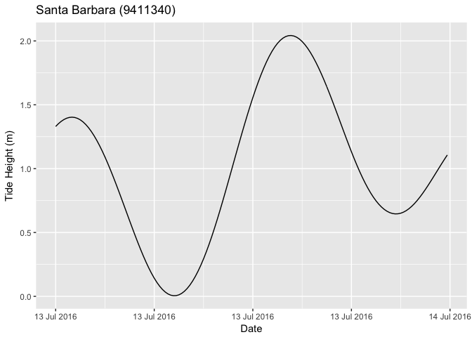

<!-- README.md is generated from README.Rmd. Please edit that file -->
[](https://travis-ci.org/poissonconsulting/rtide) [](https://ci.appveyor.com/project/joethorley/rtide/branch/master) [](https://codecov.io/gh/poissonconsulting/rtide) [](https://cran.r-project.org/package=rtide) [](https://cran.r-project.org/package=rtide)

rtide
=====

Introduction
------------

`rtide` is an R package to calculate tide heights.

The included rtide object `noaa` includes the harmonics for 816 reference, and the offsets for 2226 secondary, NOAA tide stations.

The `noaa` harmonics and offsets were scrapped from <https://tidesandcurrents.noaa.gov> on April 5, 2017.

Utilisation
-----------

``` r
library(magrittr)
library(stringr)
library(dplyr)
```

``` r
library(rtide)
#> rtide is not suitable for navigation

data <- rtide::noaa$stations
data %<>% filter(str_detect(StationName, "Santa Barbara$"))
data
#> # A tibble: 1 × 5
#>   Station Datum Longitude Latitude   StationName
#>     <chr> <dbl>     <dbl>    <dbl>         <chr>
#> 1 9411340 0.964  -119.685  34.4083 Santa Barbara

datetime <- seq_datetime(from = as.Date("2016-07-13"), minutes = 10L, tz = "PST8PDT")

data %<>% merge(data_frame(DateTime = datetime)) %>% as.tbl()

data %<>% predict_rtide(rtide = rtide::noaa)
```

``` r
library(ggplot2)
library(scales)
```

``` r
ggplot(data = data, aes(x = DateTime, y = TideHeight)) + 
  geom_line() + 
  scale_x_datetime(name = "Date", 
                   labels = date_format("%d %b %Y", tz="PST8PDT")) +
  scale_y_continuous(name = "Tide Height (m)") +
  ggtitle(str_c(data$StationName[1], " (", data$Station[1],")"))
```



Installation
------------

To install the release version from CRAN

    install.packages("rtide")

Or the development version from GitHub

    # install.packages("devtools")
    devtools::install_github("poissonconsulting/rtide")

Contribution
------------

Please report any [issues](https://github.com/poissonconsulting/rtide/issues).

[Pull requests](https://github.com/poissonconsulting/rtide/pulls) are always welcome.

Inspiration
-----------

The code to calculate tide heights from the harmonics is inspired by XTide.

The `harmonics` object which has been deprecated for the `noaa` object was converted from harmonics-dwf-20151227-free, NOAA web site data processed by David Flater for [XTide](http://www.flaterco.com/xtide/).
