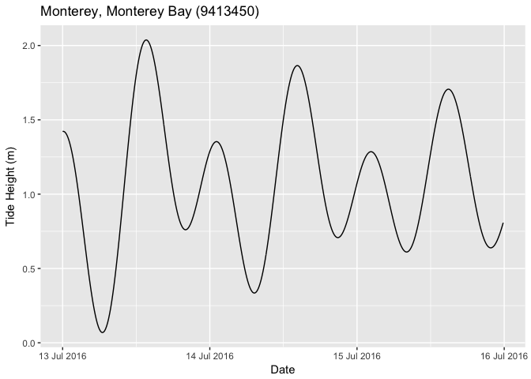

<!-- README.md is generated from README.Rmd. Please edit that file -->
[](https://travis-ci.org/poissonconsulting/rtide) [](https://ci.appveyor.com/project/joethorley/rtide/branch/master) [](https://codecov.io/gh/poissonconsulting/rtide) [](https://cran.r-project.org/package=rtide) [](https://cran.r-project.org/package=rtide)

rtide
=====

Introduction
------------

`rtide` is an R package to calculate tide heights and the timing of slack tides.

The object `rtide::noaa` allows predictions for 3042 [NOAA](https://tidesandcurrents.noaa.gov) tide stations.

Utilisation
-----------

``` r
# load helper packages
library(ggplot2)
library(lubridate)
library(magrittr)
library(scales)
library(stringr)
library(dplyr)
```

``` r
library(rtide)
#> rtide is not suitable for navigation

# get all tide stations
data <- rtide::noaa$stations 

# select Monterey by name
data %<>% filter(str_detect(StationName, "Monterey,")) 
data
#> # A tibble: 1 × 5
#>   Station Datum Longitude Latitude            StationName
#>     <chr> <dbl>     <dbl>    <dbl>                  <chr>
#> 1 9413450 1.893  -121.888   36.605 Monterey, Monterey Bay

# set up date times for predictions
datetime <- rtide::seq_datetime(from = as.Date("2016-07-13"), to = as.Date("2016-07-15"), minutes = 10L, tz = "PST8PDT") 

# add to stations
data %<>% merge(data_frame(DateTime = datetime)) %>% as.tbl()

# predict tide heights
data %<>% rtide::predict_tide_height(rtide = rtide::noaa)
#> [1] 1.893
#> # A tibble: 37 × 8
#>    Station Harmonic Amplitude Phase    Speed HarmonicName AmplitudeCor
#>      <chr>    <chr>     <dbl> <dbl>    <dbl>        <chr>        <dbl>
#> 1  9413450       M2     0.493 181.1 28.98410           M2    1.0369589
#> 2  9413450       S2     0.130 180.2 30.00000           S2    1.0000000
#> 3  9413450       N2     0.112 154.6 28.43973           N2    1.0369589
#> 4  9413450       K1     0.365 219.8 15.04107           K1    0.8866442
#> 5  9413450       M4     0.000   0.0 57.96821           M4    1.0752837
#> 6  9413450       O1     0.230 203.4 13.94304           O1    0.8227747
#> 7  9413450       M6     0.000   0.0 86.95231           M6    1.1150250
#> 8  9413450   1M1k.3     0.000   0.0 44.02517          MK3    0.9194135
#> 9  9413450       S4     0.000   0.0 60.00000           S4    1.0000000
#> 10 9413450   1M1N.4     0.000   0.0 57.42383          MN4    1.0752837
#> # ... with 27 more rows, and 1 more variables: PhaseAdj <dbl>
#> [1] 1.893
#> # A tibble: 37 × 8
#>    Station Harmonic Amplitude Phase    Speed HarmonicName AmplitudeCor
#>      <chr>    <chr>     <dbl> <dbl>    <dbl>        <chr>        <dbl>
#> 1  9413450       M2     0.493 181.1 28.98410           M2    1.0369589
#> 2  9413450       S2     0.130 180.2 30.00000           S2    1.0000000
#> 3  9413450       N2     0.112 154.6 28.43973           N2    1.0369589
#> 4  9413450       K1     0.365 219.8 15.04107           K1    0.8866442
#> 5  9413450       M4     0.000   0.0 57.96821           M4    1.0752837
#> 6  9413450       O1     0.230 203.4 13.94304           O1    0.8227747
#> 7  9413450       M6     0.000   0.0 86.95231           M6    1.1150250
#> 8  9413450   1M1k.3     0.000   0.0 44.02517          MK3    0.9194135
#> 9  9413450       S4     0.000   0.0 60.00000           S4    1.0000000
#> 10 9413450   1M1N.4     0.000   0.0 57.42383          MN4    1.0752837
#> # ... with 27 more rows, and 1 more variables: PhaseAdj <dbl>
#> [1] 1.893
#> # A tibble: 37 × 8
#>    Station Harmonic Amplitude Phase    Speed HarmonicName AmplitudeCor
#>      <chr>    <chr>     <dbl> <dbl>    <dbl>        <chr>        <dbl>
#> 1  9413450       M2     0.493 181.1 28.98410           M2    1.0369589
#> 2  9413450       S2     0.130 180.2 30.00000           S2    1.0000000
#> 3  9413450       N2     0.112 154.6 28.43973           N2    1.0369589
#> 4  9413450       K1     0.365 219.8 15.04107           K1    0.8866442
#> 5  9413450       M4     0.000   0.0 57.96821           M4    1.0752837
#> 6  9413450       O1     0.230 203.4 13.94304           O1    0.8227747
#> 7  9413450       M6     0.000   0.0 86.95231           M6    1.1150250
#> 8  9413450   1M1k.3     0.000   0.0 44.02517          MK3    0.9194135
#> 9  9413450       S4     0.000   0.0 60.00000           S4    1.0000000
#> 10 9413450   1M1N.4     0.000   0.0 57.42383          MN4    1.0752837
#> # ... with 27 more rows, and 1 more variables: PhaseAdj <dbl>
#> [1] 1.893
#> # A tibble: 37 × 8
#>    Station Harmonic Amplitude Phase    Speed HarmonicName AmplitudeCor
#>      <chr>    <chr>     <dbl> <dbl>    <dbl>        <chr>        <dbl>
#> 1  9413450       M2     0.493 181.1 28.98410           M2    1.0369589
#> 2  9413450       S2     0.130 180.2 30.00000           S2    1.0000000
#> 3  9413450       N2     0.112 154.6 28.43973           N2    1.0369589
#> 4  9413450       K1     0.365 219.8 15.04107           K1    0.8866442
#> 5  9413450       M4     0.000   0.0 57.96821           M4    1.0752837
#> 6  9413450       O1     0.230 203.4 13.94304           O1    0.8227747
#> 7  9413450       M6     0.000   0.0 86.95231           M6    1.1150250
#> 8  9413450   1M1k.3     0.000   0.0 44.02517          MK3    0.9194135
#> 9  9413450       S4     0.000   0.0 60.00000           S4    1.0000000
#> 10 9413450   1M1N.4     0.000   0.0 57.42383          MN4    1.0752837
#> # ... with 27 more rows, and 1 more variables: PhaseAdj <dbl>
#> [1] 1.893
#> # A tibble: 37 × 8
#>    Station Harmonic Amplitude Phase    Speed HarmonicName AmplitudeCor
#>      <chr>    <chr>     <dbl> <dbl>    <dbl>        <chr>        <dbl>
#> 1  9413450       M2     0.493 181.1 28.98410           M2    1.0369589
#> 2  9413450       S2     0.130 180.2 30.00000           S2    1.0000000
#> 3  9413450       N2     0.112 154.6 28.43973           N2    1.0369589
#> 4  9413450       K1     0.365 219.8 15.04107           K1    0.8866442
#> 5  9413450       M4     0.000   0.0 57.96821           M4    1.0752837
#> 6  9413450       O1     0.230 203.4 13.94304           O1    0.8227747
#> 7  9413450       M6     0.000   0.0 86.95231           M6    1.1150250
#> 8  9413450   1M1k.3     0.000   0.0 44.02517          MK3    0.9194135
#> 9  9413450       S4     0.000   0.0 60.00000           S4    1.0000000
#> 10 9413450   1M1N.4     0.000   0.0 57.42383          MN4    1.0752837
#> # ... with 27 more rows, and 1 more variables: PhaseAdj <dbl>
#> [1] 1.893
#> # A tibble: 37 × 8
#>    Station Harmonic Amplitude Phase    Speed HarmonicName AmplitudeCor
#>      <chr>    <chr>     <dbl> <dbl>    <dbl>        <chr>        <dbl>
#> 1  9413450       M2     0.493 181.1 28.98410           M2    1.0369589
#> 2  9413450       S2     0.130 180.2 30.00000           S2    1.0000000
#> 3  9413450       N2     0.112 154.6 28.43973           N2    1.0369589
#> 4  9413450       K1     0.365 219.8 15.04107           K1    0.8866442
#> 5  9413450       M4     0.000   0.0 57.96821           M4    1.0752837
#> 6  9413450       O1     0.230 203.4 13.94304           O1    0.8227747
#> 7  9413450       M6     0.000   0.0 86.95231           M6    1.1150250
#> 8  9413450   1M1k.3     0.000   0.0 44.02517          MK3    0.9194135
#> 9  9413450       S4     0.000   0.0 60.00000           S4    1.0000000
#> 10 9413450   1M1N.4     0.000   0.0 57.42383          MN4    1.0752837
#> # ... with 27 more rows, and 1 more variables: PhaseAdj <dbl>
#> [1] 1.893
#> # A tibble: 37 × 8
#>    Station Harmonic Amplitude Phase    Speed HarmonicName AmplitudeCor
#>      <chr>    <chr>     <dbl> <dbl>    <dbl>        <chr>        <dbl>
#> 1  9413450       M2     0.493 181.1 28.98410           M2    1.0369589
#> 2  9413450       S2     0.130 180.2 30.00000           S2    1.0000000
#> 3  9413450       N2     0.112 154.6 28.43973           N2    1.0369589
#> 4  9413450       K1     0.365 219.8 15.04107           K1    0.8866442
#> 5  9413450       M4     0.000   0.0 57.96821           M4    1.0752837
#> 6  9413450       O1     0.230 203.4 13.94304           O1    0.8227747
#> 7  9413450       M6     0.000   0.0 86.95231           M6    1.1150250
#> 8  9413450   1M1k.3     0.000   0.0 44.02517          MK3    0.9194135
#> 9  9413450       S4     0.000   0.0 60.00000           S4    1.0000000
#> 10 9413450   1M1N.4     0.000   0.0 57.42383          MN4    1.0752837
#> # ... with 27 more rows, and 1 more variables: PhaseAdj <dbl>
#> [1] 1.893
#> # A tibble: 37 × 8
#>    Station Harmonic Amplitude Phase    Speed HarmonicName AmplitudeCor
#>      <chr>    <chr>     <dbl> <dbl>    <dbl>        <chr>        <dbl>
#> 1  9413450       M2     0.493 181.1 28.98410           M2    1.0369589
#> 2  9413450       S2     0.130 180.2 30.00000           S2    1.0000000
#> 3  9413450       N2     0.112 154.6 28.43973           N2    1.0369589
#> 4  9413450       K1     0.365 219.8 15.04107           K1    0.8866442
#> 5  9413450       M4     0.000   0.0 57.96821           M4    1.0752837
#> 6  9413450       O1     0.230 203.4 13.94304           O1    0.8227747
#> 7  9413450       M6     0.000   0.0 86.95231           M6    1.1150250
#> 8  9413450   1M1k.3     0.000   0.0 44.02517          MK3    0.9194135
#> 9  9413450       S4     0.000   0.0 60.00000           S4    1.0000000
#> 10 9413450   1M1N.4     0.000   0.0 57.42383          MN4    1.0752837
#> # ... with 27 more rows, and 1 more variables: PhaseAdj <dbl>
#> [1] 1.893
#> # A tibble: 37 × 8
#>    Station Harmonic Amplitude Phase    Speed HarmonicName AmplitudeCor
#>      <chr>    <chr>     <dbl> <dbl>    <dbl>        <chr>        <dbl>
#> 1  9413450       M2     0.493 181.1 28.98410           M2    1.0369589
#> 2  9413450       S2     0.130 180.2 30.00000           S2    1.0000000
#> 3  9413450       N2     0.112 154.6 28.43973           N2    1.0369589
#> 4  9413450       K1     0.365 219.8 15.04107           K1    0.8866442
#> 5  9413450       M4     0.000   0.0 57.96821           M4    1.0752837
#> 6  9413450       O1     0.230 203.4 13.94304           O1    0.8227747
#> 7  9413450       M6     0.000   0.0 86.95231           M6    1.1150250
#> 8  9413450   1M1k.3     0.000   0.0 44.02517          MK3    0.9194135
#> 9  9413450       S4     0.000   0.0 60.00000           S4    1.0000000
#> 10 9413450   1M1N.4     0.000   0.0 57.42383          MN4    1.0752837
#> # ... with 27 more rows, and 1 more variables: PhaseAdj <dbl>
#> [1] 1.893
#> # A tibble: 37 × 8
#>    Station Harmonic Amplitude Phase    Speed HarmonicName AmplitudeCor
#>      <chr>    <chr>     <dbl> <dbl>    <dbl>        <chr>        <dbl>
#> 1  9413450       M2     0.493 181.1 28.98410           M2    1.0369589
#> 2  9413450       S2     0.130 180.2 30.00000           S2    1.0000000
#> 3  9413450       N2     0.112 154.6 28.43973           N2    1.0369589
#> 4  9413450       K1     0.365 219.8 15.04107           K1    0.8866442
#> 5  9413450       M4     0.000   0.0 57.96821           M4    1.0752837
#> 6  9413450       O1     0.230 203.4 13.94304           O1    0.8227747
#> 7  9413450       M6     0.000   0.0 86.95231           M6    1.1150250
#> 8  9413450   1M1k.3     0.000   0.0 44.02517          MK3    0.9194135
#> 9  9413450       S4     0.000   0.0 60.00000           S4    1.0000000
#> 10 9413450   1M1N.4     0.000   0.0 57.42383          MN4    1.0752837
#> # ... with 27 more rows, and 1 more variables: PhaseAdj <dbl>
#> [1] 1.893
#> # A tibble: 37 × 8
#>    Station Harmonic Amplitude Phase    Speed HarmonicName AmplitudeCor
#>      <chr>    <chr>     <dbl> <dbl>    <dbl>        <chr>        <dbl>
#> 1  9413450       M2     0.493 181.1 28.98410           M2    1.0369589
#> 2  9413450       S2     0.130 180.2 30.00000           S2    1.0000000
#> 3  9413450       N2     0.112 154.6 28.43973           N2    1.0369589
#> 4  9413450       K1     0.365 219.8 15.04107           K1    0.8866442
#> 5  9413450       M4     0.000   0.0 57.96821           M4    1.0752837
#> 6  9413450       O1     0.230 203.4 13.94304           O1    0.8227747
#> 7  9413450       M6     0.000   0.0 86.95231           M6    1.1150250
#> 8  9413450   1M1k.3     0.000   0.0 44.02517          MK3    0.9194135
#> 9  9413450       S4     0.000   0.0 60.00000           S4    1.0000000
#> 10 9413450   1M1N.4     0.000   0.0 57.42383          MN4    1.0752837
#> # ... with 27 more rows, and 1 more variables: PhaseAdj <dbl>
#> [1] 1.893
#> # A tibble: 37 × 8
#>    Station Harmonic Amplitude Phase    Speed HarmonicName AmplitudeCor
#>      <chr>    <chr>     <dbl> <dbl>    <dbl>        <chr>        <dbl>
#> 1  9413450       M2     0.493 181.1 28.98410           M2    1.0369589
#> 2  9413450       S2     0.130 180.2 30.00000           S2    1.0000000
#> 3  9413450       N2     0.112 154.6 28.43973           N2    1.0369589
#> 4  9413450       K1     0.365 219.8 15.04107           K1    0.8866442
#> 5  9413450       M4     0.000   0.0 57.96821           M4    1.0752837
#> 6  9413450       O1     0.230 203.4 13.94304           O1    0.8227747
#> 7  9413450       M6     0.000   0.0 86.95231           M6    1.1150250
#> 8  9413450   1M1k.3     0.000   0.0 44.02517          MK3    0.9194135
#> 9  9413450       S4     0.000   0.0 60.00000           S4    1.0000000
#> 10 9413450   1M1N.4     0.000   0.0 57.42383          MN4    1.0752837
#> # ... with 27 more rows, and 1 more variables: PhaseAdj <dbl>
#> [1] 1.893
#> # A tibble: 37 × 8
#>    Station Harmonic Amplitude Phase    Speed HarmonicName AmplitudeCor
#>      <chr>    <chr>     <dbl> <dbl>    <dbl>        <chr>        <dbl>
#> 1  9413450       M2     0.493 181.1 28.98410           M2    1.0369589
#> 2  9413450       S2     0.130 180.2 30.00000           S2    1.0000000
#> 3  9413450       N2     0.112 154.6 28.43973           N2    1.0369589
#> 4  9413450       K1     0.365 219.8 15.04107           K1    0.8866442
#> 5  9413450       M4     0.000   0.0 57.96821           M4    1.0752837
#> 6  9413450       O1     0.230 203.4 13.94304           O1    0.8227747
#> 7  9413450       M6     0.000   0.0 86.95231           M6    1.1150250
#> 8  9413450   1M1k.3     0.000   0.0 44.02517          MK3    0.9194135
#> 9  9413450       S4     0.000   0.0 60.00000           S4    1.0000000
#> 10 9413450   1M1N.4     0.000   0.0 57.42383          MN4    1.0752837
#> # ... with 27 more rows, and 1 more variables: PhaseAdj <dbl>
#> [1] 1.893
#> # A tibble: 37 × 8
#>    Station Harmonic Amplitude Phase    Speed HarmonicName AmplitudeCor
#>      <chr>    <chr>     <dbl> <dbl>    <dbl>        <chr>        <dbl>
#> 1  9413450       M2     0.493 181.1 28.98410           M2    1.0369589
#> 2  9413450       S2     0.130 180.2 30.00000           S2    1.0000000
#> 3  9413450       N2     0.112 154.6 28.43973           N2    1.0369589
#> 4  9413450       K1     0.365 219.8 15.04107           K1    0.8866442
#> 5  9413450       M4     0.000   0.0 57.96821           M4    1.0752837
#> 6  9413450       O1     0.230 203.4 13.94304           O1    0.8227747
#> 7  9413450       M6     0.000   0.0 86.95231           M6    1.1150250
#> 8  9413450   1M1k.3     0.000   0.0 44.02517          MK3    0.9194135
#> 9  9413450       S4     0.000   0.0 60.00000           S4    1.0000000
#> 10 9413450   1M1N.4     0.000   0.0 57.42383          MN4    1.0752837
#> # ... with 27 more rows, and 1 more variables: PhaseAdj <dbl>
#> [1] 1.893
#> # A tibble: 37 × 8
#>    Station Harmonic Amplitude Phase    Speed HarmonicName AmplitudeCor
#>      <chr>    <chr>     <dbl> <dbl>    <dbl>        <chr>        <dbl>
#> 1  9413450       M2     0.493 181.1 28.98410           M2    1.0369589
#> 2  9413450       S2     0.130 180.2 30.00000           S2    1.0000000
#> 3  9413450       N2     0.112 154.6 28.43973           N2    1.0369589
#> 4  9413450       K1     0.365 219.8 15.04107           K1    0.8866442
#> 5  9413450       M4     0.000   0.0 57.96821           M4    1.0752837
#> 6  9413450       O1     0.230 203.4 13.94304           O1    0.8227747
#> 7  9413450       M6     0.000   0.0 86.95231           M6    1.1150250
#> 8  9413450   1M1k.3     0.000   0.0 44.02517          MK3    0.9194135
#> 9  9413450       S4     0.000   0.0 60.00000           S4    1.0000000
#> 10 9413450   1M1N.4     0.000   0.0 57.42383          MN4    1.0752837
#> # ... with 27 more rows, and 1 more variables: PhaseAdj <dbl>
#> [1] 1.893
#> # A tibble: 37 × 8
#>    Station Harmonic Amplitude Phase    Speed HarmonicName AmplitudeCor
#>      <chr>    <chr>     <dbl> <dbl>    <dbl>        <chr>        <dbl>
#> 1  9413450       M2     0.493 181.1 28.98410           M2    1.0369589
#> 2  9413450       S2     0.130 180.2 30.00000           S2    1.0000000
#> 3  9413450       N2     0.112 154.6 28.43973           N2    1.0369589
#> 4  9413450       K1     0.365 219.8 15.04107           K1    0.8866442
#> 5  9413450       M4     0.000   0.0 57.96821           M4    1.0752837
#> 6  9413450       O1     0.230 203.4 13.94304           O1    0.8227747
#> 7  9413450       M6     0.000   0.0 86.95231           M6    1.1150250
#> 8  9413450   1M1k.3     0.000   0.0 44.02517          MK3    0.9194135
#> 9  9413450       S4     0.000   0.0 60.00000           S4    1.0000000
#> 10 9413450   1M1N.4     0.000   0.0 57.42383          MN4    1.0752837
#> # ... with 27 more rows, and 1 more variables: PhaseAdj <dbl>
#> [1] 1.893
#> # A tibble: 37 × 8
#>    Station Harmonic Amplitude Phase    Speed HarmonicName AmplitudeCor
#>      <chr>    <chr>     <dbl> <dbl>    <dbl>        <chr>        <dbl>
#> 1  9413450       M2     0.493 181.1 28.98410           M2    1.0369589
#> 2  9413450       S2     0.130 180.2 30.00000           S2    1.0000000
#> 3  9413450       N2     0.112 154.6 28.43973           N2    1.0369589
#> 4  9413450       K1     0.365 219.8 15.04107           K1    0.8866442
#> 5  9413450       M4     0.000   0.0 57.96821           M4    1.0752837
#> 6  9413450       O1     0.230 203.4 13.94304           O1    0.8227747
#> 7  9413450       M6     0.000   0.0 86.95231           M6    1.1150250
#> 8  9413450   1M1k.3     0.000   0.0 44.02517          MK3    0.9194135
#> 9  9413450       S4     0.000   0.0 60.00000           S4    1.0000000
#> 10 9413450   1M1N.4     0.000   0.0 57.42383          MN4    1.0752837
#> # ... with 27 more rows, and 1 more variables: PhaseAdj <dbl>
#> [1] 1.893
#> # A tibble: 37 × 8
#>    Station Harmonic Amplitude Phase    Speed HarmonicName AmplitudeCor
#>      <chr>    <chr>     <dbl> <dbl>    <dbl>        <chr>        <dbl>
#> 1  9413450       M2     0.493 181.1 28.98410           M2    1.0369589
#> 2  9413450       S2     0.130 180.2 30.00000           S2    1.0000000
#> 3  9413450       N2     0.112 154.6 28.43973           N2    1.0369589
#> 4  9413450       K1     0.365 219.8 15.04107           K1    0.8866442
#> 5  9413450       M4     0.000   0.0 57.96821           M4    1.0752837
#> 6  9413450       O1     0.230 203.4 13.94304           O1    0.8227747
#> 7  9413450       M6     0.000   0.0 86.95231           M6    1.1150250
#> 8  9413450   1M1k.3     0.000   0.0 44.02517          MK3    0.9194135
#> 9  9413450       S4     0.000   0.0 60.00000           S4    1.0000000
#> 10 9413450   1M1N.4     0.000   0.0 57.42383          MN4    1.0752837
#> # ... with 27 more rows, and 1 more variables: PhaseAdj <dbl>
#> [1] 1.893
#> # A tibble: 37 × 8
#>    Station Harmonic Amplitude Phase    Speed HarmonicName AmplitudeCor
#>      <chr>    <chr>     <dbl> <dbl>    <dbl>        <chr>        <dbl>
#> 1  9413450       M2     0.493 181.1 28.98410           M2    1.0369589
#> 2  9413450       S2     0.130 180.2 30.00000           S2    1.0000000
#> 3  9413450       N2     0.112 154.6 28.43973           N2    1.0369589
#> 4  9413450       K1     0.365 219.8 15.04107           K1    0.8866442
#> 5  9413450       M4     0.000   0.0 57.96821           M4    1.0752837
#> 6  9413450       O1     0.230 203.4 13.94304           O1    0.8227747
#> 7  9413450       M6     0.000   0.0 86.95231           M6    1.1150250
#> 8  9413450   1M1k.3     0.000   0.0 44.02517          MK3    0.9194135
#> 9  9413450       S4     0.000   0.0 60.00000           S4    1.0000000
#> 10 9413450   1M1N.4     0.000   0.0 57.42383          MN4    1.0752837
#> # ... with 27 more rows, and 1 more variables: PhaseAdj <dbl>
#> [1] 1.893
#> # A tibble: 37 × 8
#>    Station Harmonic Amplitude Phase    Speed HarmonicName AmplitudeCor
#>      <chr>    <chr>     <dbl> <dbl>    <dbl>        <chr>        <dbl>
#> 1  9413450       M2     0.493 181.1 28.98410           M2    1.0369589
#> 2  9413450       S2     0.130 180.2 30.00000           S2    1.0000000
#> 3  9413450       N2     0.112 154.6 28.43973           N2    1.0369589
#> 4  9413450       K1     0.365 219.8 15.04107           K1    0.8866442
#> 5  9413450       M4     0.000   0.0 57.96821           M4    1.0752837
#> 6  9413450       O1     0.230 203.4 13.94304           O1    0.8227747
#> 7  9413450       M6     0.000   0.0 86.95231           M6    1.1150250
#> 8  9413450   1M1k.3     0.000   0.0 44.02517          MK3    0.9194135
#> 9  9413450       S4     0.000   0.0 60.00000           S4    1.0000000
#> 10 9413450   1M1N.4     0.000   0.0 57.42383          MN4    1.0752837
#> # ... with 27 more rows, and 1 more variables: PhaseAdj <dbl>
#> [1] 1.893
#> # A tibble: 37 × 8
#>    Station Harmonic Amplitude Phase    Speed HarmonicName AmplitudeCor
#>      <chr>    <chr>     <dbl> <dbl>    <dbl>        <chr>        <dbl>
#> 1  9413450       M2     0.493 181.1 28.98410           M2    1.0369589
#> 2  9413450       S2     0.130 180.2 30.00000           S2    1.0000000
#> 3  9413450       N2     0.112 154.6 28.43973           N2    1.0369589
#> 4  9413450       K1     0.365 219.8 15.04107           K1    0.8866442
#> 5  9413450       M4     0.000   0.0 57.96821           M4    1.0752837
#> 6  9413450       O1     0.230 203.4 13.94304           O1    0.8227747
#> 7  9413450       M6     0.000   0.0 86.95231           M6    1.1150250
#> 8  9413450   1M1k.3     0.000   0.0 44.02517          MK3    0.9194135
#> 9  9413450       S4     0.000   0.0 60.00000           S4    1.0000000
#> 10 9413450   1M1N.4     0.000   0.0 57.42383          MN4    1.0752837
#> # ... with 27 more rows, and 1 more variables: PhaseAdj <dbl>
#> [1] 1.893
#> # A tibble: 37 × 8
#>    Station Harmonic Amplitude Phase    Speed HarmonicName AmplitudeCor
#>      <chr>    <chr>     <dbl> <dbl>    <dbl>        <chr>        <dbl>
#> 1  9413450       M2     0.493 181.1 28.98410           M2    1.0369589
#> 2  9413450       S2     0.130 180.2 30.00000           S2    1.0000000
#> 3  9413450       N2     0.112 154.6 28.43973           N2    1.0369589
#> 4  9413450       K1     0.365 219.8 15.04107           K1    0.8866442
#> 5  9413450       M4     0.000   0.0 57.96821           M4    1.0752837
#> 6  9413450       O1     0.230 203.4 13.94304           O1    0.8227747
#> 7  9413450       M6     0.000   0.0 86.95231           M6    1.1150250
#> 8  9413450   1M1k.3     0.000   0.0 44.02517          MK3    0.9194135
#> 9  9413450       S4     0.000   0.0 60.00000           S4    1.0000000
#> 10 9413450   1M1N.4     0.000   0.0 57.42383          MN4    1.0752837
#> # ... with 27 more rows, and 1 more variables: PhaseAdj <dbl>
#> [1] 1.893
#> # A tibble: 37 × 8
#>    Station Harmonic Amplitude Phase    Speed HarmonicName AmplitudeCor
#>      <chr>    <chr>     <dbl> <dbl>    <dbl>        <chr>        <dbl>
#> 1  9413450       M2     0.493 181.1 28.98410           M2    1.0369589
#> 2  9413450       S2     0.130 180.2 30.00000           S2    1.0000000
#> 3  9413450       N2     0.112 154.6 28.43973           N2    1.0369589
#> 4  9413450       K1     0.365 219.8 15.04107           K1    0.8866442
#> 5  9413450       M4     0.000   0.0 57.96821           M4    1.0752837
#> 6  9413450       O1     0.230 203.4 13.94304           O1    0.8227747
#> 7  9413450       M6     0.000   0.0 86.95231           M6    1.1150250
#> 8  9413450   1M1k.3     0.000   0.0 44.02517          MK3    0.9194135
#> 9  9413450       S4     0.000   0.0 60.00000           S4    1.0000000
#> 10 9413450   1M1N.4     0.000   0.0 57.42383          MN4    1.0752837
#> # ... with 27 more rows, and 1 more variables: PhaseAdj <dbl>
#> [1] 1.893
#> # A tibble: 37 × 8
#>    Station Harmonic Amplitude Phase    Speed HarmonicName AmplitudeCor
#>      <chr>    <chr>     <dbl> <dbl>    <dbl>        <chr>        <dbl>
#> 1  9413450       M2     0.493 181.1 28.98410           M2    1.0369589
#> 2  9413450       S2     0.130 180.2 30.00000           S2    1.0000000
#> 3  9413450       N2     0.112 154.6 28.43973           N2    1.0369589
#> 4  9413450       K1     0.365 219.8 15.04107           K1    0.8866442
#> 5  9413450       M4     0.000   0.0 57.96821           M4    1.0752837
#> 6  9413450       O1     0.230 203.4 13.94304           O1    0.8227747
#> 7  9413450       M6     0.000   0.0 86.95231           M6    1.1150250
#> 8  9413450   1M1k.3     0.000   0.0 44.02517          MK3    0.9194135
#> 9  9413450       S4     0.000   0.0 60.00000           S4    1.0000000
#> 10 9413450   1M1N.4     0.000   0.0 57.42383          MN4    1.0752837
#> # ... with 27 more rows, and 1 more variables: PhaseAdj <dbl>
#> [1] 1.893
#> # A tibble: 37 × 8
#>    Station Harmonic Amplitude Phase    Speed HarmonicName AmplitudeCor
#>      <chr>    <chr>     <dbl> <dbl>    <dbl>        <chr>        <dbl>
#> 1  9413450       M2     0.493 181.1 28.98410           M2    1.0369589
#> 2  9413450       S2     0.130 180.2 30.00000           S2    1.0000000
#> 3  9413450       N2     0.112 154.6 28.43973           N2    1.0369589
#> 4  9413450       K1     0.365 219.8 15.04107           K1    0.8866442
#> 5  9413450       M4     0.000   0.0 57.96821           M4    1.0752837
#> 6  9413450       O1     0.230 203.4 13.94304           O1    0.8227747
#> 7  9413450       M6     0.000   0.0 86.95231           M6    1.1150250
#> 8  9413450   1M1k.3     0.000   0.0 44.02517          MK3    0.9194135
#> 9  9413450       S4     0.000   0.0 60.00000           S4    1.0000000
#> 10 9413450   1M1N.4     0.000   0.0 57.42383          MN4    1.0752837
#> # ... with 27 more rows, and 1 more variables: PhaseAdj <dbl>
#> [1] 1.893
#> # A tibble: 37 × 8
#>    Station Harmonic Amplitude Phase    Speed HarmonicName AmplitudeCor
#>      <chr>    <chr>     <dbl> <dbl>    <dbl>        <chr>        <dbl>
#> 1  9413450       M2     0.493 181.1 28.98410           M2    1.0369589
#> 2  9413450       S2     0.130 180.2 30.00000           S2    1.0000000
#> 3  9413450       N2     0.112 154.6 28.43973           N2    1.0369589
#> 4  9413450       K1     0.365 219.8 15.04107           K1    0.8866442
#> 5  9413450       M4     0.000   0.0 57.96821           M4    1.0752837
#> 6  9413450       O1     0.230 203.4 13.94304           O1    0.8227747
#> 7  9413450       M6     0.000   0.0 86.95231           M6    1.1150250
#> 8  9413450   1M1k.3     0.000   0.0 44.02517          MK3    0.9194135
#> 9  9413450       S4     0.000   0.0 60.00000           S4    1.0000000
#> 10 9413450   1M1N.4     0.000   0.0 57.42383          MN4    1.0752837
#> # ... with 27 more rows, and 1 more variables: PhaseAdj <dbl>
#> [1] 1.893
#> # A tibble: 37 × 8
#>    Station Harmonic Amplitude Phase    Speed HarmonicName AmplitudeCor
#>      <chr>    <chr>     <dbl> <dbl>    <dbl>        <chr>        <dbl>
#> 1  9413450       M2     0.493 181.1 28.98410           M2    1.0369589
#> 2  9413450       S2     0.130 180.2 30.00000           S2    1.0000000
#> 3  9413450       N2     0.112 154.6 28.43973           N2    1.0369589
#> 4  9413450       K1     0.365 219.8 15.04107           K1    0.8866442
#> 5  9413450       M4     0.000   0.0 57.96821           M4    1.0752837
#> 6  9413450       O1     0.230 203.4 13.94304           O1    0.8227747
#> 7  9413450       M6     0.000   0.0 86.95231           M6    1.1150250
#> 8  9413450   1M1k.3     0.000   0.0 44.02517          MK3    0.9194135
#> 9  9413450       S4     0.000   0.0 60.00000           S4    1.0000000
#> 10 9413450   1M1N.4     0.000   0.0 57.42383          MN4    1.0752837
#> # ... with 27 more rows, and 1 more variables: PhaseAdj <dbl>
#> [1] 1.893
#> # A tibble: 37 × 8
#>    Station Harmonic Amplitude Phase    Speed HarmonicName AmplitudeCor
#>      <chr>    <chr>     <dbl> <dbl>    <dbl>        <chr>        <dbl>
#> 1  9413450       M2     0.493 181.1 28.98410           M2    1.0369589
#> 2  9413450       S2     0.130 180.2 30.00000           S2    1.0000000
#> 3  9413450       N2     0.112 154.6 28.43973           N2    1.0369589
#> 4  9413450       K1     0.365 219.8 15.04107           K1    0.8866442
#> 5  9413450       M4     0.000   0.0 57.96821           M4    1.0752837
#> 6  9413450       O1     0.230 203.4 13.94304           O1    0.8227747
#> 7  9413450       M6     0.000   0.0 86.95231           M6    1.1150250
#> 8  9413450   1M1k.3     0.000   0.0 44.02517          MK3    0.9194135
#> 9  9413450       S4     0.000   0.0 60.00000           S4    1.0000000
#> 10 9413450   1M1N.4     0.000   0.0 57.42383          MN4    1.0752837
#> # ... with 27 more rows, and 1 more variables: PhaseAdj <dbl>
#> [1] 1.893
#> # A tibble: 37 × 8
#>    Station Harmonic Amplitude Phase    Speed HarmonicName AmplitudeCor
#>      <chr>    <chr>     <dbl> <dbl>    <dbl>        <chr>        <dbl>
#> 1  9413450       M2     0.493 181.1 28.98410           M2    1.0369589
#> 2  9413450       S2     0.130 180.2 30.00000           S2    1.0000000
#> 3  9413450       N2     0.112 154.6 28.43973           N2    1.0369589
#> 4  9413450       K1     0.365 219.8 15.04107           K1    0.8866442
#> 5  9413450       M4     0.000   0.0 57.96821           M4    1.0752837
#> 6  9413450       O1     0.230 203.4 13.94304           O1    0.8227747
#> 7  9413450       M6     0.000   0.0 86.95231           M6    1.1150250
#> 8  9413450   1M1k.3     0.000   0.0 44.02517          MK3    0.9194135
#> 9  9413450       S4     0.000   0.0 60.00000           S4    1.0000000
#> 10 9413450   1M1N.4     0.000   0.0 57.42383          MN4    1.0752837
#> # ... with 27 more rows, and 1 more variables: PhaseAdj <dbl>
#> [1] 1.893
#> # A tibble: 37 × 8
#>    Station Harmonic Amplitude Phase    Speed HarmonicName AmplitudeCor
#>      <chr>    <chr>     <dbl> <dbl>    <dbl>        <chr>        <dbl>
#> 1  9413450       M2     0.493 181.1 28.98410           M2    1.0369589
#> 2  9413450       S2     0.130 180.2 30.00000           S2    1.0000000
#> 3  9413450       N2     0.112 154.6 28.43973           N2    1.0369589
#> 4  9413450       K1     0.365 219.8 15.04107           K1    0.8866442
#> 5  9413450       M4     0.000   0.0 57.96821           M4    1.0752837
#> 6  9413450       O1     0.230 203.4 13.94304           O1    0.8227747
#> 7  9413450       M6     0.000   0.0 86.95231           M6    1.1150250
#> 8  9413450   1M1k.3     0.000   0.0 44.02517          MK3    0.9194135
#> 9  9413450       S4     0.000   0.0 60.00000           S4    1.0000000
#> 10 9413450   1M1N.4     0.000   0.0 57.42383          MN4    1.0752837
#> # ... with 27 more rows, and 1 more variables: PhaseAdj <dbl>
#> [1] 1.893
#> # A tibble: 37 × 8
#>    Station Harmonic Amplitude Phase    Speed HarmonicName AmplitudeCor
#>      <chr>    <chr>     <dbl> <dbl>    <dbl>        <chr>        <dbl>
#> 1  9413450       M2     0.493 181.1 28.98410           M2    1.0369589
#> 2  9413450       S2     0.130 180.2 30.00000           S2    1.0000000
#> 3  9413450       N2     0.112 154.6 28.43973           N2    1.0369589
#> 4  9413450       K1     0.365 219.8 15.04107           K1    0.8866442
#> 5  9413450       M4     0.000   0.0 57.96821           M4    1.0752837
#> 6  9413450       O1     0.230 203.4 13.94304           O1    0.8227747
#> 7  9413450       M6     0.000   0.0 86.95231           M6    1.1150250
#> 8  9413450   1M1k.3     0.000   0.0 44.02517          MK3    0.9194135
#> 9  9413450       S4     0.000   0.0 60.00000           S4    1.0000000
#> 10 9413450   1M1N.4     0.000   0.0 57.42383          MN4    1.0752837
#> # ... with 27 more rows, and 1 more variables: PhaseAdj <dbl>
#> [1] 1.893
#> # A tibble: 37 × 8
#>    Station Harmonic Amplitude Phase    Speed HarmonicName AmplitudeCor
#>      <chr>    <chr>     <dbl> <dbl>    <dbl>        <chr>        <dbl>
#> 1  9413450       M2     0.493 181.1 28.98410           M2    1.0369589
#> 2  9413450       S2     0.130 180.2 30.00000           S2    1.0000000
#> 3  9413450       N2     0.112 154.6 28.43973           N2    1.0369589
#> 4  9413450       K1     0.365 219.8 15.04107           K1    0.8866442
#> 5  9413450       M4     0.000   0.0 57.96821           M4    1.0752837
#> 6  9413450       O1     0.230 203.4 13.94304           O1    0.8227747
#> 7  9413450       M6     0.000   0.0 86.95231           M6    1.1150250
#> 8  9413450   1M1k.3     0.000   0.0 44.02517          MK3    0.9194135
#> 9  9413450       S4     0.000   0.0 60.00000           S4    1.0000000
#> 10 9413450   1M1N.4     0.000   0.0 57.42383          MN4    1.0752837
#> # ... with 27 more rows, and 1 more variables: PhaseAdj <dbl>
#> [1] 1.893
#> # A tibble: 37 × 8
#>    Station Harmonic Amplitude Phase    Speed HarmonicName AmplitudeCor
#>      <chr>    <chr>     <dbl> <dbl>    <dbl>        <chr>        <dbl>
#> 1  9413450       M2     0.493 181.1 28.98410           M2    1.0369589
#> 2  9413450       S2     0.130 180.2 30.00000           S2    1.0000000
#> 3  9413450       N2     0.112 154.6 28.43973           N2    1.0369589
#> 4  9413450       K1     0.365 219.8 15.04107           K1    0.8866442
#> 5  9413450       M4     0.000   0.0 57.96821           M4    1.0752837
#> 6  9413450       O1     0.230 203.4 13.94304           O1    0.8227747
#> 7  9413450       M6     0.000   0.0 86.95231           M6    1.1150250
#> 8  9413450   1M1k.3     0.000   0.0 44.02517          MK3    0.9194135
#> 9  9413450       S4     0.000   0.0 60.00000           S4    1.0000000
#> 10 9413450   1M1N.4     0.000   0.0 57.42383          MN4    1.0752837
#> # ... with 27 more rows, and 1 more variables: PhaseAdj <dbl>
#> [1] 1.893
#> # A tibble: 37 × 8
#>    Station Harmonic Amplitude Phase    Speed HarmonicName AmplitudeCor
#>      <chr>    <chr>     <dbl> <dbl>    <dbl>        <chr>        <dbl>
#> 1  9413450       M2     0.493 181.1 28.98410           M2    1.0369589
#> 2  9413450       S2     0.130 180.2 30.00000           S2    1.0000000
#> 3  9413450       N2     0.112 154.6 28.43973           N2    1.0369589
#> 4  9413450       K1     0.365 219.8 15.04107           K1    0.8866442
#> 5  9413450       M4     0.000   0.0 57.96821           M4    1.0752837
#> 6  9413450       O1     0.230 203.4 13.94304           O1    0.8227747
#> 7  9413450       M6     0.000   0.0 86.95231           M6    1.1150250
#> 8  9413450   1M1k.3     0.000   0.0 44.02517          MK3    0.9194135
#> 9  9413450       S4     0.000   0.0 60.00000           S4    1.0000000
#> 10 9413450   1M1N.4     0.000   0.0 57.42383          MN4    1.0752837
#> # ... with 27 more rows, and 1 more variables: PhaseAdj <dbl>
#> [1] 1.893
#> # A tibble: 37 × 8
#>    Station Harmonic Amplitude Phase    Speed HarmonicName AmplitudeCor
#>      <chr>    <chr>     <dbl> <dbl>    <dbl>        <chr>        <dbl>
#> 1  9413450       M2     0.493 181.1 28.98410           M2    1.0369589
#> 2  9413450       S2     0.130 180.2 30.00000           S2    1.0000000
#> 3  9413450       N2     0.112 154.6 28.43973           N2    1.0369589
#> 4  9413450       K1     0.365 219.8 15.04107           K1    0.8866442
#> 5  9413450       M4     0.000   0.0 57.96821           M4    1.0752837
#> 6  9413450       O1     0.230 203.4 13.94304           O1    0.8227747
#> 7  9413450       M6     0.000   0.0 86.95231           M6    1.1150250
#> 8  9413450   1M1k.3     0.000   0.0 44.02517          MK3    0.9194135
#> 9  9413450       S4     0.000   0.0 60.00000           S4    1.0000000
#> 10 9413450   1M1N.4     0.000   0.0 57.42383          MN4    1.0752837
#> # ... with 27 more rows, and 1 more variables: PhaseAdj <dbl>
#> [1] 1.893
#> # A tibble: 37 × 8
#>    Station Harmonic Amplitude Phase    Speed HarmonicName AmplitudeCor
#>      <chr>    <chr>     <dbl> <dbl>    <dbl>        <chr>        <dbl>
#> 1  9413450       M2     0.493 181.1 28.98410           M2    1.0369589
#> 2  9413450       S2     0.130 180.2 30.00000           S2    1.0000000
#> 3  9413450       N2     0.112 154.6 28.43973           N2    1.0369589
#> 4  9413450       K1     0.365 219.8 15.04107           K1    0.8866442
#> 5  9413450       M4     0.000   0.0 57.96821           M4    1.0752837
#> 6  9413450       O1     0.230 203.4 13.94304           O1    0.8227747
#> 7  9413450       M6     0.000   0.0 86.95231           M6    1.1150250
#> 8  9413450   1M1k.3     0.000   0.0 44.02517          MK3    0.9194135
#> 9  9413450       S4     0.000   0.0 60.00000           S4    1.0000000
#> 10 9413450   1M1N.4     0.000   0.0 57.42383          MN4    1.0752837
#> # ... with 27 more rows, and 1 more variables: PhaseAdj <dbl>
#> [1] 1.893
#> # A tibble: 37 × 8
#>    Station Harmonic Amplitude Phase    Speed HarmonicName AmplitudeCor
#>      <chr>    <chr>     <dbl> <dbl>    <dbl>        <chr>        <dbl>
#> 1  9413450       M2     0.493 181.1 28.98410           M2    1.0369589
#> 2  9413450       S2     0.130 180.2 30.00000           S2    1.0000000
#> 3  9413450       N2     0.112 154.6 28.43973           N2    1.0369589
#> 4  9413450       K1     0.365 219.8 15.04107           K1    0.8866442
#> 5  9413450       M4     0.000   0.0 57.96821           M4    1.0752837
#> 6  9413450       O1     0.230 203.4 13.94304           O1    0.8227747
#> 7  9413450       M6     0.000   0.0 86.95231           M6    1.1150250
#> 8  9413450   1M1k.3     0.000   0.0 44.02517          MK3    0.9194135
#> 9  9413450       S4     0.000   0.0 60.00000           S4    1.0000000
#> 10 9413450   1M1N.4     0.000   0.0 57.42383          MN4    1.0752837
#> # ... with 27 more rows, and 1 more variables: PhaseAdj <dbl>
#> [1] 1.893
#> # A tibble: 37 × 8
#>    Station Harmonic Amplitude Phase    Speed HarmonicName AmplitudeCor
#>      <chr>    <chr>     <dbl> <dbl>    <dbl>        <chr>        <dbl>
#> 1  9413450       M2     0.493 181.1 28.98410           M2    1.0369589
#> 2  9413450       S2     0.130 180.2 30.00000           S2    1.0000000
#> 3  9413450       N2     0.112 154.6 28.43973           N2    1.0369589
#> 4  9413450       K1     0.365 219.8 15.04107           K1    0.8866442
#> 5  9413450       M4     0.000   0.0 57.96821           M4    1.0752837
#> 6  9413450       O1     0.230 203.4 13.94304           O1    0.8227747
#> 7  9413450       M6     0.000   0.0 86.95231           M6    1.1150250
#> 8  9413450   1M1k.3     0.000   0.0 44.02517          MK3    0.9194135
#> 9  9413450       S4     0.000   0.0 60.00000           S4    1.0000000
#> 10 9413450   1M1N.4     0.000   0.0 57.42383          MN4    1.0752837
#> # ... with 27 more rows, and 1 more variables: PhaseAdj <dbl>
#> [1] 1.893
#> # A tibble: 37 × 8
#>    Station Harmonic Amplitude Phase    Speed HarmonicName AmplitudeCor
#>      <chr>    <chr>     <dbl> <dbl>    <dbl>        <chr>        <dbl>
#> 1  9413450       M2     0.493 181.1 28.98410           M2    1.0369589
#> 2  9413450       S2     0.130 180.2 30.00000           S2    1.0000000
#> 3  9413450       N2     0.112 154.6 28.43973           N2    1.0369589
#> 4  9413450       K1     0.365 219.8 15.04107           K1    0.8866442
#> 5  9413450       M4     0.000   0.0 57.96821           M4    1.0752837
#> 6  9413450       O1     0.230 203.4 13.94304           O1    0.8227747
#> 7  9413450       M6     0.000   0.0 86.95231           M6    1.1150250
#> 8  9413450   1M1k.3     0.000   0.0 44.02517          MK3    0.9194135
#> 9  9413450       S4     0.000   0.0 60.00000           S4    1.0000000
#> 10 9413450   1M1N.4     0.000   0.0 57.42383          MN4    1.0752837
#> # ... with 27 more rows, and 1 more variables: PhaseAdj <dbl>
#> [1] 1.893
#> # A tibble: 37 × 8
#>    Station Harmonic Amplitude Phase    Speed HarmonicName AmplitudeCor
#>      <chr>    <chr>     <dbl> <dbl>    <dbl>        <chr>        <dbl>
#> 1  9413450       M2     0.493 181.1 28.98410           M2    1.0369589
#> 2  9413450       S2     0.130 180.2 30.00000           S2    1.0000000
#> 3  9413450       N2     0.112 154.6 28.43973           N2    1.0369589
#> 4  9413450       K1     0.365 219.8 15.04107           K1    0.8866442
#> 5  9413450       M4     0.000   0.0 57.96821           M4    1.0752837
#> 6  9413450       O1     0.230 203.4 13.94304           O1    0.8227747
#> 7  9413450       M6     0.000   0.0 86.95231           M6    1.1150250
#> 8  9413450   1M1k.3     0.000   0.0 44.02517          MK3    0.9194135
#> 9  9413450       S4     0.000   0.0 60.00000           S4    1.0000000
#> 10 9413450   1M1N.4     0.000   0.0 57.42383          MN4    1.0752837
#> # ... with 27 more rows, and 1 more variables: PhaseAdj <dbl>
#> [1] 1.893
#> # A tibble: 37 × 8
#>    Station Harmonic Amplitude Phase    Speed HarmonicName AmplitudeCor
#>      <chr>    <chr>     <dbl> <dbl>    <dbl>        <chr>        <dbl>
#> 1  9413450       M2     0.493 181.1 28.98410           M2    1.0369589
#> 2  9413450       S2     0.130 180.2 30.00000           S2    1.0000000
#> 3  9413450       N2     0.112 154.6 28.43973           N2    1.0369589
#> 4  9413450       K1     0.365 219.8 15.04107           K1    0.8866442
#> 5  9413450       M4     0.000   0.0 57.96821           M4    1.0752837
#> 6  9413450       O1     0.230 203.4 13.94304           O1    0.8227747
#> 7  9413450       M6     0.000   0.0 86.95231           M6    1.1150250
#> 8  9413450   1M1k.3     0.000   0.0 44.02517          MK3    0.9194135
#> 9  9413450       S4     0.000   0.0 60.00000           S4    1.0000000
#> 10 9413450   1M1N.4     0.000   0.0 57.42383          MN4    1.0752837
#> # ... with 27 more rows, and 1 more variables: PhaseAdj <dbl>
#> [1] 1.893
#> # A tibble: 37 × 8
#>    Station Harmonic Amplitude Phase    Speed HarmonicName AmplitudeCor
#>      <chr>    <chr>     <dbl> <dbl>    <dbl>        <chr>        <dbl>
#> 1  9413450       M2     0.493 181.1 28.98410           M2    1.0369589
#> 2  9413450       S2     0.130 180.2 30.00000           S2    1.0000000
#> 3  9413450       N2     0.112 154.6 28.43973           N2    1.0369589
#> 4  9413450       K1     0.365 219.8 15.04107           K1    0.8866442
#> 5  9413450       M4     0.000   0.0 57.96821           M4    1.0752837
#> 6  9413450       O1     0.230 203.4 13.94304           O1    0.8227747
#> 7  9413450       M6     0.000   0.0 86.95231           M6    1.1150250
#> 8  9413450   1M1k.3     0.000   0.0 44.02517          MK3    0.9194135
#> 9  9413450       S4     0.000   0.0 60.00000           S4    1.0000000
#> 10 9413450   1M1N.4     0.000   0.0 57.42383          MN4    1.0752837
#> # ... with 27 more rows, and 1 more variables: PhaseAdj <dbl>
#> [1] 1.893
#> # A tibble: 37 × 8
#>    Station Harmonic Amplitude Phase    Speed HarmonicName AmplitudeCor
#>      <chr>    <chr>     <dbl> <dbl>    <dbl>        <chr>        <dbl>
#> 1  9413450       M2     0.493 181.1 28.98410           M2    1.0369589
#> 2  9413450       S2     0.130 180.2 30.00000           S2    1.0000000
#> 3  9413450       N2     0.112 154.6 28.43973           N2    1.0369589
#> 4  9413450       K1     0.365 219.8 15.04107           K1    0.8866442
#> 5  9413450       M4     0.000   0.0 57.96821           M4    1.0752837
#> 6  9413450       O1     0.230 203.4 13.94304           O1    0.8227747
#> 7  9413450       M6     0.000   0.0 86.95231           M6    1.1150250
#> 8  9413450   1M1k.3     0.000   0.0 44.02517          MK3    0.9194135
#> 9  9413450       S4     0.000   0.0 60.00000           S4    1.0000000
#> 10 9413450   1M1N.4     0.000   0.0 57.42383          MN4    1.0752837
#> # ... with 27 more rows, and 1 more variables: PhaseAdj <dbl>
#> [1] 1.893
#> # A tibble: 37 × 8
#>    Station Harmonic Amplitude Phase    Speed HarmonicName AmplitudeCor
#>      <chr>    <chr>     <dbl> <dbl>    <dbl>        <chr>        <dbl>
#> 1  9413450       M2     0.493 181.1 28.98410           M2    1.0369589
#> 2  9413450       S2     0.130 180.2 30.00000           S2    1.0000000
#> 3  9413450       N2     0.112 154.6 28.43973           N2    1.0369589
#> 4  9413450       K1     0.365 219.8 15.04107           K1    0.8866442
#> 5  9413450       M4     0.000   0.0 57.96821           M4    1.0752837
#> 6  9413450       O1     0.230 203.4 13.94304           O1    0.8227747
#> 7  9413450       M6     0.000   0.0 86.95231           M6    1.1150250
#> 8  9413450   1M1k.3     0.000   0.0 44.02517          MK3    0.9194135
#> 9  9413450       S4     0.000   0.0 60.00000           S4    1.0000000
#> 10 9413450   1M1N.4     0.000   0.0 57.42383          MN4    1.0752837
#> # ... with 27 more rows, and 1 more variables: PhaseAdj <dbl>
#> [1] 1.893
#> # A tibble: 37 × 8
#>    Station Harmonic Amplitude Phase    Speed HarmonicName AmplitudeCor
#>      <chr>    <chr>     <dbl> <dbl>    <dbl>        <chr>        <dbl>
#> 1  9413450       M2     0.493 181.1 28.98410           M2    1.0369589
#> 2  9413450       S2     0.130 180.2 30.00000           S2    1.0000000
#> 3  9413450       N2     0.112 154.6 28.43973           N2    1.0369589
#> 4  9413450       K1     0.365 219.8 15.04107           K1    0.8866442
#> 5  9413450       M4     0.000   0.0 57.96821           M4    1.0752837
#> 6  9413450       O1     0.230 203.4 13.94304           O1    0.8227747
#> 7  9413450       M6     0.000   0.0 86.95231           M6    1.1150250
#> 8  9413450   1M1k.3     0.000   0.0 44.02517          MK3    0.9194135
#> 9  9413450       S4     0.000   0.0 60.00000           S4    1.0000000
#> 10 9413450   1M1N.4     0.000   0.0 57.42383          MN4    1.0752837
#> # ... with 27 more rows, and 1 more variables: PhaseAdj <dbl>
#> [1] 1.893
#> # A tibble: 37 × 8
#>    Station Harmonic Amplitude Phase    Speed HarmonicName AmplitudeCor
#>      <chr>    <chr>     <dbl> <dbl>    <dbl>        <chr>        <dbl>
#> 1  9413450       M2     0.493 181.1 28.98410           M2    1.0369589
#> 2  9413450       S2     0.130 180.2 30.00000           S2    1.0000000
#> 3  9413450       N2     0.112 154.6 28.43973           N2    1.0369589
#> 4  9413450       K1     0.365 219.8 15.04107           K1    0.8866442
#> 5  9413450       M4     0.000   0.0 57.96821           M4    1.0752837
#> 6  9413450       O1     0.230 203.4 13.94304           O1    0.8227747
#> 7  9413450       M6     0.000   0.0 86.95231           M6    1.1150250
#> 8  9413450   1M1k.3     0.000   0.0 44.02517          MK3    0.9194135
#> 9  9413450       S4     0.000   0.0 60.00000           S4    1.0000000
#> 10 9413450   1M1N.4     0.000   0.0 57.42383          MN4    1.0752837
#> # ... with 27 more rows, and 1 more variables: PhaseAdj <dbl>
#> [1] 1.893
#> # A tibble: 37 × 8
#>    Station Harmonic Amplitude Phase    Speed HarmonicName AmplitudeCor
#>      <chr>    <chr>     <dbl> <dbl>    <dbl>        <chr>        <dbl>
#> 1  9413450       M2     0.493 181.1 28.98410           M2    1.0369589
#> 2  9413450       S2     0.130 180.2 30.00000           S2    1.0000000
#> 3  9413450       N2     0.112 154.6 28.43973           N2    1.0369589
#> 4  9413450       K1     0.365 219.8 15.04107           K1    0.8866442
#> 5  9413450       M4     0.000   0.0 57.96821           M4    1.0752837
#> 6  9413450       O1     0.230 203.4 13.94304           O1    0.8227747
#> 7  9413450       M6     0.000   0.0 86.95231           M6    1.1150250
#> 8  9413450   1M1k.3     0.000   0.0 44.02517          MK3    0.9194135
#> 9  9413450       S4     0.000   0.0 60.00000           S4    1.0000000
#> 10 9413450   1M1N.4     0.000   0.0 57.42383          MN4    1.0752837
#> # ... with 27 more rows, and 1 more variables: PhaseAdj <dbl>
#> [1] 1.893
#> # A tibble: 37 × 8
#>    Station Harmonic Amplitude Phase    Speed HarmonicName AmplitudeCor
#>      <chr>    <chr>     <dbl> <dbl>    <dbl>        <chr>        <dbl>
#> 1  9413450       M2     0.493 181.1 28.98410           M2    1.0369589
#> 2  9413450       S2     0.130 180.2 30.00000           S2    1.0000000
#> 3  9413450       N2     0.112 154.6 28.43973           N2    1.0369589
#> 4  9413450       K1     0.365 219.8 15.04107           K1    0.8866442
#> 5  9413450       M4     0.000   0.0 57.96821           M4    1.0752837
#> 6  9413450       O1     0.230 203.4 13.94304           O1    0.8227747
#> 7  9413450       M6     0.000   0.0 86.95231           M6    1.1150250
#> 8  9413450   1M1k.3     0.000   0.0 44.02517          MK3    0.9194135
#> 9  9413450       S4     0.000   0.0 60.00000           S4    1.0000000
#> 10 9413450   1M1N.4     0.000   0.0 57.42383          MN4    1.0752837
#> # ... with 27 more rows, and 1 more variables: PhaseAdj <dbl>
#> [1] 1.893
#> # A tibble: 37 × 8
#>    Station Harmonic Amplitude Phase    Speed HarmonicName AmplitudeCor
#>      <chr>    <chr>     <dbl> <dbl>    <dbl>        <chr>        <dbl>
#> 1  9413450       M2     0.493 181.1 28.98410           M2    1.0369589
#> 2  9413450       S2     0.130 180.2 30.00000           S2    1.0000000
#> 3  9413450       N2     0.112 154.6 28.43973           N2    1.0369589
#> 4  9413450       K1     0.365 219.8 15.04107           K1    0.8866442
#> 5  9413450       M4     0.000   0.0 57.96821           M4    1.0752837
#> 6  9413450       O1     0.230 203.4 13.94304           O1    0.8227747
#> 7  9413450       M6     0.000   0.0 86.95231           M6    1.1150250
#> 8  9413450   1M1k.3     0.000   0.0 44.02517          MK3    0.9194135
#> 9  9413450       S4     0.000   0.0 60.00000           S4    1.0000000
#> 10 9413450   1M1N.4     0.000   0.0 57.42383          MN4    1.0752837
#> # ... with 27 more rows, and 1 more variables: PhaseAdj <dbl>
#> [1] 1.893
#> # A tibble: 37 × 8
#>    Station Harmonic Amplitude Phase    Speed HarmonicName AmplitudeCor
#>      <chr>    <chr>     <dbl> <dbl>    <dbl>        <chr>        <dbl>
#> 1  9413450       M2     0.493 181.1 28.98410           M2    1.0369589
#> 2  9413450       S2     0.130 180.2 30.00000           S2    1.0000000
#> 3  9413450       N2     0.112 154.6 28.43973           N2    1.0369589
#> 4  9413450       K1     0.365 219.8 15.04107           K1    0.8866442
#> 5  9413450       M4     0.000   0.0 57.96821           M4    1.0752837
#> 6  9413450       O1     0.230 203.4 13.94304           O1    0.8227747
#> 7  9413450       M6     0.000   0.0 86.95231           M6    1.1150250
#> 8  9413450   1M1k.3     0.000   0.0 44.02517          MK3    0.9194135
#> 9  9413450       S4     0.000   0.0 60.00000           S4    1.0000000
#> 10 9413450   1M1N.4     0.000   0.0 57.42383          MN4    1.0752837
#> # ... with 27 more rows, and 1 more variables: PhaseAdj <dbl>
#> [1] 1.893
#> # A tibble: 37 × 8
#>    Station Harmonic Amplitude Phase    Speed HarmonicName AmplitudeCor
#>      <chr>    <chr>     <dbl> <dbl>    <dbl>        <chr>        <dbl>
#> 1  9413450       M2     0.493 181.1 28.98410           M2    1.0369589
#> 2  9413450       S2     0.130 180.2 30.00000           S2    1.0000000
#> 3  9413450       N2     0.112 154.6 28.43973           N2    1.0369589
#> 4  9413450       K1     0.365 219.8 15.04107           K1    0.8866442
#> 5  9413450       M4     0.000   0.0 57.96821           M4    1.0752837
#> 6  9413450       O1     0.230 203.4 13.94304           O1    0.8227747
#> 7  9413450       M6     0.000   0.0 86.95231           M6    1.1150250
#> 8  9413450   1M1k.3     0.000   0.0 44.02517          MK3    0.9194135
#> 9  9413450       S4     0.000   0.0 60.00000           S4    1.0000000
#> 10 9413450   1M1N.4     0.000   0.0 57.42383          MN4    1.0752837
#> # ... with 27 more rows, and 1 more variables: PhaseAdj <dbl>
#> [1] 1.893
#> # A tibble: 37 × 8
#>    Station Harmonic Amplitude Phase    Speed HarmonicName AmplitudeCor
#>      <chr>    <chr>     <dbl> <dbl>    <dbl>        <chr>        <dbl>
#> 1  9413450       M2     0.493 181.1 28.98410           M2    1.0369589
#> 2  9413450       S2     0.130 180.2 30.00000           S2    1.0000000
#> 3  9413450       N2     0.112 154.6 28.43973           N2    1.0369589
#> 4  9413450       K1     0.365 219.8 15.04107           K1    0.8866442
#> 5  9413450       M4     0.000   0.0 57.96821           M4    1.0752837
#> 6  9413450       O1     0.230 203.4 13.94304           O1    0.8227747
#> 7  9413450       M6     0.000   0.0 86.95231           M6    1.1150250
#> 8  9413450   1M1k.3     0.000   0.0 44.02517          MK3    0.9194135
#> 9  9413450       S4     0.000   0.0 60.00000           S4    1.0000000
#> 10 9413450   1M1N.4     0.000   0.0 57.42383          MN4    1.0752837
#> # ... with 27 more rows, and 1 more variables: PhaseAdj <dbl>
#> [1] 1.893
#> # A tibble: 37 × 8
#>    Station Harmonic Amplitude Phase    Speed HarmonicName AmplitudeCor
#>      <chr>    <chr>     <dbl> <dbl>    <dbl>        <chr>        <dbl>
#> 1  9413450       M2     0.493 181.1 28.98410           M2    1.0369589
#> 2  9413450       S2     0.130 180.2 30.00000           S2    1.0000000
#> 3  9413450       N2     0.112 154.6 28.43973           N2    1.0369589
#> 4  9413450       K1     0.365 219.8 15.04107           K1    0.8866442
#> 5  9413450       M4     0.000   0.0 57.96821           M4    1.0752837
#> 6  9413450       O1     0.230 203.4 13.94304           O1    0.8227747
#> 7  9413450       M6     0.000   0.0 86.95231           M6    1.1150250
#> 8  9413450   1M1k.3     0.000   0.0 44.02517          MK3    0.9194135
#> 9  9413450       S4     0.000   0.0 60.00000           S4    1.0000000
#> 10 9413450   1M1N.4     0.000   0.0 57.42383          MN4    1.0752837
#> # ... with 27 more rows, and 1 more variables: PhaseAdj <dbl>
#> [1] 1.893
#> # A tibble: 37 × 8
#>    Station Harmonic Amplitude Phase    Speed HarmonicName AmplitudeCor
#>      <chr>    <chr>     <dbl> <dbl>    <dbl>        <chr>        <dbl>
#> 1  9413450       M2     0.493 181.1 28.98410           M2    1.0369589
#> 2  9413450       S2     0.130 180.2 30.00000           S2    1.0000000
#> 3  9413450       N2     0.112 154.6 28.43973           N2    1.0369589
#> 4  9413450       K1     0.365 219.8 15.04107           K1    0.8866442
#> 5  9413450       M4     0.000   0.0 57.96821           M4    1.0752837
#> 6  9413450       O1     0.230 203.4 13.94304           O1    0.8227747
#> 7  9413450       M6     0.000   0.0 86.95231           M6    1.1150250
#> 8  9413450   1M1k.3     0.000   0.0 44.02517          MK3    0.9194135
#> 9  9413450       S4     0.000   0.0 60.00000           S4    1.0000000
#> 10 9413450   1M1N.4     0.000   0.0 57.42383          MN4    1.0752837
#> # ... with 27 more rows, and 1 more variables: PhaseAdj <dbl>
#> [1] 1.893
#> # A tibble: 37 × 8
#>    Station Harmonic Amplitude Phase    Speed HarmonicName AmplitudeCor
#>      <chr>    <chr>     <dbl> <dbl>    <dbl>        <chr>        <dbl>
#> 1  9413450       M2     0.493 181.1 28.98410           M2    1.0369589
#> 2  9413450       S2     0.130 180.2 30.00000           S2    1.0000000
#> 3  9413450       N2     0.112 154.6 28.43973           N2    1.0369589
#> 4  9413450       K1     0.365 219.8 15.04107           K1    0.8866442
#> 5  9413450       M4     0.000   0.0 57.96821           M4    1.0752837
#> 6  9413450       O1     0.230 203.4 13.94304           O1    0.8227747
#> 7  9413450       M6     0.000   0.0 86.95231           M6    1.1150250
#> 8  9413450   1M1k.3     0.000   0.0 44.02517          MK3    0.9194135
#> 9  9413450       S4     0.000   0.0 60.00000           S4    1.0000000
#> 10 9413450   1M1N.4     0.000   0.0 57.42383          MN4    1.0752837
#> # ... with 27 more rows, and 1 more variables: PhaseAdj <dbl>
#> [1] 1.893
#> # A tibble: 37 × 8
#>    Station Harmonic Amplitude Phase    Speed HarmonicName AmplitudeCor
#>      <chr>    <chr>     <dbl> <dbl>    <dbl>        <chr>        <dbl>
#> 1  9413450       M2     0.493 181.1 28.98410           M2    1.0369589
#> 2  9413450       S2     0.130 180.2 30.00000           S2    1.0000000
#> 3  9413450       N2     0.112 154.6 28.43973           N2    1.0369589
#> 4  9413450       K1     0.365 219.8 15.04107           K1    0.8866442
#> 5  9413450       M4     0.000   0.0 57.96821           M4    1.0752837
#> 6  9413450       O1     0.230 203.4 13.94304           O1    0.8227747
#> 7  9413450       M6     0.000   0.0 86.95231           M6    1.1150250
#> 8  9413450   1M1k.3     0.000   0.0 44.02517          MK3    0.9194135
#> 9  9413450       S4     0.000   0.0 60.00000           S4    1.0000000
#> 10 9413450   1M1N.4     0.000   0.0 57.42383          MN4    1.0752837
#> # ... with 27 more rows, and 1 more variables: PhaseAdj <dbl>
#> [1] 1.893
#> # A tibble: 37 × 8
#>    Station Harmonic Amplitude Phase    Speed HarmonicName AmplitudeCor
#>      <chr>    <chr>     <dbl> <dbl>    <dbl>        <chr>        <dbl>
#> 1  9413450       M2     0.493 181.1 28.98410           M2    1.0369589
#> 2  9413450       S2     0.130 180.2 30.00000           S2    1.0000000
#> 3  9413450       N2     0.112 154.6 28.43973           N2    1.0369589
#> 4  9413450       K1     0.365 219.8 15.04107           K1    0.8866442
#> 5  9413450       M4     0.000   0.0 57.96821           M4    1.0752837
#> 6  9413450       O1     0.230 203.4 13.94304           O1    0.8227747
#> 7  9413450       M6     0.000   0.0 86.95231           M6    1.1150250
#> 8  9413450   1M1k.3     0.000   0.0 44.02517          MK3    0.9194135
#> 9  9413450       S4     0.000   0.0 60.00000           S4    1.0000000
#> 10 9413450   1M1N.4     0.000   0.0 57.42383          MN4    1.0752837
#> # ... with 27 more rows, and 1 more variables: PhaseAdj <dbl>
#> [1] 1.893
#> # A tibble: 37 × 8
#>    Station Harmonic Amplitude Phase    Speed HarmonicName AmplitudeCor
#>      <chr>    <chr>     <dbl> <dbl>    <dbl>        <chr>        <dbl>
#> 1  9413450       M2     0.493 181.1 28.98410           M2    1.0369589
#> 2  9413450       S2     0.130 180.2 30.00000           S2    1.0000000
#> 3  9413450       N2     0.112 154.6 28.43973           N2    1.0369589
#> 4  9413450       K1     0.365 219.8 15.04107           K1    0.8866442
#> 5  9413450       M4     0.000   0.0 57.96821           M4    1.0752837
#> 6  9413450       O1     0.230 203.4 13.94304           O1    0.8227747
#> 7  9413450       M6     0.000   0.0 86.95231           M6    1.1150250
#> 8  9413450   1M1k.3     0.000   0.0 44.02517          MK3    0.9194135
#> 9  9413450       S4     0.000   0.0 60.00000           S4    1.0000000
#> 10 9413450   1M1N.4     0.000   0.0 57.42383          MN4    1.0752837
#> # ... with 27 more rows, and 1 more variables: PhaseAdj <dbl>
#> [1] 1.893
#> # A tibble: 37 × 8
#>    Station Harmonic Amplitude Phase    Speed HarmonicName AmplitudeCor
#>      <chr>    <chr>     <dbl> <dbl>    <dbl>        <chr>        <dbl>
#> 1  9413450       M2     0.493 181.1 28.98410           M2    1.0369589
#> 2  9413450       S2     0.130 180.2 30.00000           S2    1.0000000
#> 3  9413450       N2     0.112 154.6 28.43973           N2    1.0369589
#> 4  9413450       K1     0.365 219.8 15.04107           K1    0.8866442
#> 5  9413450       M4     0.000   0.0 57.96821           M4    1.0752837
#> 6  9413450       O1     0.230 203.4 13.94304           O1    0.8227747
#> 7  9413450       M6     0.000   0.0 86.95231           M6    1.1150250
#> 8  9413450   1M1k.3     0.000   0.0 44.02517          MK3    0.9194135
#> 9  9413450       S4     0.000   0.0 60.00000           S4    1.0000000
#> 10 9413450   1M1N.4     0.000   0.0 57.42383          MN4    1.0752837
#> # ... with 27 more rows, and 1 more variables: PhaseAdj <dbl>
#> [1] 1.893
#> # A tibble: 37 × 8
#>    Station Harmonic Amplitude Phase    Speed HarmonicName AmplitudeCor
#>      <chr>    <chr>     <dbl> <dbl>    <dbl>        <chr>        <dbl>
#> 1  9413450       M2     0.493 181.1 28.98410           M2    1.0369589
#> 2  9413450       S2     0.130 180.2 30.00000           S2    1.0000000
#> 3  9413450       N2     0.112 154.6 28.43973           N2    1.0369589
#> 4  9413450       K1     0.365 219.8 15.04107           K1    0.8866442
#> 5  9413450       M4     0.000   0.0 57.96821           M4    1.0752837
#> 6  9413450       O1     0.230 203.4 13.94304           O1    0.8227747
#> 7  9413450       M6     0.000   0.0 86.95231           M6    1.1150250
#> 8  9413450   1M1k.3     0.000   0.0 44.02517          MK3    0.9194135
#> 9  9413450       S4     0.000   0.0 60.00000           S4    1.0000000
#> 10 9413450   1M1N.4     0.000   0.0 57.42383          MN4    1.0752837
#> # ... with 27 more rows, and 1 more variables: PhaseAdj <dbl>
#> [1] 1.893
#> # A tibble: 37 × 8
#>    Station Harmonic Amplitude Phase    Speed HarmonicName AmplitudeCor
#>      <chr>    <chr>     <dbl> <dbl>    <dbl>        <chr>        <dbl>
#> 1  9413450       M2     0.493 181.1 28.98410           M2    1.0369589
#> 2  9413450       S2     0.130 180.2 30.00000           S2    1.0000000
#> 3  9413450       N2     0.112 154.6 28.43973           N2    1.0369589
#> 4  9413450       K1     0.365 219.8 15.04107           K1    0.8866442
#> 5  9413450       M4     0.000   0.0 57.96821           M4    1.0752837
#> 6  9413450       O1     0.230 203.4 13.94304           O1    0.8227747
#> 7  9413450       M6     0.000   0.0 86.95231           M6    1.1150250
#> 8  9413450   1M1k.3     0.000   0.0 44.02517          MK3    0.9194135
#> 9  9413450       S4     0.000   0.0 60.00000           S4    1.0000000
#> 10 9413450   1M1N.4     0.000   0.0 57.42383          MN4    1.0752837
#> # ... with 27 more rows, and 1 more variables: PhaseAdj <dbl>
#> [1] 1.893
#> # A tibble: 37 × 8
#>    Station Harmonic Amplitude Phase    Speed HarmonicName AmplitudeCor
#>      <chr>    <chr>     <dbl> <dbl>    <dbl>        <chr>        <dbl>
#> 1  9413450       M2     0.493 181.1 28.98410           M2    1.0369589
#> 2  9413450       S2     0.130 180.2 30.00000           S2    1.0000000
#> 3  9413450       N2     0.112 154.6 28.43973           N2    1.0369589
#> 4  9413450       K1     0.365 219.8 15.04107           K1    0.8866442
#> 5  9413450       M4     0.000   0.0 57.96821           M4    1.0752837
#> 6  9413450       O1     0.230 203.4 13.94304           O1    0.8227747
#> 7  9413450       M6     0.000   0.0 86.95231           M6    1.1150250
#> 8  9413450   1M1k.3     0.000   0.0 44.02517          MK3    0.9194135
#> 9  9413450       S4     0.000   0.0 60.00000           S4    1.0000000
#> 10 9413450   1M1N.4     0.000   0.0 57.42383          MN4    1.0752837
#> # ... with 27 more rows, and 1 more variables: PhaseAdj <dbl>
#> [1] 1.893
#> # A tibble: 37 × 8
#>    Station Harmonic Amplitude Phase    Speed HarmonicName AmplitudeCor
#>      <chr>    <chr>     <dbl> <dbl>    <dbl>        <chr>        <dbl>
#> 1  9413450       M2     0.493 181.1 28.98410           M2    1.0369589
#> 2  9413450       S2     0.130 180.2 30.00000           S2    1.0000000
#> 3  9413450       N2     0.112 154.6 28.43973           N2    1.0369589
#> 4  9413450       K1     0.365 219.8 15.04107           K1    0.8866442
#> 5  9413450       M4     0.000   0.0 57.96821           M4    1.0752837
#> 6  9413450       O1     0.230 203.4 13.94304           O1    0.8227747
#> 7  9413450       M6     0.000   0.0 86.95231           M6    1.1150250
#> 8  9413450   1M1k.3     0.000   0.0 44.02517          MK3    0.9194135
#> 9  9413450       S4     0.000   0.0 60.00000           S4    1.0000000
#> 10 9413450   1M1N.4     0.000   0.0 57.42383          MN4    1.0752837
#> # ... with 27 more rows, and 1 more variables: PhaseAdj <dbl>
#> [1] 1.893
#> # A tibble: 37 × 8
#>    Station Harmonic Amplitude Phase    Speed HarmonicName AmplitudeCor
#>      <chr>    <chr>     <dbl> <dbl>    <dbl>        <chr>        <dbl>
#> 1  9413450       M2     0.493 181.1 28.98410           M2    1.0369589
#> 2  9413450       S2     0.130 180.2 30.00000           S2    1.0000000
#> 3  9413450       N2     0.112 154.6 28.43973           N2    1.0369589
#> 4  9413450       K1     0.365 219.8 15.04107           K1    0.8866442
#> 5  9413450       M4     0.000   0.0 57.96821           M4    1.0752837
#> 6  9413450       O1     0.230 203.4 13.94304           O1    0.8227747
#> 7  9413450       M6     0.000   0.0 86.95231           M6    1.1150250
#> 8  9413450   1M1k.3     0.000   0.0 44.02517          MK3    0.9194135
#> 9  9413450       S4     0.000   0.0 60.00000           S4    1.0000000
#> 10 9413450   1M1N.4     0.000   0.0 57.42383          MN4    1.0752837
#> # ... with 27 more rows, and 1 more variables: PhaseAdj <dbl>
#> [1] 1.893
#> # A tibble: 37 × 8
#>    Station Harmonic Amplitude Phase    Speed HarmonicName AmplitudeCor
#>      <chr>    <chr>     <dbl> <dbl>    <dbl>        <chr>        <dbl>
#> 1  9413450       M2     0.493 181.1 28.98410           M2    1.0369589
#> 2  9413450       S2     0.130 180.2 30.00000           S2    1.0000000
#> 3  9413450       N2     0.112 154.6 28.43973           N2    1.0369589
#> 4  9413450       K1     0.365 219.8 15.04107           K1    0.8866442
#> 5  9413450       M4     0.000   0.0 57.96821           M4    1.0752837
#> 6  9413450       O1     0.230 203.4 13.94304           O1    0.8227747
#> 7  9413450       M6     0.000   0.0 86.95231           M6    1.1150250
#> 8  9413450   1M1k.3     0.000   0.0 44.02517          MK3    0.9194135
#> 9  9413450       S4     0.000   0.0 60.00000           S4    1.0000000
#> 10 9413450   1M1N.4     0.000   0.0 57.42383          MN4    1.0752837
#> # ... with 27 more rows, and 1 more variables: PhaseAdj <dbl>
#> [1] 1.893
#> # A tibble: 37 × 8
#>    Station Harmonic Amplitude Phase    Speed HarmonicName AmplitudeCor
#>      <chr>    <chr>     <dbl> <dbl>    <dbl>        <chr>        <dbl>
#> 1  9413450       M2     0.493 181.1 28.98410           M2    1.0369589
#> 2  9413450       S2     0.130 180.2 30.00000           S2    1.0000000
#> 3  9413450       N2     0.112 154.6 28.43973           N2    1.0369589
#> 4  9413450       K1     0.365 219.8 15.04107           K1    0.8866442
#> 5  9413450       M4     0.000   0.0 57.96821           M4    1.0752837
#> 6  9413450       O1     0.230 203.4 13.94304           O1    0.8227747
#> 7  9413450       M6     0.000   0.0 86.95231           M6    1.1150250
#> 8  9413450   1M1k.3     0.000   0.0 44.02517          MK3    0.9194135
#> 9  9413450       S4     0.000   0.0 60.00000           S4    1.0000000
#> 10 9413450   1M1N.4     0.000   0.0 57.42383          MN4    1.0752837
#> # ... with 27 more rows, and 1 more variables: PhaseAdj <dbl>
#> [1] 1.893
#> # A tibble: 37 × 8
#>    Station Harmonic Amplitude Phase    Speed HarmonicName AmplitudeCor
#>      <chr>    <chr>     <dbl> <dbl>    <dbl>        <chr>        <dbl>
#> 1  9413450       M2     0.493 181.1 28.98410           M2    1.0369589
#> 2  9413450       S2     0.130 180.2 30.00000           S2    1.0000000
#> 3  9413450       N2     0.112 154.6 28.43973           N2    1.0369589
#> 4  9413450       K1     0.365 219.8 15.04107           K1    0.8866442
#> 5  9413450       M4     0.000   0.0 57.96821           M4    1.0752837
#> 6  9413450       O1     0.230 203.4 13.94304           O1    0.8227747
#> 7  9413450       M6     0.000   0.0 86.95231           M6    1.1150250
#> 8  9413450   1M1k.3     0.000   0.0 44.02517          MK3    0.9194135
#> 9  9413450       S4     0.000   0.0 60.00000           S4    1.0000000
#> 10 9413450   1M1N.4     0.000   0.0 57.42383          MN4    1.0752837
#> # ... with 27 more rows, and 1 more variables: PhaseAdj <dbl>
#> [1] 1.893
#> # A tibble: 37 × 8
#>    Station Harmonic Amplitude Phase    Speed HarmonicName AmplitudeCor
#>      <chr>    <chr>     <dbl> <dbl>    <dbl>        <chr>        <dbl>
#> 1  9413450       M2     0.493 181.1 28.98410           M2    1.0369589
#> 2  9413450       S2     0.130 180.2 30.00000           S2    1.0000000
#> 3  9413450       N2     0.112 154.6 28.43973           N2    1.0369589
#> 4  9413450       K1     0.365 219.8 15.04107           K1    0.8866442
#> 5  9413450       M4     0.000   0.0 57.96821           M4    1.0752837
#> 6  9413450       O1     0.230 203.4 13.94304           O1    0.8227747
#> 7  9413450       M6     0.000   0.0 86.95231           M6    1.1150250
#> 8  9413450   1M1k.3     0.000   0.0 44.02517          MK3    0.9194135
#> 9  9413450       S4     0.000   0.0 60.00000           S4    1.0000000
#> 10 9413450   1M1N.4     0.000   0.0 57.42383          MN4    1.0752837
#> # ... with 27 more rows, and 1 more variables: PhaseAdj <dbl>
#> [1] 1.893
#> # A tibble: 37 × 8
#>    Station Harmonic Amplitude Phase    Speed HarmonicName AmplitudeCor
#>      <chr>    <chr>     <dbl> <dbl>    <dbl>        <chr>        <dbl>
#> 1  9413450       M2     0.493 181.1 28.98410           M2    1.0369589
#> 2  9413450       S2     0.130 180.2 30.00000           S2    1.0000000
#> 3  9413450       N2     0.112 154.6 28.43973           N2    1.0369589
#> 4  9413450       K1     0.365 219.8 15.04107           K1    0.8866442
#> 5  9413450       M4     0.000   0.0 57.96821           M4    1.0752837
#> 6  9413450       O1     0.230 203.4 13.94304           O1    0.8227747
#> 7  9413450       M6     0.000   0.0 86.95231           M6    1.1150250
#> 8  9413450   1M1k.3     0.000   0.0 44.02517          MK3    0.9194135
#> 9  9413450       S4     0.000   0.0 60.00000           S4    1.0000000
#> 10 9413450   1M1N.4     0.000   0.0 57.42383          MN4    1.0752837
#> # ... with 27 more rows, and 1 more variables: PhaseAdj <dbl>
#> [1] 1.893
#> # A tibble: 37 × 8
#>    Station Harmonic Amplitude Phase    Speed HarmonicName AmplitudeCor
#>      <chr>    <chr>     <dbl> <dbl>    <dbl>        <chr>        <dbl>
#> 1  9413450       M2     0.493 181.1 28.98410           M2    1.0369589
#> 2  9413450       S2     0.130 180.2 30.00000           S2    1.0000000
#> 3  9413450       N2     0.112 154.6 28.43973           N2    1.0369589
#> 4  9413450       K1     0.365 219.8 15.04107           K1    0.8866442
#> 5  9413450       M4     0.000   0.0 57.96821           M4    1.0752837
#> 6  9413450       O1     0.230 203.4 13.94304           O1    0.8227747
#> 7  9413450       M6     0.000   0.0 86.95231           M6    1.1150250
#> 8  9413450   1M1k.3     0.000   0.0 44.02517          MK3    0.9194135
#> 9  9413450       S4     0.000   0.0 60.00000           S4    1.0000000
#> 10 9413450   1M1N.4     0.000   0.0 57.42383          MN4    1.0752837
#> # ... with 27 more rows, and 1 more variables: PhaseAdj <dbl>
#> [1] 1.893
#> # A tibble: 37 × 8
#>    Station Harmonic Amplitude Phase    Speed HarmonicName AmplitudeCor
#>      <chr>    <chr>     <dbl> <dbl>    <dbl>        <chr>        <dbl>
#> 1  9413450       M2     0.493 181.1 28.98410           M2    1.0369589
#> 2  9413450       S2     0.130 180.2 30.00000           S2    1.0000000
#> 3  9413450       N2     0.112 154.6 28.43973           N2    1.0369589
#> 4  9413450       K1     0.365 219.8 15.04107           K1    0.8866442
#> 5  9413450       M4     0.000   0.0 57.96821           M4    1.0752837
#> 6  9413450       O1     0.230 203.4 13.94304           O1    0.8227747
#> 7  9413450       M6     0.000   0.0 86.95231           M6    1.1150250
#> 8  9413450   1M1k.3     0.000   0.0 44.02517          MK3    0.9194135
#> 9  9413450       S4     0.000   0.0 60.00000           S4    1.0000000
#> 10 9413450   1M1N.4     0.000   0.0 57.42383          MN4    1.0752837
#> # ... with 27 more rows, and 1 more variables: PhaseAdj <dbl>
#> [1] 1.893
#> # A tibble: 37 × 8
#>    Station Harmonic Amplitude Phase    Speed HarmonicName AmplitudeCor
#>      <chr>    <chr>     <dbl> <dbl>    <dbl>        <chr>        <dbl>
#> 1  9413450       M2     0.493 181.1 28.98410           M2    1.0369589
#> 2  9413450       S2     0.130 180.2 30.00000           S2    1.0000000
#> 3  9413450       N2     0.112 154.6 28.43973           N2    1.0369589
#> 4  9413450       K1     0.365 219.8 15.04107           K1    0.8866442
#> 5  9413450       M4     0.000   0.0 57.96821           M4    1.0752837
#> 6  9413450       O1     0.230 203.4 13.94304           O1    0.8227747
#> 7  9413450       M6     0.000   0.0 86.95231           M6    1.1150250
#> 8  9413450   1M1k.3     0.000   0.0 44.02517          MK3    0.9194135
#> 9  9413450       S4     0.000   0.0 60.00000           S4    1.0000000
#> 10 9413450   1M1N.4     0.000   0.0 57.42383          MN4    1.0752837
#> # ... with 27 more rows, and 1 more variables: PhaseAdj <dbl>
#> [1] 1.893
#> # A tibble: 37 × 8
#>    Station Harmonic Amplitude Phase    Speed HarmonicName AmplitudeCor
#>      <chr>    <chr>     <dbl> <dbl>    <dbl>        <chr>        <dbl>
#> 1  9413450       M2     0.493 181.1 28.98410           M2    1.0369589
#> 2  9413450       S2     0.130 180.2 30.00000           S2    1.0000000
#> 3  9413450       N2     0.112 154.6 28.43973           N2    1.0369589
#> 4  9413450       K1     0.365 219.8 15.04107           K1    0.8866442
#> 5  9413450       M4     0.000   0.0 57.96821           M4    1.0752837
#> 6  9413450       O1     0.230 203.4 13.94304           O1    0.8227747
#> 7  9413450       M6     0.000   0.0 86.95231           M6    1.1150250
#> 8  9413450   1M1k.3     0.000   0.0 44.02517          MK3    0.9194135
#> 9  9413450       S4     0.000   0.0 60.00000           S4    1.0000000
#> 10 9413450   1M1N.4     0.000   0.0 57.42383          MN4    1.0752837
#> # ... with 27 more rows, and 1 more variables: PhaseAdj <dbl>
#> [1] 1.893
#> # A tibble: 37 × 8
#>    Station Harmonic Amplitude Phase    Speed HarmonicName AmplitudeCor
#>      <chr>    <chr>     <dbl> <dbl>    <dbl>        <chr>        <dbl>
#> 1  9413450       M2     0.493 181.1 28.98410           M2    1.0369589
#> 2  9413450       S2     0.130 180.2 30.00000           S2    1.0000000
#> 3  9413450       N2     0.112 154.6 28.43973           N2    1.0369589
#> 4  9413450       K1     0.365 219.8 15.04107           K1    0.8866442
#> 5  9413450       M4     0.000   0.0 57.96821           M4    1.0752837
#> 6  9413450       O1     0.230 203.4 13.94304           O1    0.8227747
#> 7  9413450       M6     0.000   0.0 86.95231           M6    1.1150250
#> 8  9413450   1M1k.3     0.000   0.0 44.02517          MK3    0.9194135
#> 9  9413450       S4     0.000   0.0 60.00000           S4    1.0000000
#> 10 9413450   1M1N.4     0.000   0.0 57.42383          MN4    1.0752837
#> # ... with 27 more rows, and 1 more variables: PhaseAdj <dbl>
#> [1] 1.893
#> # A tibble: 37 × 8
#>    Station Harmonic Amplitude Phase    Speed HarmonicName AmplitudeCor
#>      <chr>    <chr>     <dbl> <dbl>    <dbl>        <chr>        <dbl>
#> 1  9413450       M2     0.493 181.1 28.98410           M2    1.0369589
#> 2  9413450       S2     0.130 180.2 30.00000           S2    1.0000000
#> 3  9413450       N2     0.112 154.6 28.43973           N2    1.0369589
#> 4  9413450       K1     0.365 219.8 15.04107           K1    0.8866442
#> 5  9413450       M4     0.000   0.0 57.96821           M4    1.0752837
#> 6  9413450       O1     0.230 203.4 13.94304           O1    0.8227747
#> 7  9413450       M6     0.000   0.0 86.95231           M6    1.1150250
#> 8  9413450   1M1k.3     0.000   0.0 44.02517          MK3    0.9194135
#> 9  9413450       S4     0.000   0.0 60.00000           S4    1.0000000
#> 10 9413450   1M1N.4     0.000   0.0 57.42383          MN4    1.0752837
#> # ... with 27 more rows, and 1 more variables: PhaseAdj <dbl>
#> [1] 1.893
#> # A tibble: 37 × 8
#>    Station Harmonic Amplitude Phase    Speed HarmonicName AmplitudeCor
#>      <chr>    <chr>     <dbl> <dbl>    <dbl>        <chr>        <dbl>
#> 1  9413450       M2     0.493 181.1 28.98410           M2    1.0369589
#> 2  9413450       S2     0.130 180.2 30.00000           S2    1.0000000
#> 3  9413450       N2     0.112 154.6 28.43973           N2    1.0369589
#> 4  9413450       K1     0.365 219.8 15.04107           K1    0.8866442
#> 5  9413450       M4     0.000   0.0 57.96821           M4    1.0752837
#> 6  9413450       O1     0.230 203.4 13.94304           O1    0.8227747
#> 7  9413450       M6     0.000   0.0 86.95231           M6    1.1150250
#> 8  9413450   1M1k.3     0.000   0.0 44.02517          MK3    0.9194135
#> 9  9413450       S4     0.000   0.0 60.00000           S4    1.0000000
#> 10 9413450   1M1N.4     0.000   0.0 57.42383          MN4    1.0752837
#> # ... with 27 more rows, and 1 more variables: PhaseAdj <dbl>
#> [1] 1.893
#> # A tibble: 37 × 8
#>    Station Harmonic Amplitude Phase    Speed HarmonicName AmplitudeCor
#>      <chr>    <chr>     <dbl> <dbl>    <dbl>        <chr>        <dbl>
#> 1  9413450       M2     0.493 181.1 28.98410           M2    1.0369589
#> 2  9413450       S2     0.130 180.2 30.00000           S2    1.0000000
#> 3  9413450       N2     0.112 154.6 28.43973           N2    1.0369589
#> 4  9413450       K1     0.365 219.8 15.04107           K1    0.8866442
#> 5  9413450       M4     0.000   0.0 57.96821           M4    1.0752837
#> 6  9413450       O1     0.230 203.4 13.94304           O1    0.8227747
#> 7  9413450       M6     0.000   0.0 86.95231           M6    1.1150250
#> 8  9413450   1M1k.3     0.000   0.0 44.02517          MK3    0.9194135
#> 9  9413450       S4     0.000   0.0 60.00000           S4    1.0000000
#> 10 9413450   1M1N.4     0.000   0.0 57.42383          MN4    1.0752837
#> # ... with 27 more rows, and 1 more variables: PhaseAdj <dbl>
#> [1] 1.893
#> # A tibble: 37 × 8
#>    Station Harmonic Amplitude Phase    Speed HarmonicName AmplitudeCor
#>      <chr>    <chr>     <dbl> <dbl>    <dbl>        <chr>        <dbl>
#> 1  9413450       M2     0.493 181.1 28.98410           M2    1.0369589
#> 2  9413450       S2     0.130 180.2 30.00000           S2    1.0000000
#> 3  9413450       N2     0.112 154.6 28.43973           N2    1.0369589
#> 4  9413450       K1     0.365 219.8 15.04107           K1    0.8866442
#> 5  9413450       M4     0.000   0.0 57.96821           M4    1.0752837
#> 6  9413450       O1     0.230 203.4 13.94304           O1    0.8227747
#> 7  9413450       M6     0.000   0.0 86.95231           M6    1.1150250
#> 8  9413450   1M1k.3     0.000   0.0 44.02517          MK3    0.9194135
#> 9  9413450       S4     0.000   0.0 60.00000           S4    1.0000000
#> 10 9413450   1M1N.4     0.000   0.0 57.42383          MN4    1.0752837
#> # ... with 27 more rows, and 1 more variables: PhaseAdj <dbl>
#> [1] 1.893
#> # A tibble: 37 × 8
#>    Station Harmonic Amplitude Phase    Speed HarmonicName AmplitudeCor
#>      <chr>    <chr>     <dbl> <dbl>    <dbl>        <chr>        <dbl>
#> 1  9413450       M2     0.493 181.1 28.98410           M2    1.0369589
#> 2  9413450       S2     0.130 180.2 30.00000           S2    1.0000000
#> 3  9413450       N2     0.112 154.6 28.43973           N2    1.0369589
#> 4  9413450       K1     0.365 219.8 15.04107           K1    0.8866442
#> 5  9413450       M4     0.000   0.0 57.96821           M4    1.0752837
#> 6  9413450       O1     0.230 203.4 13.94304           O1    0.8227747
#> 7  9413450       M6     0.000   0.0 86.95231           M6    1.1150250
#> 8  9413450   1M1k.3     0.000   0.0 44.02517          MK3    0.9194135
#> 9  9413450       S4     0.000   0.0 60.00000           S4    1.0000000
#> 10 9413450   1M1N.4     0.000   0.0 57.42383          MN4    1.0752837
#> # ... with 27 more rows, and 1 more variables: PhaseAdj <dbl>
#> [1] 1.893
#> # A tibble: 37 × 8
#>    Station Harmonic Amplitude Phase    Speed HarmonicName AmplitudeCor
#>      <chr>    <chr>     <dbl> <dbl>    <dbl>        <chr>        <dbl>
#> 1  9413450       M2     0.493 181.1 28.98410           M2    1.0369589
#> 2  9413450       S2     0.130 180.2 30.00000           S2    1.0000000
#> 3  9413450       N2     0.112 154.6 28.43973           N2    1.0369589
#> 4  9413450       K1     0.365 219.8 15.04107           K1    0.8866442
#> 5  9413450       M4     0.000   0.0 57.96821           M4    1.0752837
#> 6  9413450       O1     0.230 203.4 13.94304           O1    0.8227747
#> 7  9413450       M6     0.000   0.0 86.95231           M6    1.1150250
#> 8  9413450   1M1k.3     0.000   0.0 44.02517          MK3    0.9194135
#> 9  9413450       S4     0.000   0.0 60.00000           S4    1.0000000
#> 10 9413450   1M1N.4     0.000   0.0 57.42383          MN4    1.0752837
#> # ... with 27 more rows, and 1 more variables: PhaseAdj <dbl>
#> [1] 1.893
#> # A tibble: 37 × 8
#>    Station Harmonic Amplitude Phase    Speed HarmonicName AmplitudeCor
#>      <chr>    <chr>     <dbl> <dbl>    <dbl>        <chr>        <dbl>
#> 1  9413450       M2     0.493 181.1 28.98410           M2    1.0369589
#> 2  9413450       S2     0.130 180.2 30.00000           S2    1.0000000
#> 3  9413450       N2     0.112 154.6 28.43973           N2    1.0369589
#> 4  9413450       K1     0.365 219.8 15.04107           K1    0.8866442
#> 5  9413450       M4     0.000   0.0 57.96821           M4    1.0752837
#> 6  9413450       O1     0.230 203.4 13.94304           O1    0.8227747
#> 7  9413450       M6     0.000   0.0 86.95231           M6    1.1150250
#> 8  9413450   1M1k.3     0.000   0.0 44.02517          MK3    0.9194135
#> 9  9413450       S4     0.000   0.0 60.00000           S4    1.0000000
#> 10 9413450   1M1N.4     0.000   0.0 57.42383          MN4    1.0752837
#> # ... with 27 more rows, and 1 more variables: PhaseAdj <dbl>
#> [1] 1.893
#> # A tibble: 37 × 8
#>    Station Harmonic Amplitude Phase    Speed HarmonicName AmplitudeCor
#>      <chr>    <chr>     <dbl> <dbl>    <dbl>        <chr>        <dbl>
#> 1  9413450       M2     0.493 181.1 28.98410           M2    1.0369589
#> 2  9413450       S2     0.130 180.2 30.00000           S2    1.0000000
#> 3  9413450       N2     0.112 154.6 28.43973           N2    1.0369589
#> 4  9413450       K1     0.365 219.8 15.04107           K1    0.8866442
#> 5  9413450       M4     0.000   0.0 57.96821           M4    1.0752837
#> 6  9413450       O1     0.230 203.4 13.94304           O1    0.8227747
#> 7  9413450       M6     0.000   0.0 86.95231           M6    1.1150250
#> 8  9413450   1M1k.3     0.000   0.0 44.02517          MK3    0.9194135
#> 9  9413450       S4     0.000   0.0 60.00000           S4    1.0000000
#> 10 9413450   1M1N.4     0.000   0.0 57.42383          MN4    1.0752837
#> # ... with 27 more rows, and 1 more variables: PhaseAdj <dbl>
#> [1] 1.893
#> # A tibble: 37 × 8
#>    Station Harmonic Amplitude Phase    Speed HarmonicName AmplitudeCor
#>      <chr>    <chr>     <dbl> <dbl>    <dbl>        <chr>        <dbl>
#> 1  9413450       M2     0.493 181.1 28.98410           M2    1.0369589
#> 2  9413450       S2     0.130 180.2 30.00000           S2    1.0000000
#> 3  9413450       N2     0.112 154.6 28.43973           N2    1.0369589
#> 4  9413450       K1     0.365 219.8 15.04107           K1    0.8866442
#> 5  9413450       M4     0.000   0.0 57.96821           M4    1.0752837
#> 6  9413450       O1     0.230 203.4 13.94304           O1    0.8227747
#> 7  9413450       M6     0.000   0.0 86.95231           M6    1.1150250
#> 8  9413450   1M1k.3     0.000   0.0 44.02517          MK3    0.9194135
#> 9  9413450       S4     0.000   0.0 60.00000           S4    1.0000000
#> 10 9413450   1M1N.4     0.000   0.0 57.42383          MN4    1.0752837
#> # ... with 27 more rows, and 1 more variables: PhaseAdj <dbl>
#> [1] 1.893
#> # A tibble: 37 × 8
#>    Station Harmonic Amplitude Phase    Speed HarmonicName AmplitudeCor
#>      <chr>    <chr>     <dbl> <dbl>    <dbl>        <chr>        <dbl>
#> 1  9413450       M2     0.493 181.1 28.98410           M2    1.0369589
#> 2  9413450       S2     0.130 180.2 30.00000           S2    1.0000000
#> 3  9413450       N2     0.112 154.6 28.43973           N2    1.0369589
#> 4  9413450       K1     0.365 219.8 15.04107           K1    0.8866442
#> 5  9413450       M4     0.000   0.0 57.96821           M4    1.0752837
#> 6  9413450       O1     0.230 203.4 13.94304           O1    0.8227747
#> 7  9413450       M6     0.000   0.0 86.95231           M6    1.1150250
#> 8  9413450   1M1k.3     0.000   0.0 44.02517          MK3    0.9194135
#> 9  9413450       S4     0.000   0.0 60.00000           S4    1.0000000
#> 10 9413450   1M1N.4     0.000   0.0 57.42383          MN4    1.0752837
#> # ... with 27 more rows, and 1 more variables: PhaseAdj <dbl>
#> [1] 1.893
#> # A tibble: 37 × 8
#>    Station Harmonic Amplitude Phase    Speed HarmonicName AmplitudeCor
#>      <chr>    <chr>     <dbl> <dbl>    <dbl>        <chr>        <dbl>
#> 1  9413450       M2     0.493 181.1 28.98410           M2    1.0369589
#> 2  9413450       S2     0.130 180.2 30.00000           S2    1.0000000
#> 3  9413450       N2     0.112 154.6 28.43973           N2    1.0369589
#> 4  9413450       K1     0.365 219.8 15.04107           K1    0.8866442
#> 5  9413450       M4     0.000   0.0 57.96821           M4    1.0752837
#> 6  9413450       O1     0.230 203.4 13.94304           O1    0.8227747
#> 7  9413450       M6     0.000   0.0 86.95231           M6    1.1150250
#> 8  9413450   1M1k.3     0.000   0.0 44.02517          MK3    0.9194135
#> 9  9413450       S4     0.000   0.0 60.00000           S4    1.0000000
#> 10 9413450   1M1N.4     0.000   0.0 57.42383          MN4    1.0752837
#> # ... with 27 more rows, and 1 more variables: PhaseAdj <dbl>
#> [1] 1.893
#> # A tibble: 37 × 8
#>    Station Harmonic Amplitude Phase    Speed HarmonicName AmplitudeCor
#>      <chr>    <chr>     <dbl> <dbl>    <dbl>        <chr>        <dbl>
#> 1  9413450       M2     0.493 181.1 28.98410           M2    1.0369589
#> 2  9413450       S2     0.130 180.2 30.00000           S2    1.0000000
#> 3  9413450       N2     0.112 154.6 28.43973           N2    1.0369589
#> 4  9413450       K1     0.365 219.8 15.04107           K1    0.8866442
#> 5  9413450       M4     0.000   0.0 57.96821           M4    1.0752837
#> 6  9413450       O1     0.230 203.4 13.94304           O1    0.8227747
#> 7  9413450       M6     0.000   0.0 86.95231           M6    1.1150250
#> 8  9413450   1M1k.3     0.000   0.0 44.02517          MK3    0.9194135
#> 9  9413450       S4     0.000   0.0 60.00000           S4    1.0000000
#> 10 9413450   1M1N.4     0.000   0.0 57.42383          MN4    1.0752837
#> # ... with 27 more rows, and 1 more variables: PhaseAdj <dbl>
#> [1] 1.893
#> # A tibble: 37 × 8
#>    Station Harmonic Amplitude Phase    Speed HarmonicName AmplitudeCor
#>      <chr>    <chr>     <dbl> <dbl>    <dbl>        <chr>        <dbl>
#> 1  9413450       M2     0.493 181.1 28.98410           M2    1.0369589
#> 2  9413450       S2     0.130 180.2 30.00000           S2    1.0000000
#> 3  9413450       N2     0.112 154.6 28.43973           N2    1.0369589
#> 4  9413450       K1     0.365 219.8 15.04107           K1    0.8866442
#> 5  9413450       M4     0.000   0.0 57.96821           M4    1.0752837
#> 6  9413450       O1     0.230 203.4 13.94304           O1    0.8227747
#> 7  9413450       M6     0.000   0.0 86.95231           M6    1.1150250
#> 8  9413450   1M1k.3     0.000   0.0 44.02517          MK3    0.9194135
#> 9  9413450       S4     0.000   0.0 60.00000           S4    1.0000000
#> 10 9413450   1M1N.4     0.000   0.0 57.42383          MN4    1.0752837
#> # ... with 27 more rows, and 1 more variables: PhaseAdj <dbl>
#> [1] 1.893
#> # A tibble: 37 × 8
#>    Station Harmonic Amplitude Phase    Speed HarmonicName AmplitudeCor
#>      <chr>    <chr>     <dbl> <dbl>    <dbl>        <chr>        <dbl>
#> 1  9413450       M2     0.493 181.1 28.98410           M2    1.0369589
#> 2  9413450       S2     0.130 180.2 30.00000           S2    1.0000000
#> 3  9413450       N2     0.112 154.6 28.43973           N2    1.0369589
#> 4  9413450       K1     0.365 219.8 15.04107           K1    0.8866442
#> 5  9413450       M4     0.000   0.0 57.96821           M4    1.0752837
#> 6  9413450       O1     0.230 203.4 13.94304           O1    0.8227747
#> 7  9413450       M6     0.000   0.0 86.95231           M6    1.1150250
#> 8  9413450   1M1k.3     0.000   0.0 44.02517          MK3    0.9194135
#> 9  9413450       S4     0.000   0.0 60.00000           S4    1.0000000
#> 10 9413450   1M1N.4     0.000   0.0 57.42383          MN4    1.0752837
#> # ... with 27 more rows, and 1 more variables: PhaseAdj <dbl>
#> [1] 1.893
#> # A tibble: 37 × 8
#>    Station Harmonic Amplitude Phase    Speed HarmonicName AmplitudeCor
#>      <chr>    <chr>     <dbl> <dbl>    <dbl>        <chr>        <dbl>
#> 1  9413450       M2     0.493 181.1 28.98410           M2    1.0369589
#> 2  9413450       S2     0.130 180.2 30.00000           S2    1.0000000
#> 3  9413450       N2     0.112 154.6 28.43973           N2    1.0369589
#> 4  9413450       K1     0.365 219.8 15.04107           K1    0.8866442
#> 5  9413450       M4     0.000   0.0 57.96821           M4    1.0752837
#> 6  9413450       O1     0.230 203.4 13.94304           O1    0.8227747
#> 7  9413450       M6     0.000   0.0 86.95231           M6    1.1150250
#> 8  9413450   1M1k.3     0.000   0.0 44.02517          MK3    0.9194135
#> 9  9413450       S4     0.000   0.0 60.00000           S4    1.0000000
#> 10 9413450   1M1N.4     0.000   0.0 57.42383          MN4    1.0752837
#> # ... with 27 more rows, and 1 more variables: PhaseAdj <dbl>
#> [1] 1.893
#> # A tibble: 37 × 8
#>    Station Harmonic Amplitude Phase    Speed HarmonicName AmplitudeCor
#>      <chr>    <chr>     <dbl> <dbl>    <dbl>        <chr>        <dbl>
#> 1  9413450       M2     0.493 181.1 28.98410           M2    1.0369589
#> 2  9413450       S2     0.130 180.2 30.00000           S2    1.0000000
#> 3  9413450       N2     0.112 154.6 28.43973           N2    1.0369589
#> 4  9413450       K1     0.365 219.8 15.04107           K1    0.8866442
#> 5  9413450       M4     0.000   0.0 57.96821           M4    1.0752837
#> 6  9413450       O1     0.230 203.4 13.94304           O1    0.8227747
#> 7  9413450       M6     0.000   0.0 86.95231           M6    1.1150250
#> 8  9413450   1M1k.3     0.000   0.0 44.02517          MK3    0.9194135
#> 9  9413450       S4     0.000   0.0 60.00000           S4    1.0000000
#> 10 9413450   1M1N.4     0.000   0.0 57.42383          MN4    1.0752837
#> # ... with 27 more rows, and 1 more variables: PhaseAdj <dbl>
#> [1] 1.893
#> # A tibble: 37 × 8
#>    Station Harmonic Amplitude Phase    Speed HarmonicName AmplitudeCor
#>      <chr>    <chr>     <dbl> <dbl>    <dbl>        <chr>        <dbl>
#> 1  9413450       M2     0.493 181.1 28.98410           M2    1.0369589
#> 2  9413450       S2     0.130 180.2 30.00000           S2    1.0000000
#> 3  9413450       N2     0.112 154.6 28.43973           N2    1.0369589
#> 4  9413450       K1     0.365 219.8 15.04107           K1    0.8866442
#> 5  9413450       M4     0.000   0.0 57.96821           M4    1.0752837
#> 6  9413450       O1     0.230 203.4 13.94304           O1    0.8227747
#> 7  9413450       M6     0.000   0.0 86.95231           M6    1.1150250
#> 8  9413450   1M1k.3     0.000   0.0 44.02517          MK3    0.9194135
#> 9  9413450       S4     0.000   0.0 60.00000           S4    1.0000000
#> 10 9413450   1M1N.4     0.000   0.0 57.42383          MN4    1.0752837
#> # ... with 27 more rows, and 1 more variables: PhaseAdj <dbl>
#> [1] 1.893
#> # A tibble: 37 × 8
#>    Station Harmonic Amplitude Phase    Speed HarmonicName AmplitudeCor
#>      <chr>    <chr>     <dbl> <dbl>    <dbl>        <chr>        <dbl>
#> 1  9413450       M2     0.493 181.1 28.98410           M2    1.0369589
#> 2  9413450       S2     0.130 180.2 30.00000           S2    1.0000000
#> 3  9413450       N2     0.112 154.6 28.43973           N2    1.0369589
#> 4  9413450       K1     0.365 219.8 15.04107           K1    0.8866442
#> 5  9413450       M4     0.000   0.0 57.96821           M4    1.0752837
#> 6  9413450       O1     0.230 203.4 13.94304           O1    0.8227747
#> 7  9413450       M6     0.000   0.0 86.95231           M6    1.1150250
#> 8  9413450   1M1k.3     0.000   0.0 44.02517          MK3    0.9194135
#> 9  9413450       S4     0.000   0.0 60.00000           S4    1.0000000
#> 10 9413450   1M1N.4     0.000   0.0 57.42383          MN4    1.0752837
#> # ... with 27 more rows, and 1 more variables: PhaseAdj <dbl>
#> [1] 1.893
#> # A tibble: 37 × 8
#>    Station Harmonic Amplitude Phase    Speed HarmonicName AmplitudeCor
#>      <chr>    <chr>     <dbl> <dbl>    <dbl>        <chr>        <dbl>
#> 1  9413450       M2     0.493 181.1 28.98410           M2    1.0369589
#> 2  9413450       S2     0.130 180.2 30.00000           S2    1.0000000
#> 3  9413450       N2     0.112 154.6 28.43973           N2    1.0369589
#> 4  9413450       K1     0.365 219.8 15.04107           K1    0.8866442
#> 5  9413450       M4     0.000   0.0 57.96821           M4    1.0752837
#> 6  9413450       O1     0.230 203.4 13.94304           O1    0.8227747
#> 7  9413450       M6     0.000   0.0 86.95231           M6    1.1150250
#> 8  9413450   1M1k.3     0.000   0.0 44.02517          MK3    0.9194135
#> 9  9413450       S4     0.000   0.0 60.00000           S4    1.0000000
#> 10 9413450   1M1N.4     0.000   0.0 57.42383          MN4    1.0752837
#> # ... with 27 more rows, and 1 more variables: PhaseAdj <dbl>
#> [1] 1.893
#> # A tibble: 37 × 8
#>    Station Harmonic Amplitude Phase    Speed HarmonicName AmplitudeCor
#>      <chr>    <chr>     <dbl> <dbl>    <dbl>        <chr>        <dbl>
#> 1  9413450       M2     0.493 181.1 28.98410           M2    1.0369589
#> 2  9413450       S2     0.130 180.2 30.00000           S2    1.0000000
#> 3  9413450       N2     0.112 154.6 28.43973           N2    1.0369589
#> 4  9413450       K1     0.365 219.8 15.04107           K1    0.8866442
#> 5  9413450       M4     0.000   0.0 57.96821           M4    1.0752837
#> 6  9413450       O1     0.230 203.4 13.94304           O1    0.8227747
#> 7  9413450       M6     0.000   0.0 86.95231           M6    1.1150250
#> 8  9413450   1M1k.3     0.000   0.0 44.02517          MK3    0.9194135
#> 9  9413450       S4     0.000   0.0 60.00000           S4    1.0000000
#> 10 9413450   1M1N.4     0.000   0.0 57.42383          MN4    1.0752837
#> # ... with 27 more rows, and 1 more variables: PhaseAdj <dbl>
#> [1] 1.893
#> # A tibble: 37 × 8
#>    Station Harmonic Amplitude Phase    Speed HarmonicName AmplitudeCor
#>      <chr>    <chr>     <dbl> <dbl>    <dbl>        <chr>        <dbl>
#> 1  9413450       M2     0.493 181.1 28.98410           M2    1.0369589
#> 2  9413450       S2     0.130 180.2 30.00000           S2    1.0000000
#> 3  9413450       N2     0.112 154.6 28.43973           N2    1.0369589
#> 4  9413450       K1     0.365 219.8 15.04107           K1    0.8866442
#> 5  9413450       M4     0.000   0.0 57.96821           M4    1.0752837
#> 6  9413450       O1     0.230 203.4 13.94304           O1    0.8227747
#> 7  9413450       M6     0.000   0.0 86.95231           M6    1.1150250
#> 8  9413450   1M1k.3     0.000   0.0 44.02517          MK3    0.9194135
#> 9  9413450       S4     0.000   0.0 60.00000           S4    1.0000000
#> 10 9413450   1M1N.4     0.000   0.0 57.42383          MN4    1.0752837
#> # ... with 27 more rows, and 1 more variables: PhaseAdj <dbl>
#> [1] 1.893
#> # A tibble: 37 × 8
#>    Station Harmonic Amplitude Phase    Speed HarmonicName AmplitudeCor
#>      <chr>    <chr>     <dbl> <dbl>    <dbl>        <chr>        <dbl>
#> 1  9413450       M2     0.493 181.1 28.98410           M2    1.0369589
#> 2  9413450       S2     0.130 180.2 30.00000           S2    1.0000000
#> 3  9413450       N2     0.112 154.6 28.43973           N2    1.0369589
#> 4  9413450       K1     0.365 219.8 15.04107           K1    0.8866442
#> 5  9413450       M4     0.000   0.0 57.96821           M4    1.0752837
#> 6  9413450       O1     0.230 203.4 13.94304           O1    0.8227747
#> 7  9413450       M6     0.000   0.0 86.95231           M6    1.1150250
#> 8  9413450   1M1k.3     0.000   0.0 44.02517          MK3    0.9194135
#> 9  9413450       S4     0.000   0.0 60.00000           S4    1.0000000
#> 10 9413450   1M1N.4     0.000   0.0 57.42383          MN4    1.0752837
#> # ... with 27 more rows, and 1 more variables: PhaseAdj <dbl>
#> [1] 1.893
#> # A tibble: 37 × 8
#>    Station Harmonic Amplitude Phase    Speed HarmonicName AmplitudeCor
#>      <chr>    <chr>     <dbl> <dbl>    <dbl>        <chr>        <dbl>
#> 1  9413450       M2     0.493 181.1 28.98410           M2    1.0369589
#> 2  9413450       S2     0.130 180.2 30.00000           S2    1.0000000
#> 3  9413450       N2     0.112 154.6 28.43973           N2    1.0369589
#> 4  9413450       K1     0.365 219.8 15.04107           K1    0.8866442
#> 5  9413450       M4     0.000   0.0 57.96821           M4    1.0752837
#> 6  9413450       O1     0.230 203.4 13.94304           O1    0.8227747
#> 7  9413450       M6     0.000   0.0 86.95231           M6    1.1150250
#> 8  9413450   1M1k.3     0.000   0.0 44.02517          MK3    0.9194135
#> 9  9413450       S4     0.000   0.0 60.00000           S4    1.0000000
#> 10 9413450   1M1N.4     0.000   0.0 57.42383          MN4    1.0752837
#> # ... with 27 more rows, and 1 more variables: PhaseAdj <dbl>
#> [1] 1.893
#> # A tibble: 37 × 8
#>    Station Harmonic Amplitude Phase    Speed HarmonicName AmplitudeCor
#>      <chr>    <chr>     <dbl> <dbl>    <dbl>        <chr>        <dbl>
#> 1  9413450       M2     0.493 181.1 28.98410           M2    1.0369589
#> 2  9413450       S2     0.130 180.2 30.00000           S2    1.0000000
#> 3  9413450       N2     0.112 154.6 28.43973           N2    1.0369589
#> 4  9413450       K1     0.365 219.8 15.04107           K1    0.8866442
#> 5  9413450       M4     0.000   0.0 57.96821           M4    1.0752837
#> 6  9413450       O1     0.230 203.4 13.94304           O1    0.8227747
#> 7  9413450       M6     0.000   0.0 86.95231           M6    1.1150250
#> 8  9413450   1M1k.3     0.000   0.0 44.02517          MK3    0.9194135
#> 9  9413450       S4     0.000   0.0 60.00000           S4    1.0000000
#> 10 9413450   1M1N.4     0.000   0.0 57.42383          MN4    1.0752837
#> # ... with 27 more rows, and 1 more variables: PhaseAdj <dbl>
#> [1] 1.893
#> # A tibble: 37 × 8
#>    Station Harmonic Amplitude Phase    Speed HarmonicName AmplitudeCor
#>      <chr>    <chr>     <dbl> <dbl>    <dbl>        <chr>        <dbl>
#> 1  9413450       M2     0.493 181.1 28.98410           M2    1.0369589
#> 2  9413450       S2     0.130 180.2 30.00000           S2    1.0000000
#> 3  9413450       N2     0.112 154.6 28.43973           N2    1.0369589
#> 4  9413450       K1     0.365 219.8 15.04107           K1    0.8866442
#> 5  9413450       M4     0.000   0.0 57.96821           M4    1.0752837
#> 6  9413450       O1     0.230 203.4 13.94304           O1    0.8227747
#> 7  9413450       M6     0.000   0.0 86.95231           M6    1.1150250
#> 8  9413450   1M1k.3     0.000   0.0 44.02517          MK3    0.9194135
#> 9  9413450       S4     0.000   0.0 60.00000           S4    1.0000000
#> 10 9413450   1M1N.4     0.000   0.0 57.42383          MN4    1.0752837
#> # ... with 27 more rows, and 1 more variables: PhaseAdj <dbl>
#> [1] 1.893
#> # A tibble: 37 × 8
#>    Station Harmonic Amplitude Phase    Speed HarmonicName AmplitudeCor
#>      <chr>    <chr>     <dbl> <dbl>    <dbl>        <chr>        <dbl>
#> 1  9413450       M2     0.493 181.1 28.98410           M2    1.0369589
#> 2  9413450       S2     0.130 180.2 30.00000           S2    1.0000000
#> 3  9413450       N2     0.112 154.6 28.43973           N2    1.0369589
#> 4  9413450       K1     0.365 219.8 15.04107           K1    0.8866442
#> 5  9413450       M4     0.000   0.0 57.96821           M4    1.0752837
#> 6  9413450       O1     0.230 203.4 13.94304           O1    0.8227747
#> 7  9413450       M6     0.000   0.0 86.95231           M6    1.1150250
#> 8  9413450   1M1k.3     0.000   0.0 44.02517          MK3    0.9194135
#> 9  9413450       S4     0.000   0.0 60.00000           S4    1.0000000
#> 10 9413450   1M1N.4     0.000   0.0 57.42383          MN4    1.0752837
#> # ... with 27 more rows, and 1 more variables: PhaseAdj <dbl>
#> [1] 1.893
#> # A tibble: 37 × 8
#>    Station Harmonic Amplitude Phase    Speed HarmonicName AmplitudeCor
#>      <chr>    <chr>     <dbl> <dbl>    <dbl>        <chr>        <dbl>
#> 1  9413450       M2     0.493 181.1 28.98410           M2    1.0369589
#> 2  9413450       S2     0.130 180.2 30.00000           S2    1.0000000
#> 3  9413450       N2     0.112 154.6 28.43973           N2    1.0369589
#> 4  9413450       K1     0.365 219.8 15.04107           K1    0.8866442
#> 5  9413450       M4     0.000   0.0 57.96821           M4    1.0752837
#> 6  9413450       O1     0.230 203.4 13.94304           O1    0.8227747
#> 7  9413450       M6     0.000   0.0 86.95231           M6    1.1150250
#> 8  9413450   1M1k.3     0.000   0.0 44.02517          MK3    0.9194135
#> 9  9413450       S4     0.000   0.0 60.00000           S4    1.0000000
#> 10 9413450   1M1N.4     0.000   0.0 57.42383          MN4    1.0752837
#> # ... with 27 more rows, and 1 more variables: PhaseAdj <dbl>
#> [1] 1.893
#> # A tibble: 37 × 8
#>    Station Harmonic Amplitude Phase    Speed HarmonicName AmplitudeCor
#>      <chr>    <chr>     <dbl> <dbl>    <dbl>        <chr>        <dbl>
#> 1  9413450       M2     0.493 181.1 28.98410           M2    1.0369589
#> 2  9413450       S2     0.130 180.2 30.00000           S2    1.0000000
#> 3  9413450       N2     0.112 154.6 28.43973           N2    1.0369589
#> 4  9413450       K1     0.365 219.8 15.04107           K1    0.8866442
#> 5  9413450       M4     0.000   0.0 57.96821           M4    1.0752837
#> 6  9413450       O1     0.230 203.4 13.94304           O1    0.8227747
#> 7  9413450       M6     0.000   0.0 86.95231           M6    1.1150250
#> 8  9413450   1M1k.3     0.000   0.0 44.02517          MK3    0.9194135
#> 9  9413450       S4     0.000   0.0 60.00000           S4    1.0000000
#> 10 9413450   1M1N.4     0.000   0.0 57.42383          MN4    1.0752837
#> # ... with 27 more rows, and 1 more variables: PhaseAdj <dbl>
#> [1] 1.893
#> # A tibble: 37 × 8
#>    Station Harmonic Amplitude Phase    Speed HarmonicName AmplitudeCor
#>      <chr>    <chr>     <dbl> <dbl>    <dbl>        <chr>        <dbl>
#> 1  9413450       M2     0.493 181.1 28.98410           M2    1.0369500
#> 2  9413450       S2     0.130 180.2 30.00000           S2    1.0000000
#> 3  9413450       N2     0.112 154.6 28.43973           N2    1.0369500
#> 4  9413450       K1     0.365 219.8 15.04107           K1    0.8866803
#> 5  9413450       M4     0.000   0.0 57.96821           M4    1.0752652
#> 6  9413450       O1     0.230 203.4 13.94304           O1    0.8228346
#> 7  9413450       M6     0.000   0.0 86.95231           M6    1.1149962
#> 8  9413450   1M1k.3     0.000   0.0 44.02517          MK3    0.9194431
#> 9  9413450       S4     0.000   0.0 60.00000           S4    1.0000000
#> 10 9413450   1M1N.4     0.000   0.0 57.42383          MN4    1.0752652
#> # ... with 27 more rows, and 1 more variables: PhaseAdj <dbl>
#> [1] 1.893
#> # A tibble: 37 × 8
#>    Station Harmonic Amplitude Phase    Speed HarmonicName AmplitudeCor
#>      <chr>    <chr>     <dbl> <dbl>    <dbl>        <chr>        <dbl>
#> 1  9413450       M2     0.493 181.1 28.98410           M2    1.0369500
#> 2  9413450       S2     0.130 180.2 30.00000           S2    1.0000000
#> 3  9413450       N2     0.112 154.6 28.43973           N2    1.0369500
#> 4  9413450       K1     0.365 219.8 15.04107           K1    0.8866803
#> 5  9413450       M4     0.000   0.0 57.96821           M4    1.0752652
#> 6  9413450       O1     0.230 203.4 13.94304           O1    0.8228346
#> 7  9413450       M6     0.000   0.0 86.95231           M6    1.1149962
#> 8  9413450   1M1k.3     0.000   0.0 44.02517          MK3    0.9194431
#> 9  9413450       S4     0.000   0.0 60.00000           S4    1.0000000
#> 10 9413450   1M1N.4     0.000   0.0 57.42383          MN4    1.0752652
#> # ... with 27 more rows, and 1 more variables: PhaseAdj <dbl>
#> [1] 1.893
#> # A tibble: 37 × 8
#>    Station Harmonic Amplitude Phase    Speed HarmonicName AmplitudeCor
#>      <chr>    <chr>     <dbl> <dbl>    <dbl>        <chr>        <dbl>
#> 1  9413450       M2     0.493 181.1 28.98410           M2    1.0369500
#> 2  9413450       S2     0.130 180.2 30.00000           S2    1.0000000
#> 3  9413450       N2     0.112 154.6 28.43973           N2    1.0369500
#> 4  9413450       K1     0.365 219.8 15.04107           K1    0.8866803
#> 5  9413450       M4     0.000   0.0 57.96821           M4    1.0752652
#> 6  9413450       O1     0.230 203.4 13.94304           O1    0.8228346
#> 7  9413450       M6     0.000   0.0 86.95231           M6    1.1149962
#> 8  9413450   1M1k.3     0.000   0.0 44.02517          MK3    0.9194431
#> 9  9413450       S4     0.000   0.0 60.00000           S4    1.0000000
#> 10 9413450   1M1N.4     0.000   0.0 57.42383          MN4    1.0752652
#> # ... with 27 more rows, and 1 more variables: PhaseAdj <dbl>
#> [1] 1.893
#> # A tibble: 37 × 8
#>    Station Harmonic Amplitude Phase    Speed HarmonicName AmplitudeCor
#>      <chr>    <chr>     <dbl> <dbl>    <dbl>        <chr>        <dbl>
#> 1  9413450       M2     0.493 181.1 28.98410           M2    1.0369500
#> 2  9413450       S2     0.130 180.2 30.00000           S2    1.0000000
#> 3  9413450       N2     0.112 154.6 28.43973           N2    1.0369500
#> 4  9413450       K1     0.365 219.8 15.04107           K1    0.8866803
#> 5  9413450       M4     0.000   0.0 57.96821           M4    1.0752652
#> 6  9413450       O1     0.230 203.4 13.94304           O1    0.8228346
#> 7  9413450       M6     0.000   0.0 86.95231           M6    1.1149962
#> 8  9413450   1M1k.3     0.000   0.0 44.02517          MK3    0.9194431
#> 9  9413450       S4     0.000   0.0 60.00000           S4    1.0000000
#> 10 9413450   1M1N.4     0.000   0.0 57.42383          MN4    1.0752652
#> # ... with 27 more rows, and 1 more variables: PhaseAdj <dbl>
#> [1] 1.893
#> # A tibble: 37 × 8
#>    Station Harmonic Amplitude Phase    Speed HarmonicName AmplitudeCor
#>      <chr>    <chr>     <dbl> <dbl>    <dbl>        <chr>        <dbl>
#> 1  9413450       M2     0.493 181.1 28.98410           M2    1.0369500
#> 2  9413450       S2     0.130 180.2 30.00000           S2    1.0000000
#> 3  9413450       N2     0.112 154.6 28.43973           N2    1.0369500
#> 4  9413450       K1     0.365 219.8 15.04107           K1    0.8866803
#> 5  9413450       M4     0.000   0.0 57.96821           M4    1.0752652
#> 6  9413450       O1     0.230 203.4 13.94304           O1    0.8228346
#> 7  9413450       M6     0.000   0.0 86.95231           M6    1.1149962
#> 8  9413450   1M1k.3     0.000   0.0 44.02517          MK3    0.9194431
#> 9  9413450       S4     0.000   0.0 60.00000           S4    1.0000000
#> 10 9413450   1M1N.4     0.000   0.0 57.42383          MN4    1.0752652
#> # ... with 27 more rows, and 1 more variables: PhaseAdj <dbl>
#> [1] 1.893
#> # A tibble: 37 × 8
#>    Station Harmonic Amplitude Phase    Speed HarmonicName AmplitudeCor
#>      <chr>    <chr>     <dbl> <dbl>    <dbl>        <chr>        <dbl>
#> 1  9413450       M2     0.493 181.1 28.98410           M2    1.0369500
#> 2  9413450       S2     0.130 180.2 30.00000           S2    1.0000000
#> 3  9413450       N2     0.112 154.6 28.43973           N2    1.0369500
#> 4  9413450       K1     0.365 219.8 15.04107           K1    0.8866803
#> 5  9413450       M4     0.000   0.0 57.96821           M4    1.0752652
#> 6  9413450       O1     0.230 203.4 13.94304           O1    0.8228346
#> 7  9413450       M6     0.000   0.0 86.95231           M6    1.1149962
#> 8  9413450   1M1k.3     0.000   0.0 44.02517          MK3    0.9194431
#> 9  9413450       S4     0.000   0.0 60.00000           S4    1.0000000
#> 10 9413450   1M1N.4     0.000   0.0 57.42383          MN4    1.0752652
#> # ... with 27 more rows, and 1 more variables: PhaseAdj <dbl>
#> [1] 1.893
#> # A tibble: 37 × 8
#>    Station Harmonic Amplitude Phase    Speed HarmonicName AmplitudeCor
#>      <chr>    <chr>     <dbl> <dbl>    <dbl>        <chr>        <dbl>
#> 1  9413450       M2     0.493 181.1 28.98410           M2    1.0369500
#> 2  9413450       S2     0.130 180.2 30.00000           S2    1.0000000
#> 3  9413450       N2     0.112 154.6 28.43973           N2    1.0369500
#> 4  9413450       K1     0.365 219.8 15.04107           K1    0.8866803
#> 5  9413450       M4     0.000   0.0 57.96821           M4    1.0752652
#> 6  9413450       O1     0.230 203.4 13.94304           O1    0.8228346
#> 7  9413450       M6     0.000   0.0 86.95231           M6    1.1149962
#> 8  9413450   1M1k.3     0.000   0.0 44.02517          MK3    0.9194431
#> 9  9413450       S4     0.000   0.0 60.00000           S4    1.0000000
#> 10 9413450   1M1N.4     0.000   0.0 57.42383          MN4    1.0752652
#> # ... with 27 more rows, and 1 more variables: PhaseAdj <dbl>
#> [1] 1.893
#> # A tibble: 37 × 8
#>    Station Harmonic Amplitude Phase    Speed HarmonicName AmplitudeCor
#>      <chr>    <chr>     <dbl> <dbl>    <dbl>        <chr>        <dbl>
#> 1  9413450       M2     0.493 181.1 28.98410           M2    1.0369500
#> 2  9413450       S2     0.130 180.2 30.00000           S2    1.0000000
#> 3  9413450       N2     0.112 154.6 28.43973           N2    1.0369500
#> 4  9413450       K1     0.365 219.8 15.04107           K1    0.8866803
#> 5  9413450       M4     0.000   0.0 57.96821           M4    1.0752652
#> 6  9413450       O1     0.230 203.4 13.94304           O1    0.8228346
#> 7  9413450       M6     0.000   0.0 86.95231           M6    1.1149962
#> 8  9413450   1M1k.3     0.000   0.0 44.02517          MK3    0.9194431
#> 9  9413450       S4     0.000   0.0 60.00000           S4    1.0000000
#> 10 9413450   1M1N.4     0.000   0.0 57.42383          MN4    1.0752652
#> # ... with 27 more rows, and 1 more variables: PhaseAdj <dbl>
#> [1] 1.893
#> # A tibble: 37 × 8
#>    Station Harmonic Amplitude Phase    Speed HarmonicName AmplitudeCor
#>      <chr>    <chr>     <dbl> <dbl>    <dbl>        <chr>        <dbl>
#> 1  9413450       M2     0.493 181.1 28.98410           M2    1.0369500
#> 2  9413450       S2     0.130 180.2 30.00000           S2    1.0000000
#> 3  9413450       N2     0.112 154.6 28.43973           N2    1.0369500
#> 4  9413450       K1     0.365 219.8 15.04107           K1    0.8866803
#> 5  9413450       M4     0.000   0.0 57.96821           M4    1.0752652
#> 6  9413450       O1     0.230 203.4 13.94304           O1    0.8228346
#> 7  9413450       M6     0.000   0.0 86.95231           M6    1.1149962
#> 8  9413450   1M1k.3     0.000   0.0 44.02517          MK3    0.9194431
#> 9  9413450       S4     0.000   0.0 60.00000           S4    1.0000000
#> 10 9413450   1M1N.4     0.000   0.0 57.42383          MN4    1.0752652
#> # ... with 27 more rows, and 1 more variables: PhaseAdj <dbl>
#> [1] 1.893
#> # A tibble: 37 × 8
#>    Station Harmonic Amplitude Phase    Speed HarmonicName AmplitudeCor
#>      <chr>    <chr>     <dbl> <dbl>    <dbl>        <chr>        <dbl>
#> 1  9413450       M2     0.493 181.1 28.98410           M2    1.0369500
#> 2  9413450       S2     0.130 180.2 30.00000           S2    1.0000000
#> 3  9413450       N2     0.112 154.6 28.43973           N2    1.0369500
#> 4  9413450       K1     0.365 219.8 15.04107           K1    0.8866803
#> 5  9413450       M4     0.000   0.0 57.96821           M4    1.0752652
#> 6  9413450       O1     0.230 203.4 13.94304           O1    0.8228346
#> 7  9413450       M6     0.000   0.0 86.95231           M6    1.1149962
#> 8  9413450   1M1k.3     0.000   0.0 44.02517          MK3    0.9194431
#> 9  9413450       S4     0.000   0.0 60.00000           S4    1.0000000
#> 10 9413450   1M1N.4     0.000   0.0 57.42383          MN4    1.0752652
#> # ... with 27 more rows, and 1 more variables: PhaseAdj <dbl>
#> [1] 1.893
#> # A tibble: 37 × 8
#>    Station Harmonic Amplitude Phase    Speed HarmonicName AmplitudeCor
#>      <chr>    <chr>     <dbl> <dbl>    <dbl>        <chr>        <dbl>
#> 1  9413450       M2     0.493 181.1 28.98410           M2    1.0369500
#> 2  9413450       S2     0.130 180.2 30.00000           S2    1.0000000
#> 3  9413450       N2     0.112 154.6 28.43973           N2    1.0369500
#> 4  9413450       K1     0.365 219.8 15.04107           K1    0.8866803
#> 5  9413450       M4     0.000   0.0 57.96821           M4    1.0752652
#> 6  9413450       O1     0.230 203.4 13.94304           O1    0.8228346
#> 7  9413450       M6     0.000   0.0 86.95231           M6    1.1149962
#> 8  9413450   1M1k.3     0.000   0.0 44.02517          MK3    0.9194431
#> 9  9413450       S4     0.000   0.0 60.00000           S4    1.0000000
#> 10 9413450   1M1N.4     0.000   0.0 57.42383          MN4    1.0752652
#> # ... with 27 more rows, and 1 more variables: PhaseAdj <dbl>
#> [1] 1.893
#> # A tibble: 37 × 8
#>    Station Harmonic Amplitude Phase    Speed HarmonicName AmplitudeCor
#>      <chr>    <chr>     <dbl> <dbl>    <dbl>        <chr>        <dbl>
#> 1  9413450       M2     0.493 181.1 28.98410           M2    1.0369500
#> 2  9413450       S2     0.130 180.2 30.00000           S2    1.0000000
#> 3  9413450       N2     0.112 154.6 28.43973           N2    1.0369500
#> 4  9413450       K1     0.365 219.8 15.04107           K1    0.8866803
#> 5  9413450       M4     0.000   0.0 57.96821           M4    1.0752652
#> 6  9413450       O1     0.230 203.4 13.94304           O1    0.8228346
#> 7  9413450       M6     0.000   0.0 86.95231           M6    1.1149962
#> 8  9413450   1M1k.3     0.000   0.0 44.02517          MK3    0.9194431
#> 9  9413450       S4     0.000   0.0 60.00000           S4    1.0000000
#> 10 9413450   1M1N.4     0.000   0.0 57.42383          MN4    1.0752652
#> # ... with 27 more rows, and 1 more variables: PhaseAdj <dbl>
#> [1] 1.893
#> # A tibble: 37 × 8
#>    Station Harmonic Amplitude Phase    Speed HarmonicName AmplitudeCor
#>      <chr>    <chr>     <dbl> <dbl>    <dbl>        <chr>        <dbl>
#> 1  9413450       M2     0.493 181.1 28.98410           M2    1.0369500
#> 2  9413450       S2     0.130 180.2 30.00000           S2    1.0000000
#> 3  9413450       N2     0.112 154.6 28.43973           N2    1.0369500
#> 4  9413450       K1     0.365 219.8 15.04107           K1    0.8866803
#> 5  9413450       M4     0.000   0.0 57.96821           M4    1.0752652
#> 6  9413450       O1     0.230 203.4 13.94304           O1    0.8228346
#> 7  9413450       M6     0.000   0.0 86.95231           M6    1.1149962
#> 8  9413450   1M1k.3     0.000   0.0 44.02517          MK3    0.9194431
#> 9  9413450       S4     0.000   0.0 60.00000           S4    1.0000000
#> 10 9413450   1M1N.4     0.000   0.0 57.42383          MN4    1.0752652
#> # ... with 27 more rows, and 1 more variables: PhaseAdj <dbl>
#> [1] 1.893
#> # A tibble: 37 × 8
#>    Station Harmonic Amplitude Phase    Speed HarmonicName AmplitudeCor
#>      <chr>    <chr>     <dbl> <dbl>    <dbl>        <chr>        <dbl>
#> 1  9413450       M2     0.493 181.1 28.98410           M2    1.0369500
#> 2  9413450       S2     0.130 180.2 30.00000           S2    1.0000000
#> 3  9413450       N2     0.112 154.6 28.43973           N2    1.0369500
#> 4  9413450       K1     0.365 219.8 15.04107           K1    0.8866803
#> 5  9413450       M4     0.000   0.0 57.96821           M4    1.0752652
#> 6  9413450       O1     0.230 203.4 13.94304           O1    0.8228346
#> 7  9413450       M6     0.000   0.0 86.95231           M6    1.1149962
#> 8  9413450   1M1k.3     0.000   0.0 44.02517          MK3    0.9194431
#> 9  9413450       S4     0.000   0.0 60.00000           S4    1.0000000
#> 10 9413450   1M1N.4     0.000   0.0 57.42383          MN4    1.0752652
#> # ... with 27 more rows, and 1 more variables: PhaseAdj <dbl>
#> [1] 1.893
#> # A tibble: 37 × 8
#>    Station Harmonic Amplitude Phase    Speed HarmonicName AmplitudeCor
#>      <chr>    <chr>     <dbl> <dbl>    <dbl>        <chr>        <dbl>
#> 1  9413450       M2     0.493 181.1 28.98410           M2    1.0369500
#> 2  9413450       S2     0.130 180.2 30.00000           S2    1.0000000
#> 3  9413450       N2     0.112 154.6 28.43973           N2    1.0369500
#> 4  9413450       K1     0.365 219.8 15.04107           K1    0.8866803
#> 5  9413450       M4     0.000   0.0 57.96821           M4    1.0752652
#> 6  9413450       O1     0.230 203.4 13.94304           O1    0.8228346
#> 7  9413450       M6     0.000   0.0 86.95231           M6    1.1149962
#> 8  9413450   1M1k.3     0.000   0.0 44.02517          MK3    0.9194431
#> 9  9413450       S4     0.000   0.0 60.00000           S4    1.0000000
#> 10 9413450   1M1N.4     0.000   0.0 57.42383          MN4    1.0752652
#> # ... with 27 more rows, and 1 more variables: PhaseAdj <dbl>
#> [1] 1.893
#> # A tibble: 37 × 8
#>    Station Harmonic Amplitude Phase    Speed HarmonicName AmplitudeCor
#>      <chr>    <chr>     <dbl> <dbl>    <dbl>        <chr>        <dbl>
#> 1  9413450       M2     0.493 181.1 28.98410           M2    1.0369500
#> 2  9413450       S2     0.130 180.2 30.00000           S2    1.0000000
#> 3  9413450       N2     0.112 154.6 28.43973           N2    1.0369500
#> 4  9413450       K1     0.365 219.8 15.04107           K1    0.8866803
#> 5  9413450       M4     0.000   0.0 57.96821           M4    1.0752652
#> 6  9413450       O1     0.230 203.4 13.94304           O1    0.8228346
#> 7  9413450       M6     0.000   0.0 86.95231           M6    1.1149962
#> 8  9413450   1M1k.3     0.000   0.0 44.02517          MK3    0.9194431
#> 9  9413450       S4     0.000   0.0 60.00000           S4    1.0000000
#> 10 9413450   1M1N.4     0.000   0.0 57.42383          MN4    1.0752652
#> # ... with 27 more rows, and 1 more variables: PhaseAdj <dbl>
#> [1] 1.893
#> # A tibble: 37 × 8
#>    Station Harmonic Amplitude Phase    Speed HarmonicName AmplitudeCor
#>      <chr>    <chr>     <dbl> <dbl>    <dbl>        <chr>        <dbl>
#> 1  9413450       M2     0.493 181.1 28.98410           M2    1.0369500
#> 2  9413450       S2     0.130 180.2 30.00000           S2    1.0000000
#> 3  9413450       N2     0.112 154.6 28.43973           N2    1.0369500
#> 4  9413450       K1     0.365 219.8 15.04107           K1    0.8866803
#> 5  9413450       M4     0.000   0.0 57.96821           M4    1.0752652
#> 6  9413450       O1     0.230 203.4 13.94304           O1    0.8228346
#> 7  9413450       M6     0.000   0.0 86.95231           M6    1.1149962
#> 8  9413450   1M1k.3     0.000   0.0 44.02517          MK3    0.9194431
#> 9  9413450       S4     0.000   0.0 60.00000           S4    1.0000000
#> 10 9413450   1M1N.4     0.000   0.0 57.42383          MN4    1.0752652
#> # ... with 27 more rows, and 1 more variables: PhaseAdj <dbl>
#> [1] 1.893
#> # A tibble: 37 × 8
#>    Station Harmonic Amplitude Phase    Speed HarmonicName AmplitudeCor
#>      <chr>    <chr>     <dbl> <dbl>    <dbl>        <chr>        <dbl>
#> 1  9413450       M2     0.493 181.1 28.98410           M2    1.0369500
#> 2  9413450       S2     0.130 180.2 30.00000           S2    1.0000000
#> 3  9413450       N2     0.112 154.6 28.43973           N2    1.0369500
#> 4  9413450       K1     0.365 219.8 15.04107           K1    0.8866803
#> 5  9413450       M4     0.000   0.0 57.96821           M4    1.0752652
#> 6  9413450       O1     0.230 203.4 13.94304           O1    0.8228346
#> 7  9413450       M6     0.000   0.0 86.95231           M6    1.1149962
#> 8  9413450   1M1k.3     0.000   0.0 44.02517          MK3    0.9194431
#> 9  9413450       S4     0.000   0.0 60.00000           S4    1.0000000
#> 10 9413450   1M1N.4     0.000   0.0 57.42383          MN4    1.0752652
#> # ... with 27 more rows, and 1 more variables: PhaseAdj <dbl>
#> [1] 1.893
#> # A tibble: 37 × 8
#>    Station Harmonic Amplitude Phase    Speed HarmonicName AmplitudeCor
#>      <chr>    <chr>     <dbl> <dbl>    <dbl>        <chr>        <dbl>
#> 1  9413450       M2     0.493 181.1 28.98410           M2    1.0369500
#> 2  9413450       S2     0.130 180.2 30.00000           S2    1.0000000
#> 3  9413450       N2     0.112 154.6 28.43973           N2    1.0369500
#> 4  9413450       K1     0.365 219.8 15.04107           K1    0.8866803
#> 5  9413450       M4     0.000   0.0 57.96821           M4    1.0752652
#> 6  9413450       O1     0.230 203.4 13.94304           O1    0.8228346
#> 7  9413450       M6     0.000   0.0 86.95231           M6    1.1149962
#> 8  9413450   1M1k.3     0.000   0.0 44.02517          MK3    0.9194431
#> 9  9413450       S4     0.000   0.0 60.00000           S4    1.0000000
#> 10 9413450   1M1N.4     0.000   0.0 57.42383          MN4    1.0752652
#> # ... with 27 more rows, and 1 more variables: PhaseAdj <dbl>
#> [1] 1.893
#> # A tibble: 37 × 8
#>    Station Harmonic Amplitude Phase    Speed HarmonicName AmplitudeCor
#>      <chr>    <chr>     <dbl> <dbl>    <dbl>        <chr>        <dbl>
#> 1  9413450       M2     0.493 181.1 28.98410           M2    1.0369500
#> 2  9413450       S2     0.130 180.2 30.00000           S2    1.0000000
#> 3  9413450       N2     0.112 154.6 28.43973           N2    1.0369500
#> 4  9413450       K1     0.365 219.8 15.04107           K1    0.8866803
#> 5  9413450       M4     0.000   0.0 57.96821           M4    1.0752652
#> 6  9413450       O1     0.230 203.4 13.94304           O1    0.8228346
#> 7  9413450       M6     0.000   0.0 86.95231           M6    1.1149962
#> 8  9413450   1M1k.3     0.000   0.0 44.02517          MK3    0.9194431
#> 9  9413450       S4     0.000   0.0 60.00000           S4    1.0000000
#> 10 9413450   1M1N.4     0.000   0.0 57.42383          MN4    1.0752652
#> # ... with 27 more rows, and 1 more variables: PhaseAdj <dbl>
#> [1] 1.893
#> # A tibble: 37 × 8
#>    Station Harmonic Amplitude Phase    Speed HarmonicName AmplitudeCor
#>      <chr>    <chr>     <dbl> <dbl>    <dbl>        <chr>        <dbl>
#> 1  9413450       M2     0.493 181.1 28.98410           M2    1.0369500
#> 2  9413450       S2     0.130 180.2 30.00000           S2    1.0000000
#> 3  9413450       N2     0.112 154.6 28.43973           N2    1.0369500
#> 4  9413450       K1     0.365 219.8 15.04107           K1    0.8866803
#> 5  9413450       M4     0.000   0.0 57.96821           M4    1.0752652
#> 6  9413450       O1     0.230 203.4 13.94304           O1    0.8228346
#> 7  9413450       M6     0.000   0.0 86.95231           M6    1.1149962
#> 8  9413450   1M1k.3     0.000   0.0 44.02517          MK3    0.9194431
#> 9  9413450       S4     0.000   0.0 60.00000           S4    1.0000000
#> 10 9413450   1M1N.4     0.000   0.0 57.42383          MN4    1.0752652
#> # ... with 27 more rows, and 1 more variables: PhaseAdj <dbl>
#> [1] 1.893
#> # A tibble: 37 × 8
#>    Station Harmonic Amplitude Phase    Speed HarmonicName AmplitudeCor
#>      <chr>    <chr>     <dbl> <dbl>    <dbl>        <chr>        <dbl>
#> 1  9413450       M2     0.493 181.1 28.98410           M2    1.0369500
#> 2  9413450       S2     0.130 180.2 30.00000           S2    1.0000000
#> 3  9413450       N2     0.112 154.6 28.43973           N2    1.0369500
#> 4  9413450       K1     0.365 219.8 15.04107           K1    0.8866803
#> 5  9413450       M4     0.000   0.0 57.96821           M4    1.0752652
#> 6  9413450       O1     0.230 203.4 13.94304           O1    0.8228346
#> 7  9413450       M6     0.000   0.0 86.95231           M6    1.1149962
#> 8  9413450   1M1k.3     0.000   0.0 44.02517          MK3    0.9194431
#> 9  9413450       S4     0.000   0.0 60.00000           S4    1.0000000
#> 10 9413450   1M1N.4     0.000   0.0 57.42383          MN4    1.0752652
#> # ... with 27 more rows, and 1 more variables: PhaseAdj <dbl>
#> [1] 1.893
#> # A tibble: 37 × 8
#>    Station Harmonic Amplitude Phase    Speed HarmonicName AmplitudeCor
#>      <chr>    <chr>     <dbl> <dbl>    <dbl>        <chr>        <dbl>
#> 1  9413450       M2     0.493 181.1 28.98410           M2    1.0369500
#> 2  9413450       S2     0.130 180.2 30.00000           S2    1.0000000
#> 3  9413450       N2     0.112 154.6 28.43973           N2    1.0369500
#> 4  9413450       K1     0.365 219.8 15.04107           K1    0.8866803
#> 5  9413450       M4     0.000   0.0 57.96821           M4    1.0752652
#> 6  9413450       O1     0.230 203.4 13.94304           O1    0.8228346
#> 7  9413450       M6     0.000   0.0 86.95231           M6    1.1149962
#> 8  9413450   1M1k.3     0.000   0.0 44.02517          MK3    0.9194431
#> 9  9413450       S4     0.000   0.0 60.00000           S4    1.0000000
#> 10 9413450   1M1N.4     0.000   0.0 57.42383          MN4    1.0752652
#> # ... with 27 more rows, and 1 more variables: PhaseAdj <dbl>
#> [1] 1.893
#> # A tibble: 37 × 8
#>    Station Harmonic Amplitude Phase    Speed HarmonicName AmplitudeCor
#>      <chr>    <chr>     <dbl> <dbl>    <dbl>        <chr>        <dbl>
#> 1  9413450       M2     0.493 181.1 28.98410           M2    1.0369500
#> 2  9413450       S2     0.130 180.2 30.00000           S2    1.0000000
#> 3  9413450       N2     0.112 154.6 28.43973           N2    1.0369500
#> 4  9413450       K1     0.365 219.8 15.04107           K1    0.8866803
#> 5  9413450       M4     0.000   0.0 57.96821           M4    1.0752652
#> 6  9413450       O1     0.230 203.4 13.94304           O1    0.8228346
#> 7  9413450       M6     0.000   0.0 86.95231           M6    1.1149962
#> 8  9413450   1M1k.3     0.000   0.0 44.02517          MK3    0.9194431
#> 9  9413450       S4     0.000   0.0 60.00000           S4    1.0000000
#> 10 9413450   1M1N.4     0.000   0.0 57.42383          MN4    1.0752652
#> # ... with 27 more rows, and 1 more variables: PhaseAdj <dbl>
#> [1] 1.893
#> # A tibble: 37 × 8
#>    Station Harmonic Amplitude Phase    Speed HarmonicName AmplitudeCor
#>      <chr>    <chr>     <dbl> <dbl>    <dbl>        <chr>        <dbl>
#> 1  9413450       M2     0.493 181.1 28.98410           M2    1.0369500
#> 2  9413450       S2     0.130 180.2 30.00000           S2    1.0000000
#> 3  9413450       N2     0.112 154.6 28.43973           N2    1.0369500
#> 4  9413450       K1     0.365 219.8 15.04107           K1    0.8866803
#> 5  9413450       M4     0.000   0.0 57.96821           M4    1.0752652
#> 6  9413450       O1     0.230 203.4 13.94304           O1    0.8228346
#> 7  9413450       M6     0.000   0.0 86.95231           M6    1.1149962
#> 8  9413450   1M1k.3     0.000   0.0 44.02517          MK3    0.9194431
#> 9  9413450       S4     0.000   0.0 60.00000           S4    1.0000000
#> 10 9413450   1M1N.4     0.000   0.0 57.42383          MN4    1.0752652
#> # ... with 27 more rows, and 1 more variables: PhaseAdj <dbl>
#> [1] 1.893
#> # A tibble: 37 × 8
#>    Station Harmonic Amplitude Phase    Speed HarmonicName AmplitudeCor
#>      <chr>    <chr>     <dbl> <dbl>    <dbl>        <chr>        <dbl>
#> 1  9413450       M2     0.493 181.1 28.98410           M2    1.0369500
#> 2  9413450       S2     0.130 180.2 30.00000           S2    1.0000000
#> 3  9413450       N2     0.112 154.6 28.43973           N2    1.0369500
#> 4  9413450       K1     0.365 219.8 15.04107           K1    0.8866803
#> 5  9413450       M4     0.000   0.0 57.96821           M4    1.0752652
#> 6  9413450       O1     0.230 203.4 13.94304           O1    0.8228346
#> 7  9413450       M6     0.000   0.0 86.95231           M6    1.1149962
#> 8  9413450   1M1k.3     0.000   0.0 44.02517          MK3    0.9194431
#> 9  9413450       S4     0.000   0.0 60.00000           S4    1.0000000
#> 10 9413450   1M1N.4     0.000   0.0 57.42383          MN4    1.0752652
#> # ... with 27 more rows, and 1 more variables: PhaseAdj <dbl>
#> [1] 1.893
#> # A tibble: 37 × 8
#>    Station Harmonic Amplitude Phase    Speed HarmonicName AmplitudeCor
#>      <chr>    <chr>     <dbl> <dbl>    <dbl>        <chr>        <dbl>
#> 1  9413450       M2     0.493 181.1 28.98410           M2    1.0369500
#> 2  9413450       S2     0.130 180.2 30.00000           S2    1.0000000
#> 3  9413450       N2     0.112 154.6 28.43973           N2    1.0369500
#> 4  9413450       K1     0.365 219.8 15.04107           K1    0.8866803
#> 5  9413450       M4     0.000   0.0 57.96821           M4    1.0752652
#> 6  9413450       O1     0.230 203.4 13.94304           O1    0.8228346
#> 7  9413450       M6     0.000   0.0 86.95231           M6    1.1149962
#> 8  9413450   1M1k.3     0.000   0.0 44.02517          MK3    0.9194431
#> 9  9413450       S4     0.000   0.0 60.00000           S4    1.0000000
#> 10 9413450   1M1N.4     0.000   0.0 57.42383          MN4    1.0752652
#> # ... with 27 more rows, and 1 more variables: PhaseAdj <dbl>
#> [1] 1.893
#> # A tibble: 37 × 8
#>    Station Harmonic Amplitude Phase    Speed HarmonicName AmplitudeCor
#>      <chr>    <chr>     <dbl> <dbl>    <dbl>        <chr>        <dbl>
#> 1  9413450       M2     0.493 181.1 28.98410           M2    1.0369500
#> 2  9413450       S2     0.130 180.2 30.00000           S2    1.0000000
#> 3  9413450       N2     0.112 154.6 28.43973           N2    1.0369500
#> 4  9413450       K1     0.365 219.8 15.04107           K1    0.8866803
#> 5  9413450       M4     0.000   0.0 57.96821           M4    1.0752652
#> 6  9413450       O1     0.230 203.4 13.94304           O1    0.8228346
#> 7  9413450       M6     0.000   0.0 86.95231           M6    1.1149962
#> 8  9413450   1M1k.3     0.000   0.0 44.02517          MK3    0.9194431
#> 9  9413450       S4     0.000   0.0 60.00000           S4    1.0000000
#> 10 9413450   1M1N.4     0.000   0.0 57.42383          MN4    1.0752652
#> # ... with 27 more rows, and 1 more variables: PhaseAdj <dbl>
#> [1] 1.893
#> # A tibble: 37 × 8
#>    Station Harmonic Amplitude Phase    Speed HarmonicName AmplitudeCor
#>      <chr>    <chr>     <dbl> <dbl>    <dbl>        <chr>        <dbl>
#> 1  9413450       M2     0.493 181.1 28.98410           M2    1.0369500
#> 2  9413450       S2     0.130 180.2 30.00000           S2    1.0000000
#> 3  9413450       N2     0.112 154.6 28.43973           N2    1.0369500
#> 4  9413450       K1     0.365 219.8 15.04107           K1    0.8866803
#> 5  9413450       M4     0.000   0.0 57.96821           M4    1.0752652
#> 6  9413450       O1     0.230 203.4 13.94304           O1    0.8228346
#> 7  9413450       M6     0.000   0.0 86.95231           M6    1.1149962
#> 8  9413450   1M1k.3     0.000   0.0 44.02517          MK3    0.9194431
#> 9  9413450       S4     0.000   0.0 60.00000           S4    1.0000000
#> 10 9413450   1M1N.4     0.000   0.0 57.42383          MN4    1.0752652
#> # ... with 27 more rows, and 1 more variables: PhaseAdj <dbl>
#> [1] 1.893
#> # A tibble: 37 × 8
#>    Station Harmonic Amplitude Phase    Speed HarmonicName AmplitudeCor
#>      <chr>    <chr>     <dbl> <dbl>    <dbl>        <chr>        <dbl>
#> 1  9413450       M2     0.493 181.1 28.98410           M2    1.0369500
#> 2  9413450       S2     0.130 180.2 30.00000           S2    1.0000000
#> 3  9413450       N2     0.112 154.6 28.43973           N2    1.0369500
#> 4  9413450       K1     0.365 219.8 15.04107           K1    0.8866803
#> 5  9413450       M4     0.000   0.0 57.96821           M4    1.0752652
#> 6  9413450       O1     0.230 203.4 13.94304           O1    0.8228346
#> 7  9413450       M6     0.000   0.0 86.95231           M6    1.1149962
#> 8  9413450   1M1k.3     0.000   0.0 44.02517          MK3    0.9194431
#> 9  9413450       S4     0.000   0.0 60.00000           S4    1.0000000
#> 10 9413450   1M1N.4     0.000   0.0 57.42383          MN4    1.0752652
#> # ... with 27 more rows, and 1 more variables: PhaseAdj <dbl>
#> [1] 1.893
#> # A tibble: 37 × 8
#>    Station Harmonic Amplitude Phase    Speed HarmonicName AmplitudeCor
#>      <chr>    <chr>     <dbl> <dbl>    <dbl>        <chr>        <dbl>
#> 1  9413450       M2     0.493 181.1 28.98410           M2    1.0369500
#> 2  9413450       S2     0.130 180.2 30.00000           S2    1.0000000
#> 3  9413450       N2     0.112 154.6 28.43973           N2    1.0369500
#> 4  9413450       K1     0.365 219.8 15.04107           K1    0.8866803
#> 5  9413450       M4     0.000   0.0 57.96821           M4    1.0752652
#> 6  9413450       O1     0.230 203.4 13.94304           O1    0.8228346
#> 7  9413450       M6     0.000   0.0 86.95231           M6    1.1149962
#> 8  9413450   1M1k.3     0.000   0.0 44.02517          MK3    0.9194431
#> 9  9413450       S4     0.000   0.0 60.00000           S4    1.0000000
#> 10 9413450   1M1N.4     0.000   0.0 57.42383          MN4    1.0752652
#> # ... with 27 more rows, and 1 more variables: PhaseAdj <dbl>
#> [1] 1.893
#> # A tibble: 37 × 8
#>    Station Harmonic Amplitude Phase    Speed HarmonicName AmplitudeCor
#>      <chr>    <chr>     <dbl> <dbl>    <dbl>        <chr>        <dbl>
#> 1  9413450       M2     0.493 181.1 28.98410           M2    1.0369500
#> 2  9413450       S2     0.130 180.2 30.00000           S2    1.0000000
#> 3  9413450       N2     0.112 154.6 28.43973           N2    1.0369500
#> 4  9413450       K1     0.365 219.8 15.04107           K1    0.8866803
#> 5  9413450       M4     0.000   0.0 57.96821           M4    1.0752652
#> 6  9413450       O1     0.230 203.4 13.94304           O1    0.8228346
#> 7  9413450       M6     0.000   0.0 86.95231           M6    1.1149962
#> 8  9413450   1M1k.3     0.000   0.0 44.02517          MK3    0.9194431
#> 9  9413450       S4     0.000   0.0 60.00000           S4    1.0000000
#> 10 9413450   1M1N.4     0.000   0.0 57.42383          MN4    1.0752652
#> # ... with 27 more rows, and 1 more variables: PhaseAdj <dbl>
#> [1] 1.893
#> # A tibble: 37 × 8
#>    Station Harmonic Amplitude Phase    Speed HarmonicName AmplitudeCor
#>      <chr>    <chr>     <dbl> <dbl>    <dbl>        <chr>        <dbl>
#> 1  9413450       M2     0.493 181.1 28.98410           M2    1.0369500
#> 2  9413450       S2     0.130 180.2 30.00000           S2    1.0000000
#> 3  9413450       N2     0.112 154.6 28.43973           N2    1.0369500
#> 4  9413450       K1     0.365 219.8 15.04107           K1    0.8866803
#> 5  9413450       M4     0.000   0.0 57.96821           M4    1.0752652
#> 6  9413450       O1     0.230 203.4 13.94304           O1    0.8228346
#> 7  9413450       M6     0.000   0.0 86.95231           M6    1.1149962
#> 8  9413450   1M1k.3     0.000   0.0 44.02517          MK3    0.9194431
#> 9  9413450       S4     0.000   0.0 60.00000           S4    1.0000000
#> 10 9413450   1M1N.4     0.000   0.0 57.42383          MN4    1.0752652
#> # ... with 27 more rows, and 1 more variables: PhaseAdj <dbl>
#> [1] 1.893
#> # A tibble: 37 × 8
#>    Station Harmonic Amplitude Phase    Speed HarmonicName AmplitudeCor
#>      <chr>    <chr>     <dbl> <dbl>    <dbl>        <chr>        <dbl>
#> 1  9413450       M2     0.493 181.1 28.98410           M2    1.0369500
#> 2  9413450       S2     0.130 180.2 30.00000           S2    1.0000000
#> 3  9413450       N2     0.112 154.6 28.43973           N2    1.0369500
#> 4  9413450       K1     0.365 219.8 15.04107           K1    0.8866803
#> 5  9413450       M4     0.000   0.0 57.96821           M4    1.0752652
#> 6  9413450       O1     0.230 203.4 13.94304           O1    0.8228346
#> 7  9413450       M6     0.000   0.0 86.95231           M6    1.1149962
#> 8  9413450   1M1k.3     0.000   0.0 44.02517          MK3    0.9194431
#> 9  9413450       S4     0.000   0.0 60.00000           S4    1.0000000
#> 10 9413450   1M1N.4     0.000   0.0 57.42383          MN4    1.0752652
#> # ... with 27 more rows, and 1 more variables: PhaseAdj <dbl>
#> [1] 1.893
#> # A tibble: 37 × 8
#>    Station Harmonic Amplitude Phase    Speed HarmonicName AmplitudeCor
#>      <chr>    <chr>     <dbl> <dbl>    <dbl>        <chr>        <dbl>
#> 1  9413450       M2     0.493 181.1 28.98410           M2    1.0369500
#> 2  9413450       S2     0.130 180.2 30.00000           S2    1.0000000
#> 3  9413450       N2     0.112 154.6 28.43973           N2    1.0369500
#> 4  9413450       K1     0.365 219.8 15.04107           K1    0.8866803
#> 5  9413450       M4     0.000   0.0 57.96821           M4    1.0752652
#> 6  9413450       O1     0.230 203.4 13.94304           O1    0.8228346
#> 7  9413450       M6     0.000   0.0 86.95231           M6    1.1149962
#> 8  9413450   1M1k.3     0.000   0.0 44.02517          MK3    0.9194431
#> 9  9413450       S4     0.000   0.0 60.00000           S4    1.0000000
#> 10 9413450   1M1N.4     0.000   0.0 57.42383          MN4    1.0752652
#> # ... with 27 more rows, and 1 more variables: PhaseAdj <dbl>
#> [1] 1.893
#> # A tibble: 37 × 8
#>    Station Harmonic Amplitude Phase    Speed HarmonicName AmplitudeCor
#>      <chr>    <chr>     <dbl> <dbl>    <dbl>        <chr>        <dbl>
#> 1  9413450       M2     0.493 181.1 28.98410           M2    1.0369500
#> 2  9413450       S2     0.130 180.2 30.00000           S2    1.0000000
#> 3  9413450       N2     0.112 154.6 28.43973           N2    1.0369500
#> 4  9413450       K1     0.365 219.8 15.04107           K1    0.8866803
#> 5  9413450       M4     0.000   0.0 57.96821           M4    1.0752652
#> 6  9413450       O1     0.230 203.4 13.94304           O1    0.8228346
#> 7  9413450       M6     0.000   0.0 86.95231           M6    1.1149962
#> 8  9413450   1M1k.3     0.000   0.0 44.02517          MK3    0.9194431
#> 9  9413450       S4     0.000   0.0 60.00000           S4    1.0000000
#> 10 9413450   1M1N.4     0.000   0.0 57.42383          MN4    1.0752652
#> # ... with 27 more rows, and 1 more variables: PhaseAdj <dbl>
#> [1] 1.893
#> # A tibble: 37 × 8
#>    Station Harmonic Amplitude Phase    Speed HarmonicName AmplitudeCor
#>      <chr>    <chr>     <dbl> <dbl>    <dbl>        <chr>        <dbl>
#> 1  9413450       M2     0.493 181.1 28.98410           M2    1.0369500
#> 2  9413450       S2     0.130 180.2 30.00000           S2    1.0000000
#> 3  9413450       N2     0.112 154.6 28.43973           N2    1.0369500
#> 4  9413450       K1     0.365 219.8 15.04107           K1    0.8866803
#> 5  9413450       M4     0.000   0.0 57.96821           M4    1.0752652
#> 6  9413450       O1     0.230 203.4 13.94304           O1    0.8228346
#> 7  9413450       M6     0.000   0.0 86.95231           M6    1.1149962
#> 8  9413450   1M1k.3     0.000   0.0 44.02517          MK3    0.9194431
#> 9  9413450       S4     0.000   0.0 60.00000           S4    1.0000000
#> 10 9413450   1M1N.4     0.000   0.0 57.42383          MN4    1.0752652
#> # ... with 27 more rows, and 1 more variables: PhaseAdj <dbl>
#> [1] 1.893
#> # A tibble: 37 × 8
#>    Station Harmonic Amplitude Phase    Speed HarmonicName AmplitudeCor
#>      <chr>    <chr>     <dbl> <dbl>    <dbl>        <chr>        <dbl>
#> 1  9413450       M2     0.493 181.1 28.98410           M2    1.0369500
#> 2  9413450       S2     0.130 180.2 30.00000           S2    1.0000000
#> 3  9413450       N2     0.112 154.6 28.43973           N2    1.0369500
#> 4  9413450       K1     0.365 219.8 15.04107           K1    0.8866803
#> 5  9413450       M4     0.000   0.0 57.96821           M4    1.0752652
#> 6  9413450       O1     0.230 203.4 13.94304           O1    0.8228346
#> 7  9413450       M6     0.000   0.0 86.95231           M6    1.1149962
#> 8  9413450   1M1k.3     0.000   0.0 44.02517          MK3    0.9194431
#> 9  9413450       S4     0.000   0.0 60.00000           S4    1.0000000
#> 10 9413450   1M1N.4     0.000   0.0 57.42383          MN4    1.0752652
#> # ... with 27 more rows, and 1 more variables: PhaseAdj <dbl>
#> [1] 1.893
#> # A tibble: 37 × 8
#>    Station Harmonic Amplitude Phase    Speed HarmonicName AmplitudeCor
#>      <chr>    <chr>     <dbl> <dbl>    <dbl>        <chr>        <dbl>
#> 1  9413450       M2     0.493 181.1 28.98410           M2    1.0369500
#> 2  9413450       S2     0.130 180.2 30.00000           S2    1.0000000
#> 3  9413450       N2     0.112 154.6 28.43973           N2    1.0369500
#> 4  9413450       K1     0.365 219.8 15.04107           K1    0.8866803
#> 5  9413450       M4     0.000   0.0 57.96821           M4    1.0752652
#> 6  9413450       O1     0.230 203.4 13.94304           O1    0.8228346
#> 7  9413450       M6     0.000   0.0 86.95231           M6    1.1149962
#> 8  9413450   1M1k.3     0.000   0.0 44.02517          MK3    0.9194431
#> 9  9413450       S4     0.000   0.0 60.00000           S4    1.0000000
#> 10 9413450   1M1N.4     0.000   0.0 57.42383          MN4    1.0752652
#> # ... with 27 more rows, and 1 more variables: PhaseAdj <dbl>
#> [1] 1.893
#> # A tibble: 37 × 8
#>    Station Harmonic Amplitude Phase    Speed HarmonicName AmplitudeCor
#>      <chr>    <chr>     <dbl> <dbl>    <dbl>        <chr>        <dbl>
#> 1  9413450       M2     0.493 181.1 28.98410           M2    1.0369500
#> 2  9413450       S2     0.130 180.2 30.00000           S2    1.0000000
#> 3  9413450       N2     0.112 154.6 28.43973           N2    1.0369500
#> 4  9413450       K1     0.365 219.8 15.04107           K1    0.8866803
#> 5  9413450       M4     0.000   0.0 57.96821           M4    1.0752652
#> 6  9413450       O1     0.230 203.4 13.94304           O1    0.8228346
#> 7  9413450       M6     0.000   0.0 86.95231           M6    1.1149962
#> 8  9413450   1M1k.3     0.000   0.0 44.02517          MK3    0.9194431
#> 9  9413450       S4     0.000   0.0 60.00000           S4    1.0000000
#> 10 9413450   1M1N.4     0.000   0.0 57.42383          MN4    1.0752652
#> # ... with 27 more rows, and 1 more variables: PhaseAdj <dbl>
#> [1] 1.893
#> # A tibble: 37 × 8
#>    Station Harmonic Amplitude Phase    Speed HarmonicName AmplitudeCor
#>      <chr>    <chr>     <dbl> <dbl>    <dbl>        <chr>        <dbl>
#> 1  9413450       M2     0.493 181.1 28.98410           M2    1.0369500
#> 2  9413450       S2     0.130 180.2 30.00000           S2    1.0000000
#> 3  9413450       N2     0.112 154.6 28.43973           N2    1.0369500
#> 4  9413450       K1     0.365 219.8 15.04107           K1    0.8866803
#> 5  9413450       M4     0.000   0.0 57.96821           M4    1.0752652
#> 6  9413450       O1     0.230 203.4 13.94304           O1    0.8228346
#> 7  9413450       M6     0.000   0.0 86.95231           M6    1.1149962
#> 8  9413450   1M1k.3     0.000   0.0 44.02517          MK3    0.9194431
#> 9  9413450       S4     0.000   0.0 60.00000           S4    1.0000000
#> 10 9413450   1M1N.4     0.000   0.0 57.42383          MN4    1.0752652
#> # ... with 27 more rows, and 1 more variables: PhaseAdj <dbl>
#> [1] 1.893
#> # A tibble: 37 × 8
#>    Station Harmonic Amplitude Phase    Speed HarmonicName AmplitudeCor
#>      <chr>    <chr>     <dbl> <dbl>    <dbl>        <chr>        <dbl>
#> 1  9413450       M2     0.493 181.1 28.98410           M2    1.0369500
#> 2  9413450       S2     0.130 180.2 30.00000           S2    1.0000000
#> 3  9413450       N2     0.112 154.6 28.43973           N2    1.0369500
#> 4  9413450       K1     0.365 219.8 15.04107           K1    0.8866803
#> 5  9413450       M4     0.000   0.0 57.96821           M4    1.0752652
#> 6  9413450       O1     0.230 203.4 13.94304           O1    0.8228346
#> 7  9413450       M6     0.000   0.0 86.95231           M6    1.1149962
#> 8  9413450   1M1k.3     0.000   0.0 44.02517          MK3    0.9194431
#> 9  9413450       S4     0.000   0.0 60.00000           S4    1.0000000
#> 10 9413450   1M1N.4     0.000   0.0 57.42383          MN4    1.0752652
#> # ... with 27 more rows, and 1 more variables: PhaseAdj <dbl>
#> [1] 1.893
#> # A tibble: 37 × 8
#>    Station Harmonic Amplitude Phase    Speed HarmonicName AmplitudeCor
#>      <chr>    <chr>     <dbl> <dbl>    <dbl>        <chr>        <dbl>
#> 1  9413450       M2     0.493 181.1 28.98410           M2    1.0369500
#> 2  9413450       S2     0.130 180.2 30.00000           S2    1.0000000
#> 3  9413450       N2     0.112 154.6 28.43973           N2    1.0369500
#> 4  9413450       K1     0.365 219.8 15.04107           K1    0.8866803
#> 5  9413450       M4     0.000   0.0 57.96821           M4    1.0752652
#> 6  9413450       O1     0.230 203.4 13.94304           O1    0.8228346
#> 7  9413450       M6     0.000   0.0 86.95231           M6    1.1149962
#> 8  9413450   1M1k.3     0.000   0.0 44.02517          MK3    0.9194431
#> 9  9413450       S4     0.000   0.0 60.00000           S4    1.0000000
#> 10 9413450   1M1N.4     0.000   0.0 57.42383          MN4    1.0752652
#> # ... with 27 more rows, and 1 more variables: PhaseAdj <dbl>
#> [1] 1.893
#> # A tibble: 37 × 8
#>    Station Harmonic Amplitude Phase    Speed HarmonicName AmplitudeCor
#>      <chr>    <chr>     <dbl> <dbl>    <dbl>        <chr>        <dbl>
#> 1  9413450       M2     0.493 181.1 28.98410           M2    1.0369500
#> 2  9413450       S2     0.130 180.2 30.00000           S2    1.0000000
#> 3  9413450       N2     0.112 154.6 28.43973           N2    1.0369500
#> 4  9413450       K1     0.365 219.8 15.04107           K1    0.8866803
#> 5  9413450       M4     0.000   0.0 57.96821           M4    1.0752652
#> 6  9413450       O1     0.230 203.4 13.94304           O1    0.8228346
#> 7  9413450       M6     0.000   0.0 86.95231           M6    1.1149962
#> 8  9413450   1M1k.3     0.000   0.0 44.02517          MK3    0.9194431
#> 9  9413450       S4     0.000   0.0 60.00000           S4    1.0000000
#> 10 9413450   1M1N.4     0.000   0.0 57.42383          MN4    1.0752652
#> # ... with 27 more rows, and 1 more variables: PhaseAdj <dbl>
#> [1] 1.893
#> # A tibble: 37 × 8
#>    Station Harmonic Amplitude Phase    Speed HarmonicName AmplitudeCor
#>      <chr>    <chr>     <dbl> <dbl>    <dbl>        <chr>        <dbl>
#> 1  9413450       M2     0.493 181.1 28.98410           M2    1.0369500
#> 2  9413450       S2     0.130 180.2 30.00000           S2    1.0000000
#> 3  9413450       N2     0.112 154.6 28.43973           N2    1.0369500
#> 4  9413450       K1     0.365 219.8 15.04107           K1    0.8866803
#> 5  9413450       M4     0.000   0.0 57.96821           M4    1.0752652
#> 6  9413450       O1     0.230 203.4 13.94304           O1    0.8228346
#> 7  9413450       M6     0.000   0.0 86.95231           M6    1.1149962
#> 8  9413450   1M1k.3     0.000   0.0 44.02517          MK3    0.9194431
#> 9  9413450       S4     0.000   0.0 60.00000           S4    1.0000000
#> 10 9413450   1M1N.4     0.000   0.0 57.42383          MN4    1.0752652
#> # ... with 27 more rows, and 1 more variables: PhaseAdj <dbl>
#> [1] 1.893
#> # A tibble: 37 × 8
#>    Station Harmonic Amplitude Phase    Speed HarmonicName AmplitudeCor
#>      <chr>    <chr>     <dbl> <dbl>    <dbl>        <chr>        <dbl>
#> 1  9413450       M2     0.493 181.1 28.98410           M2    1.0369500
#> 2  9413450       S2     0.130 180.2 30.00000           S2    1.0000000
#> 3  9413450       N2     0.112 154.6 28.43973           N2    1.0369500
#> 4  9413450       K1     0.365 219.8 15.04107           K1    0.8866803
#> 5  9413450       M4     0.000   0.0 57.96821           M4    1.0752652
#> 6  9413450       O1     0.230 203.4 13.94304           O1    0.8228346
#> 7  9413450       M6     0.000   0.0 86.95231           M6    1.1149962
#> 8  9413450   1M1k.3     0.000   0.0 44.02517          MK3    0.9194431
#> 9  9413450       S4     0.000   0.0 60.00000           S4    1.0000000
#> 10 9413450   1M1N.4     0.000   0.0 57.42383          MN4    1.0752652
#> # ... with 27 more rows, and 1 more variables: PhaseAdj <dbl>
#> [1] 1.893
#> # A tibble: 37 × 8
#>    Station Harmonic Amplitude Phase    Speed HarmonicName AmplitudeCor
#>      <chr>    <chr>     <dbl> <dbl>    <dbl>        <chr>        <dbl>
#> 1  9413450       M2     0.493 181.1 28.98410           M2    1.0369500
#> 2  9413450       S2     0.130 180.2 30.00000           S2    1.0000000
#> 3  9413450       N2     0.112 154.6 28.43973           N2    1.0369500
#> 4  9413450       K1     0.365 219.8 15.04107           K1    0.8866803
#> 5  9413450       M4     0.000   0.0 57.96821           M4    1.0752652
#> 6  9413450       O1     0.230 203.4 13.94304           O1    0.8228346
#> 7  9413450       M6     0.000   0.0 86.95231           M6    1.1149962
#> 8  9413450   1M1k.3     0.000   0.0 44.02517          MK3    0.9194431
#> 9  9413450       S4     0.000   0.0 60.00000           S4    1.0000000
#> 10 9413450   1M1N.4     0.000   0.0 57.42383          MN4    1.0752652
#> # ... with 27 more rows, and 1 more variables: PhaseAdj <dbl>
#> [1] 1.893
#> # A tibble: 37 × 8
#>    Station Harmonic Amplitude Phase    Speed HarmonicName AmplitudeCor
#>      <chr>    <chr>     <dbl> <dbl>    <dbl>        <chr>        <dbl>
#> 1  9413450       M2     0.493 181.1 28.98410           M2    1.0369500
#> 2  9413450       S2     0.130 180.2 30.00000           S2    1.0000000
#> 3  9413450       N2     0.112 154.6 28.43973           N2    1.0369500
#> 4  9413450       K1     0.365 219.8 15.04107           K1    0.8866803
#> 5  9413450       M4     0.000   0.0 57.96821           M4    1.0752652
#> 6  9413450       O1     0.230 203.4 13.94304           O1    0.8228346
#> 7  9413450       M6     0.000   0.0 86.95231           M6    1.1149962
#> 8  9413450   1M1k.3     0.000   0.0 44.02517          MK3    0.9194431
#> 9  9413450       S4     0.000   0.0 60.00000           S4    1.0000000
#> 10 9413450   1M1N.4     0.000   0.0 57.42383          MN4    1.0752652
#> # ... with 27 more rows, and 1 more variables: PhaseAdj <dbl>
#> [1] 1.893
#> # A tibble: 37 × 8
#>    Station Harmonic Amplitude Phase    Speed HarmonicName AmplitudeCor
#>      <chr>    <chr>     <dbl> <dbl>    <dbl>        <chr>        <dbl>
#> 1  9413450       M2     0.493 181.1 28.98410           M2    1.0369500
#> 2  9413450       S2     0.130 180.2 30.00000           S2    1.0000000
#> 3  9413450       N2     0.112 154.6 28.43973           N2    1.0369500
#> 4  9413450       K1     0.365 219.8 15.04107           K1    0.8866803
#> 5  9413450       M4     0.000   0.0 57.96821           M4    1.0752652
#> 6  9413450       O1     0.230 203.4 13.94304           O1    0.8228346
#> 7  9413450       M6     0.000   0.0 86.95231           M6    1.1149962
#> 8  9413450   1M1k.3     0.000   0.0 44.02517          MK3    0.9194431
#> 9  9413450       S4     0.000   0.0 60.00000           S4    1.0000000
#> 10 9413450   1M1N.4     0.000   0.0 57.42383          MN4    1.0752652
#> # ... with 27 more rows, and 1 more variables: PhaseAdj <dbl>
#> [1] 1.893
#> # A tibble: 37 × 8
#>    Station Harmonic Amplitude Phase    Speed HarmonicName AmplitudeCor
#>      <chr>    <chr>     <dbl> <dbl>    <dbl>        <chr>        <dbl>
#> 1  9413450       M2     0.493 181.1 28.98410           M2    1.0369500
#> 2  9413450       S2     0.130 180.2 30.00000           S2    1.0000000
#> 3  9413450       N2     0.112 154.6 28.43973           N2    1.0369500
#> 4  9413450       K1     0.365 219.8 15.04107           K1    0.8866803
#> 5  9413450       M4     0.000   0.0 57.96821           M4    1.0752652
#> 6  9413450       O1     0.230 203.4 13.94304           O1    0.8228346
#> 7  9413450       M6     0.000   0.0 86.95231           M6    1.1149962
#> 8  9413450   1M1k.3     0.000   0.0 44.02517          MK3    0.9194431
#> 9  9413450       S4     0.000   0.0 60.00000           S4    1.0000000
#> 10 9413450   1M1N.4     0.000   0.0 57.42383          MN4    1.0752652
#> # ... with 27 more rows, and 1 more variables: PhaseAdj <dbl>
#> [1] 1.893
#> # A tibble: 37 × 8
#>    Station Harmonic Amplitude Phase    Speed HarmonicName AmplitudeCor
#>      <chr>    <chr>     <dbl> <dbl>    <dbl>        <chr>        <dbl>
#> 1  9413450       M2     0.493 181.1 28.98410           M2    1.0369500
#> 2  9413450       S2     0.130 180.2 30.00000           S2    1.0000000
#> 3  9413450       N2     0.112 154.6 28.43973           N2    1.0369500
#> 4  9413450       K1     0.365 219.8 15.04107           K1    0.8866803
#> 5  9413450       M4     0.000   0.0 57.96821           M4    1.0752652
#> 6  9413450       O1     0.230 203.4 13.94304           O1    0.8228346
#> 7  9413450       M6     0.000   0.0 86.95231           M6    1.1149962
#> 8  9413450   1M1k.3     0.000   0.0 44.02517          MK3    0.9194431
#> 9  9413450       S4     0.000   0.0 60.00000           S4    1.0000000
#> 10 9413450   1M1N.4     0.000   0.0 57.42383          MN4    1.0752652
#> # ... with 27 more rows, and 1 more variables: PhaseAdj <dbl>
#> [1] 1.893
#> # A tibble: 37 × 8
#>    Station Harmonic Amplitude Phase    Speed HarmonicName AmplitudeCor
#>      <chr>    <chr>     <dbl> <dbl>    <dbl>        <chr>        <dbl>
#> 1  9413450       M2     0.493 181.1 28.98410           M2    1.0369500
#> 2  9413450       S2     0.130 180.2 30.00000           S2    1.0000000
#> 3  9413450       N2     0.112 154.6 28.43973           N2    1.0369500
#> 4  9413450       K1     0.365 219.8 15.04107           K1    0.8866803
#> 5  9413450       M4     0.000   0.0 57.96821           M4    1.0752652
#> 6  9413450       O1     0.230 203.4 13.94304           O1    0.8228346
#> 7  9413450       M6     0.000   0.0 86.95231           M6    1.1149962
#> 8  9413450   1M1k.3     0.000   0.0 44.02517          MK3    0.9194431
#> 9  9413450       S4     0.000   0.0 60.00000           S4    1.0000000
#> 10 9413450   1M1N.4     0.000   0.0 57.42383          MN4    1.0752652
#> # ... with 27 more rows, and 1 more variables: PhaseAdj <dbl>
#> [1] 1.893
#> # A tibble: 37 × 8
#>    Station Harmonic Amplitude Phase    Speed HarmonicName AmplitudeCor
#>      <chr>    <chr>     <dbl> <dbl>    <dbl>        <chr>        <dbl>
#> 1  9413450       M2     0.493 181.1 28.98410           M2    1.0369500
#> 2  9413450       S2     0.130 180.2 30.00000           S2    1.0000000
#> 3  9413450       N2     0.112 154.6 28.43973           N2    1.0369500
#> 4  9413450       K1     0.365 219.8 15.04107           K1    0.8866803
#> 5  9413450       M4     0.000   0.0 57.96821           M4    1.0752652
#> 6  9413450       O1     0.230 203.4 13.94304           O1    0.8228346
#> 7  9413450       M6     0.000   0.0 86.95231           M6    1.1149962
#> 8  9413450   1M1k.3     0.000   0.0 44.02517          MK3    0.9194431
#> 9  9413450       S4     0.000   0.0 60.00000           S4    1.0000000
#> 10 9413450   1M1N.4     0.000   0.0 57.42383          MN4    1.0752652
#> # ... with 27 more rows, and 1 more variables: PhaseAdj <dbl>
#> [1] 1.893
#> # A tibble: 37 × 8
#>    Station Harmonic Amplitude Phase    Speed HarmonicName AmplitudeCor
#>      <chr>    <chr>     <dbl> <dbl>    <dbl>        <chr>        <dbl>
#> 1  9413450       M2     0.493 181.1 28.98410           M2    1.0369500
#> 2  9413450       S2     0.130 180.2 30.00000           S2    1.0000000
#> 3  9413450       N2     0.112 154.6 28.43973           N2    1.0369500
#> 4  9413450       K1     0.365 219.8 15.04107           K1    0.8866803
#> 5  9413450       M4     0.000   0.0 57.96821           M4    1.0752652
#> 6  9413450       O1     0.230 203.4 13.94304           O1    0.8228346
#> 7  9413450       M6     0.000   0.0 86.95231           M6    1.1149962
#> 8  9413450   1M1k.3     0.000   0.0 44.02517          MK3    0.9194431
#> 9  9413450       S4     0.000   0.0 60.00000           S4    1.0000000
#> 10 9413450   1M1N.4     0.000   0.0 57.42383          MN4    1.0752652
#> # ... with 27 more rows, and 1 more variables: PhaseAdj <dbl>
#> [1] 1.893
#> # A tibble: 37 × 8
#>    Station Harmonic Amplitude Phase    Speed HarmonicName AmplitudeCor
#>      <chr>    <chr>     <dbl> <dbl>    <dbl>        <chr>        <dbl>
#> 1  9413450       M2     0.493 181.1 28.98410           M2    1.0369500
#> 2  9413450       S2     0.130 180.2 30.00000           S2    1.0000000
#> 3  9413450       N2     0.112 154.6 28.43973           N2    1.0369500
#> 4  9413450       K1     0.365 219.8 15.04107           K1    0.8866803
#> 5  9413450       M4     0.000   0.0 57.96821           M4    1.0752652
#> 6  9413450       O1     0.230 203.4 13.94304           O1    0.8228346
#> 7  9413450       M6     0.000   0.0 86.95231           M6    1.1149962
#> 8  9413450   1M1k.3     0.000   0.0 44.02517          MK3    0.9194431
#> 9  9413450       S4     0.000   0.0 60.00000           S4    1.0000000
#> 10 9413450   1M1N.4     0.000   0.0 57.42383          MN4    1.0752652
#> # ... with 27 more rows, and 1 more variables: PhaseAdj <dbl>
#> [1] 1.893
#> # A tibble: 37 × 8
#>    Station Harmonic Amplitude Phase    Speed HarmonicName AmplitudeCor
#>      <chr>    <chr>     <dbl> <dbl>    <dbl>        <chr>        <dbl>
#> 1  9413450       M2     0.493 181.1 28.98410           M2    1.0369500
#> 2  9413450       S2     0.130 180.2 30.00000           S2    1.0000000
#> 3  9413450       N2     0.112 154.6 28.43973           N2    1.0369500
#> 4  9413450       K1     0.365 219.8 15.04107           K1    0.8866803
#> 5  9413450       M4     0.000   0.0 57.96821           M4    1.0752652
#> 6  9413450       O1     0.230 203.4 13.94304           O1    0.8228346
#> 7  9413450       M6     0.000   0.0 86.95231           M6    1.1149962
#> 8  9413450   1M1k.3     0.000   0.0 44.02517          MK3    0.9194431
#> 9  9413450       S4     0.000   0.0 60.00000           S4    1.0000000
#> 10 9413450   1M1N.4     0.000   0.0 57.42383          MN4    1.0752652
#> # ... with 27 more rows, and 1 more variables: PhaseAdj <dbl>
#> [1] 1.893
#> # A tibble: 37 × 8
#>    Station Harmonic Amplitude Phase    Speed HarmonicName AmplitudeCor
#>      <chr>    <chr>     <dbl> <dbl>    <dbl>        <chr>        <dbl>
#> 1  9413450       M2     0.493 181.1 28.98410           M2    1.0369500
#> 2  9413450       S2     0.130 180.2 30.00000           S2    1.0000000
#> 3  9413450       N2     0.112 154.6 28.43973           N2    1.0369500
#> 4  9413450       K1     0.365 219.8 15.04107           K1    0.8866803
#> 5  9413450       M4     0.000   0.0 57.96821           M4    1.0752652
#> 6  9413450       O1     0.230 203.4 13.94304           O1    0.8228346
#> 7  9413450       M6     0.000   0.0 86.95231           M6    1.1149962
#> 8  9413450   1M1k.3     0.000   0.0 44.02517          MK3    0.9194431
#> 9  9413450       S4     0.000   0.0 60.00000           S4    1.0000000
#> 10 9413450   1M1N.4     0.000   0.0 57.42383          MN4    1.0752652
#> # ... with 27 more rows, and 1 more variables: PhaseAdj <dbl>
#> [1] 1.893
#> # A tibble: 37 × 8
#>    Station Harmonic Amplitude Phase    Speed HarmonicName AmplitudeCor
#>      <chr>    <chr>     <dbl> <dbl>    <dbl>        <chr>        <dbl>
#> 1  9413450       M2     0.493 181.1 28.98410           M2    1.0369500
#> 2  9413450       S2     0.130 180.2 30.00000           S2    1.0000000
#> 3  9413450       N2     0.112 154.6 28.43973           N2    1.0369500
#> 4  9413450       K1     0.365 219.8 15.04107           K1    0.8866803
#> 5  9413450       M4     0.000   0.0 57.96821           M4    1.0752652
#> 6  9413450       O1     0.230 203.4 13.94304           O1    0.8228346
#> 7  9413450       M6     0.000   0.0 86.95231           M6    1.1149962
#> 8  9413450   1M1k.3     0.000   0.0 44.02517          MK3    0.9194431
#> 9  9413450       S4     0.000   0.0 60.00000           S4    1.0000000
#> 10 9413450   1M1N.4     0.000   0.0 57.42383          MN4    1.0752652
#> # ... with 27 more rows, and 1 more variables: PhaseAdj <dbl>
#> [1] 1.893
#> # A tibble: 37 × 8
#>    Station Harmonic Amplitude Phase    Speed HarmonicName AmplitudeCor
#>      <chr>    <chr>     <dbl> <dbl>    <dbl>        <chr>        <dbl>
#> 1  9413450       M2     0.493 181.1 28.98410           M2    1.0369500
#> 2  9413450       S2     0.130 180.2 30.00000           S2    1.0000000
#> 3  9413450       N2     0.112 154.6 28.43973           N2    1.0369500
#> 4  9413450       K1     0.365 219.8 15.04107           K1    0.8866803
#> 5  9413450       M4     0.000   0.0 57.96821           M4    1.0752652
#> 6  9413450       O1     0.230 203.4 13.94304           O1    0.8228346
#> 7  9413450       M6     0.000   0.0 86.95231           M6    1.1149962
#> 8  9413450   1M1k.3     0.000   0.0 44.02517          MK3    0.9194431
#> 9  9413450       S4     0.000   0.0 60.00000           S4    1.0000000
#> 10 9413450   1M1N.4     0.000   0.0 57.42383          MN4    1.0752652
#> # ... with 27 more rows, and 1 more variables: PhaseAdj <dbl>
#> [1] 1.893
#> # A tibble: 37 × 8
#>    Station Harmonic Amplitude Phase    Speed HarmonicName AmplitudeCor
#>      <chr>    <chr>     <dbl> <dbl>    <dbl>        <chr>        <dbl>
#> 1  9413450       M2     0.493 181.1 28.98410           M2    1.0369500
#> 2  9413450       S2     0.130 180.2 30.00000           S2    1.0000000
#> 3  9413450       N2     0.112 154.6 28.43973           N2    1.0369500
#> 4  9413450       K1     0.365 219.8 15.04107           K1    0.8866803
#> 5  9413450       M4     0.000   0.0 57.96821           M4    1.0752652
#> 6  9413450       O1     0.230 203.4 13.94304           O1    0.8228346
#> 7  9413450       M6     0.000   0.0 86.95231           M6    1.1149962
#> 8  9413450   1M1k.3     0.000   0.0 44.02517          MK3    0.9194431
#> 9  9413450       S4     0.000   0.0 60.00000           S4    1.0000000
#> 10 9413450   1M1N.4     0.000   0.0 57.42383          MN4    1.0752652
#> # ... with 27 more rows, and 1 more variables: PhaseAdj <dbl>
#> [1] 1.893
#> # A tibble: 37 × 8
#>    Station Harmonic Amplitude Phase    Speed HarmonicName AmplitudeCor
#>      <chr>    <chr>     <dbl> <dbl>    <dbl>        <chr>        <dbl>
#> 1  9413450       M2     0.493 181.1 28.98410           M2    1.0369500
#> 2  9413450       S2     0.130 180.2 30.00000           S2    1.0000000
#> 3  9413450       N2     0.112 154.6 28.43973           N2    1.0369500
#> 4  9413450       K1     0.365 219.8 15.04107           K1    0.8866803
#> 5  9413450       M4     0.000   0.0 57.96821           M4    1.0752652
#> 6  9413450       O1     0.230 203.4 13.94304           O1    0.8228346
#> 7  9413450       M6     0.000   0.0 86.95231           M6    1.1149962
#> 8  9413450   1M1k.3     0.000   0.0 44.02517          MK3    0.9194431
#> 9  9413450       S4     0.000   0.0 60.00000           S4    1.0000000
#> 10 9413450   1M1N.4     0.000   0.0 57.42383          MN4    1.0752652
#> # ... with 27 more rows, and 1 more variables: PhaseAdj <dbl>
#> [1] 1.893
#> # A tibble: 37 × 8
#>    Station Harmonic Amplitude Phase    Speed HarmonicName AmplitudeCor
#>      <chr>    <chr>     <dbl> <dbl>    <dbl>        <chr>        <dbl>
#> 1  9413450       M2     0.493 181.1 28.98410           M2    1.0369500
#> 2  9413450       S2     0.130 180.2 30.00000           S2    1.0000000
#> 3  9413450       N2     0.112 154.6 28.43973           N2    1.0369500
#> 4  9413450       K1     0.365 219.8 15.04107           K1    0.8866803
#> 5  9413450       M4     0.000   0.0 57.96821           M4    1.0752652
#> 6  9413450       O1     0.230 203.4 13.94304           O1    0.8228346
#> 7  9413450       M6     0.000   0.0 86.95231           M6    1.1149962
#> 8  9413450   1M1k.3     0.000   0.0 44.02517          MK3    0.9194431
#> 9  9413450       S4     0.000   0.0 60.00000           S4    1.0000000
#> 10 9413450   1M1N.4     0.000   0.0 57.42383          MN4    1.0752652
#> # ... with 27 more rows, and 1 more variables: PhaseAdj <dbl>
#> [1] 1.893
#> # A tibble: 37 × 8
#>    Station Harmonic Amplitude Phase    Speed HarmonicName AmplitudeCor
#>      <chr>    <chr>     <dbl> <dbl>    <dbl>        <chr>        <dbl>
#> 1  9413450       M2     0.493 181.1 28.98410           M2    1.0369500
#> 2  9413450       S2     0.130 180.2 30.00000           S2    1.0000000
#> 3  9413450       N2     0.112 154.6 28.43973           N2    1.0369500
#> 4  9413450       K1     0.365 219.8 15.04107           K1    0.8866803
#> 5  9413450       M4     0.000   0.0 57.96821           M4    1.0752652
#> 6  9413450       O1     0.230 203.4 13.94304           O1    0.8228346
#> 7  9413450       M6     0.000   0.0 86.95231           M6    1.1149962
#> 8  9413450   1M1k.3     0.000   0.0 44.02517          MK3    0.9194431
#> 9  9413450       S4     0.000   0.0 60.00000           S4    1.0000000
#> 10 9413450   1M1N.4     0.000   0.0 57.42383          MN4    1.0752652
#> # ... with 27 more rows, and 1 more variables: PhaseAdj <dbl>
#> [1] 1.893
#> # A tibble: 37 × 8
#>    Station Harmonic Amplitude Phase    Speed HarmonicName AmplitudeCor
#>      <chr>    <chr>     <dbl> <dbl>    <dbl>        <chr>        <dbl>
#> 1  9413450       M2     0.493 181.1 28.98410           M2    1.0369500
#> 2  9413450       S2     0.130 180.2 30.00000           S2    1.0000000
#> 3  9413450       N2     0.112 154.6 28.43973           N2    1.0369500
#> 4  9413450       K1     0.365 219.8 15.04107           K1    0.8866803
#> 5  9413450       M4     0.000   0.0 57.96821           M4    1.0752652
#> 6  9413450       O1     0.230 203.4 13.94304           O1    0.8228346
#> 7  9413450       M6     0.000   0.0 86.95231           M6    1.1149962
#> 8  9413450   1M1k.3     0.000   0.0 44.02517          MK3    0.9194431
#> 9  9413450       S4     0.000   0.0 60.00000           S4    1.0000000
#> 10 9413450   1M1N.4     0.000   0.0 57.42383          MN4    1.0752652
#> # ... with 27 more rows, and 1 more variables: PhaseAdj <dbl>
#> [1] 1.893
#> # A tibble: 37 × 8
#>    Station Harmonic Amplitude Phase    Speed HarmonicName AmplitudeCor
#>      <chr>    <chr>     <dbl> <dbl>    <dbl>        <chr>        <dbl>
#> 1  9413450       M2     0.493 181.1 28.98410           M2    1.0369500
#> 2  9413450       S2     0.130 180.2 30.00000           S2    1.0000000
#> 3  9413450       N2     0.112 154.6 28.43973           N2    1.0369500
#> 4  9413450       K1     0.365 219.8 15.04107           K1    0.8866803
#> 5  9413450       M4     0.000   0.0 57.96821           M4    1.0752652
#> 6  9413450       O1     0.230 203.4 13.94304           O1    0.8228346
#> 7  9413450       M6     0.000   0.0 86.95231           M6    1.1149962
#> 8  9413450   1M1k.3     0.000   0.0 44.02517          MK3    0.9194431
#> 9  9413450       S4     0.000   0.0 60.00000           S4    1.0000000
#> 10 9413450   1M1N.4     0.000   0.0 57.42383          MN4    1.0752652
#> # ... with 27 more rows, and 1 more variables: PhaseAdj <dbl>
#> [1] 1.893
#> # A tibble: 37 × 8
#>    Station Harmonic Amplitude Phase    Speed HarmonicName AmplitudeCor
#>      <chr>    <chr>     <dbl> <dbl>    <dbl>        <chr>        <dbl>
#> 1  9413450       M2     0.493 181.1 28.98410           M2    1.0369500
#> 2  9413450       S2     0.130 180.2 30.00000           S2    1.0000000
#> 3  9413450       N2     0.112 154.6 28.43973           N2    1.0369500
#> 4  9413450       K1     0.365 219.8 15.04107           K1    0.8866803
#> 5  9413450       M4     0.000   0.0 57.96821           M4    1.0752652
#> 6  9413450       O1     0.230 203.4 13.94304           O1    0.8228346
#> 7  9413450       M6     0.000   0.0 86.95231           M6    1.1149962
#> 8  9413450   1M1k.3     0.000   0.0 44.02517          MK3    0.9194431
#> 9  9413450       S4     0.000   0.0 60.00000           S4    1.0000000
#> 10 9413450   1M1N.4     0.000   0.0 57.42383          MN4    1.0752652
#> # ... with 27 more rows, and 1 more variables: PhaseAdj <dbl>
#> [1] 1.893
#> # A tibble: 37 × 8
#>    Station Harmonic Amplitude Phase    Speed HarmonicName AmplitudeCor
#>      <chr>    <chr>     <dbl> <dbl>    <dbl>        <chr>        <dbl>
#> 1  9413450       M2     0.493 181.1 28.98410           M2    1.0369500
#> 2  9413450       S2     0.130 180.2 30.00000           S2    1.0000000
#> 3  9413450       N2     0.112 154.6 28.43973           N2    1.0369500
#> 4  9413450       K1     0.365 219.8 15.04107           K1    0.8866803
#> 5  9413450       M4     0.000   0.0 57.96821           M4    1.0752652
#> 6  9413450       O1     0.230 203.4 13.94304           O1    0.8228346
#> 7  9413450       M6     0.000   0.0 86.95231           M6    1.1149962
#> 8  9413450   1M1k.3     0.000   0.0 44.02517          MK3    0.9194431
#> 9  9413450       S4     0.000   0.0 60.00000           S4    1.0000000
#> 10 9413450   1M1N.4     0.000   0.0 57.42383          MN4    1.0752652
#> # ... with 27 more rows, and 1 more variables: PhaseAdj <dbl>
#> [1] 1.893
#> # A tibble: 37 × 8
#>    Station Harmonic Amplitude Phase    Speed HarmonicName AmplitudeCor
#>      <chr>    <chr>     <dbl> <dbl>    <dbl>        <chr>        <dbl>
#> 1  9413450       M2     0.493 181.1 28.98410           M2    1.0369500
#> 2  9413450       S2     0.130 180.2 30.00000           S2    1.0000000
#> 3  9413450       N2     0.112 154.6 28.43973           N2    1.0369500
#> 4  9413450       K1     0.365 219.8 15.04107           K1    0.8866803
#> 5  9413450       M4     0.000   0.0 57.96821           M4    1.0752652
#> 6  9413450       O1     0.230 203.4 13.94304           O1    0.8228346
#> 7  9413450       M6     0.000   0.0 86.95231           M6    1.1149962
#> 8  9413450   1M1k.3     0.000   0.0 44.02517          MK3    0.9194431
#> 9  9413450       S4     0.000   0.0 60.00000           S4    1.0000000
#> 10 9413450   1M1N.4     0.000   0.0 57.42383          MN4    1.0752652
#> # ... with 27 more rows, and 1 more variables: PhaseAdj <dbl>
#> [1] 1.893
#> # A tibble: 37 × 8
#>    Station Harmonic Amplitude Phase    Speed HarmonicName AmplitudeCor
#>      <chr>    <chr>     <dbl> <dbl>    <dbl>        <chr>        <dbl>
#> 1  9413450       M2     0.493 181.1 28.98410           M2    1.0369500
#> 2  9413450       S2     0.130 180.2 30.00000           S2    1.0000000
#> 3  9413450       N2     0.112 154.6 28.43973           N2    1.0369500
#> 4  9413450       K1     0.365 219.8 15.04107           K1    0.8866803
#> 5  9413450       M4     0.000   0.0 57.96821           M4    1.0752652
#> 6  9413450       O1     0.230 203.4 13.94304           O1    0.8228346
#> 7  9413450       M6     0.000   0.0 86.95231           M6    1.1149962
#> 8  9413450   1M1k.3     0.000   0.0 44.02517          MK3    0.9194431
#> 9  9413450       S4     0.000   0.0 60.00000           S4    1.0000000
#> 10 9413450   1M1N.4     0.000   0.0 57.42383          MN4    1.0752652
#> # ... with 27 more rows, and 1 more variables: PhaseAdj <dbl>
#> [1] 1.893
#> # A tibble: 37 × 8
#>    Station Harmonic Amplitude Phase    Speed HarmonicName AmplitudeCor
#>      <chr>    <chr>     <dbl> <dbl>    <dbl>        <chr>        <dbl>
#> 1  9413450       M2     0.493 181.1 28.98410           M2    1.0369500
#> 2  9413450       S2     0.130 180.2 30.00000           S2    1.0000000
#> 3  9413450       N2     0.112 154.6 28.43973           N2    1.0369500
#> 4  9413450       K1     0.365 219.8 15.04107           K1    0.8866803
#> 5  9413450       M4     0.000   0.0 57.96821           M4    1.0752652
#> 6  9413450       O1     0.230 203.4 13.94304           O1    0.8228346
#> 7  9413450       M6     0.000   0.0 86.95231           M6    1.1149962
#> 8  9413450   1M1k.3     0.000   0.0 44.02517          MK3    0.9194431
#> 9  9413450       S4     0.000   0.0 60.00000           S4    1.0000000
#> 10 9413450   1M1N.4     0.000   0.0 57.42383          MN4    1.0752652
#> # ... with 27 more rows, and 1 more variables: PhaseAdj <dbl>
#> [1] 1.893
#> # A tibble: 37 × 8
#>    Station Harmonic Amplitude Phase    Speed HarmonicName AmplitudeCor
#>      <chr>    <chr>     <dbl> <dbl>    <dbl>        <chr>        <dbl>
#> 1  9413450       M2     0.493 181.1 28.98410           M2    1.0369500
#> 2  9413450       S2     0.130 180.2 30.00000           S2    1.0000000
#> 3  9413450       N2     0.112 154.6 28.43973           N2    1.0369500
#> 4  9413450       K1     0.365 219.8 15.04107           K1    0.8866803
#> 5  9413450       M4     0.000   0.0 57.96821           M4    1.0752652
#> 6  9413450       O1     0.230 203.4 13.94304           O1    0.8228346
#> 7  9413450       M6     0.000   0.0 86.95231           M6    1.1149962
#> 8  9413450   1M1k.3     0.000   0.0 44.02517          MK3    0.9194431
#> 9  9413450       S4     0.000   0.0 60.00000           S4    1.0000000
#> 10 9413450   1M1N.4     0.000   0.0 57.42383          MN4    1.0752652
#> # ... with 27 more rows, and 1 more variables: PhaseAdj <dbl>
#> [1] 1.893
#> # A tibble: 37 × 8
#>    Station Harmonic Amplitude Phase    Speed HarmonicName AmplitudeCor
#>      <chr>    <chr>     <dbl> <dbl>    <dbl>        <chr>        <dbl>
#> 1  9413450       M2     0.493 181.1 28.98410           M2    1.0369500
#> 2  9413450       S2     0.130 180.2 30.00000           S2    1.0000000
#> 3  9413450       N2     0.112 154.6 28.43973           N2    1.0369500
#> 4  9413450       K1     0.365 219.8 15.04107           K1    0.8866803
#> 5  9413450       M4     0.000   0.0 57.96821           M4    1.0752652
#> 6  9413450       O1     0.230 203.4 13.94304           O1    0.8228346
#> 7  9413450       M6     0.000   0.0 86.95231           M6    1.1149962
#> 8  9413450   1M1k.3     0.000   0.0 44.02517          MK3    0.9194431
#> 9  9413450       S4     0.000   0.0 60.00000           S4    1.0000000
#> 10 9413450   1M1N.4     0.000   0.0 57.42383          MN4    1.0752652
#> # ... with 27 more rows, and 1 more variables: PhaseAdj <dbl>
#> [1] 1.893
#> # A tibble: 37 × 8
#>    Station Harmonic Amplitude Phase    Speed HarmonicName AmplitudeCor
#>      <chr>    <chr>     <dbl> <dbl>    <dbl>        <chr>        <dbl>
#> 1  9413450       M2     0.493 181.1 28.98410           M2    1.0369500
#> 2  9413450       S2     0.130 180.2 30.00000           S2    1.0000000
#> 3  9413450       N2     0.112 154.6 28.43973           N2    1.0369500
#> 4  9413450       K1     0.365 219.8 15.04107           K1    0.8866803
#> 5  9413450       M4     0.000   0.0 57.96821           M4    1.0752652
#> 6  9413450       O1     0.230 203.4 13.94304           O1    0.8228346
#> 7  9413450       M6     0.000   0.0 86.95231           M6    1.1149962
#> 8  9413450   1M1k.3     0.000   0.0 44.02517          MK3    0.9194431
#> 9  9413450       S4     0.000   0.0 60.00000           S4    1.0000000
#> 10 9413450   1M1N.4     0.000   0.0 57.42383          MN4    1.0752652
#> # ... with 27 more rows, and 1 more variables: PhaseAdj <dbl>
#> [1] 1.893
#> # A tibble: 37 × 8
#>    Station Harmonic Amplitude Phase    Speed HarmonicName AmplitudeCor
#>      <chr>    <chr>     <dbl> <dbl>    <dbl>        <chr>        <dbl>
#> 1  9413450       M2     0.493 181.1 28.98410           M2    1.0369500
#> 2  9413450       S2     0.130 180.2 30.00000           S2    1.0000000
#> 3  9413450       N2     0.112 154.6 28.43973           N2    1.0369500
#> 4  9413450       K1     0.365 219.8 15.04107           K1    0.8866803
#> 5  9413450       M4     0.000   0.0 57.96821           M4    1.0752652
#> 6  9413450       O1     0.230 203.4 13.94304           O1    0.8228346
#> 7  9413450       M6     0.000   0.0 86.95231           M6    1.1149962
#> 8  9413450   1M1k.3     0.000   0.0 44.02517          MK3    0.9194431
#> 9  9413450       S4     0.000   0.0 60.00000           S4    1.0000000
#> 10 9413450   1M1N.4     0.000   0.0 57.42383          MN4    1.0752652
#> # ... with 27 more rows, and 1 more variables: PhaseAdj <dbl>
#> [1] 1.893
#> # A tibble: 37 × 8
#>    Station Harmonic Amplitude Phase    Speed HarmonicName AmplitudeCor
#>      <chr>    <chr>     <dbl> <dbl>    <dbl>        <chr>        <dbl>
#> 1  9413450       M2     0.493 181.1 28.98410           M2    1.0369500
#> 2  9413450       S2     0.130 180.2 30.00000           S2    1.0000000
#> 3  9413450       N2     0.112 154.6 28.43973           N2    1.0369500
#> 4  9413450       K1     0.365 219.8 15.04107           K1    0.8866803
#> 5  9413450       M4     0.000   0.0 57.96821           M4    1.0752652
#> 6  9413450       O1     0.230 203.4 13.94304           O1    0.8228346
#> 7  9413450       M6     0.000   0.0 86.95231           M6    1.1149962
#> 8  9413450   1M1k.3     0.000   0.0 44.02517          MK3    0.9194431
#> 9  9413450       S4     0.000   0.0 60.00000           S4    1.0000000
#> 10 9413450   1M1N.4     0.000   0.0 57.42383          MN4    1.0752652
#> # ... with 27 more rows, and 1 more variables: PhaseAdj <dbl>
#> [1] 1.893
#> # A tibble: 37 × 8
#>    Station Harmonic Amplitude Phase    Speed HarmonicName AmplitudeCor
#>      <chr>    <chr>     <dbl> <dbl>    <dbl>        <chr>        <dbl>
#> 1  9413450       M2     0.493 181.1 28.98410           M2    1.0369500
#> 2  9413450       S2     0.130 180.2 30.00000           S2    1.0000000
#> 3  9413450       N2     0.112 154.6 28.43973           N2    1.0369500
#> 4  9413450       K1     0.365 219.8 15.04107           K1    0.8866803
#> 5  9413450       M4     0.000   0.0 57.96821           M4    1.0752652
#> 6  9413450       O1     0.230 203.4 13.94304           O1    0.8228346
#> 7  9413450       M6     0.000   0.0 86.95231           M6    1.1149962
#> 8  9413450   1M1k.3     0.000   0.0 44.02517          MK3    0.9194431
#> 9  9413450       S4     0.000   0.0 60.00000           S4    1.0000000
#> 10 9413450   1M1N.4     0.000   0.0 57.42383          MN4    1.0752652
#> # ... with 27 more rows, and 1 more variables: PhaseAdj <dbl>
#> [1] 1.893
#> # A tibble: 37 × 8
#>    Station Harmonic Amplitude Phase    Speed HarmonicName AmplitudeCor
#>      <chr>    <chr>     <dbl> <dbl>    <dbl>        <chr>        <dbl>
#> 1  9413450       M2     0.493 181.1 28.98410           M2    1.0369500
#> 2  9413450       S2     0.130 180.2 30.00000           S2    1.0000000
#> 3  9413450       N2     0.112 154.6 28.43973           N2    1.0369500
#> 4  9413450       K1     0.365 219.8 15.04107           K1    0.8866803
#> 5  9413450       M4     0.000   0.0 57.96821           M4    1.0752652
#> 6  9413450       O1     0.230 203.4 13.94304           O1    0.8228346
#> 7  9413450       M6     0.000   0.0 86.95231           M6    1.1149962
#> 8  9413450   1M1k.3     0.000   0.0 44.02517          MK3    0.9194431
#> 9  9413450       S4     0.000   0.0 60.00000           S4    1.0000000
#> 10 9413450   1M1N.4     0.000   0.0 57.42383          MN4    1.0752652
#> # ... with 27 more rows, and 1 more variables: PhaseAdj <dbl>
#> [1] 1.893
#> # A tibble: 37 × 8
#>    Station Harmonic Amplitude Phase    Speed HarmonicName AmplitudeCor
#>      <chr>    <chr>     <dbl> <dbl>    <dbl>        <chr>        <dbl>
#> 1  9413450       M2     0.493 181.1 28.98410           M2    1.0369500
#> 2  9413450       S2     0.130 180.2 30.00000           S2    1.0000000
#> 3  9413450       N2     0.112 154.6 28.43973           N2    1.0369500
#> 4  9413450       K1     0.365 219.8 15.04107           K1    0.8866803
#> 5  9413450       M4     0.000   0.0 57.96821           M4    1.0752652
#> 6  9413450       O1     0.230 203.4 13.94304           O1    0.8228346
#> 7  9413450       M6     0.000   0.0 86.95231           M6    1.1149962
#> 8  9413450   1M1k.3     0.000   0.0 44.02517          MK3    0.9194431
#> 9  9413450       S4     0.000   0.0 60.00000           S4    1.0000000
#> 10 9413450   1M1N.4     0.000   0.0 57.42383          MN4    1.0752652
#> # ... with 27 more rows, and 1 more variables: PhaseAdj <dbl>
#> [1] 1.893
#> # A tibble: 37 × 8
#>    Station Harmonic Amplitude Phase    Speed HarmonicName AmplitudeCor
#>      <chr>    <chr>     <dbl> <dbl>    <dbl>        <chr>        <dbl>
#> 1  9413450       M2     0.493 181.1 28.98410           M2    1.0369500
#> 2  9413450       S2     0.130 180.2 30.00000           S2    1.0000000
#> 3  9413450       N2     0.112 154.6 28.43973           N2    1.0369500
#> 4  9413450       K1     0.365 219.8 15.04107           K1    0.8866803
#> 5  9413450       M4     0.000   0.0 57.96821           M4    1.0752652
#> 6  9413450       O1     0.230 203.4 13.94304           O1    0.8228346
#> 7  9413450       M6     0.000   0.0 86.95231           M6    1.1149962
#> 8  9413450   1M1k.3     0.000   0.0 44.02517          MK3    0.9194431
#> 9  9413450       S4     0.000   0.0 60.00000           S4    1.0000000
#> 10 9413450   1M1N.4     0.000   0.0 57.42383          MN4    1.0752652
#> # ... with 27 more rows, and 1 more variables: PhaseAdj <dbl>
#> [1] 1.893
#> # A tibble: 37 × 8
#>    Station Harmonic Amplitude Phase    Speed HarmonicName AmplitudeCor
#>      <chr>    <chr>     <dbl> <dbl>    <dbl>        <chr>        <dbl>
#> 1  9413450       M2     0.493 181.1 28.98410           M2    1.0369500
#> 2  9413450       S2     0.130 180.2 30.00000           S2    1.0000000
#> 3  9413450       N2     0.112 154.6 28.43973           N2    1.0369500
#> 4  9413450       K1     0.365 219.8 15.04107           K1    0.8866803
#> 5  9413450       M4     0.000   0.0 57.96821           M4    1.0752652
#> 6  9413450       O1     0.230 203.4 13.94304           O1    0.8228346
#> 7  9413450       M6     0.000   0.0 86.95231           M6    1.1149962
#> 8  9413450   1M1k.3     0.000   0.0 44.02517          MK3    0.9194431
#> 9  9413450       S4     0.000   0.0 60.00000           S4    1.0000000
#> 10 9413450   1M1N.4     0.000   0.0 57.42383          MN4    1.0752652
#> # ... with 27 more rows, and 1 more variables: PhaseAdj <dbl>
#> [1] 1.893
#> # A tibble: 37 × 8
#>    Station Harmonic Amplitude Phase    Speed HarmonicName AmplitudeCor
#>      <chr>    <chr>     <dbl> <dbl>    <dbl>        <chr>        <dbl>
#> 1  9413450       M2     0.493 181.1 28.98410           M2    1.0369500
#> 2  9413450       S2     0.130 180.2 30.00000           S2    1.0000000
#> 3  9413450       N2     0.112 154.6 28.43973           N2    1.0369500
#> 4  9413450       K1     0.365 219.8 15.04107           K1    0.8866803
#> 5  9413450       M4     0.000   0.0 57.96821           M4    1.0752652
#> 6  9413450       O1     0.230 203.4 13.94304           O1    0.8228346
#> 7  9413450       M6     0.000   0.0 86.95231           M6    1.1149962
#> 8  9413450   1M1k.3     0.000   0.0 44.02517          MK3    0.9194431
#> 9  9413450       S4     0.000   0.0 60.00000           S4    1.0000000
#> 10 9413450   1M1N.4     0.000   0.0 57.42383          MN4    1.0752652
#> # ... with 27 more rows, and 1 more variables: PhaseAdj <dbl>
#> [1] 1.893
#> # A tibble: 37 × 8
#>    Station Harmonic Amplitude Phase    Speed HarmonicName AmplitudeCor
#>      <chr>    <chr>     <dbl> <dbl>    <dbl>        <chr>        <dbl>
#> 1  9413450       M2     0.493 181.1 28.98410           M2    1.0369500
#> 2  9413450       S2     0.130 180.2 30.00000           S2    1.0000000
#> 3  9413450       N2     0.112 154.6 28.43973           N2    1.0369500
#> 4  9413450       K1     0.365 219.8 15.04107           K1    0.8866803
#> 5  9413450       M4     0.000   0.0 57.96821           M4    1.0752652
#> 6  9413450       O1     0.230 203.4 13.94304           O1    0.8228346
#> 7  9413450       M6     0.000   0.0 86.95231           M6    1.1149962
#> 8  9413450   1M1k.3     0.000   0.0 44.02517          MK3    0.9194431
#> 9  9413450       S4     0.000   0.0 60.00000           S4    1.0000000
#> 10 9413450   1M1N.4     0.000   0.0 57.42383          MN4    1.0752652
#> # ... with 27 more rows, and 1 more variables: PhaseAdj <dbl>
#> [1] 1.893
#> # A tibble: 37 × 8
#>    Station Harmonic Amplitude Phase    Speed HarmonicName AmplitudeCor
#>      <chr>    <chr>     <dbl> <dbl>    <dbl>        <chr>        <dbl>
#> 1  9413450       M2     0.493 181.1 28.98410           M2    1.0369500
#> 2  9413450       S2     0.130 180.2 30.00000           S2    1.0000000
#> 3  9413450       N2     0.112 154.6 28.43973           N2    1.0369500
#> 4  9413450       K1     0.365 219.8 15.04107           K1    0.8866803
#> 5  9413450       M4     0.000   0.0 57.96821           M4    1.0752652
#> 6  9413450       O1     0.230 203.4 13.94304           O1    0.8228346
#> 7  9413450       M6     0.000   0.0 86.95231           M6    1.1149962
#> 8  9413450   1M1k.3     0.000   0.0 44.02517          MK3    0.9194431
#> 9  9413450       S4     0.000   0.0 60.00000           S4    1.0000000
#> 10 9413450   1M1N.4     0.000   0.0 57.42383          MN4    1.0752652
#> # ... with 27 more rows, and 1 more variables: PhaseAdj <dbl>
#> [1] 1.893
#> # A tibble: 37 × 8
#>    Station Harmonic Amplitude Phase    Speed HarmonicName AmplitudeCor
#>      <chr>    <chr>     <dbl> <dbl>    <dbl>        <chr>        <dbl>
#> 1  9413450       M2     0.493 181.1 28.98410           M2    1.0369500
#> 2  9413450       S2     0.130 180.2 30.00000           S2    1.0000000
#> 3  9413450       N2     0.112 154.6 28.43973           N2    1.0369500
#> 4  9413450       K1     0.365 219.8 15.04107           K1    0.8866803
#> 5  9413450       M4     0.000   0.0 57.96821           M4    1.0752652
#> 6  9413450       O1     0.230 203.4 13.94304           O1    0.8228346
#> 7  9413450       M6     0.000   0.0 86.95231           M6    1.1149962
#> 8  9413450   1M1k.3     0.000   0.0 44.02517          MK3    0.9194431
#> 9  9413450       S4     0.000   0.0 60.00000           S4    1.0000000
#> 10 9413450   1M1N.4     0.000   0.0 57.42383          MN4    1.0752652
#> # ... with 27 more rows, and 1 more variables: PhaseAdj <dbl>
#> [1] 1.893
#> # A tibble: 37 × 8
#>    Station Harmonic Amplitude Phase    Speed HarmonicName AmplitudeCor
#>      <chr>    <chr>     <dbl> <dbl>    <dbl>        <chr>        <dbl>
#> 1  9413450       M2     0.493 181.1 28.98410           M2    1.0369500
#> 2  9413450       S2     0.130 180.2 30.00000           S2    1.0000000
#> 3  9413450       N2     0.112 154.6 28.43973           N2    1.0369500
#> 4  9413450       K1     0.365 219.8 15.04107           K1    0.8866803
#> 5  9413450       M4     0.000   0.0 57.96821           M4    1.0752652
#> 6  9413450       O1     0.230 203.4 13.94304           O1    0.8228346
#> 7  9413450       M6     0.000   0.0 86.95231           M6    1.1149962
#> 8  9413450   1M1k.3     0.000   0.0 44.02517          MK3    0.9194431
#> 9  9413450       S4     0.000   0.0 60.00000           S4    1.0000000
#> 10 9413450   1M1N.4     0.000   0.0 57.42383          MN4    1.0752652
#> # ... with 27 more rows, and 1 more variables: PhaseAdj <dbl>
#> [1] 1.893
#> # A tibble: 37 × 8
#>    Station Harmonic Amplitude Phase    Speed HarmonicName AmplitudeCor
#>      <chr>    <chr>     <dbl> <dbl>    <dbl>        <chr>        <dbl>
#> 1  9413450       M2     0.493 181.1 28.98410           M2    1.0369500
#> 2  9413450       S2     0.130 180.2 30.00000           S2    1.0000000
#> 3  9413450       N2     0.112 154.6 28.43973           N2    1.0369500
#> 4  9413450       K1     0.365 219.8 15.04107           K1    0.8866803
#> 5  9413450       M4     0.000   0.0 57.96821           M4    1.0752652
#> 6  9413450       O1     0.230 203.4 13.94304           O1    0.8228346
#> 7  9413450       M6     0.000   0.0 86.95231           M6    1.1149962
#> 8  9413450   1M1k.3     0.000   0.0 44.02517          MK3    0.9194431
#> 9  9413450       S4     0.000   0.0 60.00000           S4    1.0000000
#> 10 9413450   1M1N.4     0.000   0.0 57.42383          MN4    1.0752652
#> # ... with 27 more rows, and 1 more variables: PhaseAdj <dbl>
#> [1] 1.893
#> # A tibble: 37 × 8
#>    Station Harmonic Amplitude Phase    Speed HarmonicName AmplitudeCor
#>      <chr>    <chr>     <dbl> <dbl>    <dbl>        <chr>        <dbl>
#> 1  9413450       M2     0.493 181.1 28.98410           M2    1.0369500
#> 2  9413450       S2     0.130 180.2 30.00000           S2    1.0000000
#> 3  9413450       N2     0.112 154.6 28.43973           N2    1.0369500
#> 4  9413450       K1     0.365 219.8 15.04107           K1    0.8866803
#> 5  9413450       M4     0.000   0.0 57.96821           M4    1.0752652
#> 6  9413450       O1     0.230 203.4 13.94304           O1    0.8228346
#> 7  9413450       M6     0.000   0.0 86.95231           M6    1.1149962
#> 8  9413450   1M1k.3     0.000   0.0 44.02517          MK3    0.9194431
#> 9  9413450       S4     0.000   0.0 60.00000           S4    1.0000000
#> 10 9413450   1M1N.4     0.000   0.0 57.42383          MN4    1.0752652
#> # ... with 27 more rows, and 1 more variables: PhaseAdj <dbl>
#> [1] 1.893
#> # A tibble: 37 × 8
#>    Station Harmonic Amplitude Phase    Speed HarmonicName AmplitudeCor
#>      <chr>    <chr>     <dbl> <dbl>    <dbl>        <chr>        <dbl>
#> 1  9413450       M2     0.493 181.1 28.98410           M2    1.0369500
#> 2  9413450       S2     0.130 180.2 30.00000           S2    1.0000000
#> 3  9413450       N2     0.112 154.6 28.43973           N2    1.0369500
#> 4  9413450       K1     0.365 219.8 15.04107           K1    0.8866803
#> 5  9413450       M4     0.000   0.0 57.96821           M4    1.0752652
#> 6  9413450       O1     0.230 203.4 13.94304           O1    0.8228346
#> 7  9413450       M6     0.000   0.0 86.95231           M6    1.1149962
#> 8  9413450   1M1k.3     0.000   0.0 44.02517          MK3    0.9194431
#> 9  9413450       S4     0.000   0.0 60.00000           S4    1.0000000
#> 10 9413450   1M1N.4     0.000   0.0 57.42383          MN4    1.0752652
#> # ... with 27 more rows, and 1 more variables: PhaseAdj <dbl>
#> [1] 1.893
#> # A tibble: 37 × 8
#>    Station Harmonic Amplitude Phase    Speed HarmonicName AmplitudeCor
#>      <chr>    <chr>     <dbl> <dbl>    <dbl>        <chr>        <dbl>
#> 1  9413450       M2     0.493 181.1 28.98410           M2    1.0369500
#> 2  9413450       S2     0.130 180.2 30.00000           S2    1.0000000
#> 3  9413450       N2     0.112 154.6 28.43973           N2    1.0369500
#> 4  9413450       K1     0.365 219.8 15.04107           K1    0.8866803
#> 5  9413450       M4     0.000   0.0 57.96821           M4    1.0752652
#> 6  9413450       O1     0.230 203.4 13.94304           O1    0.8228346
#> 7  9413450       M6     0.000   0.0 86.95231           M6    1.1149962
#> 8  9413450   1M1k.3     0.000   0.0 44.02517          MK3    0.9194431
#> 9  9413450       S4     0.000   0.0 60.00000           S4    1.0000000
#> 10 9413450   1M1N.4     0.000   0.0 57.42383          MN4    1.0752652
#> # ... with 27 more rows, and 1 more variables: PhaseAdj <dbl>
#> [1] 1.893
#> # A tibble: 37 × 8
#>    Station Harmonic Amplitude Phase    Speed HarmonicName AmplitudeCor
#>      <chr>    <chr>     <dbl> <dbl>    <dbl>        <chr>        <dbl>
#> 1  9413450       M2     0.493 181.1 28.98410           M2    1.0369500
#> 2  9413450       S2     0.130 180.2 30.00000           S2    1.0000000
#> 3  9413450       N2     0.112 154.6 28.43973           N2    1.0369500
#> 4  9413450       K1     0.365 219.8 15.04107           K1    0.8866803
#> 5  9413450       M4     0.000   0.0 57.96821           M4    1.0752652
#> 6  9413450       O1     0.230 203.4 13.94304           O1    0.8228346
#> 7  9413450       M6     0.000   0.0 86.95231           M6    1.1149962
#> 8  9413450   1M1k.3     0.000   0.0 44.02517          MK3    0.9194431
#> 9  9413450       S4     0.000   0.0 60.00000           S4    1.0000000
#> 10 9413450   1M1N.4     0.000   0.0 57.42383          MN4    1.0752652
#> # ... with 27 more rows, and 1 more variables: PhaseAdj <dbl>
#> [1] 1.893
#> # A tibble: 37 × 8
#>    Station Harmonic Amplitude Phase    Speed HarmonicName AmplitudeCor
#>      <chr>    <chr>     <dbl> <dbl>    <dbl>        <chr>        <dbl>
#> 1  9413450       M2     0.493 181.1 28.98410           M2    1.0369500
#> 2  9413450       S2     0.130 180.2 30.00000           S2    1.0000000
#> 3  9413450       N2     0.112 154.6 28.43973           N2    1.0369500
#> 4  9413450       K1     0.365 219.8 15.04107           K1    0.8866803
#> 5  9413450       M4     0.000   0.0 57.96821           M4    1.0752652
#> 6  9413450       O1     0.230 203.4 13.94304           O1    0.8228346
#> 7  9413450       M6     0.000   0.0 86.95231           M6    1.1149962
#> 8  9413450   1M1k.3     0.000   0.0 44.02517          MK3    0.9194431
#> 9  9413450       S4     0.000   0.0 60.00000           S4    1.0000000
#> 10 9413450   1M1N.4     0.000   0.0 57.42383          MN4    1.0752652
#> # ... with 27 more rows, and 1 more variables: PhaseAdj <dbl>
#> [1] 1.893
#> # A tibble: 37 × 8
#>    Station Harmonic Amplitude Phase    Speed HarmonicName AmplitudeCor
#>      <chr>    <chr>     <dbl> <dbl>    <dbl>        <chr>        <dbl>
#> 1  9413450       M2     0.493 181.1 28.98410           M2    1.0369500
#> 2  9413450       S2     0.130 180.2 30.00000           S2    1.0000000
#> 3  9413450       N2     0.112 154.6 28.43973           N2    1.0369500
#> 4  9413450       K1     0.365 219.8 15.04107           K1    0.8866803
#> 5  9413450       M4     0.000   0.0 57.96821           M4    1.0752652
#> 6  9413450       O1     0.230 203.4 13.94304           O1    0.8228346
#> 7  9413450       M6     0.000   0.0 86.95231           M6    1.1149962
#> 8  9413450   1M1k.3     0.000   0.0 44.02517          MK3    0.9194431
#> 9  9413450       S4     0.000   0.0 60.00000           S4    1.0000000
#> 10 9413450   1M1N.4     0.000   0.0 57.42383          MN4    1.0752652
#> # ... with 27 more rows, and 1 more variables: PhaseAdj <dbl>
#> [1] 1.893
#> # A tibble: 37 × 8
#>    Station Harmonic Amplitude Phase    Speed HarmonicName AmplitudeCor
#>      <chr>    <chr>     <dbl> <dbl>    <dbl>        <chr>        <dbl>
#> 1  9413450       M2     0.493 181.1 28.98410           M2    1.0369500
#> 2  9413450       S2     0.130 180.2 30.00000           S2    1.0000000
#> 3  9413450       N2     0.112 154.6 28.43973           N2    1.0369500
#> 4  9413450       K1     0.365 219.8 15.04107           K1    0.8866803
#> 5  9413450       M4     0.000   0.0 57.96821           M4    1.0752652
#> 6  9413450       O1     0.230 203.4 13.94304           O1    0.8228346
#> 7  9413450       M6     0.000   0.0 86.95231           M6    1.1149962
#> 8  9413450   1M1k.3     0.000   0.0 44.02517          MK3    0.9194431
#> 9  9413450       S4     0.000   0.0 60.00000           S4    1.0000000
#> 10 9413450   1M1N.4     0.000   0.0 57.42383          MN4    1.0752652
#> # ... with 27 more rows, and 1 more variables: PhaseAdj <dbl>
#> [1] 1.893
#> # A tibble: 37 × 8
#>    Station Harmonic Amplitude Phase    Speed HarmonicName AmplitudeCor
#>      <chr>    <chr>     <dbl> <dbl>    <dbl>        <chr>        <dbl>
#> 1  9413450       M2     0.493 181.1 28.98410           M2    1.0369500
#> 2  9413450       S2     0.130 180.2 30.00000           S2    1.0000000
#> 3  9413450       N2     0.112 154.6 28.43973           N2    1.0369500
#> 4  9413450       K1     0.365 219.8 15.04107           K1    0.8866803
#> 5  9413450       M4     0.000   0.0 57.96821           M4    1.0752652
#> 6  9413450       O1     0.230 203.4 13.94304           O1    0.8228346
#> 7  9413450       M6     0.000   0.0 86.95231           M6    1.1149962
#> 8  9413450   1M1k.3     0.000   0.0 44.02517          MK3    0.9194431
#> 9  9413450       S4     0.000   0.0 60.00000           S4    1.0000000
#> 10 9413450   1M1N.4     0.000   0.0 57.42383          MN4    1.0752652
#> # ... with 27 more rows, and 1 more variables: PhaseAdj <dbl>
#> [1] 1.893
#> # A tibble: 37 × 8
#>    Station Harmonic Amplitude Phase    Speed HarmonicName AmplitudeCor
#>      <chr>    <chr>     <dbl> <dbl>    <dbl>        <chr>        <dbl>
#> 1  9413450       M2     0.493 181.1 28.98410           M2    1.0369500
#> 2  9413450       S2     0.130 180.2 30.00000           S2    1.0000000
#> 3  9413450       N2     0.112 154.6 28.43973           N2    1.0369500
#> 4  9413450       K1     0.365 219.8 15.04107           K1    0.8866803
#> 5  9413450       M4     0.000   0.0 57.96821           M4    1.0752652
#> 6  9413450       O1     0.230 203.4 13.94304           O1    0.8228346
#> 7  9413450       M6     0.000   0.0 86.95231           M6    1.1149962
#> 8  9413450   1M1k.3     0.000   0.0 44.02517          MK3    0.9194431
#> 9  9413450       S4     0.000   0.0 60.00000           S4    1.0000000
#> 10 9413450   1M1N.4     0.000   0.0 57.42383          MN4    1.0752652
#> # ... with 27 more rows, and 1 more variables: PhaseAdj <dbl>
#> [1] 1.893
#> # A tibble: 37 × 8
#>    Station Harmonic Amplitude Phase    Speed HarmonicName AmplitudeCor
#>      <chr>    <chr>     <dbl> <dbl>    <dbl>        <chr>        <dbl>
#> 1  9413450       M2     0.493 181.1 28.98410           M2    1.0369500
#> 2  9413450       S2     0.130 180.2 30.00000           S2    1.0000000
#> 3  9413450       N2     0.112 154.6 28.43973           N2    1.0369500
#> 4  9413450       K1     0.365 219.8 15.04107           K1    0.8866803
#> 5  9413450       M4     0.000   0.0 57.96821           M4    1.0752652
#> 6  9413450       O1     0.230 203.4 13.94304           O1    0.8228346
#> 7  9413450       M6     0.000   0.0 86.95231           M6    1.1149962
#> 8  9413450   1M1k.3     0.000   0.0 44.02517          MK3    0.9194431
#> 9  9413450       S4     0.000   0.0 60.00000           S4    1.0000000
#> 10 9413450   1M1N.4     0.000   0.0 57.42383          MN4    1.0752652
#> # ... with 27 more rows, and 1 more variables: PhaseAdj <dbl>
#> [1] 1.893
#> # A tibble: 37 × 8
#>    Station Harmonic Amplitude Phase    Speed HarmonicName AmplitudeCor
#>      <chr>    <chr>     <dbl> <dbl>    <dbl>        <chr>        <dbl>
#> 1  9413450       M2     0.493 181.1 28.98410           M2    1.0369500
#> 2  9413450       S2     0.130 180.2 30.00000           S2    1.0000000
#> 3  9413450       N2     0.112 154.6 28.43973           N2    1.0369500
#> 4  9413450       K1     0.365 219.8 15.04107           K1    0.8866803
#> 5  9413450       M4     0.000   0.0 57.96821           M4    1.0752652
#> 6  9413450       O1     0.230 203.4 13.94304           O1    0.8228346
#> 7  9413450       M6     0.000   0.0 86.95231           M6    1.1149962
#> 8  9413450   1M1k.3     0.000   0.0 44.02517          MK3    0.9194431
#> 9  9413450       S4     0.000   0.0 60.00000           S4    1.0000000
#> 10 9413450   1M1N.4     0.000   0.0 57.42383          MN4    1.0752652
#> # ... with 27 more rows, and 1 more variables: PhaseAdj <dbl>
#> [1] 1.893
#> # A tibble: 37 × 8
#>    Station Harmonic Amplitude Phase    Speed HarmonicName AmplitudeCor
#>      <chr>    <chr>     <dbl> <dbl>    <dbl>        <chr>        <dbl>
#> 1  9413450       M2     0.493 181.1 28.98410           M2    1.0369500
#> 2  9413450       S2     0.130 180.2 30.00000           S2    1.0000000
#> 3  9413450       N2     0.112 154.6 28.43973           N2    1.0369500
#> 4  9413450       K1     0.365 219.8 15.04107           K1    0.8866803
#> 5  9413450       M4     0.000   0.0 57.96821           M4    1.0752652
#> 6  9413450       O1     0.230 203.4 13.94304           O1    0.8228346
#> 7  9413450       M6     0.000   0.0 86.95231           M6    1.1149962
#> 8  9413450   1M1k.3     0.000   0.0 44.02517          MK3    0.9194431
#> 9  9413450       S4     0.000   0.0 60.00000           S4    1.0000000
#> 10 9413450   1M1N.4     0.000   0.0 57.42383          MN4    1.0752652
#> # ... with 27 more rows, and 1 more variables: PhaseAdj <dbl>
#> [1] 1.893
#> # A tibble: 37 × 8
#>    Station Harmonic Amplitude Phase    Speed HarmonicName AmplitudeCor
#>      <chr>    <chr>     <dbl> <dbl>    <dbl>        <chr>        <dbl>
#> 1  9413450       M2     0.493 181.1 28.98410           M2    1.0369500
#> 2  9413450       S2     0.130 180.2 30.00000           S2    1.0000000
#> 3  9413450       N2     0.112 154.6 28.43973           N2    1.0369500
#> 4  9413450       K1     0.365 219.8 15.04107           K1    0.8866803
#> 5  9413450       M4     0.000   0.0 57.96821           M4    1.0752652
#> 6  9413450       O1     0.230 203.4 13.94304           O1    0.8228346
#> 7  9413450       M6     0.000   0.0 86.95231           M6    1.1149962
#> 8  9413450   1M1k.3     0.000   0.0 44.02517          MK3    0.9194431
#> 9  9413450       S4     0.000   0.0 60.00000           S4    1.0000000
#> 10 9413450   1M1N.4     0.000   0.0 57.42383          MN4    1.0752652
#> # ... with 27 more rows, and 1 more variables: PhaseAdj <dbl>
#> [1] 1.893
#> # A tibble: 37 × 8
#>    Station Harmonic Amplitude Phase    Speed HarmonicName AmplitudeCor
#>      <chr>    <chr>     <dbl> <dbl>    <dbl>        <chr>        <dbl>
#> 1  9413450       M2     0.493 181.1 28.98410           M2    1.0369500
#> 2  9413450       S2     0.130 180.2 30.00000           S2    1.0000000
#> 3  9413450       N2     0.112 154.6 28.43973           N2    1.0369500
#> 4  9413450       K1     0.365 219.8 15.04107           K1    0.8866803
#> 5  9413450       M4     0.000   0.0 57.96821           M4    1.0752652
#> 6  9413450       O1     0.230 203.4 13.94304           O1    0.8228346
#> 7  9413450       M6     0.000   0.0 86.95231           M6    1.1149962
#> 8  9413450   1M1k.3     0.000   0.0 44.02517          MK3    0.9194431
#> 9  9413450       S4     0.000   0.0 60.00000           S4    1.0000000
#> 10 9413450   1M1N.4     0.000   0.0 57.42383          MN4    1.0752652
#> # ... with 27 more rows, and 1 more variables: PhaseAdj <dbl>
#> [1] 1.893
#> # A tibble: 37 × 8
#>    Station Harmonic Amplitude Phase    Speed HarmonicName AmplitudeCor
#>      <chr>    <chr>     <dbl> <dbl>    <dbl>        <chr>        <dbl>
#> 1  9413450       M2     0.493 181.1 28.98410           M2    1.0369500
#> 2  9413450       S2     0.130 180.2 30.00000           S2    1.0000000
#> 3  9413450       N2     0.112 154.6 28.43973           N2    1.0369500
#> 4  9413450       K1     0.365 219.8 15.04107           K1    0.8866803
#> 5  9413450       M4     0.000   0.0 57.96821           M4    1.0752652
#> 6  9413450       O1     0.230 203.4 13.94304           O1    0.8228346
#> 7  9413450       M6     0.000   0.0 86.95231           M6    1.1149962
#> 8  9413450   1M1k.3     0.000   0.0 44.02517          MK3    0.9194431
#> 9  9413450       S4     0.000   0.0 60.00000           S4    1.0000000
#> 10 9413450   1M1N.4     0.000   0.0 57.42383          MN4    1.0752652
#> # ... with 27 more rows, and 1 more variables: PhaseAdj <dbl>
#> [1] 1.893
#> # A tibble: 37 × 8
#>    Station Harmonic Amplitude Phase    Speed HarmonicName AmplitudeCor
#>      <chr>    <chr>     <dbl> <dbl>    <dbl>        <chr>        <dbl>
#> 1  9413450       M2     0.493 181.1 28.98410           M2    1.0369500
#> 2  9413450       S2     0.130 180.2 30.00000           S2    1.0000000
#> 3  9413450       N2     0.112 154.6 28.43973           N2    1.0369500
#> 4  9413450       K1     0.365 219.8 15.04107           K1    0.8866803
#> 5  9413450       M4     0.000   0.0 57.96821           M4    1.0752652
#> 6  9413450       O1     0.230 203.4 13.94304           O1    0.8228346
#> 7  9413450       M6     0.000   0.0 86.95231           M6    1.1149962
#> 8  9413450   1M1k.3     0.000   0.0 44.02517          MK3    0.9194431
#> 9  9413450       S4     0.000   0.0 60.00000           S4    1.0000000
#> 10 9413450   1M1N.4     0.000   0.0 57.42383          MN4    1.0752652
#> # ... with 27 more rows, and 1 more variables: PhaseAdj <dbl>
#> [1] 1.893
#> # A tibble: 37 × 8
#>    Station Harmonic Amplitude Phase    Speed HarmonicName AmplitudeCor
#>      <chr>    <chr>     <dbl> <dbl>    <dbl>        <chr>        <dbl>
#> 1  9413450       M2     0.493 181.1 28.98410           M2    1.0369500
#> 2  9413450       S2     0.130 180.2 30.00000           S2    1.0000000
#> 3  9413450       N2     0.112 154.6 28.43973           N2    1.0369500
#> 4  9413450       K1     0.365 219.8 15.04107           K1    0.8866803
#> 5  9413450       M4     0.000   0.0 57.96821           M4    1.0752652
#> 6  9413450       O1     0.230 203.4 13.94304           O1    0.8228346
#> 7  9413450       M6     0.000   0.0 86.95231           M6    1.1149962
#> 8  9413450   1M1k.3     0.000   0.0 44.02517          MK3    0.9194431
#> 9  9413450       S4     0.000   0.0 60.00000           S4    1.0000000
#> 10 9413450   1M1N.4     0.000   0.0 57.42383          MN4    1.0752652
#> # ... with 27 more rows, and 1 more variables: PhaseAdj <dbl>
#> [1] 1.893
#> # A tibble: 37 × 8
#>    Station Harmonic Amplitude Phase    Speed HarmonicName AmplitudeCor
#>      <chr>    <chr>     <dbl> <dbl>    <dbl>        <chr>        <dbl>
#> 1  9413450       M2     0.493 181.1 28.98410           M2    1.0369500
#> 2  9413450       S2     0.130 180.2 30.00000           S2    1.0000000
#> 3  9413450       N2     0.112 154.6 28.43973           N2    1.0369500
#> 4  9413450       K1     0.365 219.8 15.04107           K1    0.8866803
#> 5  9413450       M4     0.000   0.0 57.96821           M4    1.0752652
#> 6  9413450       O1     0.230 203.4 13.94304           O1    0.8228346
#> 7  9413450       M6     0.000   0.0 86.95231           M6    1.1149962
#> 8  9413450   1M1k.3     0.000   0.0 44.02517          MK3    0.9194431
#> 9  9413450       S4     0.000   0.0 60.00000           S4    1.0000000
#> 10 9413450   1M1N.4     0.000   0.0 57.42383          MN4    1.0752652
#> # ... with 27 more rows, and 1 more variables: PhaseAdj <dbl>
#> [1] 1.893
#> # A tibble: 37 × 8
#>    Station Harmonic Amplitude Phase    Speed HarmonicName AmplitudeCor
#>      <chr>    <chr>     <dbl> <dbl>    <dbl>        <chr>        <dbl>
#> 1  9413450       M2     0.493 181.1 28.98410           M2    1.0369500
#> 2  9413450       S2     0.130 180.2 30.00000           S2    1.0000000
#> 3  9413450       N2     0.112 154.6 28.43973           N2    1.0369500
#> 4  9413450       K1     0.365 219.8 15.04107           K1    0.8866803
#> 5  9413450       M4     0.000   0.0 57.96821           M4    1.0752652
#> 6  9413450       O1     0.230 203.4 13.94304           O1    0.8228346
#> 7  9413450       M6     0.000   0.0 86.95231           M6    1.1149962
#> 8  9413450   1M1k.3     0.000   0.0 44.02517          MK3    0.9194431
#> 9  9413450       S4     0.000   0.0 60.00000           S4    1.0000000
#> 10 9413450   1M1N.4     0.000   0.0 57.42383          MN4    1.0752652
#> # ... with 27 more rows, and 1 more variables: PhaseAdj <dbl>
#> [1] 1.893
#> # A tibble: 37 × 8
#>    Station Harmonic Amplitude Phase    Speed HarmonicName AmplitudeCor
#>      <chr>    <chr>     <dbl> <dbl>    <dbl>        <chr>        <dbl>
#> 1  9413450       M2     0.493 181.1 28.98410           M2    1.0369500
#> 2  9413450       S2     0.130 180.2 30.00000           S2    1.0000000
#> 3  9413450       N2     0.112 154.6 28.43973           N2    1.0369500
#> 4  9413450       K1     0.365 219.8 15.04107           K1    0.8866803
#> 5  9413450       M4     0.000   0.0 57.96821           M4    1.0752652
#> 6  9413450       O1     0.230 203.4 13.94304           O1    0.8228346
#> 7  9413450       M6     0.000   0.0 86.95231           M6    1.1149962
#> 8  9413450   1M1k.3     0.000   0.0 44.02517          MK3    0.9194431
#> 9  9413450       S4     0.000   0.0 60.00000           S4    1.0000000
#> 10 9413450   1M1N.4     0.000   0.0 57.42383          MN4    1.0752652
#> # ... with 27 more rows, and 1 more variables: PhaseAdj <dbl>
#> [1] 1.893
#> # A tibble: 37 × 8
#>    Station Harmonic Amplitude Phase    Speed HarmonicName AmplitudeCor
#>      <chr>    <chr>     <dbl> <dbl>    <dbl>        <chr>        <dbl>
#> 1  9413450       M2     0.493 181.1 28.98410           M2    1.0369500
#> 2  9413450       S2     0.130 180.2 30.00000           S2    1.0000000
#> 3  9413450       N2     0.112 154.6 28.43973           N2    1.0369500
#> 4  9413450       K1     0.365 219.8 15.04107           K1    0.8866803
#> 5  9413450       M4     0.000   0.0 57.96821           M4    1.0752652
#> 6  9413450       O1     0.230 203.4 13.94304           O1    0.8228346
#> 7  9413450       M6     0.000   0.0 86.95231           M6    1.1149962
#> 8  9413450   1M1k.3     0.000   0.0 44.02517          MK3    0.9194431
#> 9  9413450       S4     0.000   0.0 60.00000           S4    1.0000000
#> 10 9413450   1M1N.4     0.000   0.0 57.42383          MN4    1.0752652
#> # ... with 27 more rows, and 1 more variables: PhaseAdj <dbl>
#> [1] 1.893
#> # A tibble: 37 × 8
#>    Station Harmonic Amplitude Phase    Speed HarmonicName AmplitudeCor
#>      <chr>    <chr>     <dbl> <dbl>    <dbl>        <chr>        <dbl>
#> 1  9413450       M2     0.493 181.1 28.98410           M2    1.0369500
#> 2  9413450       S2     0.130 180.2 30.00000           S2    1.0000000
#> 3  9413450       N2     0.112 154.6 28.43973           N2    1.0369500
#> 4  9413450       K1     0.365 219.8 15.04107           K1    0.8866803
#> 5  9413450       M4     0.000   0.0 57.96821           M4    1.0752652
#> 6  9413450       O1     0.230 203.4 13.94304           O1    0.8228346
#> 7  9413450       M6     0.000   0.0 86.95231           M6    1.1149962
#> 8  9413450   1M1k.3     0.000   0.0 44.02517          MK3    0.9194431
#> 9  9413450       S4     0.000   0.0 60.00000           S4    1.0000000
#> 10 9413450   1M1N.4     0.000   0.0 57.42383          MN4    1.0752652
#> # ... with 27 more rows, and 1 more variables: PhaseAdj <dbl>
#> [1] 1.893
#> # A tibble: 37 × 8
#>    Station Harmonic Amplitude Phase    Speed HarmonicName AmplitudeCor
#>      <chr>    <chr>     <dbl> <dbl>    <dbl>        <chr>        <dbl>
#> 1  9413450       M2     0.493 181.1 28.98410           M2    1.0369500
#> 2  9413450       S2     0.130 180.2 30.00000           S2    1.0000000
#> 3  9413450       N2     0.112 154.6 28.43973           N2    1.0369500
#> 4  9413450       K1     0.365 219.8 15.04107           K1    0.8866803
#> 5  9413450       M4     0.000   0.0 57.96821           M4    1.0752652
#> 6  9413450       O1     0.230 203.4 13.94304           O1    0.8228346
#> 7  9413450       M6     0.000   0.0 86.95231           M6    1.1149962
#> 8  9413450   1M1k.3     0.000   0.0 44.02517          MK3    0.9194431
#> 9  9413450       S4     0.000   0.0 60.00000           S4    1.0000000
#> 10 9413450   1M1N.4     0.000   0.0 57.42383          MN4    1.0752652
#> # ... with 27 more rows, and 1 more variables: PhaseAdj <dbl>
#> [1] 1.893
#> # A tibble: 37 × 8
#>    Station Harmonic Amplitude Phase    Speed HarmonicName AmplitudeCor
#>      <chr>    <chr>     <dbl> <dbl>    <dbl>        <chr>        <dbl>
#> 1  9413450       M2     0.493 181.1 28.98410           M2    1.0369500
#> 2  9413450       S2     0.130 180.2 30.00000           S2    1.0000000
#> 3  9413450       N2     0.112 154.6 28.43973           N2    1.0369500
#> 4  9413450       K1     0.365 219.8 15.04107           K1    0.8866803
#> 5  9413450       M4     0.000   0.0 57.96821           M4    1.0752652
#> 6  9413450       O1     0.230 203.4 13.94304           O1    0.8228346
#> 7  9413450       M6     0.000   0.0 86.95231           M6    1.1149962
#> 8  9413450   1M1k.3     0.000   0.0 44.02517          MK3    0.9194431
#> 9  9413450       S4     0.000   0.0 60.00000           S4    1.0000000
#> 10 9413450   1M1N.4     0.000   0.0 57.42383          MN4    1.0752652
#> # ... with 27 more rows, and 1 more variables: PhaseAdj <dbl>
#> [1] 1.893
#> # A tibble: 37 × 8
#>    Station Harmonic Amplitude Phase    Speed HarmonicName AmplitudeCor
#>      <chr>    <chr>     <dbl> <dbl>    <dbl>        <chr>        <dbl>
#> 1  9413450       M2     0.493 181.1 28.98410           M2    1.0369500
#> 2  9413450       S2     0.130 180.2 30.00000           S2    1.0000000
#> 3  9413450       N2     0.112 154.6 28.43973           N2    1.0369500
#> 4  9413450       K1     0.365 219.8 15.04107           K1    0.8866803
#> 5  9413450       M4     0.000   0.0 57.96821           M4    1.0752652
#> 6  9413450       O1     0.230 203.4 13.94304           O1    0.8228346
#> 7  9413450       M6     0.000   0.0 86.95231           M6    1.1149962
#> 8  9413450   1M1k.3     0.000   0.0 44.02517          MK3    0.9194431
#> 9  9413450       S4     0.000   0.0 60.00000           S4    1.0000000
#> 10 9413450   1M1N.4     0.000   0.0 57.42383          MN4    1.0752652
#> # ... with 27 more rows, and 1 more variables: PhaseAdj <dbl>
#> [1] 1.893
#> # A tibble: 37 × 8
#>    Station Harmonic Amplitude Phase    Speed HarmonicName AmplitudeCor
#>      <chr>    <chr>     <dbl> <dbl>    <dbl>        <chr>        <dbl>
#> 1  9413450       M2     0.493 181.1 28.98410           M2    1.0369500
#> 2  9413450       S2     0.130 180.2 30.00000           S2    1.0000000
#> 3  9413450       N2     0.112 154.6 28.43973           N2    1.0369500
#> 4  9413450       K1     0.365 219.8 15.04107           K1    0.8866803
#> 5  9413450       M4     0.000   0.0 57.96821           M4    1.0752652
#> 6  9413450       O1     0.230 203.4 13.94304           O1    0.8228346
#> 7  9413450       M6     0.000   0.0 86.95231           M6    1.1149962
#> 8  9413450   1M1k.3     0.000   0.0 44.02517          MK3    0.9194431
#> 9  9413450       S4     0.000   0.0 60.00000           S4    1.0000000
#> 10 9413450   1M1N.4     0.000   0.0 57.42383          MN4    1.0752652
#> # ... with 27 more rows, and 1 more variables: PhaseAdj <dbl>
#> [1] 1.893
#> # A tibble: 37 × 8
#>    Station Harmonic Amplitude Phase    Speed HarmonicName AmplitudeCor
#>      <chr>    <chr>     <dbl> <dbl>    <dbl>        <chr>        <dbl>
#> 1  9413450       M2     0.493 181.1 28.98410           M2    1.0369500
#> 2  9413450       S2     0.130 180.2 30.00000           S2    1.0000000
#> 3  9413450       N2     0.112 154.6 28.43973           N2    1.0369500
#> 4  9413450       K1     0.365 219.8 15.04107           K1    0.8866803
#> 5  9413450       M4     0.000   0.0 57.96821           M4    1.0752652
#> 6  9413450       O1     0.230 203.4 13.94304           O1    0.8228346
#> 7  9413450       M6     0.000   0.0 86.95231           M6    1.1149962
#> 8  9413450   1M1k.3     0.000   0.0 44.02517          MK3    0.9194431
#> 9  9413450       S4     0.000   0.0 60.00000           S4    1.0000000
#> 10 9413450   1M1N.4     0.000   0.0 57.42383          MN4    1.0752652
#> # ... with 27 more rows, and 1 more variables: PhaseAdj <dbl>
#> [1] 1.893
#> # A tibble: 37 × 8
#>    Station Harmonic Amplitude Phase    Speed HarmonicName AmplitudeCor
#>      <chr>    <chr>     <dbl> <dbl>    <dbl>        <chr>        <dbl>
#> 1  9413450       M2     0.493 181.1 28.98410           M2    1.0369500
#> 2  9413450       S2     0.130 180.2 30.00000           S2    1.0000000
#> 3  9413450       N2     0.112 154.6 28.43973           N2    1.0369500
#> 4  9413450       K1     0.365 219.8 15.04107           K1    0.8866803
#> 5  9413450       M4     0.000   0.0 57.96821           M4    1.0752652
#> 6  9413450       O1     0.230 203.4 13.94304           O1    0.8228346
#> 7  9413450       M6     0.000   0.0 86.95231           M6    1.1149962
#> 8  9413450   1M1k.3     0.000   0.0 44.02517          MK3    0.9194431
#> 9  9413450       S4     0.000   0.0 60.00000           S4    1.0000000
#> 10 9413450   1M1N.4     0.000   0.0 57.42383          MN4    1.0752652
#> # ... with 27 more rows, and 1 more variables: PhaseAdj <dbl>
#> [1] 1.893
#> # A tibble: 37 × 8
#>    Station Harmonic Amplitude Phase    Speed HarmonicName AmplitudeCor
#>      <chr>    <chr>     <dbl> <dbl>    <dbl>        <chr>        <dbl>
#> 1  9413450       M2     0.493 181.1 28.98410           M2    1.0369500
#> 2  9413450       S2     0.130 180.2 30.00000           S2    1.0000000
#> 3  9413450       N2     0.112 154.6 28.43973           N2    1.0369500
#> 4  9413450       K1     0.365 219.8 15.04107           K1    0.8866803
#> 5  9413450       M4     0.000   0.0 57.96821           M4    1.0752652
#> 6  9413450       O1     0.230 203.4 13.94304           O1    0.8228346
#> 7  9413450       M6     0.000   0.0 86.95231           M6    1.1149962
#> 8  9413450   1M1k.3     0.000   0.0 44.02517          MK3    0.9194431
#> 9  9413450       S4     0.000   0.0 60.00000           S4    1.0000000
#> 10 9413450   1M1N.4     0.000   0.0 57.42383          MN4    1.0752652
#> # ... with 27 more rows, and 1 more variables: PhaseAdj <dbl>
#> [1] 1.893
#> # A tibble: 37 × 8
#>    Station Harmonic Amplitude Phase    Speed HarmonicName AmplitudeCor
#>      <chr>    <chr>     <dbl> <dbl>    <dbl>        <chr>        <dbl>
#> 1  9413450       M2     0.493 181.1 28.98410           M2    1.0369500
#> 2  9413450       S2     0.130 180.2 30.00000           S2    1.0000000
#> 3  9413450       N2     0.112 154.6 28.43973           N2    1.0369500
#> 4  9413450       K1     0.365 219.8 15.04107           K1    0.8866803
#> 5  9413450       M4     0.000   0.0 57.96821           M4    1.0752652
#> 6  9413450       O1     0.230 203.4 13.94304           O1    0.8228346
#> 7  9413450       M6     0.000   0.0 86.95231           M6    1.1149962
#> 8  9413450   1M1k.3     0.000   0.0 44.02517          MK3    0.9194431
#> 9  9413450       S4     0.000   0.0 60.00000           S4    1.0000000
#> 10 9413450   1M1N.4     0.000   0.0 57.42383          MN4    1.0752652
#> # ... with 27 more rows, and 1 more variables: PhaseAdj <dbl>
#> [1] 1.893
#> # A tibble: 37 × 8
#>    Station Harmonic Amplitude Phase    Speed HarmonicName AmplitudeCor
#>      <chr>    <chr>     <dbl> <dbl>    <dbl>        <chr>        <dbl>
#> 1  9413450       M2     0.493 181.1 28.98410           M2    1.0369500
#> 2  9413450       S2     0.130 180.2 30.00000           S2    1.0000000
#> 3  9413450       N2     0.112 154.6 28.43973           N2    1.0369500
#> 4  9413450       K1     0.365 219.8 15.04107           K1    0.8866803
#> 5  9413450       M4     0.000   0.0 57.96821           M4    1.0752652
#> 6  9413450       O1     0.230 203.4 13.94304           O1    0.8228346
#> 7  9413450       M6     0.000   0.0 86.95231           M6    1.1149962
#> 8  9413450   1M1k.3     0.000   0.0 44.02517          MK3    0.9194431
#> 9  9413450       S4     0.000   0.0 60.00000           S4    1.0000000
#> 10 9413450   1M1N.4     0.000   0.0 57.42383          MN4    1.0752652
#> # ... with 27 more rows, and 1 more variables: PhaseAdj <dbl>
#> [1] 1.893
#> # A tibble: 37 × 8
#>    Station Harmonic Amplitude Phase    Speed HarmonicName AmplitudeCor
#>      <chr>    <chr>     <dbl> <dbl>    <dbl>        <chr>        <dbl>
#> 1  9413450       M2     0.493 181.1 28.98410           M2    1.0369500
#> 2  9413450       S2     0.130 180.2 30.00000           S2    1.0000000
#> 3  9413450       N2     0.112 154.6 28.43973           N2    1.0369500
#> 4  9413450       K1     0.365 219.8 15.04107           K1    0.8866803
#> 5  9413450       M4     0.000   0.0 57.96821           M4    1.0752652
#> 6  9413450       O1     0.230 203.4 13.94304           O1    0.8228346
#> 7  9413450       M6     0.000   0.0 86.95231           M6    1.1149962
#> 8  9413450   1M1k.3     0.000   0.0 44.02517          MK3    0.9194431
#> 9  9413450       S4     0.000   0.0 60.00000           S4    1.0000000
#> 10 9413450   1M1N.4     0.000   0.0 57.42383          MN4    1.0752652
#> # ... with 27 more rows, and 1 more variables: PhaseAdj <dbl>
#> [1] 1.893
#> # A tibble: 37 × 8
#>    Station Harmonic Amplitude Phase    Speed HarmonicName AmplitudeCor
#>      <chr>    <chr>     <dbl> <dbl>    <dbl>        <chr>        <dbl>
#> 1  9413450       M2     0.493 181.1 28.98410           M2    1.0369500
#> 2  9413450       S2     0.130 180.2 30.00000           S2    1.0000000
#> 3  9413450       N2     0.112 154.6 28.43973           N2    1.0369500
#> 4  9413450       K1     0.365 219.8 15.04107           K1    0.8866803
#> 5  9413450       M4     0.000   0.0 57.96821           M4    1.0752652
#> 6  9413450       O1     0.230 203.4 13.94304           O1    0.8228346
#> 7  9413450       M6     0.000   0.0 86.95231           M6    1.1149962
#> 8  9413450   1M1k.3     0.000   0.0 44.02517          MK3    0.9194431
#> 9  9413450       S4     0.000   0.0 60.00000           S4    1.0000000
#> 10 9413450   1M1N.4     0.000   0.0 57.42383          MN4    1.0752652
#> # ... with 27 more rows, and 1 more variables: PhaseAdj <dbl>
#> [1] 1.893
#> # A tibble: 37 × 8
#>    Station Harmonic Amplitude Phase    Speed HarmonicName AmplitudeCor
#>      <chr>    <chr>     <dbl> <dbl>    <dbl>        <chr>        <dbl>
#> 1  9413450       M2     0.493 181.1 28.98410           M2    1.0369500
#> 2  9413450       S2     0.130 180.2 30.00000           S2    1.0000000
#> 3  9413450       N2     0.112 154.6 28.43973           N2    1.0369500
#> 4  9413450       K1     0.365 219.8 15.04107           K1    0.8866803
#> 5  9413450       M4     0.000   0.0 57.96821           M4    1.0752652
#> 6  9413450       O1     0.230 203.4 13.94304           O1    0.8228346
#> 7  9413450       M6     0.000   0.0 86.95231           M6    1.1149962
#> 8  9413450   1M1k.3     0.000   0.0 44.02517          MK3    0.9194431
#> 9  9413450       S4     0.000   0.0 60.00000           S4    1.0000000
#> 10 9413450   1M1N.4     0.000   0.0 57.42383          MN4    1.0752652
#> # ... with 27 more rows, and 1 more variables: PhaseAdj <dbl>
#> [1] 1.893
#> # A tibble: 37 × 8
#>    Station Harmonic Amplitude Phase    Speed HarmonicName AmplitudeCor
#>      <chr>    <chr>     <dbl> <dbl>    <dbl>        <chr>        <dbl>
#> 1  9413450       M2     0.493 181.1 28.98410           M2    1.0369500
#> 2  9413450       S2     0.130 180.2 30.00000           S2    1.0000000
#> 3  9413450       N2     0.112 154.6 28.43973           N2    1.0369500
#> 4  9413450       K1     0.365 219.8 15.04107           K1    0.8866803
#> 5  9413450       M4     0.000   0.0 57.96821           M4    1.0752652
#> 6  9413450       O1     0.230 203.4 13.94304           O1    0.8228346
#> 7  9413450       M6     0.000   0.0 86.95231           M6    1.1149962
#> 8  9413450   1M1k.3     0.000   0.0 44.02517          MK3    0.9194431
#> 9  9413450       S4     0.000   0.0 60.00000           S4    1.0000000
#> 10 9413450   1M1N.4     0.000   0.0 57.42383          MN4    1.0752652
#> # ... with 27 more rows, and 1 more variables: PhaseAdj <dbl>
#> [1] 1.893
#> # A tibble: 37 × 8
#>    Station Harmonic Amplitude Phase    Speed HarmonicName AmplitudeCor
#>      <chr>    <chr>     <dbl> <dbl>    <dbl>        <chr>        <dbl>
#> 1  9413450       M2     0.493 181.1 28.98410           M2    1.0369500
#> 2  9413450       S2     0.130 180.2 30.00000           S2    1.0000000
#> 3  9413450       N2     0.112 154.6 28.43973           N2    1.0369500
#> 4  9413450       K1     0.365 219.8 15.04107           K1    0.8866803
#> 5  9413450       M4     0.000   0.0 57.96821           M4    1.0752652
#> 6  9413450       O1     0.230 203.4 13.94304           O1    0.8228346
#> 7  9413450       M6     0.000   0.0 86.95231           M6    1.1149962
#> 8  9413450   1M1k.3     0.000   0.0 44.02517          MK3    0.9194431
#> 9  9413450       S4     0.000   0.0 60.00000           S4    1.0000000
#> 10 9413450   1M1N.4     0.000   0.0 57.42383          MN4    1.0752652
#> # ... with 27 more rows, and 1 more variables: PhaseAdj <dbl>
#> [1] 1.893
#> # A tibble: 37 × 8
#>    Station Harmonic Amplitude Phase    Speed HarmonicName AmplitudeCor
#>      <chr>    <chr>     <dbl> <dbl>    <dbl>        <chr>        <dbl>
#> 1  9413450       M2     0.493 181.1 28.98410           M2    1.0369500
#> 2  9413450       S2     0.130 180.2 30.00000           S2    1.0000000
#> 3  9413450       N2     0.112 154.6 28.43973           N2    1.0369500
#> 4  9413450       K1     0.365 219.8 15.04107           K1    0.8866803
#> 5  9413450       M4     0.000   0.0 57.96821           M4    1.0752652
#> 6  9413450       O1     0.230 203.4 13.94304           O1    0.8228346
#> 7  9413450       M6     0.000   0.0 86.95231           M6    1.1149962
#> 8  9413450   1M1k.3     0.000   0.0 44.02517          MK3    0.9194431
#> 9  9413450       S4     0.000   0.0 60.00000           S4    1.0000000
#> 10 9413450   1M1N.4     0.000   0.0 57.42383          MN4    1.0752652
#> # ... with 27 more rows, and 1 more variables: PhaseAdj <dbl>
#> [1] 1.893
#> # A tibble: 37 × 8
#>    Station Harmonic Amplitude Phase    Speed HarmonicName AmplitudeCor
#>      <chr>    <chr>     <dbl> <dbl>    <dbl>        <chr>        <dbl>
#> 1  9413450       M2     0.493 181.1 28.98410           M2    1.0369500
#> 2  9413450       S2     0.130 180.2 30.00000           S2    1.0000000
#> 3  9413450       N2     0.112 154.6 28.43973           N2    1.0369500
#> 4  9413450       K1     0.365 219.8 15.04107           K1    0.8866803
#> 5  9413450       M4     0.000   0.0 57.96821           M4    1.0752652
#> 6  9413450       O1     0.230 203.4 13.94304           O1    0.8228346
#> 7  9413450       M6     0.000   0.0 86.95231           M6    1.1149962
#> 8  9413450   1M1k.3     0.000   0.0 44.02517          MK3    0.9194431
#> 9  9413450       S4     0.000   0.0 60.00000           S4    1.0000000
#> 10 9413450   1M1N.4     0.000   0.0 57.42383          MN4    1.0752652
#> # ... with 27 more rows, and 1 more variables: PhaseAdj <dbl>
#> [1] 1.893
#> # A tibble: 37 × 8
#>    Station Harmonic Amplitude Phase    Speed HarmonicName AmplitudeCor
#>      <chr>    <chr>     <dbl> <dbl>    <dbl>        <chr>        <dbl>
#> 1  9413450       M2     0.493 181.1 28.98410           M2    1.0369500
#> 2  9413450       S2     0.130 180.2 30.00000           S2    1.0000000
#> 3  9413450       N2     0.112 154.6 28.43973           N2    1.0369500
#> 4  9413450       K1     0.365 219.8 15.04107           K1    0.8866803
#> 5  9413450       M4     0.000   0.0 57.96821           M4    1.0752652
#> 6  9413450       O1     0.230 203.4 13.94304           O1    0.8228346
#> 7  9413450       M6     0.000   0.0 86.95231           M6    1.1149962
#> 8  9413450   1M1k.3     0.000   0.0 44.02517          MK3    0.9194431
#> 9  9413450       S4     0.000   0.0 60.00000           S4    1.0000000
#> 10 9413450   1M1N.4     0.000   0.0 57.42383          MN4    1.0752652
#> # ... with 27 more rows, and 1 more variables: PhaseAdj <dbl>
#> [1] 1.893
#> # A tibble: 37 × 8
#>    Station Harmonic Amplitude Phase    Speed HarmonicName AmplitudeCor
#>      <chr>    <chr>     <dbl> <dbl>    <dbl>        <chr>        <dbl>
#> 1  9413450       M2     0.493 181.1 28.98410           M2    1.0369500
#> 2  9413450       S2     0.130 180.2 30.00000           S2    1.0000000
#> 3  9413450       N2     0.112 154.6 28.43973           N2    1.0369500
#> 4  9413450       K1     0.365 219.8 15.04107           K1    0.8866803
#> 5  9413450       M4     0.000   0.0 57.96821           M4    1.0752652
#> 6  9413450       O1     0.230 203.4 13.94304           O1    0.8228346
#> 7  9413450       M6     0.000   0.0 86.95231           M6    1.1149962
#> 8  9413450   1M1k.3     0.000   0.0 44.02517          MK3    0.9194431
#> 9  9413450       S4     0.000   0.0 60.00000           S4    1.0000000
#> 10 9413450   1M1N.4     0.000   0.0 57.42383          MN4    1.0752652
#> # ... with 27 more rows, and 1 more variables: PhaseAdj <dbl>
#> [1] 1.893
#> # A tibble: 37 × 8
#>    Station Harmonic Amplitude Phase    Speed HarmonicName AmplitudeCor
#>      <chr>    <chr>     <dbl> <dbl>    <dbl>        <chr>        <dbl>
#> 1  9413450       M2     0.493 181.1 28.98410           M2    1.0369500
#> 2  9413450       S2     0.130 180.2 30.00000           S2    1.0000000
#> 3  9413450       N2     0.112 154.6 28.43973           N2    1.0369500
#> 4  9413450       K1     0.365 219.8 15.04107           K1    0.8866803
#> 5  9413450       M4     0.000   0.0 57.96821           M4    1.0752652
#> 6  9413450       O1     0.230 203.4 13.94304           O1    0.8228346
#> 7  9413450       M6     0.000   0.0 86.95231           M6    1.1149962
#> 8  9413450   1M1k.3     0.000   0.0 44.02517          MK3    0.9194431
#> 9  9413450       S4     0.000   0.0 60.00000           S4    1.0000000
#> 10 9413450   1M1N.4     0.000   0.0 57.42383          MN4    1.0752652
#> # ... with 27 more rows, and 1 more variables: PhaseAdj <dbl>
#> [1] 1.893
#> # A tibble: 37 × 8
#>    Station Harmonic Amplitude Phase    Speed HarmonicName AmplitudeCor
#>      <chr>    <chr>     <dbl> <dbl>    <dbl>        <chr>        <dbl>
#> 1  9413450       M2     0.493 181.1 28.98410           M2    1.0369500
#> 2  9413450       S2     0.130 180.2 30.00000           S2    1.0000000
#> 3  9413450       N2     0.112 154.6 28.43973           N2    1.0369500
#> 4  9413450       K1     0.365 219.8 15.04107           K1    0.8866803
#> 5  9413450       M4     0.000   0.0 57.96821           M4    1.0752652
#> 6  9413450       O1     0.230 203.4 13.94304           O1    0.8228346
#> 7  9413450       M6     0.000   0.0 86.95231           M6    1.1149962
#> 8  9413450   1M1k.3     0.000   0.0 44.02517          MK3    0.9194431
#> 9  9413450       S4     0.000   0.0 60.00000           S4    1.0000000
#> 10 9413450   1M1N.4     0.000   0.0 57.42383          MN4    1.0752652
#> # ... with 27 more rows, and 1 more variables: PhaseAdj <dbl>
#> [1] 1.893
#> # A tibble: 37 × 8
#>    Station Harmonic Amplitude Phase    Speed HarmonicName AmplitudeCor
#>      <chr>    <chr>     <dbl> <dbl>    <dbl>        <chr>        <dbl>
#> 1  9413450       M2     0.493 181.1 28.98410           M2    1.0369500
#> 2  9413450       S2     0.130 180.2 30.00000           S2    1.0000000
#> 3  9413450       N2     0.112 154.6 28.43973           N2    1.0369500
#> 4  9413450       K1     0.365 219.8 15.04107           K1    0.8866803
#> 5  9413450       M4     0.000   0.0 57.96821           M4    1.0752652
#> 6  9413450       O1     0.230 203.4 13.94304           O1    0.8228346
#> 7  9413450       M6     0.000   0.0 86.95231           M6    1.1149962
#> 8  9413450   1M1k.3     0.000   0.0 44.02517          MK3    0.9194431
#> 9  9413450       S4     0.000   0.0 60.00000           S4    1.0000000
#> 10 9413450   1M1N.4     0.000   0.0 57.42383          MN4    1.0752652
#> # ... with 27 more rows, and 1 more variables: PhaseAdj <dbl>
#> [1] 1.893
#> # A tibble: 37 × 8
#>    Station Harmonic Amplitude Phase    Speed HarmonicName AmplitudeCor
#>      <chr>    <chr>     <dbl> <dbl>    <dbl>        <chr>        <dbl>
#> 1  9413450       M2     0.493 181.1 28.98410           M2    1.0369500
#> 2  9413450       S2     0.130 180.2 30.00000           S2    1.0000000
#> 3  9413450       N2     0.112 154.6 28.43973           N2    1.0369500
#> 4  9413450       K1     0.365 219.8 15.04107           K1    0.8866803
#> 5  9413450       M4     0.000   0.0 57.96821           M4    1.0752652
#> 6  9413450       O1     0.230 203.4 13.94304           O1    0.8228346
#> 7  9413450       M6     0.000   0.0 86.95231           M6    1.1149962
#> 8  9413450   1M1k.3     0.000   0.0 44.02517          MK3    0.9194431
#> 9  9413450       S4     0.000   0.0 60.00000           S4    1.0000000
#> 10 9413450   1M1N.4     0.000   0.0 57.42383          MN4    1.0752652
#> # ... with 27 more rows, and 1 more variables: PhaseAdj <dbl>
#> [1] 1.893
#> # A tibble: 37 × 8
#>    Station Harmonic Amplitude Phase    Speed HarmonicName AmplitudeCor
#>      <chr>    <chr>     <dbl> <dbl>    <dbl>        <chr>        <dbl>
#> 1  9413450       M2     0.493 181.1 28.98410           M2    1.0369500
#> 2  9413450       S2     0.130 180.2 30.00000           S2    1.0000000
#> 3  9413450       N2     0.112 154.6 28.43973           N2    1.0369500
#> 4  9413450       K1     0.365 219.8 15.04107           K1    0.8866803
#> 5  9413450       M4     0.000   0.0 57.96821           M4    1.0752652
#> 6  9413450       O1     0.230 203.4 13.94304           O1    0.8228346
#> 7  9413450       M6     0.000   0.0 86.95231           M6    1.1149962
#> 8  9413450   1M1k.3     0.000   0.0 44.02517          MK3    0.9194431
#> 9  9413450       S4     0.000   0.0 60.00000           S4    1.0000000
#> 10 9413450   1M1N.4     0.000   0.0 57.42383          MN4    1.0752652
#> # ... with 27 more rows, and 1 more variables: PhaseAdj <dbl>
#> [1] 1.893
#> # A tibble: 37 × 8
#>    Station Harmonic Amplitude Phase    Speed HarmonicName AmplitudeCor
#>      <chr>    <chr>     <dbl> <dbl>    <dbl>        <chr>        <dbl>
#> 1  9413450       M2     0.493 181.1 28.98410           M2    1.0369500
#> 2  9413450       S2     0.130 180.2 30.00000           S2    1.0000000
#> 3  9413450       N2     0.112 154.6 28.43973           N2    1.0369500
#> 4  9413450       K1     0.365 219.8 15.04107           K1    0.8866803
#> 5  9413450       M4     0.000   0.0 57.96821           M4    1.0752652
#> 6  9413450       O1     0.230 203.4 13.94304           O1    0.8228346
#> 7  9413450       M6     0.000   0.0 86.95231           M6    1.1149962
#> 8  9413450   1M1k.3     0.000   0.0 44.02517          MK3    0.9194431
#> 9  9413450       S4     0.000   0.0 60.00000           S4    1.0000000
#> 10 9413450   1M1N.4     0.000   0.0 57.42383          MN4    1.0752652
#> # ... with 27 more rows, and 1 more variables: PhaseAdj <dbl>
#> [1] 1.893
#> # A tibble: 37 × 8
#>    Station Harmonic Amplitude Phase    Speed HarmonicName AmplitudeCor
#>      <chr>    <chr>     <dbl> <dbl>    <dbl>        <chr>        <dbl>
#> 1  9413450       M2     0.493 181.1 28.98410           M2    1.0369500
#> 2  9413450       S2     0.130 180.2 30.00000           S2    1.0000000
#> 3  9413450       N2     0.112 154.6 28.43973           N2    1.0369500
#> 4  9413450       K1     0.365 219.8 15.04107           K1    0.8866803
#> 5  9413450       M4     0.000   0.0 57.96821           M4    1.0752652
#> 6  9413450       O1     0.230 203.4 13.94304           O1    0.8228346
#> 7  9413450       M6     0.000   0.0 86.95231           M6    1.1149962
#> 8  9413450   1M1k.3     0.000   0.0 44.02517          MK3    0.9194431
#> 9  9413450       S4     0.000   0.0 60.00000           S4    1.0000000
#> 10 9413450   1M1N.4     0.000   0.0 57.42383          MN4    1.0752652
#> # ... with 27 more rows, and 1 more variables: PhaseAdj <dbl>
#> [1] 1.893
#> # A tibble: 37 × 8
#>    Station Harmonic Amplitude Phase    Speed HarmonicName AmplitudeCor
#>      <chr>    <chr>     <dbl> <dbl>    <dbl>        <chr>        <dbl>
#> 1  9413450       M2     0.493 181.1 28.98410           M2    1.0369500
#> 2  9413450       S2     0.130 180.2 30.00000           S2    1.0000000
#> 3  9413450       N2     0.112 154.6 28.43973           N2    1.0369500
#> 4  9413450       K1     0.365 219.8 15.04107           K1    0.8866803
#> 5  9413450       M4     0.000   0.0 57.96821           M4    1.0752652
#> 6  9413450       O1     0.230 203.4 13.94304           O1    0.8228346
#> 7  9413450       M6     0.000   0.0 86.95231           M6    1.1149962
#> 8  9413450   1M1k.3     0.000   0.0 44.02517          MK3    0.9194431
#> 9  9413450       S4     0.000   0.0 60.00000           S4    1.0000000
#> 10 9413450   1M1N.4     0.000   0.0 57.42383          MN4    1.0752652
#> # ... with 27 more rows, and 1 more variables: PhaseAdj <dbl>
#> [1] 1.893
#> # A tibble: 37 × 8
#>    Station Harmonic Amplitude Phase    Speed HarmonicName AmplitudeCor
#>      <chr>    <chr>     <dbl> <dbl>    <dbl>        <chr>        <dbl>
#> 1  9413450       M2     0.493 181.1 28.98410           M2    1.0369500
#> 2  9413450       S2     0.130 180.2 30.00000           S2    1.0000000
#> 3  9413450       N2     0.112 154.6 28.43973           N2    1.0369500
#> 4  9413450       K1     0.365 219.8 15.04107           K1    0.8866803
#> 5  9413450       M4     0.000   0.0 57.96821           M4    1.0752652
#> 6  9413450       O1     0.230 203.4 13.94304           O1    0.8228346
#> 7  9413450       M6     0.000   0.0 86.95231           M6    1.1149962
#> 8  9413450   1M1k.3     0.000   0.0 44.02517          MK3    0.9194431
#> 9  9413450       S4     0.000   0.0 60.00000           S4    1.0000000
#> 10 9413450   1M1N.4     0.000   0.0 57.42383          MN4    1.0752652
#> # ... with 27 more rows, and 1 more variables: PhaseAdj <dbl>
#> [1] 1.893
#> # A tibble: 37 × 8
#>    Station Harmonic Amplitude Phase    Speed HarmonicName AmplitudeCor
#>      <chr>    <chr>     <dbl> <dbl>    <dbl>        <chr>        <dbl>
#> 1  9413450       M2     0.493 181.1 28.98410           M2    1.0369500
#> 2  9413450       S2     0.130 180.2 30.00000           S2    1.0000000
#> 3  9413450       N2     0.112 154.6 28.43973           N2    1.0369500
#> 4  9413450       K1     0.365 219.8 15.04107           K1    0.8866803
#> 5  9413450       M4     0.000   0.0 57.96821           M4    1.0752652
#> 6  9413450       O1     0.230 203.4 13.94304           O1    0.8228346
#> 7  9413450       M6     0.000   0.0 86.95231           M6    1.1149962
#> 8  9413450   1M1k.3     0.000   0.0 44.02517          MK3    0.9194431
#> 9  9413450       S4     0.000   0.0 60.00000           S4    1.0000000
#> 10 9413450   1M1N.4     0.000   0.0 57.42383          MN4    1.0752652
#> # ... with 27 more rows, and 1 more variables: PhaseAdj <dbl>
#> [1] 1.893
#> # A tibble: 37 × 8
#>    Station Harmonic Amplitude Phase    Speed HarmonicName AmplitudeCor
#>      <chr>    <chr>     <dbl> <dbl>    <dbl>        <chr>        <dbl>
#> 1  9413450       M2     0.493 181.1 28.98410           M2    1.0369500
#> 2  9413450       S2     0.130 180.2 30.00000           S2    1.0000000
#> 3  9413450       N2     0.112 154.6 28.43973           N2    1.0369500
#> 4  9413450       K1     0.365 219.8 15.04107           K1    0.8866803
#> 5  9413450       M4     0.000   0.0 57.96821           M4    1.0752652
#> 6  9413450       O1     0.230 203.4 13.94304           O1    0.8228346
#> 7  9413450       M6     0.000   0.0 86.95231           M6    1.1149962
#> 8  9413450   1M1k.3     0.000   0.0 44.02517          MK3    0.9194431
#> 9  9413450       S4     0.000   0.0 60.00000           S4    1.0000000
#> 10 9413450   1M1N.4     0.000   0.0 57.42383          MN4    1.0752652
#> # ... with 27 more rows, and 1 more variables: PhaseAdj <dbl>
#> [1] 1.893
#> # A tibble: 37 × 8
#>    Station Harmonic Amplitude Phase    Speed HarmonicName AmplitudeCor
#>      <chr>    <chr>     <dbl> <dbl>    <dbl>        <chr>        <dbl>
#> 1  9413450       M2     0.493 181.1 28.98410           M2    1.0369500
#> 2  9413450       S2     0.130 180.2 30.00000           S2    1.0000000
#> 3  9413450       N2     0.112 154.6 28.43973           N2    1.0369500
#> 4  9413450       K1     0.365 219.8 15.04107           K1    0.8866803
#> 5  9413450       M4     0.000   0.0 57.96821           M4    1.0752652
#> 6  9413450       O1     0.230 203.4 13.94304           O1    0.8228346
#> 7  9413450       M6     0.000   0.0 86.95231           M6    1.1149962
#> 8  9413450   1M1k.3     0.000   0.0 44.02517          MK3    0.9194431
#> 9  9413450       S4     0.000   0.0 60.00000           S4    1.0000000
#> 10 9413450   1M1N.4     0.000   0.0 57.42383          MN4    1.0752652
#> # ... with 27 more rows, and 1 more variables: PhaseAdj <dbl>
#> [1] 1.893
#> # A tibble: 37 × 8
#>    Station Harmonic Amplitude Phase    Speed HarmonicName AmplitudeCor
#>      <chr>    <chr>     <dbl> <dbl>    <dbl>        <chr>        <dbl>
#> 1  9413450       M2     0.493 181.1 28.98410           M2    1.0369500
#> 2  9413450       S2     0.130 180.2 30.00000           S2    1.0000000
#> 3  9413450       N2     0.112 154.6 28.43973           N2    1.0369500
#> 4  9413450       K1     0.365 219.8 15.04107           K1    0.8866803
#> 5  9413450       M4     0.000   0.0 57.96821           M4    1.0752652
#> 6  9413450       O1     0.230 203.4 13.94304           O1    0.8228346
#> 7  9413450       M6     0.000   0.0 86.95231           M6    1.1149962
#> 8  9413450   1M1k.3     0.000   0.0 44.02517          MK3    0.9194431
#> 9  9413450       S4     0.000   0.0 60.00000           S4    1.0000000
#> 10 9413450   1M1N.4     0.000   0.0 57.42383          MN4    1.0752652
#> # ... with 27 more rows, and 1 more variables: PhaseAdj <dbl>
#> [1] 1.893
#> # A tibble: 37 × 8
#>    Station Harmonic Amplitude Phase    Speed HarmonicName AmplitudeCor
#>      <chr>    <chr>     <dbl> <dbl>    <dbl>        <chr>        <dbl>
#> 1  9413450       M2     0.493 181.1 28.98410           M2    1.0369500
#> 2  9413450       S2     0.130 180.2 30.00000           S2    1.0000000
#> 3  9413450       N2     0.112 154.6 28.43973           N2    1.0369500
#> 4  9413450       K1     0.365 219.8 15.04107           K1    0.8866803
#> 5  9413450       M4     0.000   0.0 57.96821           M4    1.0752652
#> 6  9413450       O1     0.230 203.4 13.94304           O1    0.8228346
#> 7  9413450       M6     0.000   0.0 86.95231           M6    1.1149962
#> 8  9413450   1M1k.3     0.000   0.0 44.02517          MK3    0.9194431
#> 9  9413450       S4     0.000   0.0 60.00000           S4    1.0000000
#> 10 9413450   1M1N.4     0.000   0.0 57.42383          MN4    1.0752652
#> # ... with 27 more rows, and 1 more variables: PhaseAdj <dbl>
#> [1] 1.893
#> # A tibble: 37 × 8
#>    Station Harmonic Amplitude Phase    Speed HarmonicName AmplitudeCor
#>      <chr>    <chr>     <dbl> <dbl>    <dbl>        <chr>        <dbl>
#> 1  9413450       M2     0.493 181.1 28.98410           M2    1.0369500
#> 2  9413450       S2     0.130 180.2 30.00000           S2    1.0000000
#> 3  9413450       N2     0.112 154.6 28.43973           N2    1.0369500
#> 4  9413450       K1     0.365 219.8 15.04107           K1    0.8866803
#> 5  9413450       M4     0.000   0.0 57.96821           M4    1.0752652
#> 6  9413450       O1     0.230 203.4 13.94304           O1    0.8228346
#> 7  9413450       M6     0.000   0.0 86.95231           M6    1.1149962
#> 8  9413450   1M1k.3     0.000   0.0 44.02517          MK3    0.9194431
#> 9  9413450       S4     0.000   0.0 60.00000           S4    1.0000000
#> 10 9413450   1M1N.4     0.000   0.0 57.42383          MN4    1.0752652
#> # ... with 27 more rows, and 1 more variables: PhaseAdj <dbl>
#> [1] 1.893
#> # A tibble: 37 × 8
#>    Station Harmonic Amplitude Phase    Speed HarmonicName AmplitudeCor
#>      <chr>    <chr>     <dbl> <dbl>    <dbl>        <chr>        <dbl>
#> 1  9413450       M2     0.493 181.1 28.98410           M2    1.0369500
#> 2  9413450       S2     0.130 180.2 30.00000           S2    1.0000000
#> 3  9413450       N2     0.112 154.6 28.43973           N2    1.0369500
#> 4  9413450       K1     0.365 219.8 15.04107           K1    0.8866803
#> 5  9413450       M4     0.000   0.0 57.96821           M4    1.0752652
#> 6  9413450       O1     0.230 203.4 13.94304           O1    0.8228346
#> 7  9413450       M6     0.000   0.0 86.95231           M6    1.1149962
#> 8  9413450   1M1k.3     0.000   0.0 44.02517          MK3    0.9194431
#> 9  9413450       S4     0.000   0.0 60.00000           S4    1.0000000
#> 10 9413450   1M1N.4     0.000   0.0 57.42383          MN4    1.0752652
#> # ... with 27 more rows, and 1 more variables: PhaseAdj <dbl>
#> [1] 1.893
#> # A tibble: 37 × 8
#>    Station Harmonic Amplitude Phase    Speed HarmonicName AmplitudeCor
#>      <chr>    <chr>     <dbl> <dbl>    <dbl>        <chr>        <dbl>
#> 1  9413450       M2     0.493 181.1 28.98410           M2    1.0369500
#> 2  9413450       S2     0.130 180.2 30.00000           S2    1.0000000
#> 3  9413450       N2     0.112 154.6 28.43973           N2    1.0369500
#> 4  9413450       K1     0.365 219.8 15.04107           K1    0.8866803
#> 5  9413450       M4     0.000   0.0 57.96821           M4    1.0752652
#> 6  9413450       O1     0.230 203.4 13.94304           O1    0.8228346
#> 7  9413450       M6     0.000   0.0 86.95231           M6    1.1149962
#> 8  9413450   1M1k.3     0.000   0.0 44.02517          MK3    0.9194431
#> 9  9413450       S4     0.000   0.0 60.00000           S4    1.0000000
#> 10 9413450   1M1N.4     0.000   0.0 57.42383          MN4    1.0752652
#> # ... with 27 more rows, and 1 more variables: PhaseAdj <dbl>
#> [1] 1.893
#> # A tibble: 37 × 8
#>    Station Harmonic Amplitude Phase    Speed HarmonicName AmplitudeCor
#>      <chr>    <chr>     <dbl> <dbl>    <dbl>        <chr>        <dbl>
#> 1  9413450       M2     0.493 181.1 28.98410           M2    1.0369500
#> 2  9413450       S2     0.130 180.2 30.00000           S2    1.0000000
#> 3  9413450       N2     0.112 154.6 28.43973           N2    1.0369500
#> 4  9413450       K1     0.365 219.8 15.04107           K1    0.8866803
#> 5  9413450       M4     0.000   0.0 57.96821           M4    1.0752652
#> 6  9413450       O1     0.230 203.4 13.94304           O1    0.8228346
#> 7  9413450       M6     0.000   0.0 86.95231           M6    1.1149962
#> 8  9413450   1M1k.3     0.000   0.0 44.02517          MK3    0.9194431
#> 9  9413450       S4     0.000   0.0 60.00000           S4    1.0000000
#> 10 9413450   1M1N.4     0.000   0.0 57.42383          MN4    1.0752652
#> # ... with 27 more rows, and 1 more variables: PhaseAdj <dbl>
#> [1] 1.893
#> # A tibble: 37 × 8
#>    Station Harmonic Amplitude Phase    Speed HarmonicName AmplitudeCor
#>      <chr>    <chr>     <dbl> <dbl>    <dbl>        <chr>        <dbl>
#> 1  9413450       M2     0.493 181.1 28.98410           M2    1.0369410
#> 2  9413450       S2     0.130 180.2 30.00000           S2    1.0000000
#> 3  9413450       N2     0.112 154.6 28.43973           N2    1.0369410
#> 4  9413450       K1     0.365 219.8 15.04107           K1    0.8867165
#> 5  9413450       M4     0.000   0.0 57.96821           M4    1.0752467
#> 6  9413450       O1     0.230 203.4 13.94304           O1    0.8228946
#> 7  9413450       M6     0.000   0.0 86.95231           M6    1.1149674
#> 8  9413450   1M1k.3     0.000   0.0 44.02517          MK3    0.9194727
#> 9  9413450       S4     0.000   0.0 60.00000           S4    1.0000000
#> 10 9413450   1M1N.4     0.000   0.0 57.42383          MN4    1.0752467
#> # ... with 27 more rows, and 1 more variables: PhaseAdj <dbl>
#> [1] 1.893
#> # A tibble: 37 × 8
#>    Station Harmonic Amplitude Phase    Speed HarmonicName AmplitudeCor
#>      <chr>    <chr>     <dbl> <dbl>    <dbl>        <chr>        <dbl>
#> 1  9413450       M2     0.493 181.1 28.98410           M2    1.0369410
#> 2  9413450       S2     0.130 180.2 30.00000           S2    1.0000000
#> 3  9413450       N2     0.112 154.6 28.43973           N2    1.0369410
#> 4  9413450       K1     0.365 219.8 15.04107           K1    0.8867165
#> 5  9413450       M4     0.000   0.0 57.96821           M4    1.0752467
#> 6  9413450       O1     0.230 203.4 13.94304           O1    0.8228946
#> 7  9413450       M6     0.000   0.0 86.95231           M6    1.1149674
#> 8  9413450   1M1k.3     0.000   0.0 44.02517          MK3    0.9194727
#> 9  9413450       S4     0.000   0.0 60.00000           S4    1.0000000
#> 10 9413450   1M1N.4     0.000   0.0 57.42383          MN4    1.0752467
#> # ... with 27 more rows, and 1 more variables: PhaseAdj <dbl>
#> [1] 1.893
#> # A tibble: 37 × 8
#>    Station Harmonic Amplitude Phase    Speed HarmonicName AmplitudeCor
#>      <chr>    <chr>     <dbl> <dbl>    <dbl>        <chr>        <dbl>
#> 1  9413450       M2     0.493 181.1 28.98410           M2    1.0369410
#> 2  9413450       S2     0.130 180.2 30.00000           S2    1.0000000
#> 3  9413450       N2     0.112 154.6 28.43973           N2    1.0369410
#> 4  9413450       K1     0.365 219.8 15.04107           K1    0.8867165
#> 5  9413450       M4     0.000   0.0 57.96821           M4    1.0752467
#> 6  9413450       O1     0.230 203.4 13.94304           O1    0.8228946
#> 7  9413450       M6     0.000   0.0 86.95231           M6    1.1149674
#> 8  9413450   1M1k.3     0.000   0.0 44.02517          MK3    0.9194727
#> 9  9413450       S4     0.000   0.0 60.00000           S4    1.0000000
#> 10 9413450   1M1N.4     0.000   0.0 57.42383          MN4    1.0752467
#> # ... with 27 more rows, and 1 more variables: PhaseAdj <dbl>
#> [1] 1.893
#> # A tibble: 37 × 8
#>    Station Harmonic Amplitude Phase    Speed HarmonicName AmplitudeCor
#>      <chr>    <chr>     <dbl> <dbl>    <dbl>        <chr>        <dbl>
#> 1  9413450       M2     0.493 181.1 28.98410           M2    1.0369410
#> 2  9413450       S2     0.130 180.2 30.00000           S2    1.0000000
#> 3  9413450       N2     0.112 154.6 28.43973           N2    1.0369410
#> 4  9413450       K1     0.365 219.8 15.04107           K1    0.8867165
#> 5  9413450       M4     0.000   0.0 57.96821           M4    1.0752467
#> 6  9413450       O1     0.230 203.4 13.94304           O1    0.8228946
#> 7  9413450       M6     0.000   0.0 86.95231           M6    1.1149674
#> 8  9413450   1M1k.3     0.000   0.0 44.02517          MK3    0.9194727
#> 9  9413450       S4     0.000   0.0 60.00000           S4    1.0000000
#> 10 9413450   1M1N.4     0.000   0.0 57.42383          MN4    1.0752467
#> # ... with 27 more rows, and 1 more variables: PhaseAdj <dbl>
#> [1] 1.893
#> # A tibble: 37 × 8
#>    Station Harmonic Amplitude Phase    Speed HarmonicName AmplitudeCor
#>      <chr>    <chr>     <dbl> <dbl>    <dbl>        <chr>        <dbl>
#> 1  9413450       M2     0.493 181.1 28.98410           M2    1.0369410
#> 2  9413450       S2     0.130 180.2 30.00000           S2    1.0000000
#> 3  9413450       N2     0.112 154.6 28.43973           N2    1.0369410
#> 4  9413450       K1     0.365 219.8 15.04107           K1    0.8867165
#> 5  9413450       M4     0.000   0.0 57.96821           M4    1.0752467
#> 6  9413450       O1     0.230 203.4 13.94304           O1    0.8228946
#> 7  9413450       M6     0.000   0.0 86.95231           M6    1.1149674
#> 8  9413450   1M1k.3     0.000   0.0 44.02517          MK3    0.9194727
#> 9  9413450       S4     0.000   0.0 60.00000           S4    1.0000000
#> 10 9413450   1M1N.4     0.000   0.0 57.42383          MN4    1.0752467
#> # ... with 27 more rows, and 1 more variables: PhaseAdj <dbl>
#> [1] 1.893
#> # A tibble: 37 × 8
#>    Station Harmonic Amplitude Phase    Speed HarmonicName AmplitudeCor
#>      <chr>    <chr>     <dbl> <dbl>    <dbl>        <chr>        <dbl>
#> 1  9413450       M2     0.493 181.1 28.98410           M2    1.0369410
#> 2  9413450       S2     0.130 180.2 30.00000           S2    1.0000000
#> 3  9413450       N2     0.112 154.6 28.43973           N2    1.0369410
#> 4  9413450       K1     0.365 219.8 15.04107           K1    0.8867165
#> 5  9413450       M4     0.000   0.0 57.96821           M4    1.0752467
#> 6  9413450       O1     0.230 203.4 13.94304           O1    0.8228946
#> 7  9413450       M6     0.000   0.0 86.95231           M6    1.1149674
#> 8  9413450   1M1k.3     0.000   0.0 44.02517          MK3    0.9194727
#> 9  9413450       S4     0.000   0.0 60.00000           S4    1.0000000
#> 10 9413450   1M1N.4     0.000   0.0 57.42383          MN4    1.0752467
#> # ... with 27 more rows, and 1 more variables: PhaseAdj <dbl>
#> [1] 1.893
#> # A tibble: 37 × 8
#>    Station Harmonic Amplitude Phase    Speed HarmonicName AmplitudeCor
#>      <chr>    <chr>     <dbl> <dbl>    <dbl>        <chr>        <dbl>
#> 1  9413450       M2     0.493 181.1 28.98410           M2    1.0369410
#> 2  9413450       S2     0.130 180.2 30.00000           S2    1.0000000
#> 3  9413450       N2     0.112 154.6 28.43973           N2    1.0369410
#> 4  9413450       K1     0.365 219.8 15.04107           K1    0.8867165
#> 5  9413450       M4     0.000   0.0 57.96821           M4    1.0752467
#> 6  9413450       O1     0.230 203.4 13.94304           O1    0.8228946
#> 7  9413450       M6     0.000   0.0 86.95231           M6    1.1149674
#> 8  9413450   1M1k.3     0.000   0.0 44.02517          MK3    0.9194727
#> 9  9413450       S4     0.000   0.0 60.00000           S4    1.0000000
#> 10 9413450   1M1N.4     0.000   0.0 57.42383          MN4    1.0752467
#> # ... with 27 more rows, and 1 more variables: PhaseAdj <dbl>
#> [1] 1.893
#> # A tibble: 37 × 8
#>    Station Harmonic Amplitude Phase    Speed HarmonicName AmplitudeCor
#>      <chr>    <chr>     <dbl> <dbl>    <dbl>        <chr>        <dbl>
#> 1  9413450       M2     0.493 181.1 28.98410           M2    1.0369410
#> 2  9413450       S2     0.130 180.2 30.00000           S2    1.0000000
#> 3  9413450       N2     0.112 154.6 28.43973           N2    1.0369410
#> 4  9413450       K1     0.365 219.8 15.04107           K1    0.8867165
#> 5  9413450       M4     0.000   0.0 57.96821           M4    1.0752467
#> 6  9413450       O1     0.230 203.4 13.94304           O1    0.8228946
#> 7  9413450       M6     0.000   0.0 86.95231           M6    1.1149674
#> 8  9413450   1M1k.3     0.000   0.0 44.02517          MK3    0.9194727
#> 9  9413450       S4     0.000   0.0 60.00000           S4    1.0000000
#> 10 9413450   1M1N.4     0.000   0.0 57.42383          MN4    1.0752467
#> # ... with 27 more rows, and 1 more variables: PhaseAdj <dbl>
#> [1] 1.893
#> # A tibble: 37 × 8
#>    Station Harmonic Amplitude Phase    Speed HarmonicName AmplitudeCor
#>      <chr>    <chr>     <dbl> <dbl>    <dbl>        <chr>        <dbl>
#> 1  9413450       M2     0.493 181.1 28.98410           M2    1.0369410
#> 2  9413450       S2     0.130 180.2 30.00000           S2    1.0000000
#> 3  9413450       N2     0.112 154.6 28.43973           N2    1.0369410
#> 4  9413450       K1     0.365 219.8 15.04107           K1    0.8867165
#> 5  9413450       M4     0.000   0.0 57.96821           M4    1.0752467
#> 6  9413450       O1     0.230 203.4 13.94304           O1    0.8228946
#> 7  9413450       M6     0.000   0.0 86.95231           M6    1.1149674
#> 8  9413450   1M1k.3     0.000   0.0 44.02517          MK3    0.9194727
#> 9  9413450       S4     0.000   0.0 60.00000           S4    1.0000000
#> 10 9413450   1M1N.4     0.000   0.0 57.42383          MN4    1.0752467
#> # ... with 27 more rows, and 1 more variables: PhaseAdj <dbl>
#> [1] 1.893
#> # A tibble: 37 × 8
#>    Station Harmonic Amplitude Phase    Speed HarmonicName AmplitudeCor
#>      <chr>    <chr>     <dbl> <dbl>    <dbl>        <chr>        <dbl>
#> 1  9413450       M2     0.493 181.1 28.98410           M2    1.0369410
#> 2  9413450       S2     0.130 180.2 30.00000           S2    1.0000000
#> 3  9413450       N2     0.112 154.6 28.43973           N2    1.0369410
#> 4  9413450       K1     0.365 219.8 15.04107           K1    0.8867165
#> 5  9413450       M4     0.000   0.0 57.96821           M4    1.0752467
#> 6  9413450       O1     0.230 203.4 13.94304           O1    0.8228946
#> 7  9413450       M6     0.000   0.0 86.95231           M6    1.1149674
#> 8  9413450   1M1k.3     0.000   0.0 44.02517          MK3    0.9194727
#> 9  9413450       S4     0.000   0.0 60.00000           S4    1.0000000
#> 10 9413450   1M1N.4     0.000   0.0 57.42383          MN4    1.0752467
#> # ... with 27 more rows, and 1 more variables: PhaseAdj <dbl>
#> [1] 1.893
#> # A tibble: 37 × 8
#>    Station Harmonic Amplitude Phase    Speed HarmonicName AmplitudeCor
#>      <chr>    <chr>     <dbl> <dbl>    <dbl>        <chr>        <dbl>
#> 1  9413450       M2     0.493 181.1 28.98410           M2    1.0369410
#> 2  9413450       S2     0.130 180.2 30.00000           S2    1.0000000
#> 3  9413450       N2     0.112 154.6 28.43973           N2    1.0369410
#> 4  9413450       K1     0.365 219.8 15.04107           K1    0.8867165
#> 5  9413450       M4     0.000   0.0 57.96821           M4    1.0752467
#> 6  9413450       O1     0.230 203.4 13.94304           O1    0.8228946
#> 7  9413450       M6     0.000   0.0 86.95231           M6    1.1149674
#> 8  9413450   1M1k.3     0.000   0.0 44.02517          MK3    0.9194727
#> 9  9413450       S4     0.000   0.0 60.00000           S4    1.0000000
#> 10 9413450   1M1N.4     0.000   0.0 57.42383          MN4    1.0752467
#> # ... with 27 more rows, and 1 more variables: PhaseAdj <dbl>
#> [1] 1.893
#> # A tibble: 37 × 8
#>    Station Harmonic Amplitude Phase    Speed HarmonicName AmplitudeCor
#>      <chr>    <chr>     <dbl> <dbl>    <dbl>        <chr>        <dbl>
#> 1  9413450       M2     0.493 181.1 28.98410           M2    1.0369410
#> 2  9413450       S2     0.130 180.2 30.00000           S2    1.0000000
#> 3  9413450       N2     0.112 154.6 28.43973           N2    1.0369410
#> 4  9413450       K1     0.365 219.8 15.04107           K1    0.8867165
#> 5  9413450       M4     0.000   0.0 57.96821           M4    1.0752467
#> 6  9413450       O1     0.230 203.4 13.94304           O1    0.8228946
#> 7  9413450       M6     0.000   0.0 86.95231           M6    1.1149674
#> 8  9413450   1M1k.3     0.000   0.0 44.02517          MK3    0.9194727
#> 9  9413450       S4     0.000   0.0 60.00000           S4    1.0000000
#> 10 9413450   1M1N.4     0.000   0.0 57.42383          MN4    1.0752467
#> # ... with 27 more rows, and 1 more variables: PhaseAdj <dbl>
#> [1] 1.893
#> # A tibble: 37 × 8
#>    Station Harmonic Amplitude Phase    Speed HarmonicName AmplitudeCor
#>      <chr>    <chr>     <dbl> <dbl>    <dbl>        <chr>        <dbl>
#> 1  9413450       M2     0.493 181.1 28.98410           M2    1.0369410
#> 2  9413450       S2     0.130 180.2 30.00000           S2    1.0000000
#> 3  9413450       N2     0.112 154.6 28.43973           N2    1.0369410
#> 4  9413450       K1     0.365 219.8 15.04107           K1    0.8867165
#> 5  9413450       M4     0.000   0.0 57.96821           M4    1.0752467
#> 6  9413450       O1     0.230 203.4 13.94304           O1    0.8228946
#> 7  9413450       M6     0.000   0.0 86.95231           M6    1.1149674
#> 8  9413450   1M1k.3     0.000   0.0 44.02517          MK3    0.9194727
#> 9  9413450       S4     0.000   0.0 60.00000           S4    1.0000000
#> 10 9413450   1M1N.4     0.000   0.0 57.42383          MN4    1.0752467
#> # ... with 27 more rows, and 1 more variables: PhaseAdj <dbl>
#> [1] 1.893
#> # A tibble: 37 × 8
#>    Station Harmonic Amplitude Phase    Speed HarmonicName AmplitudeCor
#>      <chr>    <chr>     <dbl> <dbl>    <dbl>        <chr>        <dbl>
#> 1  9413450       M2     0.493 181.1 28.98410           M2    1.0369410
#> 2  9413450       S2     0.130 180.2 30.00000           S2    1.0000000
#> 3  9413450       N2     0.112 154.6 28.43973           N2    1.0369410
#> 4  9413450       K1     0.365 219.8 15.04107           K1    0.8867165
#> 5  9413450       M4     0.000   0.0 57.96821           M4    1.0752467
#> 6  9413450       O1     0.230 203.4 13.94304           O1    0.8228946
#> 7  9413450       M6     0.000   0.0 86.95231           M6    1.1149674
#> 8  9413450   1M1k.3     0.000   0.0 44.02517          MK3    0.9194727
#> 9  9413450       S4     0.000   0.0 60.00000           S4    1.0000000
#> 10 9413450   1M1N.4     0.000   0.0 57.42383          MN4    1.0752467
#> # ... with 27 more rows, and 1 more variables: PhaseAdj <dbl>
#> [1] 1.893
#> # A tibble: 37 × 8
#>    Station Harmonic Amplitude Phase    Speed HarmonicName AmplitudeCor
#>      <chr>    <chr>     <dbl> <dbl>    <dbl>        <chr>        <dbl>
#> 1  9413450       M2     0.493 181.1 28.98410           M2    1.0369410
#> 2  9413450       S2     0.130 180.2 30.00000           S2    1.0000000
#> 3  9413450       N2     0.112 154.6 28.43973           N2    1.0369410
#> 4  9413450       K1     0.365 219.8 15.04107           K1    0.8867165
#> 5  9413450       M4     0.000   0.0 57.96821           M4    1.0752467
#> 6  9413450       O1     0.230 203.4 13.94304           O1    0.8228946
#> 7  9413450       M6     0.000   0.0 86.95231           M6    1.1149674
#> 8  9413450   1M1k.3     0.000   0.0 44.02517          MK3    0.9194727
#> 9  9413450       S4     0.000   0.0 60.00000           S4    1.0000000
#> 10 9413450   1M1N.4     0.000   0.0 57.42383          MN4    1.0752467
#> # ... with 27 more rows, and 1 more variables: PhaseAdj <dbl>
#> [1] 1.893
#> # A tibble: 37 × 8
#>    Station Harmonic Amplitude Phase    Speed HarmonicName AmplitudeCor
#>      <chr>    <chr>     <dbl> <dbl>    <dbl>        <chr>        <dbl>
#> 1  9413450       M2     0.493 181.1 28.98410           M2    1.0369410
#> 2  9413450       S2     0.130 180.2 30.00000           S2    1.0000000
#> 3  9413450       N2     0.112 154.6 28.43973           N2    1.0369410
#> 4  9413450       K1     0.365 219.8 15.04107           K1    0.8867165
#> 5  9413450       M4     0.000   0.0 57.96821           M4    1.0752467
#> 6  9413450       O1     0.230 203.4 13.94304           O1    0.8228946
#> 7  9413450       M6     0.000   0.0 86.95231           M6    1.1149674
#> 8  9413450   1M1k.3     0.000   0.0 44.02517          MK3    0.9194727
#> 9  9413450       S4     0.000   0.0 60.00000           S4    1.0000000
#> 10 9413450   1M1N.4     0.000   0.0 57.42383          MN4    1.0752467
#> # ... with 27 more rows, and 1 more variables: PhaseAdj <dbl>
#> [1] 1.893
#> # A tibble: 37 × 8
#>    Station Harmonic Amplitude Phase    Speed HarmonicName AmplitudeCor
#>      <chr>    <chr>     <dbl> <dbl>    <dbl>        <chr>        <dbl>
#> 1  9413450       M2     0.493 181.1 28.98410           M2    1.0369410
#> 2  9413450       S2     0.130 180.2 30.00000           S2    1.0000000
#> 3  9413450       N2     0.112 154.6 28.43973           N2    1.0369410
#> 4  9413450       K1     0.365 219.8 15.04107           K1    0.8867165
#> 5  9413450       M4     0.000   0.0 57.96821           M4    1.0752467
#> 6  9413450       O1     0.230 203.4 13.94304           O1    0.8228946
#> 7  9413450       M6     0.000   0.0 86.95231           M6    1.1149674
#> 8  9413450   1M1k.3     0.000   0.0 44.02517          MK3    0.9194727
#> 9  9413450       S4     0.000   0.0 60.00000           S4    1.0000000
#> 10 9413450   1M1N.4     0.000   0.0 57.42383          MN4    1.0752467
#> # ... with 27 more rows, and 1 more variables: PhaseAdj <dbl>
#> [1] 1.893
#> # A tibble: 37 × 8
#>    Station Harmonic Amplitude Phase    Speed HarmonicName AmplitudeCor
#>      <chr>    <chr>     <dbl> <dbl>    <dbl>        <chr>        <dbl>
#> 1  9413450       M2     0.493 181.1 28.98410           M2    1.0369410
#> 2  9413450       S2     0.130 180.2 30.00000           S2    1.0000000
#> 3  9413450       N2     0.112 154.6 28.43973           N2    1.0369410
#> 4  9413450       K1     0.365 219.8 15.04107           K1    0.8867165
#> 5  9413450       M4     0.000   0.0 57.96821           M4    1.0752467
#> 6  9413450       O1     0.230 203.4 13.94304           O1    0.8228946
#> 7  9413450       M6     0.000   0.0 86.95231           M6    1.1149674
#> 8  9413450   1M1k.3     0.000   0.0 44.02517          MK3    0.9194727
#> 9  9413450       S4     0.000   0.0 60.00000           S4    1.0000000
#> 10 9413450   1M1N.4     0.000   0.0 57.42383          MN4    1.0752467
#> # ... with 27 more rows, and 1 more variables: PhaseAdj <dbl>
#> [1] 1.893
#> # A tibble: 37 × 8
#>    Station Harmonic Amplitude Phase    Speed HarmonicName AmplitudeCor
#>      <chr>    <chr>     <dbl> <dbl>    <dbl>        <chr>        <dbl>
#> 1  9413450       M2     0.493 181.1 28.98410           M2    1.0369410
#> 2  9413450       S2     0.130 180.2 30.00000           S2    1.0000000
#> 3  9413450       N2     0.112 154.6 28.43973           N2    1.0369410
#> 4  9413450       K1     0.365 219.8 15.04107           K1    0.8867165
#> 5  9413450       M4     0.000   0.0 57.96821           M4    1.0752467
#> 6  9413450       O1     0.230 203.4 13.94304           O1    0.8228946
#> 7  9413450       M6     0.000   0.0 86.95231           M6    1.1149674
#> 8  9413450   1M1k.3     0.000   0.0 44.02517          MK3    0.9194727
#> 9  9413450       S4     0.000   0.0 60.00000           S4    1.0000000
#> 10 9413450   1M1N.4     0.000   0.0 57.42383          MN4    1.0752467
#> # ... with 27 more rows, and 1 more variables: PhaseAdj <dbl>
#> [1] 1.893
#> # A tibble: 37 × 8
#>    Station Harmonic Amplitude Phase    Speed HarmonicName AmplitudeCor
#>      <chr>    <chr>     <dbl> <dbl>    <dbl>        <chr>        <dbl>
#> 1  9413450       M2     0.493 181.1 28.98410           M2    1.0369410
#> 2  9413450       S2     0.130 180.2 30.00000           S2    1.0000000
#> 3  9413450       N2     0.112 154.6 28.43973           N2    1.0369410
#> 4  9413450       K1     0.365 219.8 15.04107           K1    0.8867165
#> 5  9413450       M4     0.000   0.0 57.96821           M4    1.0752467
#> 6  9413450       O1     0.230 203.4 13.94304           O1    0.8228946
#> 7  9413450       M6     0.000   0.0 86.95231           M6    1.1149674
#> 8  9413450   1M1k.3     0.000   0.0 44.02517          MK3    0.9194727
#> 9  9413450       S4     0.000   0.0 60.00000           S4    1.0000000
#> 10 9413450   1M1N.4     0.000   0.0 57.42383          MN4    1.0752467
#> # ... with 27 more rows, and 1 more variables: PhaseAdj <dbl>
#> [1] 1.893
#> # A tibble: 37 × 8
#>    Station Harmonic Amplitude Phase    Speed HarmonicName AmplitudeCor
#>      <chr>    <chr>     <dbl> <dbl>    <dbl>        <chr>        <dbl>
#> 1  9413450       M2     0.493 181.1 28.98410           M2    1.0369410
#> 2  9413450       S2     0.130 180.2 30.00000           S2    1.0000000
#> 3  9413450       N2     0.112 154.6 28.43973           N2    1.0369410
#> 4  9413450       K1     0.365 219.8 15.04107           K1    0.8867165
#> 5  9413450       M4     0.000   0.0 57.96821           M4    1.0752467
#> 6  9413450       O1     0.230 203.4 13.94304           O1    0.8228946
#> 7  9413450       M6     0.000   0.0 86.95231           M6    1.1149674
#> 8  9413450   1M1k.3     0.000   0.0 44.02517          MK3    0.9194727
#> 9  9413450       S4     0.000   0.0 60.00000           S4    1.0000000
#> 10 9413450   1M1N.4     0.000   0.0 57.42383          MN4    1.0752467
#> # ... with 27 more rows, and 1 more variables: PhaseAdj <dbl>
#> [1] 1.893
#> # A tibble: 37 × 8
#>    Station Harmonic Amplitude Phase    Speed HarmonicName AmplitudeCor
#>      <chr>    <chr>     <dbl> <dbl>    <dbl>        <chr>        <dbl>
#> 1  9413450       M2     0.493 181.1 28.98410           M2    1.0369410
#> 2  9413450       S2     0.130 180.2 30.00000           S2    1.0000000
#> 3  9413450       N2     0.112 154.6 28.43973           N2    1.0369410
#> 4  9413450       K1     0.365 219.8 15.04107           K1    0.8867165
#> 5  9413450       M4     0.000   0.0 57.96821           M4    1.0752467
#> 6  9413450       O1     0.230 203.4 13.94304           O1    0.8228946
#> 7  9413450       M6     0.000   0.0 86.95231           M6    1.1149674
#> 8  9413450   1M1k.3     0.000   0.0 44.02517          MK3    0.9194727
#> 9  9413450       S4     0.000   0.0 60.00000           S4    1.0000000
#> 10 9413450   1M1N.4     0.000   0.0 57.42383          MN4    1.0752467
#> # ... with 27 more rows, and 1 more variables: PhaseAdj <dbl>
#> [1] 1.893
#> # A tibble: 37 × 8
#>    Station Harmonic Amplitude Phase    Speed HarmonicName AmplitudeCor
#>      <chr>    <chr>     <dbl> <dbl>    <dbl>        <chr>        <dbl>
#> 1  9413450       M2     0.493 181.1 28.98410           M2    1.0369410
#> 2  9413450       S2     0.130 180.2 30.00000           S2    1.0000000
#> 3  9413450       N2     0.112 154.6 28.43973           N2    1.0369410
#> 4  9413450       K1     0.365 219.8 15.04107           K1    0.8867165
#> 5  9413450       M4     0.000   0.0 57.96821           M4    1.0752467
#> 6  9413450       O1     0.230 203.4 13.94304           O1    0.8228946
#> 7  9413450       M6     0.000   0.0 86.95231           M6    1.1149674
#> 8  9413450   1M1k.3     0.000   0.0 44.02517          MK3    0.9194727
#> 9  9413450       S4     0.000   0.0 60.00000           S4    1.0000000
#> 10 9413450   1M1N.4     0.000   0.0 57.42383          MN4    1.0752467
#> # ... with 27 more rows, and 1 more variables: PhaseAdj <dbl>
#> [1] 1.893
#> # A tibble: 37 × 8
#>    Station Harmonic Amplitude Phase    Speed HarmonicName AmplitudeCor
#>      <chr>    <chr>     <dbl> <dbl>    <dbl>        <chr>        <dbl>
#> 1  9413450       M2     0.493 181.1 28.98410           M2    1.0369410
#> 2  9413450       S2     0.130 180.2 30.00000           S2    1.0000000
#> 3  9413450       N2     0.112 154.6 28.43973           N2    1.0369410
#> 4  9413450       K1     0.365 219.8 15.04107           K1    0.8867165
#> 5  9413450       M4     0.000   0.0 57.96821           M4    1.0752467
#> 6  9413450       O1     0.230 203.4 13.94304           O1    0.8228946
#> 7  9413450       M6     0.000   0.0 86.95231           M6    1.1149674
#> 8  9413450   1M1k.3     0.000   0.0 44.02517          MK3    0.9194727
#> 9  9413450       S4     0.000   0.0 60.00000           S4    1.0000000
#> 10 9413450   1M1N.4     0.000   0.0 57.42383          MN4    1.0752467
#> # ... with 27 more rows, and 1 more variables: PhaseAdj <dbl>
#> [1] 1.893
#> # A tibble: 37 × 8
#>    Station Harmonic Amplitude Phase    Speed HarmonicName AmplitudeCor
#>      <chr>    <chr>     <dbl> <dbl>    <dbl>        <chr>        <dbl>
#> 1  9413450       M2     0.493 181.1 28.98410           M2    1.0369410
#> 2  9413450       S2     0.130 180.2 30.00000           S2    1.0000000
#> 3  9413450       N2     0.112 154.6 28.43973           N2    1.0369410
#> 4  9413450       K1     0.365 219.8 15.04107           K1    0.8867165
#> 5  9413450       M4     0.000   0.0 57.96821           M4    1.0752467
#> 6  9413450       O1     0.230 203.4 13.94304           O1    0.8228946
#> 7  9413450       M6     0.000   0.0 86.95231           M6    1.1149674
#> 8  9413450   1M1k.3     0.000   0.0 44.02517          MK3    0.9194727
#> 9  9413450       S4     0.000   0.0 60.00000           S4    1.0000000
#> 10 9413450   1M1N.4     0.000   0.0 57.42383          MN4    1.0752467
#> # ... with 27 more rows, and 1 more variables: PhaseAdj <dbl>
#> [1] 1.893
#> # A tibble: 37 × 8
#>    Station Harmonic Amplitude Phase    Speed HarmonicName AmplitudeCor
#>      <chr>    <chr>     <dbl> <dbl>    <dbl>        <chr>        <dbl>
#> 1  9413450       M2     0.493 181.1 28.98410           M2    1.0369410
#> 2  9413450       S2     0.130 180.2 30.00000           S2    1.0000000
#> 3  9413450       N2     0.112 154.6 28.43973           N2    1.0369410
#> 4  9413450       K1     0.365 219.8 15.04107           K1    0.8867165
#> 5  9413450       M4     0.000   0.0 57.96821           M4    1.0752467
#> 6  9413450       O1     0.230 203.4 13.94304           O1    0.8228946
#> 7  9413450       M6     0.000   0.0 86.95231           M6    1.1149674
#> 8  9413450   1M1k.3     0.000   0.0 44.02517          MK3    0.9194727
#> 9  9413450       S4     0.000   0.0 60.00000           S4    1.0000000
#> 10 9413450   1M1N.4     0.000   0.0 57.42383          MN4    1.0752467
#> # ... with 27 more rows, and 1 more variables: PhaseAdj <dbl>
#> [1] 1.893
#> # A tibble: 37 × 8
#>    Station Harmonic Amplitude Phase    Speed HarmonicName AmplitudeCor
#>      <chr>    <chr>     <dbl> <dbl>    <dbl>        <chr>        <dbl>
#> 1  9413450       M2     0.493 181.1 28.98410           M2    1.0369410
#> 2  9413450       S2     0.130 180.2 30.00000           S2    1.0000000
#> 3  9413450       N2     0.112 154.6 28.43973           N2    1.0369410
#> 4  9413450       K1     0.365 219.8 15.04107           K1    0.8867165
#> 5  9413450       M4     0.000   0.0 57.96821           M4    1.0752467
#> 6  9413450       O1     0.230 203.4 13.94304           O1    0.8228946
#> 7  9413450       M6     0.000   0.0 86.95231           M6    1.1149674
#> 8  9413450   1M1k.3     0.000   0.0 44.02517          MK3    0.9194727
#> 9  9413450       S4     0.000   0.0 60.00000           S4    1.0000000
#> 10 9413450   1M1N.4     0.000   0.0 57.42383          MN4    1.0752467
#> # ... with 27 more rows, and 1 more variables: PhaseAdj <dbl>
#> [1] 1.893
#> # A tibble: 37 × 8
#>    Station Harmonic Amplitude Phase    Speed HarmonicName AmplitudeCor
#>      <chr>    <chr>     <dbl> <dbl>    <dbl>        <chr>        <dbl>
#> 1  9413450       M2     0.493 181.1 28.98410           M2    1.0369410
#> 2  9413450       S2     0.130 180.2 30.00000           S2    1.0000000
#> 3  9413450       N2     0.112 154.6 28.43973           N2    1.0369410
#> 4  9413450       K1     0.365 219.8 15.04107           K1    0.8867165
#> 5  9413450       M4     0.000   0.0 57.96821           M4    1.0752467
#> 6  9413450       O1     0.230 203.4 13.94304           O1    0.8228946
#> 7  9413450       M6     0.000   0.0 86.95231           M6    1.1149674
#> 8  9413450   1M1k.3     0.000   0.0 44.02517          MK3    0.9194727
#> 9  9413450       S4     0.000   0.0 60.00000           S4    1.0000000
#> 10 9413450   1M1N.4     0.000   0.0 57.42383          MN4    1.0752467
#> # ... with 27 more rows, and 1 more variables: PhaseAdj <dbl>
#> [1] 1.893
#> # A tibble: 37 × 8
#>    Station Harmonic Amplitude Phase    Speed HarmonicName AmplitudeCor
#>      <chr>    <chr>     <dbl> <dbl>    <dbl>        <chr>        <dbl>
#> 1  9413450       M2     0.493 181.1 28.98410           M2    1.0369410
#> 2  9413450       S2     0.130 180.2 30.00000           S2    1.0000000
#> 3  9413450       N2     0.112 154.6 28.43973           N2    1.0369410
#> 4  9413450       K1     0.365 219.8 15.04107           K1    0.8867165
#> 5  9413450       M4     0.000   0.0 57.96821           M4    1.0752467
#> 6  9413450       O1     0.230 203.4 13.94304           O1    0.8228946
#> 7  9413450       M6     0.000   0.0 86.95231           M6    1.1149674
#> 8  9413450   1M1k.3     0.000   0.0 44.02517          MK3    0.9194727
#> 9  9413450       S4     0.000   0.0 60.00000           S4    1.0000000
#> 10 9413450   1M1N.4     0.000   0.0 57.42383          MN4    1.0752467
#> # ... with 27 more rows, and 1 more variables: PhaseAdj <dbl>
#> [1] 1.893
#> # A tibble: 37 × 8
#>    Station Harmonic Amplitude Phase    Speed HarmonicName AmplitudeCor
#>      <chr>    <chr>     <dbl> <dbl>    <dbl>        <chr>        <dbl>
#> 1  9413450       M2     0.493 181.1 28.98410           M2    1.0369410
#> 2  9413450       S2     0.130 180.2 30.00000           S2    1.0000000
#> 3  9413450       N2     0.112 154.6 28.43973           N2    1.0369410
#> 4  9413450       K1     0.365 219.8 15.04107           K1    0.8867165
#> 5  9413450       M4     0.000   0.0 57.96821           M4    1.0752467
#> 6  9413450       O1     0.230 203.4 13.94304           O1    0.8228946
#> 7  9413450       M6     0.000   0.0 86.95231           M6    1.1149674
#> 8  9413450   1M1k.3     0.000   0.0 44.02517          MK3    0.9194727
#> 9  9413450       S4     0.000   0.0 60.00000           S4    1.0000000
#> 10 9413450   1M1N.4     0.000   0.0 57.42383          MN4    1.0752467
#> # ... with 27 more rows, and 1 more variables: PhaseAdj <dbl>
#> [1] 1.893
#> # A tibble: 37 × 8
#>    Station Harmonic Amplitude Phase    Speed HarmonicName AmplitudeCor
#>      <chr>    <chr>     <dbl> <dbl>    <dbl>        <chr>        <dbl>
#> 1  9413450       M2     0.493 181.1 28.98410           M2    1.0369410
#> 2  9413450       S2     0.130 180.2 30.00000           S2    1.0000000
#> 3  9413450       N2     0.112 154.6 28.43973           N2    1.0369410
#> 4  9413450       K1     0.365 219.8 15.04107           K1    0.8867165
#> 5  9413450       M4     0.000   0.0 57.96821           M4    1.0752467
#> 6  9413450       O1     0.230 203.4 13.94304           O1    0.8228946
#> 7  9413450       M6     0.000   0.0 86.95231           M6    1.1149674
#> 8  9413450   1M1k.3     0.000   0.0 44.02517          MK3    0.9194727
#> 9  9413450       S4     0.000   0.0 60.00000           S4    1.0000000
#> 10 9413450   1M1N.4     0.000   0.0 57.42383          MN4    1.0752467
#> # ... with 27 more rows, and 1 more variables: PhaseAdj <dbl>
#> [1] 1.893
#> # A tibble: 37 × 8
#>    Station Harmonic Amplitude Phase    Speed HarmonicName AmplitudeCor
#>      <chr>    <chr>     <dbl> <dbl>    <dbl>        <chr>        <dbl>
#> 1  9413450       M2     0.493 181.1 28.98410           M2    1.0369410
#> 2  9413450       S2     0.130 180.2 30.00000           S2    1.0000000
#> 3  9413450       N2     0.112 154.6 28.43973           N2    1.0369410
#> 4  9413450       K1     0.365 219.8 15.04107           K1    0.8867165
#> 5  9413450       M4     0.000   0.0 57.96821           M4    1.0752467
#> 6  9413450       O1     0.230 203.4 13.94304           O1    0.8228946
#> 7  9413450       M6     0.000   0.0 86.95231           M6    1.1149674
#> 8  9413450   1M1k.3     0.000   0.0 44.02517          MK3    0.9194727
#> 9  9413450       S4     0.000   0.0 60.00000           S4    1.0000000
#> 10 9413450   1M1N.4     0.000   0.0 57.42383          MN4    1.0752467
#> # ... with 27 more rows, and 1 more variables: PhaseAdj <dbl>
#> [1] 1.893
#> # A tibble: 37 × 8
#>    Station Harmonic Amplitude Phase    Speed HarmonicName AmplitudeCor
#>      <chr>    <chr>     <dbl> <dbl>    <dbl>        <chr>        <dbl>
#> 1  9413450       M2     0.493 181.1 28.98410           M2    1.0369410
#> 2  9413450       S2     0.130 180.2 30.00000           S2    1.0000000
#> 3  9413450       N2     0.112 154.6 28.43973           N2    1.0369410
#> 4  9413450       K1     0.365 219.8 15.04107           K1    0.8867165
#> 5  9413450       M4     0.000   0.0 57.96821           M4    1.0752467
#> 6  9413450       O1     0.230 203.4 13.94304           O1    0.8228946
#> 7  9413450       M6     0.000   0.0 86.95231           M6    1.1149674
#> 8  9413450   1M1k.3     0.000   0.0 44.02517          MK3    0.9194727
#> 9  9413450       S4     0.000   0.0 60.00000           S4    1.0000000
#> 10 9413450   1M1N.4     0.000   0.0 57.42383          MN4    1.0752467
#> # ... with 27 more rows, and 1 more variables: PhaseAdj <dbl>
#> [1] 1.893
#> # A tibble: 37 × 8
#>    Station Harmonic Amplitude Phase    Speed HarmonicName AmplitudeCor
#>      <chr>    <chr>     <dbl> <dbl>    <dbl>        <chr>        <dbl>
#> 1  9413450       M2     0.493 181.1 28.98410           M2    1.0369410
#> 2  9413450       S2     0.130 180.2 30.00000           S2    1.0000000
#> 3  9413450       N2     0.112 154.6 28.43973           N2    1.0369410
#> 4  9413450       K1     0.365 219.8 15.04107           K1    0.8867165
#> 5  9413450       M4     0.000   0.0 57.96821           M4    1.0752467
#> 6  9413450       O1     0.230 203.4 13.94304           O1    0.8228946
#> 7  9413450       M6     0.000   0.0 86.95231           M6    1.1149674
#> 8  9413450   1M1k.3     0.000   0.0 44.02517          MK3    0.9194727
#> 9  9413450       S4     0.000   0.0 60.00000           S4    1.0000000
#> 10 9413450   1M1N.4     0.000   0.0 57.42383          MN4    1.0752467
#> # ... with 27 more rows, and 1 more variables: PhaseAdj <dbl>
#> [1] 1.893
#> # A tibble: 37 × 8
#>    Station Harmonic Amplitude Phase    Speed HarmonicName AmplitudeCor
#>      <chr>    <chr>     <dbl> <dbl>    <dbl>        <chr>        <dbl>
#> 1  9413450       M2     0.493 181.1 28.98410           M2    1.0369410
#> 2  9413450       S2     0.130 180.2 30.00000           S2    1.0000000
#> 3  9413450       N2     0.112 154.6 28.43973           N2    1.0369410
#> 4  9413450       K1     0.365 219.8 15.04107           K1    0.8867165
#> 5  9413450       M4     0.000   0.0 57.96821           M4    1.0752467
#> 6  9413450       O1     0.230 203.4 13.94304           O1    0.8228946
#> 7  9413450       M6     0.000   0.0 86.95231           M6    1.1149674
#> 8  9413450   1M1k.3     0.000   0.0 44.02517          MK3    0.9194727
#> 9  9413450       S4     0.000   0.0 60.00000           S4    1.0000000
#> 10 9413450   1M1N.4     0.000   0.0 57.42383          MN4    1.0752467
#> # ... with 27 more rows, and 1 more variables: PhaseAdj <dbl>
#> [1] 1.893
#> # A tibble: 37 × 8
#>    Station Harmonic Amplitude Phase    Speed HarmonicName AmplitudeCor
#>      <chr>    <chr>     <dbl> <dbl>    <dbl>        <chr>        <dbl>
#> 1  9413450       M2     0.493 181.1 28.98410           M2    1.0369410
#> 2  9413450       S2     0.130 180.2 30.00000           S2    1.0000000
#> 3  9413450       N2     0.112 154.6 28.43973           N2    1.0369410
#> 4  9413450       K1     0.365 219.8 15.04107           K1    0.8867165
#> 5  9413450       M4     0.000   0.0 57.96821           M4    1.0752467
#> 6  9413450       O1     0.230 203.4 13.94304           O1    0.8228946
#> 7  9413450       M6     0.000   0.0 86.95231           M6    1.1149674
#> 8  9413450   1M1k.3     0.000   0.0 44.02517          MK3    0.9194727
#> 9  9413450       S4     0.000   0.0 60.00000           S4    1.0000000
#> 10 9413450   1M1N.4     0.000   0.0 57.42383          MN4    1.0752467
#> # ... with 27 more rows, and 1 more variables: PhaseAdj <dbl>
#> [1] 1.893
#> # A tibble: 37 × 8
#>    Station Harmonic Amplitude Phase    Speed HarmonicName AmplitudeCor
#>      <chr>    <chr>     <dbl> <dbl>    <dbl>        <chr>        <dbl>
#> 1  9413450       M2     0.493 181.1 28.98410           M2    1.0369410
#> 2  9413450       S2     0.130 180.2 30.00000           S2    1.0000000
#> 3  9413450       N2     0.112 154.6 28.43973           N2    1.0369410
#> 4  9413450       K1     0.365 219.8 15.04107           K1    0.8867165
#> 5  9413450       M4     0.000   0.0 57.96821           M4    1.0752467
#> 6  9413450       O1     0.230 203.4 13.94304           O1    0.8228946
#> 7  9413450       M6     0.000   0.0 86.95231           M6    1.1149674
#> 8  9413450   1M1k.3     0.000   0.0 44.02517          MK3    0.9194727
#> 9  9413450       S4     0.000   0.0 60.00000           S4    1.0000000
#> 10 9413450   1M1N.4     0.000   0.0 57.42383          MN4    1.0752467
#> # ... with 27 more rows, and 1 more variables: PhaseAdj <dbl>
#> [1] 1.893
#> # A tibble: 37 × 8
#>    Station Harmonic Amplitude Phase    Speed HarmonicName AmplitudeCor
#>      <chr>    <chr>     <dbl> <dbl>    <dbl>        <chr>        <dbl>
#> 1  9413450       M2     0.493 181.1 28.98410           M2    1.0369410
#> 2  9413450       S2     0.130 180.2 30.00000           S2    1.0000000
#> 3  9413450       N2     0.112 154.6 28.43973           N2    1.0369410
#> 4  9413450       K1     0.365 219.8 15.04107           K1    0.8867165
#> 5  9413450       M4     0.000   0.0 57.96821           M4    1.0752467
#> 6  9413450       O1     0.230 203.4 13.94304           O1    0.8228946
#> 7  9413450       M6     0.000   0.0 86.95231           M6    1.1149674
#> 8  9413450   1M1k.3     0.000   0.0 44.02517          MK3    0.9194727
#> 9  9413450       S4     0.000   0.0 60.00000           S4    1.0000000
#> 10 9413450   1M1N.4     0.000   0.0 57.42383          MN4    1.0752467
#> # ... with 27 more rows, and 1 more variables: PhaseAdj <dbl>
#> [1] 1.893
#> # A tibble: 37 × 8
#>    Station Harmonic Amplitude Phase    Speed HarmonicName AmplitudeCor
#>      <chr>    <chr>     <dbl> <dbl>    <dbl>        <chr>        <dbl>
#> 1  9413450       M2     0.493 181.1 28.98410           M2    1.0369410
#> 2  9413450       S2     0.130 180.2 30.00000           S2    1.0000000
#> 3  9413450       N2     0.112 154.6 28.43973           N2    1.0369410
#> 4  9413450       K1     0.365 219.8 15.04107           K1    0.8867165
#> 5  9413450       M4     0.000   0.0 57.96821           M4    1.0752467
#> 6  9413450       O1     0.230 203.4 13.94304           O1    0.8228946
#> 7  9413450       M6     0.000   0.0 86.95231           M6    1.1149674
#> 8  9413450   1M1k.3     0.000   0.0 44.02517          MK3    0.9194727
#> 9  9413450       S4     0.000   0.0 60.00000           S4    1.0000000
#> 10 9413450   1M1N.4     0.000   0.0 57.42383          MN4    1.0752467
#> # ... with 27 more rows, and 1 more variables: PhaseAdj <dbl>
#> [1] 1.893
#> # A tibble: 37 × 8
#>    Station Harmonic Amplitude Phase    Speed HarmonicName AmplitudeCor
#>      <chr>    <chr>     <dbl> <dbl>    <dbl>        <chr>        <dbl>
#> 1  9413450       M2     0.493 181.1 28.98410           M2    1.0369410
#> 2  9413450       S2     0.130 180.2 30.00000           S2    1.0000000
#> 3  9413450       N2     0.112 154.6 28.43973           N2    1.0369410
#> 4  9413450       K1     0.365 219.8 15.04107           K1    0.8867165
#> 5  9413450       M4     0.000   0.0 57.96821           M4    1.0752467
#> 6  9413450       O1     0.230 203.4 13.94304           O1    0.8228946
#> 7  9413450       M6     0.000   0.0 86.95231           M6    1.1149674
#> 8  9413450   1M1k.3     0.000   0.0 44.02517          MK3    0.9194727
#> 9  9413450       S4     0.000   0.0 60.00000           S4    1.0000000
#> 10 9413450   1M1N.4     0.000   0.0 57.42383          MN4    1.0752467
#> # ... with 27 more rows, and 1 more variables: PhaseAdj <dbl>
#> [1] 1.893
#> # A tibble: 37 × 8
#>    Station Harmonic Amplitude Phase    Speed HarmonicName AmplitudeCor
#>      <chr>    <chr>     <dbl> <dbl>    <dbl>        <chr>        <dbl>
#> 1  9413450       M2     0.493 181.1 28.98410           M2    1.0369410
#> 2  9413450       S2     0.130 180.2 30.00000           S2    1.0000000
#> 3  9413450       N2     0.112 154.6 28.43973           N2    1.0369410
#> 4  9413450       K1     0.365 219.8 15.04107           K1    0.8867165
#> 5  9413450       M4     0.000   0.0 57.96821           M4    1.0752467
#> 6  9413450       O1     0.230 203.4 13.94304           O1    0.8228946
#> 7  9413450       M6     0.000   0.0 86.95231           M6    1.1149674
#> 8  9413450   1M1k.3     0.000   0.0 44.02517          MK3    0.9194727
#> 9  9413450       S4     0.000   0.0 60.00000           S4    1.0000000
#> 10 9413450   1M1N.4     0.000   0.0 57.42383          MN4    1.0752467
#> # ... with 27 more rows, and 1 more variables: PhaseAdj <dbl>
#> [1] 1.893
#> # A tibble: 37 × 8
#>    Station Harmonic Amplitude Phase    Speed HarmonicName AmplitudeCor
#>      <chr>    <chr>     <dbl> <dbl>    <dbl>        <chr>        <dbl>
#> 1  9413450       M2     0.493 181.1 28.98410           M2    1.0369410
#> 2  9413450       S2     0.130 180.2 30.00000           S2    1.0000000
#> 3  9413450       N2     0.112 154.6 28.43973           N2    1.0369410
#> 4  9413450       K1     0.365 219.8 15.04107           K1    0.8867165
#> 5  9413450       M4     0.000   0.0 57.96821           M4    1.0752467
#> 6  9413450       O1     0.230 203.4 13.94304           O1    0.8228946
#> 7  9413450       M6     0.000   0.0 86.95231           M6    1.1149674
#> 8  9413450   1M1k.3     0.000   0.0 44.02517          MK3    0.9194727
#> 9  9413450       S4     0.000   0.0 60.00000           S4    1.0000000
#> 10 9413450   1M1N.4     0.000   0.0 57.42383          MN4    1.0752467
#> # ... with 27 more rows, and 1 more variables: PhaseAdj <dbl>
#> [1] 1.893
#> # A tibble: 37 × 8
#>    Station Harmonic Amplitude Phase    Speed HarmonicName AmplitudeCor
#>      <chr>    <chr>     <dbl> <dbl>    <dbl>        <chr>        <dbl>
#> 1  9413450       M2     0.493 181.1 28.98410           M2    1.0369410
#> 2  9413450       S2     0.130 180.2 30.00000           S2    1.0000000
#> 3  9413450       N2     0.112 154.6 28.43973           N2    1.0369410
#> 4  9413450       K1     0.365 219.8 15.04107           K1    0.8867165
#> 5  9413450       M4     0.000   0.0 57.96821           M4    1.0752467
#> 6  9413450       O1     0.230 203.4 13.94304           O1    0.8228946
#> 7  9413450       M6     0.000   0.0 86.95231           M6    1.1149674
#> 8  9413450   1M1k.3     0.000   0.0 44.02517          MK3    0.9194727
#> 9  9413450       S4     0.000   0.0 60.00000           S4    1.0000000
#> 10 9413450   1M1N.4     0.000   0.0 57.42383          MN4    1.0752467
#> # ... with 27 more rows, and 1 more variables: PhaseAdj <dbl>
#> [1] 1.893
#> # A tibble: 37 × 8
#>    Station Harmonic Amplitude Phase    Speed HarmonicName AmplitudeCor
#>      <chr>    <chr>     <dbl> <dbl>    <dbl>        <chr>        <dbl>
#> 1  9413450       M2     0.493 181.1 28.98410           M2    1.0369410
#> 2  9413450       S2     0.130 180.2 30.00000           S2    1.0000000
#> 3  9413450       N2     0.112 154.6 28.43973           N2    1.0369410
#> 4  9413450       K1     0.365 219.8 15.04107           K1    0.8867165
#> 5  9413450       M4     0.000   0.0 57.96821           M4    1.0752467
#> 6  9413450       O1     0.230 203.4 13.94304           O1    0.8228946
#> 7  9413450       M6     0.000   0.0 86.95231           M6    1.1149674
#> 8  9413450   1M1k.3     0.000   0.0 44.02517          MK3    0.9194727
#> 9  9413450       S4     0.000   0.0 60.00000           S4    1.0000000
#> 10 9413450   1M1N.4     0.000   0.0 57.42383          MN4    1.0752467
#> # ... with 27 more rows, and 1 more variables: PhaseAdj <dbl>
#> [1] 1.893
#> # A tibble: 37 × 8
#>    Station Harmonic Amplitude Phase    Speed HarmonicName AmplitudeCor
#>      <chr>    <chr>     <dbl> <dbl>    <dbl>        <chr>        <dbl>
#> 1  9413450       M2     0.493 181.1 28.98410           M2    1.0369410
#> 2  9413450       S2     0.130 180.2 30.00000           S2    1.0000000
#> 3  9413450       N2     0.112 154.6 28.43973           N2    1.0369410
#> 4  9413450       K1     0.365 219.8 15.04107           K1    0.8867165
#> 5  9413450       M4     0.000   0.0 57.96821           M4    1.0752467
#> 6  9413450       O1     0.230 203.4 13.94304           O1    0.8228946
#> 7  9413450       M6     0.000   0.0 86.95231           M6    1.1149674
#> 8  9413450   1M1k.3     0.000   0.0 44.02517          MK3    0.9194727
#> 9  9413450       S4     0.000   0.0 60.00000           S4    1.0000000
#> 10 9413450   1M1N.4     0.000   0.0 57.42383          MN4    1.0752467
#> # ... with 27 more rows, and 1 more variables: PhaseAdj <dbl>
#> [1] 1.893
#> # A tibble: 37 × 8
#>    Station Harmonic Amplitude Phase    Speed HarmonicName AmplitudeCor
#>      <chr>    <chr>     <dbl> <dbl>    <dbl>        <chr>        <dbl>
#> 1  9413450       M2     0.493 181.1 28.98410           M2    1.0369410
#> 2  9413450       S2     0.130 180.2 30.00000           S2    1.0000000
#> 3  9413450       N2     0.112 154.6 28.43973           N2    1.0369410
#> 4  9413450       K1     0.365 219.8 15.04107           K1    0.8867165
#> 5  9413450       M4     0.000   0.0 57.96821           M4    1.0752467
#> 6  9413450       O1     0.230 203.4 13.94304           O1    0.8228946
#> 7  9413450       M6     0.000   0.0 86.95231           M6    1.1149674
#> 8  9413450   1M1k.3     0.000   0.0 44.02517          MK3    0.9194727
#> 9  9413450       S4     0.000   0.0 60.00000           S4    1.0000000
#> 10 9413450   1M1N.4     0.000   0.0 57.42383          MN4    1.0752467
#> # ... with 27 more rows, and 1 more variables: PhaseAdj <dbl>
#> [1] 1.893
#> # A tibble: 37 × 8
#>    Station Harmonic Amplitude Phase    Speed HarmonicName AmplitudeCor
#>      <chr>    <chr>     <dbl> <dbl>    <dbl>        <chr>        <dbl>
#> 1  9413450       M2     0.493 181.1 28.98410           M2    1.0369410
#> 2  9413450       S2     0.130 180.2 30.00000           S2    1.0000000
#> 3  9413450       N2     0.112 154.6 28.43973           N2    1.0369410
#> 4  9413450       K1     0.365 219.8 15.04107           K1    0.8867165
#> 5  9413450       M4     0.000   0.0 57.96821           M4    1.0752467
#> 6  9413450       O1     0.230 203.4 13.94304           O1    0.8228946
#> 7  9413450       M6     0.000   0.0 86.95231           M6    1.1149674
#> 8  9413450   1M1k.3     0.000   0.0 44.02517          MK3    0.9194727
#> 9  9413450       S4     0.000   0.0 60.00000           S4    1.0000000
#> 10 9413450   1M1N.4     0.000   0.0 57.42383          MN4    1.0752467
#> # ... with 27 more rows, and 1 more variables: PhaseAdj <dbl>
#> [1] 1.893
#> # A tibble: 37 × 8
#>    Station Harmonic Amplitude Phase    Speed HarmonicName AmplitudeCor
#>      <chr>    <chr>     <dbl> <dbl>    <dbl>        <chr>        <dbl>
#> 1  9413450       M2     0.493 181.1 28.98410           M2    1.0369410
#> 2  9413450       S2     0.130 180.2 30.00000           S2    1.0000000
#> 3  9413450       N2     0.112 154.6 28.43973           N2    1.0369410
#> 4  9413450       K1     0.365 219.8 15.04107           K1    0.8867165
#> 5  9413450       M4     0.000   0.0 57.96821           M4    1.0752467
#> 6  9413450       O1     0.230 203.4 13.94304           O1    0.8228946
#> 7  9413450       M6     0.000   0.0 86.95231           M6    1.1149674
#> 8  9413450   1M1k.3     0.000   0.0 44.02517          MK3    0.9194727
#> 9  9413450       S4     0.000   0.0 60.00000           S4    1.0000000
#> 10 9413450   1M1N.4     0.000   0.0 57.42383          MN4    1.0752467
#> # ... with 27 more rows, and 1 more variables: PhaseAdj <dbl>
#> [1] 1.893
#> # A tibble: 37 × 8
#>    Station Harmonic Amplitude Phase    Speed HarmonicName AmplitudeCor
#>      <chr>    <chr>     <dbl> <dbl>    <dbl>        <chr>        <dbl>
#> 1  9413450       M2     0.493 181.1 28.98410           M2    1.0369410
#> 2  9413450       S2     0.130 180.2 30.00000           S2    1.0000000
#> 3  9413450       N2     0.112 154.6 28.43973           N2    1.0369410
#> 4  9413450       K1     0.365 219.8 15.04107           K1    0.8867165
#> 5  9413450       M4     0.000   0.0 57.96821           M4    1.0752467
#> 6  9413450       O1     0.230 203.4 13.94304           O1    0.8228946
#> 7  9413450       M6     0.000   0.0 86.95231           M6    1.1149674
#> 8  9413450   1M1k.3     0.000   0.0 44.02517          MK3    0.9194727
#> 9  9413450       S4     0.000   0.0 60.00000           S4    1.0000000
#> 10 9413450   1M1N.4     0.000   0.0 57.42383          MN4    1.0752467
#> # ... with 27 more rows, and 1 more variables: PhaseAdj <dbl>
#> [1] 1.893
#> # A tibble: 37 × 8
#>    Station Harmonic Amplitude Phase    Speed HarmonicName AmplitudeCor
#>      <chr>    <chr>     <dbl> <dbl>    <dbl>        <chr>        <dbl>
#> 1  9413450       M2     0.493 181.1 28.98410           M2    1.0369410
#> 2  9413450       S2     0.130 180.2 30.00000           S2    1.0000000
#> 3  9413450       N2     0.112 154.6 28.43973           N2    1.0369410
#> 4  9413450       K1     0.365 219.8 15.04107           K1    0.8867165
#> 5  9413450       M4     0.000   0.0 57.96821           M4    1.0752467
#> 6  9413450       O1     0.230 203.4 13.94304           O1    0.8228946
#> 7  9413450       M6     0.000   0.0 86.95231           M6    1.1149674
#> 8  9413450   1M1k.3     0.000   0.0 44.02517          MK3    0.9194727
#> 9  9413450       S4     0.000   0.0 60.00000           S4    1.0000000
#> 10 9413450   1M1N.4     0.000   0.0 57.42383          MN4    1.0752467
#> # ... with 27 more rows, and 1 more variables: PhaseAdj <dbl>
#> [1] 1.893
#> # A tibble: 37 × 8
#>    Station Harmonic Amplitude Phase    Speed HarmonicName AmplitudeCor
#>      <chr>    <chr>     <dbl> <dbl>    <dbl>        <chr>        <dbl>
#> 1  9413450       M2     0.493 181.1 28.98410           M2    1.0369410
#> 2  9413450       S2     0.130 180.2 30.00000           S2    1.0000000
#> 3  9413450       N2     0.112 154.6 28.43973           N2    1.0369410
#> 4  9413450       K1     0.365 219.8 15.04107           K1    0.8867165
#> 5  9413450       M4     0.000   0.0 57.96821           M4    1.0752467
#> 6  9413450       O1     0.230 203.4 13.94304           O1    0.8228946
#> 7  9413450       M6     0.000   0.0 86.95231           M6    1.1149674
#> 8  9413450   1M1k.3     0.000   0.0 44.02517          MK3    0.9194727
#> 9  9413450       S4     0.000   0.0 60.00000           S4    1.0000000
#> 10 9413450   1M1N.4     0.000   0.0 57.42383          MN4    1.0752467
#> # ... with 27 more rows, and 1 more variables: PhaseAdj <dbl>
#> [1] 1.893
#> # A tibble: 37 × 8
#>    Station Harmonic Amplitude Phase    Speed HarmonicName AmplitudeCor
#>      <chr>    <chr>     <dbl> <dbl>    <dbl>        <chr>        <dbl>
#> 1  9413450       M2     0.493 181.1 28.98410           M2    1.0369410
#> 2  9413450       S2     0.130 180.2 30.00000           S2    1.0000000
#> 3  9413450       N2     0.112 154.6 28.43973           N2    1.0369410
#> 4  9413450       K1     0.365 219.8 15.04107           K1    0.8867165
#> 5  9413450       M4     0.000   0.0 57.96821           M4    1.0752467
#> 6  9413450       O1     0.230 203.4 13.94304           O1    0.8228946
#> 7  9413450       M6     0.000   0.0 86.95231           M6    1.1149674
#> 8  9413450   1M1k.3     0.000   0.0 44.02517          MK3    0.9194727
#> 9  9413450       S4     0.000   0.0 60.00000           S4    1.0000000
#> 10 9413450   1M1N.4     0.000   0.0 57.42383          MN4    1.0752467
#> # ... with 27 more rows, and 1 more variables: PhaseAdj <dbl>
#> [1] 1.893
#> # A tibble: 37 × 8
#>    Station Harmonic Amplitude Phase    Speed HarmonicName AmplitudeCor
#>      <chr>    <chr>     <dbl> <dbl>    <dbl>        <chr>        <dbl>
#> 1  9413450       M2     0.493 181.1 28.98410           M2    1.0369410
#> 2  9413450       S2     0.130 180.2 30.00000           S2    1.0000000
#> 3  9413450       N2     0.112 154.6 28.43973           N2    1.0369410
#> 4  9413450       K1     0.365 219.8 15.04107           K1    0.8867165
#> 5  9413450       M4     0.000   0.0 57.96821           M4    1.0752467
#> 6  9413450       O1     0.230 203.4 13.94304           O1    0.8228946
#> 7  9413450       M6     0.000   0.0 86.95231           M6    1.1149674
#> 8  9413450   1M1k.3     0.000   0.0 44.02517          MK3    0.9194727
#> 9  9413450       S4     0.000   0.0 60.00000           S4    1.0000000
#> 10 9413450   1M1N.4     0.000   0.0 57.42383          MN4    1.0752467
#> # ... with 27 more rows, and 1 more variables: PhaseAdj <dbl>
#> [1] 1.893
#> # A tibble: 37 × 8
#>    Station Harmonic Amplitude Phase    Speed HarmonicName AmplitudeCor
#>      <chr>    <chr>     <dbl> <dbl>    <dbl>        <chr>        <dbl>
#> 1  9413450       M2     0.493 181.1 28.98410           M2    1.0369410
#> 2  9413450       S2     0.130 180.2 30.00000           S2    1.0000000
#> 3  9413450       N2     0.112 154.6 28.43973           N2    1.0369410
#> 4  9413450       K1     0.365 219.8 15.04107           K1    0.8867165
#> 5  9413450       M4     0.000   0.0 57.96821           M4    1.0752467
#> 6  9413450       O1     0.230 203.4 13.94304           O1    0.8228946
#> 7  9413450       M6     0.000   0.0 86.95231           M6    1.1149674
#> 8  9413450   1M1k.3     0.000   0.0 44.02517          MK3    0.9194727
#> 9  9413450       S4     0.000   0.0 60.00000           S4    1.0000000
#> 10 9413450   1M1N.4     0.000   0.0 57.42383          MN4    1.0752467
#> # ... with 27 more rows, and 1 more variables: PhaseAdj <dbl>
#> [1] 1.893
#> # A tibble: 37 × 8
#>    Station Harmonic Amplitude Phase    Speed HarmonicName AmplitudeCor
#>      <chr>    <chr>     <dbl> <dbl>    <dbl>        <chr>        <dbl>
#> 1  9413450       M2     0.493 181.1 28.98410           M2    1.0369410
#> 2  9413450       S2     0.130 180.2 30.00000           S2    1.0000000
#> 3  9413450       N2     0.112 154.6 28.43973           N2    1.0369410
#> 4  9413450       K1     0.365 219.8 15.04107           K1    0.8867165
#> 5  9413450       M4     0.000   0.0 57.96821           M4    1.0752467
#> 6  9413450       O1     0.230 203.4 13.94304           O1    0.8228946
#> 7  9413450       M6     0.000   0.0 86.95231           M6    1.1149674
#> 8  9413450   1M1k.3     0.000   0.0 44.02517          MK3    0.9194727
#> 9  9413450       S4     0.000   0.0 60.00000           S4    1.0000000
#> 10 9413450   1M1N.4     0.000   0.0 57.42383          MN4    1.0752467
#> # ... with 27 more rows, and 1 more variables: PhaseAdj <dbl>
#> [1] 1.893
#> # A tibble: 37 × 8
#>    Station Harmonic Amplitude Phase    Speed HarmonicName AmplitudeCor
#>      <chr>    <chr>     <dbl> <dbl>    <dbl>        <chr>        <dbl>
#> 1  9413450       M2     0.493 181.1 28.98410           M2    1.0369410
#> 2  9413450       S2     0.130 180.2 30.00000           S2    1.0000000
#> 3  9413450       N2     0.112 154.6 28.43973           N2    1.0369410
#> 4  9413450       K1     0.365 219.8 15.04107           K1    0.8867165
#> 5  9413450       M4     0.000   0.0 57.96821           M4    1.0752467
#> 6  9413450       O1     0.230 203.4 13.94304           O1    0.8228946
#> 7  9413450       M6     0.000   0.0 86.95231           M6    1.1149674
#> 8  9413450   1M1k.3     0.000   0.0 44.02517          MK3    0.9194727
#> 9  9413450       S4     0.000   0.0 60.00000           S4    1.0000000
#> 10 9413450   1M1N.4     0.000   0.0 57.42383          MN4    1.0752467
#> # ... with 27 more rows, and 1 more variables: PhaseAdj <dbl>
#> [1] 1.893
#> # A tibble: 37 × 8
#>    Station Harmonic Amplitude Phase    Speed HarmonicName AmplitudeCor
#>      <chr>    <chr>     <dbl> <dbl>    <dbl>        <chr>        <dbl>
#> 1  9413450       M2     0.493 181.1 28.98410           M2    1.0369410
#> 2  9413450       S2     0.130 180.2 30.00000           S2    1.0000000
#> 3  9413450       N2     0.112 154.6 28.43973           N2    1.0369410
#> 4  9413450       K1     0.365 219.8 15.04107           K1    0.8867165
#> 5  9413450       M4     0.000   0.0 57.96821           M4    1.0752467
#> 6  9413450       O1     0.230 203.4 13.94304           O1    0.8228946
#> 7  9413450       M6     0.000   0.0 86.95231           M6    1.1149674
#> 8  9413450   1M1k.3     0.000   0.0 44.02517          MK3    0.9194727
#> 9  9413450       S4     0.000   0.0 60.00000           S4    1.0000000
#> 10 9413450   1M1N.4     0.000   0.0 57.42383          MN4    1.0752467
#> # ... with 27 more rows, and 1 more variables: PhaseAdj <dbl>
#> [1] 1.893
#> # A tibble: 37 × 8
#>    Station Harmonic Amplitude Phase    Speed HarmonicName AmplitudeCor
#>      <chr>    <chr>     <dbl> <dbl>    <dbl>        <chr>        <dbl>
#> 1  9413450       M2     0.493 181.1 28.98410           M2    1.0369410
#> 2  9413450       S2     0.130 180.2 30.00000           S2    1.0000000
#> 3  9413450       N2     0.112 154.6 28.43973           N2    1.0369410
#> 4  9413450       K1     0.365 219.8 15.04107           K1    0.8867165
#> 5  9413450       M4     0.000   0.0 57.96821           M4    1.0752467
#> 6  9413450       O1     0.230 203.4 13.94304           O1    0.8228946
#> 7  9413450       M6     0.000   0.0 86.95231           M6    1.1149674
#> 8  9413450   1M1k.3     0.000   0.0 44.02517          MK3    0.9194727
#> 9  9413450       S4     0.000   0.0 60.00000           S4    1.0000000
#> 10 9413450   1M1N.4     0.000   0.0 57.42383          MN4    1.0752467
#> # ... with 27 more rows, and 1 more variables: PhaseAdj <dbl>
#> [1] 1.893
#> # A tibble: 37 × 8
#>    Station Harmonic Amplitude Phase    Speed HarmonicName AmplitudeCor
#>      <chr>    <chr>     <dbl> <dbl>    <dbl>        <chr>        <dbl>
#> 1  9413450       M2     0.493 181.1 28.98410           M2    1.0369410
#> 2  9413450       S2     0.130 180.2 30.00000           S2    1.0000000
#> 3  9413450       N2     0.112 154.6 28.43973           N2    1.0369410
#> 4  9413450       K1     0.365 219.8 15.04107           K1    0.8867165
#> 5  9413450       M4     0.000   0.0 57.96821           M4    1.0752467
#> 6  9413450       O1     0.230 203.4 13.94304           O1    0.8228946
#> 7  9413450       M6     0.000   0.0 86.95231           M6    1.1149674
#> 8  9413450   1M1k.3     0.000   0.0 44.02517          MK3    0.9194727
#> 9  9413450       S4     0.000   0.0 60.00000           S4    1.0000000
#> 10 9413450   1M1N.4     0.000   0.0 57.42383          MN4    1.0752467
#> # ... with 27 more rows, and 1 more variables: PhaseAdj <dbl>
#> [1] 1.893
#> # A tibble: 37 × 8
#>    Station Harmonic Amplitude Phase    Speed HarmonicName AmplitudeCor
#>      <chr>    <chr>     <dbl> <dbl>    <dbl>        <chr>        <dbl>
#> 1  9413450       M2     0.493 181.1 28.98410           M2    1.0369410
#> 2  9413450       S2     0.130 180.2 30.00000           S2    1.0000000
#> 3  9413450       N2     0.112 154.6 28.43973           N2    1.0369410
#> 4  9413450       K1     0.365 219.8 15.04107           K1    0.8867165
#> 5  9413450       M4     0.000   0.0 57.96821           M4    1.0752467
#> 6  9413450       O1     0.230 203.4 13.94304           O1    0.8228946
#> 7  9413450       M6     0.000   0.0 86.95231           M6    1.1149674
#> 8  9413450   1M1k.3     0.000   0.0 44.02517          MK3    0.9194727
#> 9  9413450       S4     0.000   0.0 60.00000           S4    1.0000000
#> 10 9413450   1M1N.4     0.000   0.0 57.42383          MN4    1.0752467
#> # ... with 27 more rows, and 1 more variables: PhaseAdj <dbl>
#> [1] 1.893
#> # A tibble: 37 × 8
#>    Station Harmonic Amplitude Phase    Speed HarmonicName AmplitudeCor
#>      <chr>    <chr>     <dbl> <dbl>    <dbl>        <chr>        <dbl>
#> 1  9413450       M2     0.493 181.1 28.98410           M2    1.0369410
#> 2  9413450       S2     0.130 180.2 30.00000           S2    1.0000000
#> 3  9413450       N2     0.112 154.6 28.43973           N2    1.0369410
#> 4  9413450       K1     0.365 219.8 15.04107           K1    0.8867165
#> 5  9413450       M4     0.000   0.0 57.96821           M4    1.0752467
#> 6  9413450       O1     0.230 203.4 13.94304           O1    0.8228946
#> 7  9413450       M6     0.000   0.0 86.95231           M6    1.1149674
#> 8  9413450   1M1k.3     0.000   0.0 44.02517          MK3    0.9194727
#> 9  9413450       S4     0.000   0.0 60.00000           S4    1.0000000
#> 10 9413450   1M1N.4     0.000   0.0 57.42383          MN4    1.0752467
#> # ... with 27 more rows, and 1 more variables: PhaseAdj <dbl>
#> [1] 1.893
#> # A tibble: 37 × 8
#>    Station Harmonic Amplitude Phase    Speed HarmonicName AmplitudeCor
#>      <chr>    <chr>     <dbl> <dbl>    <dbl>        <chr>        <dbl>
#> 1  9413450       M2     0.493 181.1 28.98410           M2    1.0369410
#> 2  9413450       S2     0.130 180.2 30.00000           S2    1.0000000
#> 3  9413450       N2     0.112 154.6 28.43973           N2    1.0369410
#> 4  9413450       K1     0.365 219.8 15.04107           K1    0.8867165
#> 5  9413450       M4     0.000   0.0 57.96821           M4    1.0752467
#> 6  9413450       O1     0.230 203.4 13.94304           O1    0.8228946
#> 7  9413450       M6     0.000   0.0 86.95231           M6    1.1149674
#> 8  9413450   1M1k.3     0.000   0.0 44.02517          MK3    0.9194727
#> 9  9413450       S4     0.000   0.0 60.00000           S4    1.0000000
#> 10 9413450   1M1N.4     0.000   0.0 57.42383          MN4    1.0752467
#> # ... with 27 more rows, and 1 more variables: PhaseAdj <dbl>
#> [1] 1.893
#> # A tibble: 37 × 8
#>    Station Harmonic Amplitude Phase    Speed HarmonicName AmplitudeCor
#>      <chr>    <chr>     <dbl> <dbl>    <dbl>        <chr>        <dbl>
#> 1  9413450       M2     0.493 181.1 28.98410           M2    1.0369410
#> 2  9413450       S2     0.130 180.2 30.00000           S2    1.0000000
#> 3  9413450       N2     0.112 154.6 28.43973           N2    1.0369410
#> 4  9413450       K1     0.365 219.8 15.04107           K1    0.8867165
#> 5  9413450       M4     0.000   0.0 57.96821           M4    1.0752467
#> 6  9413450       O1     0.230 203.4 13.94304           O1    0.8228946
#> 7  9413450       M6     0.000   0.0 86.95231           M6    1.1149674
#> 8  9413450   1M1k.3     0.000   0.0 44.02517          MK3    0.9194727
#> 9  9413450       S4     0.000   0.0 60.00000           S4    1.0000000
#> 10 9413450   1M1N.4     0.000   0.0 57.42383          MN4    1.0752467
#> # ... with 27 more rows, and 1 more variables: PhaseAdj <dbl>
#> [1] 1.893
#> # A tibble: 37 × 8
#>    Station Harmonic Amplitude Phase    Speed HarmonicName AmplitudeCor
#>      <chr>    <chr>     <dbl> <dbl>    <dbl>        <chr>        <dbl>
#> 1  9413450       M2     0.493 181.1 28.98410           M2    1.0369410
#> 2  9413450       S2     0.130 180.2 30.00000           S2    1.0000000
#> 3  9413450       N2     0.112 154.6 28.43973           N2    1.0369410
#> 4  9413450       K1     0.365 219.8 15.04107           K1    0.8867165
#> 5  9413450       M4     0.000   0.0 57.96821           M4    1.0752467
#> 6  9413450       O1     0.230 203.4 13.94304           O1    0.8228946
#> 7  9413450       M6     0.000   0.0 86.95231           M6    1.1149674
#> 8  9413450   1M1k.3     0.000   0.0 44.02517          MK3    0.9194727
#> 9  9413450       S4     0.000   0.0 60.00000           S4    1.0000000
#> 10 9413450   1M1N.4     0.000   0.0 57.42383          MN4    1.0752467
#> # ... with 27 more rows, and 1 more variables: PhaseAdj <dbl>
#> [1] 1.893
#> # A tibble: 37 × 8
#>    Station Harmonic Amplitude Phase    Speed HarmonicName AmplitudeCor
#>      <chr>    <chr>     <dbl> <dbl>    <dbl>        <chr>        <dbl>
#> 1  9413450       M2     0.493 181.1 28.98410           M2    1.0369410
#> 2  9413450       S2     0.130 180.2 30.00000           S2    1.0000000
#> 3  9413450       N2     0.112 154.6 28.43973           N2    1.0369410
#> 4  9413450       K1     0.365 219.8 15.04107           K1    0.8867165
#> 5  9413450       M4     0.000   0.0 57.96821           M4    1.0752467
#> 6  9413450       O1     0.230 203.4 13.94304           O1    0.8228946
#> 7  9413450       M6     0.000   0.0 86.95231           M6    1.1149674
#> 8  9413450   1M1k.3     0.000   0.0 44.02517          MK3    0.9194727
#> 9  9413450       S4     0.000   0.0 60.00000           S4    1.0000000
#> 10 9413450   1M1N.4     0.000   0.0 57.42383          MN4    1.0752467
#> # ... with 27 more rows, and 1 more variables: PhaseAdj <dbl>
#> [1] 1.893
#> # A tibble: 37 × 8
#>    Station Harmonic Amplitude Phase    Speed HarmonicName AmplitudeCor
#>      <chr>    <chr>     <dbl> <dbl>    <dbl>        <chr>        <dbl>
#> 1  9413450       M2     0.493 181.1 28.98410           M2    1.0369410
#> 2  9413450       S2     0.130 180.2 30.00000           S2    1.0000000
#> 3  9413450       N2     0.112 154.6 28.43973           N2    1.0369410
#> 4  9413450       K1     0.365 219.8 15.04107           K1    0.8867165
#> 5  9413450       M4     0.000   0.0 57.96821           M4    1.0752467
#> 6  9413450       O1     0.230 203.4 13.94304           O1    0.8228946
#> 7  9413450       M6     0.000   0.0 86.95231           M6    1.1149674
#> 8  9413450   1M1k.3     0.000   0.0 44.02517          MK3    0.9194727
#> 9  9413450       S4     0.000   0.0 60.00000           S4    1.0000000
#> 10 9413450   1M1N.4     0.000   0.0 57.42383          MN4    1.0752467
#> # ... with 27 more rows, and 1 more variables: PhaseAdj <dbl>
#> [1] 1.893
#> # A tibble: 37 × 8
#>    Station Harmonic Amplitude Phase    Speed HarmonicName AmplitudeCor
#>      <chr>    <chr>     <dbl> <dbl>    <dbl>        <chr>        <dbl>
#> 1  9413450       M2     0.493 181.1 28.98410           M2    1.0369410
#> 2  9413450       S2     0.130 180.2 30.00000           S2    1.0000000
#> 3  9413450       N2     0.112 154.6 28.43973           N2    1.0369410
#> 4  9413450       K1     0.365 219.8 15.04107           K1    0.8867165
#> 5  9413450       M4     0.000   0.0 57.96821           M4    1.0752467
#> 6  9413450       O1     0.230 203.4 13.94304           O1    0.8228946
#> 7  9413450       M6     0.000   0.0 86.95231           M6    1.1149674
#> 8  9413450   1M1k.3     0.000   0.0 44.02517          MK3    0.9194727
#> 9  9413450       S4     0.000   0.0 60.00000           S4    1.0000000
#> 10 9413450   1M1N.4     0.000   0.0 57.42383          MN4    1.0752467
#> # ... with 27 more rows, and 1 more variables: PhaseAdj <dbl>
#> [1] 1.893
#> # A tibble: 37 × 8
#>    Station Harmonic Amplitude Phase    Speed HarmonicName AmplitudeCor
#>      <chr>    <chr>     <dbl> <dbl>    <dbl>        <chr>        <dbl>
#> 1  9413450       M2     0.493 181.1 28.98410           M2    1.0369410
#> 2  9413450       S2     0.130 180.2 30.00000           S2    1.0000000
#> 3  9413450       N2     0.112 154.6 28.43973           N2    1.0369410
#> 4  9413450       K1     0.365 219.8 15.04107           K1    0.8867165
#> 5  9413450       M4     0.000   0.0 57.96821           M4    1.0752467
#> 6  9413450       O1     0.230 203.4 13.94304           O1    0.8228946
#> 7  9413450       M6     0.000   0.0 86.95231           M6    1.1149674
#> 8  9413450   1M1k.3     0.000   0.0 44.02517          MK3    0.9194727
#> 9  9413450       S4     0.000   0.0 60.00000           S4    1.0000000
#> 10 9413450   1M1N.4     0.000   0.0 57.42383          MN4    1.0752467
#> # ... with 27 more rows, and 1 more variables: PhaseAdj <dbl>
#> [1] 1.893
#> # A tibble: 37 × 8
#>    Station Harmonic Amplitude Phase    Speed HarmonicName AmplitudeCor
#>      <chr>    <chr>     <dbl> <dbl>    <dbl>        <chr>        <dbl>
#> 1  9413450       M2     0.493 181.1 28.98410           M2    1.0369410
#> 2  9413450       S2     0.130 180.2 30.00000           S2    1.0000000
#> 3  9413450       N2     0.112 154.6 28.43973           N2    1.0369410
#> 4  9413450       K1     0.365 219.8 15.04107           K1    0.8867165
#> 5  9413450       M4     0.000   0.0 57.96821           M4    1.0752467
#> 6  9413450       O1     0.230 203.4 13.94304           O1    0.8228946
#> 7  9413450       M6     0.000   0.0 86.95231           M6    1.1149674
#> 8  9413450   1M1k.3     0.000   0.0 44.02517          MK3    0.9194727
#> 9  9413450       S4     0.000   0.0 60.00000           S4    1.0000000
#> 10 9413450   1M1N.4     0.000   0.0 57.42383          MN4    1.0752467
#> # ... with 27 more rows, and 1 more variables: PhaseAdj <dbl>
#> [1] 1.893
#> # A tibble: 37 × 8
#>    Station Harmonic Amplitude Phase    Speed HarmonicName AmplitudeCor
#>      <chr>    <chr>     <dbl> <dbl>    <dbl>        <chr>        <dbl>
#> 1  9413450       M2     0.493 181.1 28.98410           M2    1.0369410
#> 2  9413450       S2     0.130 180.2 30.00000           S2    1.0000000
#> 3  9413450       N2     0.112 154.6 28.43973           N2    1.0369410
#> 4  9413450       K1     0.365 219.8 15.04107           K1    0.8867165
#> 5  9413450       M4     0.000   0.0 57.96821           M4    1.0752467
#> 6  9413450       O1     0.230 203.4 13.94304           O1    0.8228946
#> 7  9413450       M6     0.000   0.0 86.95231           M6    1.1149674
#> 8  9413450   1M1k.3     0.000   0.0 44.02517          MK3    0.9194727
#> 9  9413450       S4     0.000   0.0 60.00000           S4    1.0000000
#> 10 9413450   1M1N.4     0.000   0.0 57.42383          MN4    1.0752467
#> # ... with 27 more rows, and 1 more variables: PhaseAdj <dbl>
#> [1] 1.893
#> # A tibble: 37 × 8
#>    Station Harmonic Amplitude Phase    Speed HarmonicName AmplitudeCor
#>      <chr>    <chr>     <dbl> <dbl>    <dbl>        <chr>        <dbl>
#> 1  9413450       M2     0.493 181.1 28.98410           M2    1.0369410
#> 2  9413450       S2     0.130 180.2 30.00000           S2    1.0000000
#> 3  9413450       N2     0.112 154.6 28.43973           N2    1.0369410
#> 4  9413450       K1     0.365 219.8 15.04107           K1    0.8867165
#> 5  9413450       M4     0.000   0.0 57.96821           M4    1.0752467
#> 6  9413450       O1     0.230 203.4 13.94304           O1    0.8228946
#> 7  9413450       M6     0.000   0.0 86.95231           M6    1.1149674
#> 8  9413450   1M1k.3     0.000   0.0 44.02517          MK3    0.9194727
#> 9  9413450       S4     0.000   0.0 60.00000           S4    1.0000000
#> 10 9413450   1M1N.4     0.000   0.0 57.42383          MN4    1.0752467
#> # ... with 27 more rows, and 1 more variables: PhaseAdj <dbl>
#> [1] 1.893
#> # A tibble: 37 × 8
#>    Station Harmonic Amplitude Phase    Speed HarmonicName AmplitudeCor
#>      <chr>    <chr>     <dbl> <dbl>    <dbl>        <chr>        <dbl>
#> 1  9413450       M2     0.493 181.1 28.98410           M2    1.0369410
#> 2  9413450       S2     0.130 180.2 30.00000           S2    1.0000000
#> 3  9413450       N2     0.112 154.6 28.43973           N2    1.0369410
#> 4  9413450       K1     0.365 219.8 15.04107           K1    0.8867165
#> 5  9413450       M4     0.000   0.0 57.96821           M4    1.0752467
#> 6  9413450       O1     0.230 203.4 13.94304           O1    0.8228946
#> 7  9413450       M6     0.000   0.0 86.95231           M6    1.1149674
#> 8  9413450   1M1k.3     0.000   0.0 44.02517          MK3    0.9194727
#> 9  9413450       S4     0.000   0.0 60.00000           S4    1.0000000
#> 10 9413450   1M1N.4     0.000   0.0 57.42383          MN4    1.0752467
#> # ... with 27 more rows, and 1 more variables: PhaseAdj <dbl>
#> [1] 1.893
#> # A tibble: 37 × 8
#>    Station Harmonic Amplitude Phase    Speed HarmonicName AmplitudeCor
#>      <chr>    <chr>     <dbl> <dbl>    <dbl>        <chr>        <dbl>
#> 1  9413450       M2     0.493 181.1 28.98410           M2    1.0369410
#> 2  9413450       S2     0.130 180.2 30.00000           S2    1.0000000
#> 3  9413450       N2     0.112 154.6 28.43973           N2    1.0369410
#> 4  9413450       K1     0.365 219.8 15.04107           K1    0.8867165
#> 5  9413450       M4     0.000   0.0 57.96821           M4    1.0752467
#> 6  9413450       O1     0.230 203.4 13.94304           O1    0.8228946
#> 7  9413450       M6     0.000   0.0 86.95231           M6    1.1149674
#> 8  9413450   1M1k.3     0.000   0.0 44.02517          MK3    0.9194727
#> 9  9413450       S4     0.000   0.0 60.00000           S4    1.0000000
#> 10 9413450   1M1N.4     0.000   0.0 57.42383          MN4    1.0752467
#> # ... with 27 more rows, and 1 more variables: PhaseAdj <dbl>
#> [1] 1.893
#> # A tibble: 37 × 8
#>    Station Harmonic Amplitude Phase    Speed HarmonicName AmplitudeCor
#>      <chr>    <chr>     <dbl> <dbl>    <dbl>        <chr>        <dbl>
#> 1  9413450       M2     0.493 181.1 28.98410           M2    1.0369410
#> 2  9413450       S2     0.130 180.2 30.00000           S2    1.0000000
#> 3  9413450       N2     0.112 154.6 28.43973           N2    1.0369410
#> 4  9413450       K1     0.365 219.8 15.04107           K1    0.8867165
#> 5  9413450       M4     0.000   0.0 57.96821           M4    1.0752467
#> 6  9413450       O1     0.230 203.4 13.94304           O1    0.8228946
#> 7  9413450       M6     0.000   0.0 86.95231           M6    1.1149674
#> 8  9413450   1M1k.3     0.000   0.0 44.02517          MK3    0.9194727
#> 9  9413450       S4     0.000   0.0 60.00000           S4    1.0000000
#> 10 9413450   1M1N.4     0.000   0.0 57.42383          MN4    1.0752467
#> # ... with 27 more rows, and 1 more variables: PhaseAdj <dbl>
#> [1] 1.893
#> # A tibble: 37 × 8
#>    Station Harmonic Amplitude Phase    Speed HarmonicName AmplitudeCor
#>      <chr>    <chr>     <dbl> <dbl>    <dbl>        <chr>        <dbl>
#> 1  9413450       M2     0.493 181.1 28.98410           M2    1.0369410
#> 2  9413450       S2     0.130 180.2 30.00000           S2    1.0000000
#> 3  9413450       N2     0.112 154.6 28.43973           N2    1.0369410
#> 4  9413450       K1     0.365 219.8 15.04107           K1    0.8867165
#> 5  9413450       M4     0.000   0.0 57.96821           M4    1.0752467
#> 6  9413450       O1     0.230 203.4 13.94304           O1    0.8228946
#> 7  9413450       M6     0.000   0.0 86.95231           M6    1.1149674
#> 8  9413450   1M1k.3     0.000   0.0 44.02517          MK3    0.9194727
#> 9  9413450       S4     0.000   0.0 60.00000           S4    1.0000000
#> 10 9413450   1M1N.4     0.000   0.0 57.42383          MN4    1.0752467
#> # ... with 27 more rows, and 1 more variables: PhaseAdj <dbl>
#> [1] 1.893
#> # A tibble: 37 × 8
#>    Station Harmonic Amplitude Phase    Speed HarmonicName AmplitudeCor
#>      <chr>    <chr>     <dbl> <dbl>    <dbl>        <chr>        <dbl>
#> 1  9413450       M2     0.493 181.1 28.98410           M2    1.0369410
#> 2  9413450       S2     0.130 180.2 30.00000           S2    1.0000000
#> 3  9413450       N2     0.112 154.6 28.43973           N2    1.0369410
#> 4  9413450       K1     0.365 219.8 15.04107           K1    0.8867165
#> 5  9413450       M4     0.000   0.0 57.96821           M4    1.0752467
#> 6  9413450       O1     0.230 203.4 13.94304           O1    0.8228946
#> 7  9413450       M6     0.000   0.0 86.95231           M6    1.1149674
#> 8  9413450   1M1k.3     0.000   0.0 44.02517          MK3    0.9194727
#> 9  9413450       S4     0.000   0.0 60.00000           S4    1.0000000
#> 10 9413450   1M1N.4     0.000   0.0 57.42383          MN4    1.0752467
#> # ... with 27 more rows, and 1 more variables: PhaseAdj <dbl>
#> [1] 1.893
#> # A tibble: 37 × 8
#>    Station Harmonic Amplitude Phase    Speed HarmonicName AmplitudeCor
#>      <chr>    <chr>     <dbl> <dbl>    <dbl>        <chr>        <dbl>
#> 1  9413450       M2     0.493 181.1 28.98410           M2    1.0369410
#> 2  9413450       S2     0.130 180.2 30.00000           S2    1.0000000
#> 3  9413450       N2     0.112 154.6 28.43973           N2    1.0369410
#> 4  9413450       K1     0.365 219.8 15.04107           K1    0.8867165
#> 5  9413450       M4     0.000   0.0 57.96821           M4    1.0752467
#> 6  9413450       O1     0.230 203.4 13.94304           O1    0.8228946
#> 7  9413450       M6     0.000   0.0 86.95231           M6    1.1149674
#> 8  9413450   1M1k.3     0.000   0.0 44.02517          MK3    0.9194727
#> 9  9413450       S4     0.000   0.0 60.00000           S4    1.0000000
#> 10 9413450   1M1N.4     0.000   0.0 57.42383          MN4    1.0752467
#> # ... with 27 more rows, and 1 more variables: PhaseAdj <dbl>
#> [1] 1.893
#> # A tibble: 37 × 8
#>    Station Harmonic Amplitude Phase    Speed HarmonicName AmplitudeCor
#>      <chr>    <chr>     <dbl> <dbl>    <dbl>        <chr>        <dbl>
#> 1  9413450       M2     0.493 181.1 28.98410           M2    1.0369410
#> 2  9413450       S2     0.130 180.2 30.00000           S2    1.0000000
#> 3  9413450       N2     0.112 154.6 28.43973           N2    1.0369410
#> 4  9413450       K1     0.365 219.8 15.04107           K1    0.8867165
#> 5  9413450       M4     0.000   0.0 57.96821           M4    1.0752467
#> 6  9413450       O1     0.230 203.4 13.94304           O1    0.8228946
#> 7  9413450       M6     0.000   0.0 86.95231           M6    1.1149674
#> 8  9413450   1M1k.3     0.000   0.0 44.02517          MK3    0.9194727
#> 9  9413450       S4     0.000   0.0 60.00000           S4    1.0000000
#> 10 9413450   1M1N.4     0.000   0.0 57.42383          MN4    1.0752467
#> # ... with 27 more rows, and 1 more variables: PhaseAdj <dbl>
#> [1] 1.893
#> # A tibble: 37 × 8
#>    Station Harmonic Amplitude Phase    Speed HarmonicName AmplitudeCor
#>      <chr>    <chr>     <dbl> <dbl>    <dbl>        <chr>        <dbl>
#> 1  9413450       M2     0.493 181.1 28.98410           M2    1.0369410
#> 2  9413450       S2     0.130 180.2 30.00000           S2    1.0000000
#> 3  9413450       N2     0.112 154.6 28.43973           N2    1.0369410
#> 4  9413450       K1     0.365 219.8 15.04107           K1    0.8867165
#> 5  9413450       M4     0.000   0.0 57.96821           M4    1.0752467
#> 6  9413450       O1     0.230 203.4 13.94304           O1    0.8228946
#> 7  9413450       M6     0.000   0.0 86.95231           M6    1.1149674
#> 8  9413450   1M1k.3     0.000   0.0 44.02517          MK3    0.9194727
#> 9  9413450       S4     0.000   0.0 60.00000           S4    1.0000000
#> 10 9413450   1M1N.4     0.000   0.0 57.42383          MN4    1.0752467
#> # ... with 27 more rows, and 1 more variables: PhaseAdj <dbl>
#> [1] 1.893
#> # A tibble: 37 × 8
#>    Station Harmonic Amplitude Phase    Speed HarmonicName AmplitudeCor
#>      <chr>    <chr>     <dbl> <dbl>    <dbl>        <chr>        <dbl>
#> 1  9413450       M2     0.493 181.1 28.98410           M2    1.0369410
#> 2  9413450       S2     0.130 180.2 30.00000           S2    1.0000000
#> 3  9413450       N2     0.112 154.6 28.43973           N2    1.0369410
#> 4  9413450       K1     0.365 219.8 15.04107           K1    0.8867165
#> 5  9413450       M4     0.000   0.0 57.96821           M4    1.0752467
#> 6  9413450       O1     0.230 203.4 13.94304           O1    0.8228946
#> 7  9413450       M6     0.000   0.0 86.95231           M6    1.1149674
#> 8  9413450   1M1k.3     0.000   0.0 44.02517          MK3    0.9194727
#> 9  9413450       S4     0.000   0.0 60.00000           S4    1.0000000
#> 10 9413450   1M1N.4     0.000   0.0 57.42383          MN4    1.0752467
#> # ... with 27 more rows, and 1 more variables: PhaseAdj <dbl>
#> [1] 1.893
#> # A tibble: 37 × 8
#>    Station Harmonic Amplitude Phase    Speed HarmonicName AmplitudeCor
#>      <chr>    <chr>     <dbl> <dbl>    <dbl>        <chr>        <dbl>
#> 1  9413450       M2     0.493 181.1 28.98410           M2    1.0369410
#> 2  9413450       S2     0.130 180.2 30.00000           S2    1.0000000
#> 3  9413450       N2     0.112 154.6 28.43973           N2    1.0369410
#> 4  9413450       K1     0.365 219.8 15.04107           K1    0.8867165
#> 5  9413450       M4     0.000   0.0 57.96821           M4    1.0752467
#> 6  9413450       O1     0.230 203.4 13.94304           O1    0.8228946
#> 7  9413450       M6     0.000   0.0 86.95231           M6    1.1149674
#> 8  9413450   1M1k.3     0.000   0.0 44.02517          MK3    0.9194727
#> 9  9413450       S4     0.000   0.0 60.00000           S4    1.0000000
#> 10 9413450   1M1N.4     0.000   0.0 57.42383          MN4    1.0752467
#> # ... with 27 more rows, and 1 more variables: PhaseAdj <dbl>
#> [1] 1.893
#> # A tibble: 37 × 8
#>    Station Harmonic Amplitude Phase    Speed HarmonicName AmplitudeCor
#>      <chr>    <chr>     <dbl> <dbl>    <dbl>        <chr>        <dbl>
#> 1  9413450       M2     0.493 181.1 28.98410           M2    1.0369410
#> 2  9413450       S2     0.130 180.2 30.00000           S2    1.0000000
#> 3  9413450       N2     0.112 154.6 28.43973           N2    1.0369410
#> 4  9413450       K1     0.365 219.8 15.04107           K1    0.8867165
#> 5  9413450       M4     0.000   0.0 57.96821           M4    1.0752467
#> 6  9413450       O1     0.230 203.4 13.94304           O1    0.8228946
#> 7  9413450       M6     0.000   0.0 86.95231           M6    1.1149674
#> 8  9413450   1M1k.3     0.000   0.0 44.02517          MK3    0.9194727
#> 9  9413450       S4     0.000   0.0 60.00000           S4    1.0000000
#> 10 9413450   1M1N.4     0.000   0.0 57.42383          MN4    1.0752467
#> # ... with 27 more rows, and 1 more variables: PhaseAdj <dbl>
#> [1] 1.893
#> # A tibble: 37 × 8
#>    Station Harmonic Amplitude Phase    Speed HarmonicName AmplitudeCor
#>      <chr>    <chr>     <dbl> <dbl>    <dbl>        <chr>        <dbl>
#> 1  9413450       M2     0.493 181.1 28.98410           M2    1.0369410
#> 2  9413450       S2     0.130 180.2 30.00000           S2    1.0000000
#> 3  9413450       N2     0.112 154.6 28.43973           N2    1.0369410
#> 4  9413450       K1     0.365 219.8 15.04107           K1    0.8867165
#> 5  9413450       M4     0.000   0.0 57.96821           M4    1.0752467
#> 6  9413450       O1     0.230 203.4 13.94304           O1    0.8228946
#> 7  9413450       M6     0.000   0.0 86.95231           M6    1.1149674
#> 8  9413450   1M1k.3     0.000   0.0 44.02517          MK3    0.9194727
#> 9  9413450       S4     0.000   0.0 60.00000           S4    1.0000000
#> 10 9413450   1M1N.4     0.000   0.0 57.42383          MN4    1.0752467
#> # ... with 27 more rows, and 1 more variables: PhaseAdj <dbl>
#> [1] 1.893
#> # A tibble: 37 × 8
#>    Station Harmonic Amplitude Phase    Speed HarmonicName AmplitudeCor
#>      <chr>    <chr>     <dbl> <dbl>    <dbl>        <chr>        <dbl>
#> 1  9413450       M2     0.493 181.1 28.98410           M2    1.0369410
#> 2  9413450       S2     0.130 180.2 30.00000           S2    1.0000000
#> 3  9413450       N2     0.112 154.6 28.43973           N2    1.0369410
#> 4  9413450       K1     0.365 219.8 15.04107           K1    0.8867165
#> 5  9413450       M4     0.000   0.0 57.96821           M4    1.0752467
#> 6  9413450       O1     0.230 203.4 13.94304           O1    0.8228946
#> 7  9413450       M6     0.000   0.0 86.95231           M6    1.1149674
#> 8  9413450   1M1k.3     0.000   0.0 44.02517          MK3    0.9194727
#> 9  9413450       S4     0.000   0.0 60.00000           S4    1.0000000
#> 10 9413450   1M1N.4     0.000   0.0 57.42383          MN4    1.0752467
#> # ... with 27 more rows, and 1 more variables: PhaseAdj <dbl>
#> [1] 1.893
#> # A tibble: 37 × 8
#>    Station Harmonic Amplitude Phase    Speed HarmonicName AmplitudeCor
#>      <chr>    <chr>     <dbl> <dbl>    <dbl>        <chr>        <dbl>
#> 1  9413450       M2     0.493 181.1 28.98410           M2    1.0369410
#> 2  9413450       S2     0.130 180.2 30.00000           S2    1.0000000
#> 3  9413450       N2     0.112 154.6 28.43973           N2    1.0369410
#> 4  9413450       K1     0.365 219.8 15.04107           K1    0.8867165
#> 5  9413450       M4     0.000   0.0 57.96821           M4    1.0752467
#> 6  9413450       O1     0.230 203.4 13.94304           O1    0.8228946
#> 7  9413450       M6     0.000   0.0 86.95231           M6    1.1149674
#> 8  9413450   1M1k.3     0.000   0.0 44.02517          MK3    0.9194727
#> 9  9413450       S4     0.000   0.0 60.00000           S4    1.0000000
#> 10 9413450   1M1N.4     0.000   0.0 57.42383          MN4    1.0752467
#> # ... with 27 more rows, and 1 more variables: PhaseAdj <dbl>
#> [1] 1.893
#> # A tibble: 37 × 8
#>    Station Harmonic Amplitude Phase    Speed HarmonicName AmplitudeCor
#>      <chr>    <chr>     <dbl> <dbl>    <dbl>        <chr>        <dbl>
#> 1  9413450       M2     0.493 181.1 28.98410           M2    1.0369410
#> 2  9413450       S2     0.130 180.2 30.00000           S2    1.0000000
#> 3  9413450       N2     0.112 154.6 28.43973           N2    1.0369410
#> 4  9413450       K1     0.365 219.8 15.04107           K1    0.8867165
#> 5  9413450       M4     0.000   0.0 57.96821           M4    1.0752467
#> 6  9413450       O1     0.230 203.4 13.94304           O1    0.8228946
#> 7  9413450       M6     0.000   0.0 86.95231           M6    1.1149674
#> 8  9413450   1M1k.3     0.000   0.0 44.02517          MK3    0.9194727
#> 9  9413450       S4     0.000   0.0 60.00000           S4    1.0000000
#> 10 9413450   1M1N.4     0.000   0.0 57.42383          MN4    1.0752467
#> # ... with 27 more rows, and 1 more variables: PhaseAdj <dbl>
#> [1] 1.893
#> # A tibble: 37 × 8
#>    Station Harmonic Amplitude Phase    Speed HarmonicName AmplitudeCor
#>      <chr>    <chr>     <dbl> <dbl>    <dbl>        <chr>        <dbl>
#> 1  9413450       M2     0.493 181.1 28.98410           M2    1.0369410
#> 2  9413450       S2     0.130 180.2 30.00000           S2    1.0000000
#> 3  9413450       N2     0.112 154.6 28.43973           N2    1.0369410
#> 4  9413450       K1     0.365 219.8 15.04107           K1    0.8867165
#> 5  9413450       M4     0.000   0.0 57.96821           M4    1.0752467
#> 6  9413450       O1     0.230 203.4 13.94304           O1    0.8228946
#> 7  9413450       M6     0.000   0.0 86.95231           M6    1.1149674
#> 8  9413450   1M1k.3     0.000   0.0 44.02517          MK3    0.9194727
#> 9  9413450       S4     0.000   0.0 60.00000           S4    1.0000000
#> 10 9413450   1M1N.4     0.000   0.0 57.42383          MN4    1.0752467
#> # ... with 27 more rows, and 1 more variables: PhaseAdj <dbl>
#> [1] 1.893
#> # A tibble: 37 × 8
#>    Station Harmonic Amplitude Phase    Speed HarmonicName AmplitudeCor
#>      <chr>    <chr>     <dbl> <dbl>    <dbl>        <chr>        <dbl>
#> 1  9413450       M2     0.493 181.1 28.98410           M2    1.0369410
#> 2  9413450       S2     0.130 180.2 30.00000           S2    1.0000000
#> 3  9413450       N2     0.112 154.6 28.43973           N2    1.0369410
#> 4  9413450       K1     0.365 219.8 15.04107           K1    0.8867165
#> 5  9413450       M4     0.000   0.0 57.96821           M4    1.0752467
#> 6  9413450       O1     0.230 203.4 13.94304           O1    0.8228946
#> 7  9413450       M6     0.000   0.0 86.95231           M6    1.1149674
#> 8  9413450   1M1k.3     0.000   0.0 44.02517          MK3    0.9194727
#> 9  9413450       S4     0.000   0.0 60.00000           S4    1.0000000
#> 10 9413450   1M1N.4     0.000   0.0 57.42383          MN4    1.0752467
#> # ... with 27 more rows, and 1 more variables: PhaseAdj <dbl>
#> [1] 1.893
#> # A tibble: 37 × 8
#>    Station Harmonic Amplitude Phase    Speed HarmonicName AmplitudeCor
#>      <chr>    <chr>     <dbl> <dbl>    <dbl>        <chr>        <dbl>
#> 1  9413450       M2     0.493 181.1 28.98410           M2    1.0369410
#> 2  9413450       S2     0.130 180.2 30.00000           S2    1.0000000
#> 3  9413450       N2     0.112 154.6 28.43973           N2    1.0369410
#> 4  9413450       K1     0.365 219.8 15.04107           K1    0.8867165
#> 5  9413450       M4     0.000   0.0 57.96821           M4    1.0752467
#> 6  9413450       O1     0.230 203.4 13.94304           O1    0.8228946
#> 7  9413450       M6     0.000   0.0 86.95231           M6    1.1149674
#> 8  9413450   1M1k.3     0.000   0.0 44.02517          MK3    0.9194727
#> 9  9413450       S4     0.000   0.0 60.00000           S4    1.0000000
#> 10 9413450   1M1N.4     0.000   0.0 57.42383          MN4    1.0752467
#> # ... with 27 more rows, and 1 more variables: PhaseAdj <dbl>
#> [1] 1.893
#> # A tibble: 37 × 8
#>    Station Harmonic Amplitude Phase    Speed HarmonicName AmplitudeCor
#>      <chr>    <chr>     <dbl> <dbl>    <dbl>        <chr>        <dbl>
#> 1  9413450       M2     0.493 181.1 28.98410           M2    1.0369410
#> 2  9413450       S2     0.130 180.2 30.00000           S2    1.0000000
#> 3  9413450       N2     0.112 154.6 28.43973           N2    1.0369410
#> 4  9413450       K1     0.365 219.8 15.04107           K1    0.8867165
#> 5  9413450       M4     0.000   0.0 57.96821           M4    1.0752467
#> 6  9413450       O1     0.230 203.4 13.94304           O1    0.8228946
#> 7  9413450       M6     0.000   0.0 86.95231           M6    1.1149674
#> 8  9413450   1M1k.3     0.000   0.0 44.02517          MK3    0.9194727
#> 9  9413450       S4     0.000   0.0 60.00000           S4    1.0000000
#> 10 9413450   1M1N.4     0.000   0.0 57.42383          MN4    1.0752467
#> # ... with 27 more rows, and 1 more variables: PhaseAdj <dbl>
#> [1] 1.893
#> # A tibble: 37 × 8
#>    Station Harmonic Amplitude Phase    Speed HarmonicName AmplitudeCor
#>      <chr>    <chr>     <dbl> <dbl>    <dbl>        <chr>        <dbl>
#> 1  9413450       M2     0.493 181.1 28.98410           M2    1.0369410
#> 2  9413450       S2     0.130 180.2 30.00000           S2    1.0000000
#> 3  9413450       N2     0.112 154.6 28.43973           N2    1.0369410
#> 4  9413450       K1     0.365 219.8 15.04107           K1    0.8867165
#> 5  9413450       M4     0.000   0.0 57.96821           M4    1.0752467
#> 6  9413450       O1     0.230 203.4 13.94304           O1    0.8228946
#> 7  9413450       M6     0.000   0.0 86.95231           M6    1.1149674
#> 8  9413450   1M1k.3     0.000   0.0 44.02517          MK3    0.9194727
#> 9  9413450       S4     0.000   0.0 60.00000           S4    1.0000000
#> 10 9413450   1M1N.4     0.000   0.0 57.42383          MN4    1.0752467
#> # ... with 27 more rows, and 1 more variables: PhaseAdj <dbl>
#> [1] 1.893
#> # A tibble: 37 × 8
#>    Station Harmonic Amplitude Phase    Speed HarmonicName AmplitudeCor
#>      <chr>    <chr>     <dbl> <dbl>    <dbl>        <chr>        <dbl>
#> 1  9413450       M2     0.493 181.1 28.98410           M2    1.0369410
#> 2  9413450       S2     0.130 180.2 30.00000           S2    1.0000000
#> 3  9413450       N2     0.112 154.6 28.43973           N2    1.0369410
#> 4  9413450       K1     0.365 219.8 15.04107           K1    0.8867165
#> 5  9413450       M4     0.000   0.0 57.96821           M4    1.0752467
#> 6  9413450       O1     0.230 203.4 13.94304           O1    0.8228946
#> 7  9413450       M6     0.000   0.0 86.95231           M6    1.1149674
#> 8  9413450   1M1k.3     0.000   0.0 44.02517          MK3    0.9194727
#> 9  9413450       S4     0.000   0.0 60.00000           S4    1.0000000
#> 10 9413450   1M1N.4     0.000   0.0 57.42383          MN4    1.0752467
#> # ... with 27 more rows, and 1 more variables: PhaseAdj <dbl>
#> [1] 1.893
#> # A tibble: 37 × 8
#>    Station Harmonic Amplitude Phase    Speed HarmonicName AmplitudeCor
#>      <chr>    <chr>     <dbl> <dbl>    <dbl>        <chr>        <dbl>
#> 1  9413450       M2     0.493 181.1 28.98410           M2    1.0369410
#> 2  9413450       S2     0.130 180.2 30.00000           S2    1.0000000
#> 3  9413450       N2     0.112 154.6 28.43973           N2    1.0369410
#> 4  9413450       K1     0.365 219.8 15.04107           K1    0.8867165
#> 5  9413450       M4     0.000   0.0 57.96821           M4    1.0752467
#> 6  9413450       O1     0.230 203.4 13.94304           O1    0.8228946
#> 7  9413450       M6     0.000   0.0 86.95231           M6    1.1149674
#> 8  9413450   1M1k.3     0.000   0.0 44.02517          MK3    0.9194727
#> 9  9413450       S4     0.000   0.0 60.00000           S4    1.0000000
#> 10 9413450   1M1N.4     0.000   0.0 57.42383          MN4    1.0752467
#> # ... with 27 more rows, and 1 more variables: PhaseAdj <dbl>
#> [1] 1.893
#> # A tibble: 37 × 8
#>    Station Harmonic Amplitude Phase    Speed HarmonicName AmplitudeCor
#>      <chr>    <chr>     <dbl> <dbl>    <dbl>        <chr>        <dbl>
#> 1  9413450       M2     0.493 181.1 28.98410           M2    1.0369410
#> 2  9413450       S2     0.130 180.2 30.00000           S2    1.0000000
#> 3  9413450       N2     0.112 154.6 28.43973           N2    1.0369410
#> 4  9413450       K1     0.365 219.8 15.04107           K1    0.8867165
#> 5  9413450       M4     0.000   0.0 57.96821           M4    1.0752467
#> 6  9413450       O1     0.230 203.4 13.94304           O1    0.8228946
#> 7  9413450       M6     0.000   0.0 86.95231           M6    1.1149674
#> 8  9413450   1M1k.3     0.000   0.0 44.02517          MK3    0.9194727
#> 9  9413450       S4     0.000   0.0 60.00000           S4    1.0000000
#> 10 9413450   1M1N.4     0.000   0.0 57.42383          MN4    1.0752467
#> # ... with 27 more rows, and 1 more variables: PhaseAdj <dbl>
#> [1] 1.893
#> # A tibble: 37 × 8
#>    Station Harmonic Amplitude Phase    Speed HarmonicName AmplitudeCor
#>      <chr>    <chr>     <dbl> <dbl>    <dbl>        <chr>        <dbl>
#> 1  9413450       M2     0.493 181.1 28.98410           M2    1.0369410
#> 2  9413450       S2     0.130 180.2 30.00000           S2    1.0000000
#> 3  9413450       N2     0.112 154.6 28.43973           N2    1.0369410
#> 4  9413450       K1     0.365 219.8 15.04107           K1    0.8867165
#> 5  9413450       M4     0.000   0.0 57.96821           M4    1.0752467
#> 6  9413450       O1     0.230 203.4 13.94304           O1    0.8228946
#> 7  9413450       M6     0.000   0.0 86.95231           M6    1.1149674
#> 8  9413450   1M1k.3     0.000   0.0 44.02517          MK3    0.9194727
#> 9  9413450       S4     0.000   0.0 60.00000           S4    1.0000000
#> 10 9413450   1M1N.4     0.000   0.0 57.42383          MN4    1.0752467
#> # ... with 27 more rows, and 1 more variables: PhaseAdj <dbl>
#> [1] 1.893
#> # A tibble: 37 × 8
#>    Station Harmonic Amplitude Phase    Speed HarmonicName AmplitudeCor
#>      <chr>    <chr>     <dbl> <dbl>    <dbl>        <chr>        <dbl>
#> 1  9413450       M2     0.493 181.1 28.98410           M2    1.0369410
#> 2  9413450       S2     0.130 180.2 30.00000           S2    1.0000000
#> 3  9413450       N2     0.112 154.6 28.43973           N2    1.0369410
#> 4  9413450       K1     0.365 219.8 15.04107           K1    0.8867165
#> 5  9413450       M4     0.000   0.0 57.96821           M4    1.0752467
#> 6  9413450       O1     0.230 203.4 13.94304           O1    0.8228946
#> 7  9413450       M6     0.000   0.0 86.95231           M6    1.1149674
#> 8  9413450   1M1k.3     0.000   0.0 44.02517          MK3    0.9194727
#> 9  9413450       S4     0.000   0.0 60.00000           S4    1.0000000
#> 10 9413450   1M1N.4     0.000   0.0 57.42383          MN4    1.0752467
#> # ... with 27 more rows, and 1 more variables: PhaseAdj <dbl>
#> [1] 1.893
#> # A tibble: 37 × 8
#>    Station Harmonic Amplitude Phase    Speed HarmonicName AmplitudeCor
#>      <chr>    <chr>     <dbl> <dbl>    <dbl>        <chr>        <dbl>
#> 1  9413450       M2     0.493 181.1 28.98410           M2    1.0369410
#> 2  9413450       S2     0.130 180.2 30.00000           S2    1.0000000
#> 3  9413450       N2     0.112 154.6 28.43973           N2    1.0369410
#> 4  9413450       K1     0.365 219.8 15.04107           K1    0.8867165
#> 5  9413450       M4     0.000   0.0 57.96821           M4    1.0752467
#> 6  9413450       O1     0.230 203.4 13.94304           O1    0.8228946
#> 7  9413450       M6     0.000   0.0 86.95231           M6    1.1149674
#> 8  9413450   1M1k.3     0.000   0.0 44.02517          MK3    0.9194727
#> 9  9413450       S4     0.000   0.0 60.00000           S4    1.0000000
#> 10 9413450   1M1N.4     0.000   0.0 57.42383          MN4    1.0752467
#> # ... with 27 more rows, and 1 more variables: PhaseAdj <dbl>
#> [1] 1.893
#> # A tibble: 37 × 8
#>    Station Harmonic Amplitude Phase    Speed HarmonicName AmplitudeCor
#>      <chr>    <chr>     <dbl> <dbl>    <dbl>        <chr>        <dbl>
#> 1  9413450       M2     0.493 181.1 28.98410           M2    1.0369410
#> 2  9413450       S2     0.130 180.2 30.00000           S2    1.0000000
#> 3  9413450       N2     0.112 154.6 28.43973           N2    1.0369410
#> 4  9413450       K1     0.365 219.8 15.04107           K1    0.8867165
#> 5  9413450       M4     0.000   0.0 57.96821           M4    1.0752467
#> 6  9413450       O1     0.230 203.4 13.94304           O1    0.8228946
#> 7  9413450       M6     0.000   0.0 86.95231           M6    1.1149674
#> 8  9413450   1M1k.3     0.000   0.0 44.02517          MK3    0.9194727
#> 9  9413450       S4     0.000   0.0 60.00000           S4    1.0000000
#> 10 9413450   1M1N.4     0.000   0.0 57.42383          MN4    1.0752467
#> # ... with 27 more rows, and 1 more variables: PhaseAdj <dbl>
#> [1] 1.893
#> # A tibble: 37 × 8
#>    Station Harmonic Amplitude Phase    Speed HarmonicName AmplitudeCor
#>      <chr>    <chr>     <dbl> <dbl>    <dbl>        <chr>        <dbl>
#> 1  9413450       M2     0.493 181.1 28.98410           M2    1.0369410
#> 2  9413450       S2     0.130 180.2 30.00000           S2    1.0000000
#> 3  9413450       N2     0.112 154.6 28.43973           N2    1.0369410
#> 4  9413450       K1     0.365 219.8 15.04107           K1    0.8867165
#> 5  9413450       M4     0.000   0.0 57.96821           M4    1.0752467
#> 6  9413450       O1     0.230 203.4 13.94304           O1    0.8228946
#> 7  9413450       M6     0.000   0.0 86.95231           M6    1.1149674
#> 8  9413450   1M1k.3     0.000   0.0 44.02517          MK3    0.9194727
#> 9  9413450       S4     0.000   0.0 60.00000           S4    1.0000000
#> 10 9413450   1M1N.4     0.000   0.0 57.42383          MN4    1.0752467
#> # ... with 27 more rows, and 1 more variables: PhaseAdj <dbl>
#> [1] 1.893
#> # A tibble: 37 × 8
#>    Station Harmonic Amplitude Phase    Speed HarmonicName AmplitudeCor
#>      <chr>    <chr>     <dbl> <dbl>    <dbl>        <chr>        <dbl>
#> 1  9413450       M2     0.493 181.1 28.98410           M2    1.0369410
#> 2  9413450       S2     0.130 180.2 30.00000           S2    1.0000000
#> 3  9413450       N2     0.112 154.6 28.43973           N2    1.0369410
#> 4  9413450       K1     0.365 219.8 15.04107           K1    0.8867165
#> 5  9413450       M4     0.000   0.0 57.96821           M4    1.0752467
#> 6  9413450       O1     0.230 203.4 13.94304           O1    0.8228946
#> 7  9413450       M6     0.000   0.0 86.95231           M6    1.1149674
#> 8  9413450   1M1k.3     0.000   0.0 44.02517          MK3    0.9194727
#> 9  9413450       S4     0.000   0.0 60.00000           S4    1.0000000
#> 10 9413450   1M1N.4     0.000   0.0 57.42383          MN4    1.0752467
#> # ... with 27 more rows, and 1 more variables: PhaseAdj <dbl>
#> [1] 1.893
#> # A tibble: 37 × 8
#>    Station Harmonic Amplitude Phase    Speed HarmonicName AmplitudeCor
#>      <chr>    <chr>     <dbl> <dbl>    <dbl>        <chr>        <dbl>
#> 1  9413450       M2     0.493 181.1 28.98410           M2    1.0369410
#> 2  9413450       S2     0.130 180.2 30.00000           S2    1.0000000
#> 3  9413450       N2     0.112 154.6 28.43973           N2    1.0369410
#> 4  9413450       K1     0.365 219.8 15.04107           K1    0.8867165
#> 5  9413450       M4     0.000   0.0 57.96821           M4    1.0752467
#> 6  9413450       O1     0.230 203.4 13.94304           O1    0.8228946
#> 7  9413450       M6     0.000   0.0 86.95231           M6    1.1149674
#> 8  9413450   1M1k.3     0.000   0.0 44.02517          MK3    0.9194727
#> 9  9413450       S4     0.000   0.0 60.00000           S4    1.0000000
#> 10 9413450   1M1N.4     0.000   0.0 57.42383          MN4    1.0752467
#> # ... with 27 more rows, and 1 more variables: PhaseAdj <dbl>
#> [1] 1.893
#> # A tibble: 37 × 8
#>    Station Harmonic Amplitude Phase    Speed HarmonicName AmplitudeCor
#>      <chr>    <chr>     <dbl> <dbl>    <dbl>        <chr>        <dbl>
#> 1  9413450       M2     0.493 181.1 28.98410           M2    1.0369410
#> 2  9413450       S2     0.130 180.2 30.00000           S2    1.0000000
#> 3  9413450       N2     0.112 154.6 28.43973           N2    1.0369410
#> 4  9413450       K1     0.365 219.8 15.04107           K1    0.8867165
#> 5  9413450       M4     0.000   0.0 57.96821           M4    1.0752467
#> 6  9413450       O1     0.230 203.4 13.94304           O1    0.8228946
#> 7  9413450       M6     0.000   0.0 86.95231           M6    1.1149674
#> 8  9413450   1M1k.3     0.000   0.0 44.02517          MK3    0.9194727
#> 9  9413450       S4     0.000   0.0 60.00000           S4    1.0000000
#> 10 9413450   1M1N.4     0.000   0.0 57.42383          MN4    1.0752467
#> # ... with 27 more rows, and 1 more variables: PhaseAdj <dbl>
#> [1] 1.893
#> # A tibble: 37 × 8
#>    Station Harmonic Amplitude Phase    Speed HarmonicName AmplitudeCor
#>      <chr>    <chr>     <dbl> <dbl>    <dbl>        <chr>        <dbl>
#> 1  9413450       M2     0.493 181.1 28.98410           M2    1.0369410
#> 2  9413450       S2     0.130 180.2 30.00000           S2    1.0000000
#> 3  9413450       N2     0.112 154.6 28.43973           N2    1.0369410
#> 4  9413450       K1     0.365 219.8 15.04107           K1    0.8867165
#> 5  9413450       M4     0.000   0.0 57.96821           M4    1.0752467
#> 6  9413450       O1     0.230 203.4 13.94304           O1    0.8228946
#> 7  9413450       M6     0.000   0.0 86.95231           M6    1.1149674
#> 8  9413450   1M1k.3     0.000   0.0 44.02517          MK3    0.9194727
#> 9  9413450       S4     0.000   0.0 60.00000           S4    1.0000000
#> 10 9413450   1M1N.4     0.000   0.0 57.42383          MN4    1.0752467
#> # ... with 27 more rows, and 1 more variables: PhaseAdj <dbl>
#> [1] 1.893
#> # A tibble: 37 × 8
#>    Station Harmonic Amplitude Phase    Speed HarmonicName AmplitudeCor
#>      <chr>    <chr>     <dbl> <dbl>    <dbl>        <chr>        <dbl>
#> 1  9413450       M2     0.493 181.1 28.98410           M2    1.0369410
#> 2  9413450       S2     0.130 180.2 30.00000           S2    1.0000000
#> 3  9413450       N2     0.112 154.6 28.43973           N2    1.0369410
#> 4  9413450       K1     0.365 219.8 15.04107           K1    0.8867165
#> 5  9413450       M4     0.000   0.0 57.96821           M4    1.0752467
#> 6  9413450       O1     0.230 203.4 13.94304           O1    0.8228946
#> 7  9413450       M6     0.000   0.0 86.95231           M6    1.1149674
#> 8  9413450   1M1k.3     0.000   0.0 44.02517          MK3    0.9194727
#> 9  9413450       S4     0.000   0.0 60.00000           S4    1.0000000
#> 10 9413450   1M1N.4     0.000   0.0 57.42383          MN4    1.0752467
#> # ... with 27 more rows, and 1 more variables: PhaseAdj <dbl>
#> [1] 1.893
#> # A tibble: 37 × 8
#>    Station Harmonic Amplitude Phase    Speed HarmonicName AmplitudeCor
#>      <chr>    <chr>     <dbl> <dbl>    <dbl>        <chr>        <dbl>
#> 1  9413450       M2     0.493 181.1 28.98410           M2    1.0369410
#> 2  9413450       S2     0.130 180.2 30.00000           S2    1.0000000
#> 3  9413450       N2     0.112 154.6 28.43973           N2    1.0369410
#> 4  9413450       K1     0.365 219.8 15.04107           K1    0.8867165
#> 5  9413450       M4     0.000   0.0 57.96821           M4    1.0752467
#> 6  9413450       O1     0.230 203.4 13.94304           O1    0.8228946
#> 7  9413450       M6     0.000   0.0 86.95231           M6    1.1149674
#> 8  9413450   1M1k.3     0.000   0.0 44.02517          MK3    0.9194727
#> 9  9413450       S4     0.000   0.0 60.00000           S4    1.0000000
#> 10 9413450   1M1N.4     0.000   0.0 57.42383          MN4    1.0752467
#> # ... with 27 more rows, and 1 more variables: PhaseAdj <dbl>
#> [1] 1.893
#> # A tibble: 37 × 8
#>    Station Harmonic Amplitude Phase    Speed HarmonicName AmplitudeCor
#>      <chr>    <chr>     <dbl> <dbl>    <dbl>        <chr>        <dbl>
#> 1  9413450       M2     0.493 181.1 28.98410           M2    1.0369410
#> 2  9413450       S2     0.130 180.2 30.00000           S2    1.0000000
#> 3  9413450       N2     0.112 154.6 28.43973           N2    1.0369410
#> 4  9413450       K1     0.365 219.8 15.04107           K1    0.8867165
#> 5  9413450       M4     0.000   0.0 57.96821           M4    1.0752467
#> 6  9413450       O1     0.230 203.4 13.94304           O1    0.8228946
#> 7  9413450       M6     0.000   0.0 86.95231           M6    1.1149674
#> 8  9413450   1M1k.3     0.000   0.0 44.02517          MK3    0.9194727
#> 9  9413450       S4     0.000   0.0 60.00000           S4    1.0000000
#> 10 9413450   1M1N.4     0.000   0.0 57.42383          MN4    1.0752467
#> # ... with 27 more rows, and 1 more variables: PhaseAdj <dbl>
#> [1] 1.893
#> # A tibble: 37 × 8
#>    Station Harmonic Amplitude Phase    Speed HarmonicName AmplitudeCor
#>      <chr>    <chr>     <dbl> <dbl>    <dbl>        <chr>        <dbl>
#> 1  9413450       M2     0.493 181.1 28.98410           M2    1.0369410
#> 2  9413450       S2     0.130 180.2 30.00000           S2    1.0000000
#> 3  9413450       N2     0.112 154.6 28.43973           N2    1.0369410
#> 4  9413450       K1     0.365 219.8 15.04107           K1    0.8867165
#> 5  9413450       M4     0.000   0.0 57.96821           M4    1.0752467
#> 6  9413450       O1     0.230 203.4 13.94304           O1    0.8228946
#> 7  9413450       M6     0.000   0.0 86.95231           M6    1.1149674
#> 8  9413450   1M1k.3     0.000   0.0 44.02517          MK3    0.9194727
#> 9  9413450       S4     0.000   0.0 60.00000           S4    1.0000000
#> 10 9413450   1M1N.4     0.000   0.0 57.42383          MN4    1.0752467
#> # ... with 27 more rows, and 1 more variables: PhaseAdj <dbl>
#> [1] 1.893
#> # A tibble: 37 × 8
#>    Station Harmonic Amplitude Phase    Speed HarmonicName AmplitudeCor
#>      <chr>    <chr>     <dbl> <dbl>    <dbl>        <chr>        <dbl>
#> 1  9413450       M2     0.493 181.1 28.98410           M2    1.0369410
#> 2  9413450       S2     0.130 180.2 30.00000           S2    1.0000000
#> 3  9413450       N2     0.112 154.6 28.43973           N2    1.0369410
#> 4  9413450       K1     0.365 219.8 15.04107           K1    0.8867165
#> 5  9413450       M4     0.000   0.0 57.96821           M4    1.0752467
#> 6  9413450       O1     0.230 203.4 13.94304           O1    0.8228946
#> 7  9413450       M6     0.000   0.0 86.95231           M6    1.1149674
#> 8  9413450   1M1k.3     0.000   0.0 44.02517          MK3    0.9194727
#> 9  9413450       S4     0.000   0.0 60.00000           S4    1.0000000
#> 10 9413450   1M1N.4     0.000   0.0 57.42383          MN4    1.0752467
#> # ... with 27 more rows, and 1 more variables: PhaseAdj <dbl>
#> [1] 1.893
#> # A tibble: 37 × 8
#>    Station Harmonic Amplitude Phase    Speed HarmonicName AmplitudeCor
#>      <chr>    <chr>     <dbl> <dbl>    <dbl>        <chr>        <dbl>
#> 1  9413450       M2     0.493 181.1 28.98410           M2    1.0369410
#> 2  9413450       S2     0.130 180.2 30.00000           S2    1.0000000
#> 3  9413450       N2     0.112 154.6 28.43973           N2    1.0369410
#> 4  9413450       K1     0.365 219.8 15.04107           K1    0.8867165
#> 5  9413450       M4     0.000   0.0 57.96821           M4    1.0752467
#> 6  9413450       O1     0.230 203.4 13.94304           O1    0.8228946
#> 7  9413450       M6     0.000   0.0 86.95231           M6    1.1149674
#> 8  9413450   1M1k.3     0.000   0.0 44.02517          MK3    0.9194727
#> 9  9413450       S4     0.000   0.0 60.00000           S4    1.0000000
#> 10 9413450   1M1N.4     0.000   0.0 57.42383          MN4    1.0752467
#> # ... with 27 more rows, and 1 more variables: PhaseAdj <dbl>
#> [1] 1.893
#> # A tibble: 37 × 8
#>    Station Harmonic Amplitude Phase    Speed HarmonicName AmplitudeCor
#>      <chr>    <chr>     <dbl> <dbl>    <dbl>        <chr>        <dbl>
#> 1  9413450       M2     0.493 181.1 28.98410           M2    1.0369410
#> 2  9413450       S2     0.130 180.2 30.00000           S2    1.0000000
#> 3  9413450       N2     0.112 154.6 28.43973           N2    1.0369410
#> 4  9413450       K1     0.365 219.8 15.04107           K1    0.8867165
#> 5  9413450       M4     0.000   0.0 57.96821           M4    1.0752467
#> 6  9413450       O1     0.230 203.4 13.94304           O1    0.8228946
#> 7  9413450       M6     0.000   0.0 86.95231           M6    1.1149674
#> 8  9413450   1M1k.3     0.000   0.0 44.02517          MK3    0.9194727
#> 9  9413450       S4     0.000   0.0 60.00000           S4    1.0000000
#> 10 9413450   1M1N.4     0.000   0.0 57.42383          MN4    1.0752467
#> # ... with 27 more rows, and 1 more variables: PhaseAdj <dbl>
#> [1] 1.893
#> # A tibble: 37 × 8
#>    Station Harmonic Amplitude Phase    Speed HarmonicName AmplitudeCor
#>      <chr>    <chr>     <dbl> <dbl>    <dbl>        <chr>        <dbl>
#> 1  9413450       M2     0.493 181.1 28.98410           M2    1.0369410
#> 2  9413450       S2     0.130 180.2 30.00000           S2    1.0000000
#> 3  9413450       N2     0.112 154.6 28.43973           N2    1.0369410
#> 4  9413450       K1     0.365 219.8 15.04107           K1    0.8867165
#> 5  9413450       M4     0.000   0.0 57.96821           M4    1.0752467
#> 6  9413450       O1     0.230 203.4 13.94304           O1    0.8228946
#> 7  9413450       M6     0.000   0.0 86.95231           M6    1.1149674
#> 8  9413450   1M1k.3     0.000   0.0 44.02517          MK3    0.9194727
#> 9  9413450       S4     0.000   0.0 60.00000           S4    1.0000000
#> 10 9413450   1M1N.4     0.000   0.0 57.42383          MN4    1.0752467
#> # ... with 27 more rows, and 1 more variables: PhaseAdj <dbl>
#> [1] 1.893
#> # A tibble: 37 × 8
#>    Station Harmonic Amplitude Phase    Speed HarmonicName AmplitudeCor
#>      <chr>    <chr>     <dbl> <dbl>    <dbl>        <chr>        <dbl>
#> 1  9413450       M2     0.493 181.1 28.98410           M2    1.0369410
#> 2  9413450       S2     0.130 180.2 30.00000           S2    1.0000000
#> 3  9413450       N2     0.112 154.6 28.43973           N2    1.0369410
#> 4  9413450       K1     0.365 219.8 15.04107           K1    0.8867165
#> 5  9413450       M4     0.000   0.0 57.96821           M4    1.0752467
#> 6  9413450       O1     0.230 203.4 13.94304           O1    0.8228946
#> 7  9413450       M6     0.000   0.0 86.95231           M6    1.1149674
#> 8  9413450   1M1k.3     0.000   0.0 44.02517          MK3    0.9194727
#> 9  9413450       S4     0.000   0.0 60.00000           S4    1.0000000
#> 10 9413450   1M1N.4     0.000   0.0 57.42383          MN4    1.0752467
#> # ... with 27 more rows, and 1 more variables: PhaseAdj <dbl>
#> [1] 1.893
#> # A tibble: 37 × 8
#>    Station Harmonic Amplitude Phase    Speed HarmonicName AmplitudeCor
#>      <chr>    <chr>     <dbl> <dbl>    <dbl>        <chr>        <dbl>
#> 1  9413450       M2     0.493 181.1 28.98410           M2    1.0369410
#> 2  9413450       S2     0.130 180.2 30.00000           S2    1.0000000
#> 3  9413450       N2     0.112 154.6 28.43973           N2    1.0369410
#> 4  9413450       K1     0.365 219.8 15.04107           K1    0.8867165
#> 5  9413450       M4     0.000   0.0 57.96821           M4    1.0752467
#> 6  9413450       O1     0.230 203.4 13.94304           O1    0.8228946
#> 7  9413450       M6     0.000   0.0 86.95231           M6    1.1149674
#> 8  9413450   1M1k.3     0.000   0.0 44.02517          MK3    0.9194727
#> 9  9413450       S4     0.000   0.0 60.00000           S4    1.0000000
#> 10 9413450   1M1N.4     0.000   0.0 57.42383          MN4    1.0752467
#> # ... with 27 more rows, and 1 more variables: PhaseAdj <dbl>
#> [1] 1.893
#> # A tibble: 37 × 8
#>    Station Harmonic Amplitude Phase    Speed HarmonicName AmplitudeCor
#>      <chr>    <chr>     <dbl> <dbl>    <dbl>        <chr>        <dbl>
#> 1  9413450       M2     0.493 181.1 28.98410           M2    1.0369410
#> 2  9413450       S2     0.130 180.2 30.00000           S2    1.0000000
#> 3  9413450       N2     0.112 154.6 28.43973           N2    1.0369410
#> 4  9413450       K1     0.365 219.8 15.04107           K1    0.8867165
#> 5  9413450       M4     0.000   0.0 57.96821           M4    1.0752467
#> 6  9413450       O1     0.230 203.4 13.94304           O1    0.8228946
#> 7  9413450       M6     0.000   0.0 86.95231           M6    1.1149674
#> 8  9413450   1M1k.3     0.000   0.0 44.02517          MK3    0.9194727
#> 9  9413450       S4     0.000   0.0 60.00000           S4    1.0000000
#> 10 9413450   1M1N.4     0.000   0.0 57.42383          MN4    1.0752467
#> # ... with 27 more rows, and 1 more variables: PhaseAdj <dbl>
#> [1] 1.893
#> # A tibble: 37 × 8
#>    Station Harmonic Amplitude Phase    Speed HarmonicName AmplitudeCor
#>      <chr>    <chr>     <dbl> <dbl>    <dbl>        <chr>        <dbl>
#> 1  9413450       M2     0.493 181.1 28.98410           M2    1.0369410
#> 2  9413450       S2     0.130 180.2 30.00000           S2    1.0000000
#> 3  9413450       N2     0.112 154.6 28.43973           N2    1.0369410
#> 4  9413450       K1     0.365 219.8 15.04107           K1    0.8867165
#> 5  9413450       M4     0.000   0.0 57.96821           M4    1.0752467
#> 6  9413450       O1     0.230 203.4 13.94304           O1    0.8228946
#> 7  9413450       M6     0.000   0.0 86.95231           M6    1.1149674
#> 8  9413450   1M1k.3     0.000   0.0 44.02517          MK3    0.9194727
#> 9  9413450       S4     0.000   0.0 60.00000           S4    1.0000000
#> 10 9413450   1M1N.4     0.000   0.0 57.42383          MN4    1.0752467
#> # ... with 27 more rows, and 1 more variables: PhaseAdj <dbl>
#> [1] 1.893
#> # A tibble: 37 × 8
#>    Station Harmonic Amplitude Phase    Speed HarmonicName AmplitudeCor
#>      <chr>    <chr>     <dbl> <dbl>    <dbl>        <chr>        <dbl>
#> 1  9413450       M2     0.493 181.1 28.98410           M2    1.0369410
#> 2  9413450       S2     0.130 180.2 30.00000           S2    1.0000000
#> 3  9413450       N2     0.112 154.6 28.43973           N2    1.0369410
#> 4  9413450       K1     0.365 219.8 15.04107           K1    0.8867165
#> 5  9413450       M4     0.000   0.0 57.96821           M4    1.0752467
#> 6  9413450       O1     0.230 203.4 13.94304           O1    0.8228946
#> 7  9413450       M6     0.000   0.0 86.95231           M6    1.1149674
#> 8  9413450   1M1k.3     0.000   0.0 44.02517          MK3    0.9194727
#> 9  9413450       S4     0.000   0.0 60.00000           S4    1.0000000
#> 10 9413450   1M1N.4     0.000   0.0 57.42383          MN4    1.0752467
#> # ... with 27 more rows, and 1 more variables: PhaseAdj <dbl>
#> [1] 1.893
#> # A tibble: 37 × 8
#>    Station Harmonic Amplitude Phase    Speed HarmonicName AmplitudeCor
#>      <chr>    <chr>     <dbl> <dbl>    <dbl>        <chr>        <dbl>
#> 1  9413450       M2     0.493 181.1 28.98410           M2    1.0369410
#> 2  9413450       S2     0.130 180.2 30.00000           S2    1.0000000
#> 3  9413450       N2     0.112 154.6 28.43973           N2    1.0369410
#> 4  9413450       K1     0.365 219.8 15.04107           K1    0.8867165
#> 5  9413450       M4     0.000   0.0 57.96821           M4    1.0752467
#> 6  9413450       O1     0.230 203.4 13.94304           O1    0.8228946
#> 7  9413450       M6     0.000   0.0 86.95231           M6    1.1149674
#> 8  9413450   1M1k.3     0.000   0.0 44.02517          MK3    0.9194727
#> 9  9413450       S4     0.000   0.0 60.00000           S4    1.0000000
#> 10 9413450   1M1N.4     0.000   0.0 57.42383          MN4    1.0752467
#> # ... with 27 more rows, and 1 more variables: PhaseAdj <dbl>
#> [1] 1.893
#> # A tibble: 37 × 8
#>    Station Harmonic Amplitude Phase    Speed HarmonicName AmplitudeCor
#>      <chr>    <chr>     <dbl> <dbl>    <dbl>        <chr>        <dbl>
#> 1  9413450       M2     0.493 181.1 28.98410           M2    1.0369410
#> 2  9413450       S2     0.130 180.2 30.00000           S2    1.0000000
#> 3  9413450       N2     0.112 154.6 28.43973           N2    1.0369410
#> 4  9413450       K1     0.365 219.8 15.04107           K1    0.8867165
#> 5  9413450       M4     0.000   0.0 57.96821           M4    1.0752467
#> 6  9413450       O1     0.230 203.4 13.94304           O1    0.8228946
#> 7  9413450       M6     0.000   0.0 86.95231           M6    1.1149674
#> 8  9413450   1M1k.3     0.000   0.0 44.02517          MK3    0.9194727
#> 9  9413450       S4     0.000   0.0 60.00000           S4    1.0000000
#> 10 9413450   1M1N.4     0.000   0.0 57.42383          MN4    1.0752467
#> # ... with 27 more rows, and 1 more variables: PhaseAdj <dbl>
#> [1] 1.893
#> # A tibble: 37 × 8
#>    Station Harmonic Amplitude Phase    Speed HarmonicName AmplitudeCor
#>      <chr>    <chr>     <dbl> <dbl>    <dbl>        <chr>        <dbl>
#> 1  9413450       M2     0.493 181.1 28.98410           M2    1.0369410
#> 2  9413450       S2     0.130 180.2 30.00000           S2    1.0000000
#> 3  9413450       N2     0.112 154.6 28.43973           N2    1.0369410
#> 4  9413450       K1     0.365 219.8 15.04107           K1    0.8867165
#> 5  9413450       M4     0.000   0.0 57.96821           M4    1.0752467
#> 6  9413450       O1     0.230 203.4 13.94304           O1    0.8228946
#> 7  9413450       M6     0.000   0.0 86.95231           M6    1.1149674
#> 8  9413450   1M1k.3     0.000   0.0 44.02517          MK3    0.9194727
#> 9  9413450       S4     0.000   0.0 60.00000           S4    1.0000000
#> 10 9413450   1M1N.4     0.000   0.0 57.42383          MN4    1.0752467
#> # ... with 27 more rows, and 1 more variables: PhaseAdj <dbl>
#> [1] 1.893
#> # A tibble: 37 × 8
#>    Station Harmonic Amplitude Phase    Speed HarmonicName AmplitudeCor
#>      <chr>    <chr>     <dbl> <dbl>    <dbl>        <chr>        <dbl>
#> 1  9413450       M2     0.493 181.1 28.98410           M2    1.0369410
#> 2  9413450       S2     0.130 180.2 30.00000           S2    1.0000000
#> 3  9413450       N2     0.112 154.6 28.43973           N2    1.0369410
#> 4  9413450       K1     0.365 219.8 15.04107           K1    0.8867165
#> 5  9413450       M4     0.000   0.0 57.96821           M4    1.0752467
#> 6  9413450       O1     0.230 203.4 13.94304           O1    0.8228946
#> 7  9413450       M6     0.000   0.0 86.95231           M6    1.1149674
#> 8  9413450   1M1k.3     0.000   0.0 44.02517          MK3    0.9194727
#> 9  9413450       S4     0.000   0.0 60.00000           S4    1.0000000
#> 10 9413450   1M1N.4     0.000   0.0 57.42383          MN4    1.0752467
#> # ... with 27 more rows, and 1 more variables: PhaseAdj <dbl>
#> [1] 1.893
#> # A tibble: 37 × 8
#>    Station Harmonic Amplitude Phase    Speed HarmonicName AmplitudeCor
#>      <chr>    <chr>     <dbl> <dbl>    <dbl>        <chr>        <dbl>
#> 1  9413450       M2     0.493 181.1 28.98410           M2    1.0369410
#> 2  9413450       S2     0.130 180.2 30.00000           S2    1.0000000
#> 3  9413450       N2     0.112 154.6 28.43973           N2    1.0369410
#> 4  9413450       K1     0.365 219.8 15.04107           K1    0.8867165
#> 5  9413450       M4     0.000   0.0 57.96821           M4    1.0752467
#> 6  9413450       O1     0.230 203.4 13.94304           O1    0.8228946
#> 7  9413450       M6     0.000   0.0 86.95231           M6    1.1149674
#> 8  9413450   1M1k.3     0.000   0.0 44.02517          MK3    0.9194727
#> 9  9413450       S4     0.000   0.0 60.00000           S4    1.0000000
#> 10 9413450   1M1N.4     0.000   0.0 57.42383          MN4    1.0752467
#> # ... with 27 more rows, and 1 more variables: PhaseAdj <dbl>
#> [1] 1.893
#> # A tibble: 37 × 8
#>    Station Harmonic Amplitude Phase    Speed HarmonicName AmplitudeCor
#>      <chr>    <chr>     <dbl> <dbl>    <dbl>        <chr>        <dbl>
#> 1  9413450       M2     0.493 181.1 28.98410           M2    1.0369410
#> 2  9413450       S2     0.130 180.2 30.00000           S2    1.0000000
#> 3  9413450       N2     0.112 154.6 28.43973           N2    1.0369410
#> 4  9413450       K1     0.365 219.8 15.04107           K1    0.8867165
#> 5  9413450       M4     0.000   0.0 57.96821           M4    1.0752467
#> 6  9413450       O1     0.230 203.4 13.94304           O1    0.8228946
#> 7  9413450       M6     0.000   0.0 86.95231           M6    1.1149674
#> 8  9413450   1M1k.3     0.000   0.0 44.02517          MK3    0.9194727
#> 9  9413450       S4     0.000   0.0 60.00000           S4    1.0000000
#> 10 9413450   1M1N.4     0.000   0.0 57.42383          MN4    1.0752467
#> # ... with 27 more rows, and 1 more variables: PhaseAdj <dbl>
#> [1] 1.893
#> # A tibble: 37 × 8
#>    Station Harmonic Amplitude Phase    Speed HarmonicName AmplitudeCor
#>      <chr>    <chr>     <dbl> <dbl>    <dbl>        <chr>        <dbl>
#> 1  9413450       M2     0.493 181.1 28.98410           M2    1.0369410
#> 2  9413450       S2     0.130 180.2 30.00000           S2    1.0000000
#> 3  9413450       N2     0.112 154.6 28.43973           N2    1.0369410
#> 4  9413450       K1     0.365 219.8 15.04107           K1    0.8867165
#> 5  9413450       M4     0.000   0.0 57.96821           M4    1.0752467
#> 6  9413450       O1     0.230 203.4 13.94304           O1    0.8228946
#> 7  9413450       M6     0.000   0.0 86.95231           M6    1.1149674
#> 8  9413450   1M1k.3     0.000   0.0 44.02517          MK3    0.9194727
#> 9  9413450       S4     0.000   0.0 60.00000           S4    1.0000000
#> 10 9413450   1M1N.4     0.000   0.0 57.42383          MN4    1.0752467
#> # ... with 27 more rows, and 1 more variables: PhaseAdj <dbl>
#> [1] 1.893
#> # A tibble: 37 × 8
#>    Station Harmonic Amplitude Phase    Speed HarmonicName AmplitudeCor
#>      <chr>    <chr>     <dbl> <dbl>    <dbl>        <chr>        <dbl>
#> 1  9413450       M2     0.493 181.1 28.98410           M2    1.0369410
#> 2  9413450       S2     0.130 180.2 30.00000           S2    1.0000000
#> 3  9413450       N2     0.112 154.6 28.43973           N2    1.0369410
#> 4  9413450       K1     0.365 219.8 15.04107           K1    0.8867165
#> 5  9413450       M4     0.000   0.0 57.96821           M4    1.0752467
#> 6  9413450       O1     0.230 203.4 13.94304           O1    0.8228946
#> 7  9413450       M6     0.000   0.0 86.95231           M6    1.1149674
#> 8  9413450   1M1k.3     0.000   0.0 44.02517          MK3    0.9194727
#> 9  9413450       S4     0.000   0.0 60.00000           S4    1.0000000
#> 10 9413450   1M1N.4     0.000   0.0 57.42383          MN4    1.0752467
#> # ... with 27 more rows, and 1 more variables: PhaseAdj <dbl>
#> [1] 1.893
#> # A tibble: 37 × 8
#>    Station Harmonic Amplitude Phase    Speed HarmonicName AmplitudeCor
#>      <chr>    <chr>     <dbl> <dbl>    <dbl>        <chr>        <dbl>
#> 1  9413450       M2     0.493 181.1 28.98410           M2    1.0369410
#> 2  9413450       S2     0.130 180.2 30.00000           S2    1.0000000
#> 3  9413450       N2     0.112 154.6 28.43973           N2    1.0369410
#> 4  9413450       K1     0.365 219.8 15.04107           K1    0.8867165
#> 5  9413450       M4     0.000   0.0 57.96821           M4    1.0752467
#> 6  9413450       O1     0.230 203.4 13.94304           O1    0.8228946
#> 7  9413450       M6     0.000   0.0 86.95231           M6    1.1149674
#> 8  9413450   1M1k.3     0.000   0.0 44.02517          MK3    0.9194727
#> 9  9413450       S4     0.000   0.0 60.00000           S4    1.0000000
#> 10 9413450   1M1N.4     0.000   0.0 57.42383          MN4    1.0752467
#> # ... with 27 more rows, and 1 more variables: PhaseAdj <dbl>
#> [1] 1.893
#> # A tibble: 37 × 8
#>    Station Harmonic Amplitude Phase    Speed HarmonicName AmplitudeCor
#>      <chr>    <chr>     <dbl> <dbl>    <dbl>        <chr>        <dbl>
#> 1  9413450       M2     0.493 181.1 28.98410           M2    1.0369410
#> 2  9413450       S2     0.130 180.2 30.00000           S2    1.0000000
#> 3  9413450       N2     0.112 154.6 28.43973           N2    1.0369410
#> 4  9413450       K1     0.365 219.8 15.04107           K1    0.8867165
#> 5  9413450       M4     0.000   0.0 57.96821           M4    1.0752467
#> 6  9413450       O1     0.230 203.4 13.94304           O1    0.8228946
#> 7  9413450       M6     0.000   0.0 86.95231           M6    1.1149674
#> 8  9413450   1M1k.3     0.000   0.0 44.02517          MK3    0.9194727
#> 9  9413450       S4     0.000   0.0 60.00000           S4    1.0000000
#> 10 9413450   1M1N.4     0.000   0.0 57.42383          MN4    1.0752467
#> # ... with 27 more rows, and 1 more variables: PhaseAdj <dbl>
#> [1] 1.893
#> # A tibble: 37 × 8
#>    Station Harmonic Amplitude Phase    Speed HarmonicName AmplitudeCor
#>      <chr>    <chr>     <dbl> <dbl>    <dbl>        <chr>        <dbl>
#> 1  9413450       M2     0.493 181.1 28.98410           M2    1.0369410
#> 2  9413450       S2     0.130 180.2 30.00000           S2    1.0000000
#> 3  9413450       N2     0.112 154.6 28.43973           N2    1.0369410
#> 4  9413450       K1     0.365 219.8 15.04107           K1    0.8867165
#> 5  9413450       M4     0.000   0.0 57.96821           M4    1.0752467
#> 6  9413450       O1     0.230 203.4 13.94304           O1    0.8228946
#> 7  9413450       M6     0.000   0.0 86.95231           M6    1.1149674
#> 8  9413450   1M1k.3     0.000   0.0 44.02517          MK3    0.9194727
#> 9  9413450       S4     0.000   0.0 60.00000           S4    1.0000000
#> 10 9413450   1M1N.4     0.000   0.0 57.42383          MN4    1.0752467
#> # ... with 27 more rows, and 1 more variables: PhaseAdj <dbl>
#> [1] 1.893
#> # A tibble: 37 × 8
#>    Station Harmonic Amplitude Phase    Speed HarmonicName AmplitudeCor
#>      <chr>    <chr>     <dbl> <dbl>    <dbl>        <chr>        <dbl>
#> 1  9413450       M2     0.493 181.1 28.98410           M2    1.0369410
#> 2  9413450       S2     0.130 180.2 30.00000           S2    1.0000000
#> 3  9413450       N2     0.112 154.6 28.43973           N2    1.0369410
#> 4  9413450       K1     0.365 219.8 15.04107           K1    0.8867165
#> 5  9413450       M4     0.000   0.0 57.96821           M4    1.0752467
#> 6  9413450       O1     0.230 203.4 13.94304           O1    0.8228946
#> 7  9413450       M6     0.000   0.0 86.95231           M6    1.1149674
#> 8  9413450   1M1k.3     0.000   0.0 44.02517          MK3    0.9194727
#> 9  9413450       S4     0.000   0.0 60.00000           S4    1.0000000
#> 10 9413450   1M1N.4     0.000   0.0 57.42383          MN4    1.0752467
#> # ... with 27 more rows, and 1 more variables: PhaseAdj <dbl>
#> [1] 1.893
#> # A tibble: 37 × 8
#>    Station Harmonic Amplitude Phase    Speed HarmonicName AmplitudeCor
#>      <chr>    <chr>     <dbl> <dbl>    <dbl>        <chr>        <dbl>
#> 1  9413450       M2     0.493 181.1 28.98410           M2    1.0369410
#> 2  9413450       S2     0.130 180.2 30.00000           S2    1.0000000
#> 3  9413450       N2     0.112 154.6 28.43973           N2    1.0369410
#> 4  9413450       K1     0.365 219.8 15.04107           K1    0.8867165
#> 5  9413450       M4     0.000   0.0 57.96821           M4    1.0752467
#> 6  9413450       O1     0.230 203.4 13.94304           O1    0.8228946
#> 7  9413450       M6     0.000   0.0 86.95231           M6    1.1149674
#> 8  9413450   1M1k.3     0.000   0.0 44.02517          MK3    0.9194727
#> 9  9413450       S4     0.000   0.0 60.00000           S4    1.0000000
#> 10 9413450   1M1N.4     0.000   0.0 57.42383          MN4    1.0752467
#> # ... with 27 more rows, and 1 more variables: PhaseAdj <dbl>
#> [1] 1.893
#> # A tibble: 37 × 8
#>    Station Harmonic Amplitude Phase    Speed HarmonicName AmplitudeCor
#>      <chr>    <chr>     <dbl> <dbl>    <dbl>        <chr>        <dbl>
#> 1  9413450       M2     0.493 181.1 28.98410           M2    1.0369410
#> 2  9413450       S2     0.130 180.2 30.00000           S2    1.0000000
#> 3  9413450       N2     0.112 154.6 28.43973           N2    1.0369410
#> 4  9413450       K1     0.365 219.8 15.04107           K1    0.8867165
#> 5  9413450       M4     0.000   0.0 57.96821           M4    1.0752467
#> 6  9413450       O1     0.230 203.4 13.94304           O1    0.8228946
#> 7  9413450       M6     0.000   0.0 86.95231           M6    1.1149674
#> 8  9413450   1M1k.3     0.000   0.0 44.02517          MK3    0.9194727
#> 9  9413450       S4     0.000   0.0 60.00000           S4    1.0000000
#> 10 9413450   1M1N.4     0.000   0.0 57.42383          MN4    1.0752467
#> # ... with 27 more rows, and 1 more variables: PhaseAdj <dbl>
#> [1] 1.893
#> # A tibble: 37 × 8
#>    Station Harmonic Amplitude Phase    Speed HarmonicName AmplitudeCor
#>      <chr>    <chr>     <dbl> <dbl>    <dbl>        <chr>        <dbl>
#> 1  9413450       M2     0.493 181.1 28.98410           M2    1.0369410
#> 2  9413450       S2     0.130 180.2 30.00000           S2    1.0000000
#> 3  9413450       N2     0.112 154.6 28.43973           N2    1.0369410
#> 4  9413450       K1     0.365 219.8 15.04107           K1    0.8867165
#> 5  9413450       M4     0.000   0.0 57.96821           M4    1.0752467
#> 6  9413450       O1     0.230 203.4 13.94304           O1    0.8228946
#> 7  9413450       M6     0.000   0.0 86.95231           M6    1.1149674
#> 8  9413450   1M1k.3     0.000   0.0 44.02517          MK3    0.9194727
#> 9  9413450       S4     0.000   0.0 60.00000           S4    1.0000000
#> 10 9413450   1M1N.4     0.000   0.0 57.42383          MN4    1.0752467
#> # ... with 27 more rows, and 1 more variables: PhaseAdj <dbl>
#> [1] 1.893
#> # A tibble: 37 × 8
#>    Station Harmonic Amplitude Phase    Speed HarmonicName AmplitudeCor
#>      <chr>    <chr>     <dbl> <dbl>    <dbl>        <chr>        <dbl>
#> 1  9413450       M2     0.493 181.1 28.98410           M2    1.0369410
#> 2  9413450       S2     0.130 180.2 30.00000           S2    1.0000000
#> 3  9413450       N2     0.112 154.6 28.43973           N2    1.0369410
#> 4  9413450       K1     0.365 219.8 15.04107           K1    0.8867165
#> 5  9413450       M4     0.000   0.0 57.96821           M4    1.0752467
#> 6  9413450       O1     0.230 203.4 13.94304           O1    0.8228946
#> 7  9413450       M6     0.000   0.0 86.95231           M6    1.1149674
#> 8  9413450   1M1k.3     0.000   0.0 44.02517          MK3    0.9194727
#> 9  9413450       S4     0.000   0.0 60.00000           S4    1.0000000
#> 10 9413450   1M1N.4     0.000   0.0 57.42383          MN4    1.0752467
#> # ... with 27 more rows, and 1 more variables: PhaseAdj <dbl>
#> [1] 1.893
#> # A tibble: 37 × 8
#>    Station Harmonic Amplitude Phase    Speed HarmonicName AmplitudeCor
#>      <chr>    <chr>     <dbl> <dbl>    <dbl>        <chr>        <dbl>
#> 1  9413450       M2     0.493 181.1 28.98410           M2    1.0369410
#> 2  9413450       S2     0.130 180.2 30.00000           S2    1.0000000
#> 3  9413450       N2     0.112 154.6 28.43973           N2    1.0369410
#> 4  9413450       K1     0.365 219.8 15.04107           K1    0.8867165
#> 5  9413450       M4     0.000   0.0 57.96821           M4    1.0752467
#> 6  9413450       O1     0.230 203.4 13.94304           O1    0.8228946
#> 7  9413450       M6     0.000   0.0 86.95231           M6    1.1149674
#> 8  9413450   1M1k.3     0.000   0.0 44.02517          MK3    0.9194727
#> 9  9413450       S4     0.000   0.0 60.00000           S4    1.0000000
#> 10 9413450   1M1N.4     0.000   0.0 57.42383          MN4    1.0752467
#> # ... with 27 more rows, and 1 more variables: PhaseAdj <dbl>
#> [1] 1.893
#> # A tibble: 37 × 8
#>    Station Harmonic Amplitude Phase    Speed HarmonicName AmplitudeCor
#>      <chr>    <chr>     <dbl> <dbl>    <dbl>        <chr>        <dbl>
#> 1  9413450       M2     0.493 181.1 28.98410           M2    1.0369410
#> 2  9413450       S2     0.130 180.2 30.00000           S2    1.0000000
#> 3  9413450       N2     0.112 154.6 28.43973           N2    1.0369410
#> 4  9413450       K1     0.365 219.8 15.04107           K1    0.8867165
#> 5  9413450       M4     0.000   0.0 57.96821           M4    1.0752467
#> 6  9413450       O1     0.230 203.4 13.94304           O1    0.8228946
#> 7  9413450       M6     0.000   0.0 86.95231           M6    1.1149674
#> 8  9413450   1M1k.3     0.000   0.0 44.02517          MK3    0.9194727
#> 9  9413450       S4     0.000   0.0 60.00000           S4    1.0000000
#> 10 9413450   1M1N.4     0.000   0.0 57.42383          MN4    1.0752467
#> # ... with 27 more rows, and 1 more variables: PhaseAdj <dbl>
#> [1] 1.893
#> # A tibble: 37 × 8
#>    Station Harmonic Amplitude Phase    Speed HarmonicName AmplitudeCor
#>      <chr>    <chr>     <dbl> <dbl>    <dbl>        <chr>        <dbl>
#> 1  9413450       M2     0.493 181.1 28.98410           M2    1.0369410
#> 2  9413450       S2     0.130 180.2 30.00000           S2    1.0000000
#> 3  9413450       N2     0.112 154.6 28.43973           N2    1.0369410
#> 4  9413450       K1     0.365 219.8 15.04107           K1    0.8867165
#> 5  9413450       M4     0.000   0.0 57.96821           M4    1.0752467
#> 6  9413450       O1     0.230 203.4 13.94304           O1    0.8228946
#> 7  9413450       M6     0.000   0.0 86.95231           M6    1.1149674
#> 8  9413450   1M1k.3     0.000   0.0 44.02517          MK3    0.9194727
#> 9  9413450       S4     0.000   0.0 60.00000           S4    1.0000000
#> 10 9413450   1M1N.4     0.000   0.0 57.42383          MN4    1.0752467
#> # ... with 27 more rows, and 1 more variables: PhaseAdj <dbl>
#> [1] 1.893
#> # A tibble: 37 × 8
#>    Station Harmonic Amplitude Phase    Speed HarmonicName AmplitudeCor
#>      <chr>    <chr>     <dbl> <dbl>    <dbl>        <chr>        <dbl>
#> 1  9413450       M2     0.493 181.1 28.98410           M2    1.0369410
#> 2  9413450       S2     0.130 180.2 30.00000           S2    1.0000000
#> 3  9413450       N2     0.112 154.6 28.43973           N2    1.0369410
#> 4  9413450       K1     0.365 219.8 15.04107           K1    0.8867165
#> 5  9413450       M4     0.000   0.0 57.96821           M4    1.0752467
#> 6  9413450       O1     0.230 203.4 13.94304           O1    0.8228946
#> 7  9413450       M6     0.000   0.0 86.95231           M6    1.1149674
#> 8  9413450   1M1k.3     0.000   0.0 44.02517          MK3    0.9194727
#> 9  9413450       S4     0.000   0.0 60.00000           S4    1.0000000
#> 10 9413450   1M1N.4     0.000   0.0 57.42383          MN4    1.0752467
#> # ... with 27 more rows, and 1 more variables: PhaseAdj <dbl>
#> [1] 1.893
#> # A tibble: 37 × 8
#>    Station Harmonic Amplitude Phase    Speed HarmonicName AmplitudeCor
#>      <chr>    <chr>     <dbl> <dbl>    <dbl>        <chr>        <dbl>
#> 1  9413450       M2     0.493 181.1 28.98410           M2    1.0369410
#> 2  9413450       S2     0.130 180.2 30.00000           S2    1.0000000
#> 3  9413450       N2     0.112 154.6 28.43973           N2    1.0369410
#> 4  9413450       K1     0.365 219.8 15.04107           K1    0.8867165
#> 5  9413450       M4     0.000   0.0 57.96821           M4    1.0752467
#> 6  9413450       O1     0.230 203.4 13.94304           O1    0.8228946
#> 7  9413450       M6     0.000   0.0 86.95231           M6    1.1149674
#> 8  9413450   1M1k.3     0.000   0.0 44.02517          MK3    0.9194727
#> 9  9413450       S4     0.000   0.0 60.00000           S4    1.0000000
#> 10 9413450   1M1N.4     0.000   0.0 57.42383          MN4    1.0752467
#> # ... with 27 more rows, and 1 more variables: PhaseAdj <dbl>
#> [1] 1.893
#> # A tibble: 37 × 8
#>    Station Harmonic Amplitude Phase    Speed HarmonicName AmplitudeCor
#>      <chr>    <chr>     <dbl> <dbl>    <dbl>        <chr>        <dbl>
#> 1  9413450       M2     0.493 181.1 28.98410           M2    1.0369410
#> 2  9413450       S2     0.130 180.2 30.00000           S2    1.0000000
#> 3  9413450       N2     0.112 154.6 28.43973           N2    1.0369410
#> 4  9413450       K1     0.365 219.8 15.04107           K1    0.8867165
#> 5  9413450       M4     0.000   0.0 57.96821           M4    1.0752467
#> 6  9413450       O1     0.230 203.4 13.94304           O1    0.8228946
#> 7  9413450       M6     0.000   0.0 86.95231           M6    1.1149674
#> 8  9413450   1M1k.3     0.000   0.0 44.02517          MK3    0.9194727
#> 9  9413450       S4     0.000   0.0 60.00000           S4    1.0000000
#> 10 9413450   1M1N.4     0.000   0.0 57.42383          MN4    1.0752467
#> # ... with 27 more rows, and 1 more variables: PhaseAdj <dbl>
#> [1] 1.893
#> # A tibble: 37 × 8
#>    Station Harmonic Amplitude Phase    Speed HarmonicName AmplitudeCor
#>      <chr>    <chr>     <dbl> <dbl>    <dbl>        <chr>        <dbl>
#> 1  9413450       M2     0.493 181.1 28.98410           M2    1.0369410
#> 2  9413450       S2     0.130 180.2 30.00000           S2    1.0000000
#> 3  9413450       N2     0.112 154.6 28.43973           N2    1.0369410
#> 4  9413450       K1     0.365 219.8 15.04107           K1    0.8867165
#> 5  9413450       M4     0.000   0.0 57.96821           M4    1.0752467
#> 6  9413450       O1     0.230 203.4 13.94304           O1    0.8228946
#> 7  9413450       M6     0.000   0.0 86.95231           M6    1.1149674
#> 8  9413450   1M1k.3     0.000   0.0 44.02517          MK3    0.9194727
#> 9  9413450       S4     0.000   0.0 60.00000           S4    1.0000000
#> 10 9413450   1M1N.4     0.000   0.0 57.42383          MN4    1.0752467
#> # ... with 27 more rows, and 1 more variables: PhaseAdj <dbl>
#> [1] 1.893
#> # A tibble: 37 × 8
#>    Station Harmonic Amplitude Phase    Speed HarmonicName AmplitudeCor
#>      <chr>    <chr>     <dbl> <dbl>    <dbl>        <chr>        <dbl>
#> 1  9413450       M2     0.493 181.1 28.98410           M2    1.0369410
#> 2  9413450       S2     0.130 180.2 30.00000           S2    1.0000000
#> 3  9413450       N2     0.112 154.6 28.43973           N2    1.0369410
#> 4  9413450       K1     0.365 219.8 15.04107           K1    0.8867165
#> 5  9413450       M4     0.000   0.0 57.96821           M4    1.0752467
#> 6  9413450       O1     0.230 203.4 13.94304           O1    0.8228946
#> 7  9413450       M6     0.000   0.0 86.95231           M6    1.1149674
#> 8  9413450   1M1k.3     0.000   0.0 44.02517          MK3    0.9194727
#> 9  9413450       S4     0.000   0.0 60.00000           S4    1.0000000
#> 10 9413450   1M1N.4     0.000   0.0 57.42383          MN4    1.0752467
#> # ... with 27 more rows, and 1 more variables: PhaseAdj <dbl>
#> [1] 1.893
#> # A tibble: 37 × 8
#>    Station Harmonic Amplitude Phase    Speed HarmonicName AmplitudeCor
#>      <chr>    <chr>     <dbl> <dbl>    <dbl>        <chr>        <dbl>
#> 1  9413450       M2     0.493 181.1 28.98410           M2    1.0369410
#> 2  9413450       S2     0.130 180.2 30.00000           S2    1.0000000
#> 3  9413450       N2     0.112 154.6 28.43973           N2    1.0369410
#> 4  9413450       K1     0.365 219.8 15.04107           K1    0.8867165
#> 5  9413450       M4     0.000   0.0 57.96821           M4    1.0752467
#> 6  9413450       O1     0.230 203.4 13.94304           O1    0.8228946
#> 7  9413450       M6     0.000   0.0 86.95231           M6    1.1149674
#> 8  9413450   1M1k.3     0.000   0.0 44.02517          MK3    0.9194727
#> 9  9413450       S4     0.000   0.0 60.00000           S4    1.0000000
#> 10 9413450   1M1N.4     0.000   0.0 57.42383          MN4    1.0752467
#> # ... with 27 more rows, and 1 more variables: PhaseAdj <dbl>
#> [1] 1.893
#> # A tibble: 37 × 8
#>    Station Harmonic Amplitude Phase    Speed HarmonicName AmplitudeCor
#>      <chr>    <chr>     <dbl> <dbl>    <dbl>        <chr>        <dbl>
#> 1  9413450       M2     0.493 181.1 28.98410           M2    1.0369410
#> 2  9413450       S2     0.130 180.2 30.00000           S2    1.0000000
#> 3  9413450       N2     0.112 154.6 28.43973           N2    1.0369410
#> 4  9413450       K1     0.365 219.8 15.04107           K1    0.8867165
#> 5  9413450       M4     0.000   0.0 57.96821           M4    1.0752467
#> 6  9413450       O1     0.230 203.4 13.94304           O1    0.8228946
#> 7  9413450       M6     0.000   0.0 86.95231           M6    1.1149674
#> 8  9413450   1M1k.3     0.000   0.0 44.02517          MK3    0.9194727
#> 9  9413450       S4     0.000   0.0 60.00000           S4    1.0000000
#> 10 9413450   1M1N.4     0.000   0.0 57.42383          MN4    1.0752467
#> # ... with 27 more rows, and 1 more variables: PhaseAdj <dbl>
#> [1] 1.893
#> # A tibble: 37 × 8
#>    Station Harmonic Amplitude Phase    Speed HarmonicName AmplitudeCor
#>      <chr>    <chr>     <dbl> <dbl>    <dbl>        <chr>        <dbl>
#> 1  9413450       M2     0.493 181.1 28.98410           M2    1.0369410
#> 2  9413450       S2     0.130 180.2 30.00000           S2    1.0000000
#> 3  9413450       N2     0.112 154.6 28.43973           N2    1.0369410
#> 4  9413450       K1     0.365 219.8 15.04107           K1    0.8867165
#> 5  9413450       M4     0.000   0.0 57.96821           M4    1.0752467
#> 6  9413450       O1     0.230 203.4 13.94304           O1    0.8228946
#> 7  9413450       M6     0.000   0.0 86.95231           M6    1.1149674
#> 8  9413450   1M1k.3     0.000   0.0 44.02517          MK3    0.9194727
#> 9  9413450       S4     0.000   0.0 60.00000           S4    1.0000000
#> 10 9413450   1M1N.4     0.000   0.0 57.42383          MN4    1.0752467
#> # ... with 27 more rows, and 1 more variables: PhaseAdj <dbl>
#> [1] 1.893
#> # A tibble: 37 × 8
#>    Station Harmonic Amplitude Phase    Speed HarmonicName AmplitudeCor
#>      <chr>    <chr>     <dbl> <dbl>    <dbl>        <chr>        <dbl>
#> 1  9413450       M2     0.493 181.1 28.98410           M2    1.0369410
#> 2  9413450       S2     0.130 180.2 30.00000           S2    1.0000000
#> 3  9413450       N2     0.112 154.6 28.43973           N2    1.0369410
#> 4  9413450       K1     0.365 219.8 15.04107           K1    0.8867165
#> 5  9413450       M4     0.000   0.0 57.96821           M4    1.0752467
#> 6  9413450       O1     0.230 203.4 13.94304           O1    0.8228946
#> 7  9413450       M6     0.000   0.0 86.95231           M6    1.1149674
#> 8  9413450   1M1k.3     0.000   0.0 44.02517          MK3    0.9194727
#> 9  9413450       S4     0.000   0.0 60.00000           S4    1.0000000
#> 10 9413450   1M1N.4     0.000   0.0 57.42383          MN4    1.0752467
#> # ... with 27 more rows, and 1 more variables: PhaseAdj <dbl>
#> [1] 1.893
#> # A tibble: 37 × 8
#>    Station Harmonic Amplitude Phase    Speed HarmonicName AmplitudeCor
#>      <chr>    <chr>     <dbl> <dbl>    <dbl>        <chr>        <dbl>
#> 1  9413450       M2     0.493 181.1 28.98410           M2    1.0369320
#> 2  9413450       S2     0.130 180.2 30.00000           S2    1.0000000
#> 3  9413450       N2     0.112 154.6 28.43973           N2    1.0369320
#> 4  9413450       K1     0.365 219.8 15.04107           K1    0.8867528
#> 5  9413450       M4     0.000   0.0 57.96821           M4    1.0752280
#> 6  9413450       O1     0.230 203.4 13.94304           O1    0.8229549
#> 7  9413450       M6     0.000   0.0 86.95231           M6    1.1149384
#> 8  9413450   1M1k.3     0.000   0.0 44.02517          MK3    0.9195024
#> 9  9413450       S4     0.000   0.0 60.00000           S4    1.0000000
#> 10 9413450   1M1N.4     0.000   0.0 57.42383          MN4    1.0752280
#> # ... with 27 more rows, and 1 more variables: PhaseAdj <dbl>
#> [1] 1.893
#> # A tibble: 37 × 8
#>    Station Harmonic Amplitude Phase    Speed HarmonicName AmplitudeCor
#>      <chr>    <chr>     <dbl> <dbl>    <dbl>        <chr>        <dbl>
#> 1  9413450       M2     0.493 181.1 28.98410           M2    1.0369320
#> 2  9413450       S2     0.130 180.2 30.00000           S2    1.0000000
#> 3  9413450       N2     0.112 154.6 28.43973           N2    1.0369320
#> 4  9413450       K1     0.365 219.8 15.04107           K1    0.8867528
#> 5  9413450       M4     0.000   0.0 57.96821           M4    1.0752280
#> 6  9413450       O1     0.230 203.4 13.94304           O1    0.8229549
#> 7  9413450       M6     0.000   0.0 86.95231           M6    1.1149384
#> 8  9413450   1M1k.3     0.000   0.0 44.02517          MK3    0.9195024
#> 9  9413450       S4     0.000   0.0 60.00000           S4    1.0000000
#> 10 9413450   1M1N.4     0.000   0.0 57.42383          MN4    1.0752280
#> # ... with 27 more rows, and 1 more variables: PhaseAdj <dbl>
#> [1] 1.893
#> # A tibble: 37 × 8
#>    Station Harmonic Amplitude Phase    Speed HarmonicName AmplitudeCor
#>      <chr>    <chr>     <dbl> <dbl>    <dbl>        <chr>        <dbl>
#> 1  9413450       M2     0.493 181.1 28.98410           M2    1.0369320
#> 2  9413450       S2     0.130 180.2 30.00000           S2    1.0000000
#> 3  9413450       N2     0.112 154.6 28.43973           N2    1.0369320
#> 4  9413450       K1     0.365 219.8 15.04107           K1    0.8867528
#> 5  9413450       M4     0.000   0.0 57.96821           M4    1.0752280
#> 6  9413450       O1     0.230 203.4 13.94304           O1    0.8229549
#> 7  9413450       M6     0.000   0.0 86.95231           M6    1.1149384
#> 8  9413450   1M1k.3     0.000   0.0 44.02517          MK3    0.9195024
#> 9  9413450       S4     0.000   0.0 60.00000           S4    1.0000000
#> 10 9413450   1M1N.4     0.000   0.0 57.42383          MN4    1.0752280
#> # ... with 27 more rows, and 1 more variables: PhaseAdj <dbl>
#> [1] 1.893
#> # A tibble: 37 × 8
#>    Station Harmonic Amplitude Phase    Speed HarmonicName AmplitudeCor
#>      <chr>    <chr>     <dbl> <dbl>    <dbl>        <chr>        <dbl>
#> 1  9413450       M2     0.493 181.1 28.98410           M2    1.0369320
#> 2  9413450       S2     0.130 180.2 30.00000           S2    1.0000000
#> 3  9413450       N2     0.112 154.6 28.43973           N2    1.0369320
#> 4  9413450       K1     0.365 219.8 15.04107           K1    0.8867528
#> 5  9413450       M4     0.000   0.0 57.96821           M4    1.0752280
#> 6  9413450       O1     0.230 203.4 13.94304           O1    0.8229549
#> 7  9413450       M6     0.000   0.0 86.95231           M6    1.1149384
#> 8  9413450   1M1k.3     0.000   0.0 44.02517          MK3    0.9195024
#> 9  9413450       S4     0.000   0.0 60.00000           S4    1.0000000
#> 10 9413450   1M1N.4     0.000   0.0 57.42383          MN4    1.0752280
#> # ... with 27 more rows, and 1 more variables: PhaseAdj <dbl>
#> [1] 1.893
#> # A tibble: 37 × 8
#>    Station Harmonic Amplitude Phase    Speed HarmonicName AmplitudeCor
#>      <chr>    <chr>     <dbl> <dbl>    <dbl>        <chr>        <dbl>
#> 1  9413450       M2     0.493 181.1 28.98410           M2    1.0369320
#> 2  9413450       S2     0.130 180.2 30.00000           S2    1.0000000
#> 3  9413450       N2     0.112 154.6 28.43973           N2    1.0369320
#> 4  9413450       K1     0.365 219.8 15.04107           K1    0.8867528
#> 5  9413450       M4     0.000   0.0 57.96821           M4    1.0752280
#> 6  9413450       O1     0.230 203.4 13.94304           O1    0.8229549
#> 7  9413450       M6     0.000   0.0 86.95231           M6    1.1149384
#> 8  9413450   1M1k.3     0.000   0.0 44.02517          MK3    0.9195024
#> 9  9413450       S4     0.000   0.0 60.00000           S4    1.0000000
#> 10 9413450   1M1N.4     0.000   0.0 57.42383          MN4    1.0752280
#> # ... with 27 more rows, and 1 more variables: PhaseAdj <dbl>
#> [1] 1.893
#> # A tibble: 37 × 8
#>    Station Harmonic Amplitude Phase    Speed HarmonicName AmplitudeCor
#>      <chr>    <chr>     <dbl> <dbl>    <dbl>        <chr>        <dbl>
#> 1  9413450       M2     0.493 181.1 28.98410           M2    1.0369320
#> 2  9413450       S2     0.130 180.2 30.00000           S2    1.0000000
#> 3  9413450       N2     0.112 154.6 28.43973           N2    1.0369320
#> 4  9413450       K1     0.365 219.8 15.04107           K1    0.8867528
#> 5  9413450       M4     0.000   0.0 57.96821           M4    1.0752280
#> 6  9413450       O1     0.230 203.4 13.94304           O1    0.8229549
#> 7  9413450       M6     0.000   0.0 86.95231           M6    1.1149384
#> 8  9413450   1M1k.3     0.000   0.0 44.02517          MK3    0.9195024
#> 9  9413450       S4     0.000   0.0 60.00000           S4    1.0000000
#> 10 9413450   1M1N.4     0.000   0.0 57.42383          MN4    1.0752280
#> # ... with 27 more rows, and 1 more variables: PhaseAdj <dbl>
#> [1] 1.893
#> # A tibble: 37 × 8
#>    Station Harmonic Amplitude Phase    Speed HarmonicName AmplitudeCor
#>      <chr>    <chr>     <dbl> <dbl>    <dbl>        <chr>        <dbl>
#> 1  9413450       M2     0.493 181.1 28.98410           M2    1.0369320
#> 2  9413450       S2     0.130 180.2 30.00000           S2    1.0000000
#> 3  9413450       N2     0.112 154.6 28.43973           N2    1.0369320
#> 4  9413450       K1     0.365 219.8 15.04107           K1    0.8867528
#> 5  9413450       M4     0.000   0.0 57.96821           M4    1.0752280
#> 6  9413450       O1     0.230 203.4 13.94304           O1    0.8229549
#> 7  9413450       M6     0.000   0.0 86.95231           M6    1.1149384
#> 8  9413450   1M1k.3     0.000   0.0 44.02517          MK3    0.9195024
#> 9  9413450       S4     0.000   0.0 60.00000           S4    1.0000000
#> 10 9413450   1M1N.4     0.000   0.0 57.42383          MN4    1.0752280
#> # ... with 27 more rows, and 1 more variables: PhaseAdj <dbl>
#> [1] 1.893
#> # A tibble: 37 × 8
#>    Station Harmonic Amplitude Phase    Speed HarmonicName AmplitudeCor
#>      <chr>    <chr>     <dbl> <dbl>    <dbl>        <chr>        <dbl>
#> 1  9413450       M2     0.493 181.1 28.98410           M2    1.0369320
#> 2  9413450       S2     0.130 180.2 30.00000           S2    1.0000000
#> 3  9413450       N2     0.112 154.6 28.43973           N2    1.0369320
#> 4  9413450       K1     0.365 219.8 15.04107           K1    0.8867528
#> 5  9413450       M4     0.000   0.0 57.96821           M4    1.0752280
#> 6  9413450       O1     0.230 203.4 13.94304           O1    0.8229549
#> 7  9413450       M6     0.000   0.0 86.95231           M6    1.1149384
#> 8  9413450   1M1k.3     0.000   0.0 44.02517          MK3    0.9195024
#> 9  9413450       S4     0.000   0.0 60.00000           S4    1.0000000
#> 10 9413450   1M1N.4     0.000   0.0 57.42383          MN4    1.0752280
#> # ... with 27 more rows, and 1 more variables: PhaseAdj <dbl>
#> [1] 1.893
#> # A tibble: 37 × 8
#>    Station Harmonic Amplitude Phase    Speed HarmonicName AmplitudeCor
#>      <chr>    <chr>     <dbl> <dbl>    <dbl>        <chr>        <dbl>
#> 1  9413450       M2     0.493 181.1 28.98410           M2    1.0369320
#> 2  9413450       S2     0.130 180.2 30.00000           S2    1.0000000
#> 3  9413450       N2     0.112 154.6 28.43973           N2    1.0369320
#> 4  9413450       K1     0.365 219.8 15.04107           K1    0.8867528
#> 5  9413450       M4     0.000   0.0 57.96821           M4    1.0752280
#> 6  9413450       O1     0.230 203.4 13.94304           O1    0.8229549
#> 7  9413450       M6     0.000   0.0 86.95231           M6    1.1149384
#> 8  9413450   1M1k.3     0.000   0.0 44.02517          MK3    0.9195024
#> 9  9413450       S4     0.000   0.0 60.00000           S4    1.0000000
#> 10 9413450   1M1N.4     0.000   0.0 57.42383          MN4    1.0752280
#> # ... with 27 more rows, and 1 more variables: PhaseAdj <dbl>
#> [1] 1.893
#> # A tibble: 37 × 8
#>    Station Harmonic Amplitude Phase    Speed HarmonicName AmplitudeCor
#>      <chr>    <chr>     <dbl> <dbl>    <dbl>        <chr>        <dbl>
#> 1  9413450       M2     0.493 181.1 28.98410           M2    1.0369320
#> 2  9413450       S2     0.130 180.2 30.00000           S2    1.0000000
#> 3  9413450       N2     0.112 154.6 28.43973           N2    1.0369320
#> 4  9413450       K1     0.365 219.8 15.04107           K1    0.8867528
#> 5  9413450       M4     0.000   0.0 57.96821           M4    1.0752280
#> 6  9413450       O1     0.230 203.4 13.94304           O1    0.8229549
#> 7  9413450       M6     0.000   0.0 86.95231           M6    1.1149384
#> 8  9413450   1M1k.3     0.000   0.0 44.02517          MK3    0.9195024
#> 9  9413450       S4     0.000   0.0 60.00000           S4    1.0000000
#> 10 9413450   1M1N.4     0.000   0.0 57.42383          MN4    1.0752280
#> # ... with 27 more rows, and 1 more variables: PhaseAdj <dbl>
#> [1] 1.893
#> # A tibble: 37 × 8
#>    Station Harmonic Amplitude Phase    Speed HarmonicName AmplitudeCor
#>      <chr>    <chr>     <dbl> <dbl>    <dbl>        <chr>        <dbl>
#> 1  9413450       M2     0.493 181.1 28.98410           M2    1.0369320
#> 2  9413450       S2     0.130 180.2 30.00000           S2    1.0000000
#> 3  9413450       N2     0.112 154.6 28.43973           N2    1.0369320
#> 4  9413450       K1     0.365 219.8 15.04107           K1    0.8867528
#> 5  9413450       M4     0.000   0.0 57.96821           M4    1.0752280
#> 6  9413450       O1     0.230 203.4 13.94304           O1    0.8229549
#> 7  9413450       M6     0.000   0.0 86.95231           M6    1.1149384
#> 8  9413450   1M1k.3     0.000   0.0 44.02517          MK3    0.9195024
#> 9  9413450       S4     0.000   0.0 60.00000           S4    1.0000000
#> 10 9413450   1M1N.4     0.000   0.0 57.42383          MN4    1.0752280
#> # ... with 27 more rows, and 1 more variables: PhaseAdj <dbl>
#> [1] 1.893
#> # A tibble: 37 × 8
#>    Station Harmonic Amplitude Phase    Speed HarmonicName AmplitudeCor
#>      <chr>    <chr>     <dbl> <dbl>    <dbl>        <chr>        <dbl>
#> 1  9413450       M2     0.493 181.1 28.98410           M2    1.0369320
#> 2  9413450       S2     0.130 180.2 30.00000           S2    1.0000000
#> 3  9413450       N2     0.112 154.6 28.43973           N2    1.0369320
#> 4  9413450       K1     0.365 219.8 15.04107           K1    0.8867528
#> 5  9413450       M4     0.000   0.0 57.96821           M4    1.0752280
#> 6  9413450       O1     0.230 203.4 13.94304           O1    0.8229549
#> 7  9413450       M6     0.000   0.0 86.95231           M6    1.1149384
#> 8  9413450   1M1k.3     0.000   0.0 44.02517          MK3    0.9195024
#> 9  9413450       S4     0.000   0.0 60.00000           S4    1.0000000
#> 10 9413450   1M1N.4     0.000   0.0 57.42383          MN4    1.0752280
#> # ... with 27 more rows, and 1 more variables: PhaseAdj <dbl>
#> [1] 1.893
#> # A tibble: 37 × 8
#>    Station Harmonic Amplitude Phase    Speed HarmonicName AmplitudeCor
#>      <chr>    <chr>     <dbl> <dbl>    <dbl>        <chr>        <dbl>
#> 1  9413450       M2     0.493 181.1 28.98410           M2    1.0369320
#> 2  9413450       S2     0.130 180.2 30.00000           S2    1.0000000
#> 3  9413450       N2     0.112 154.6 28.43973           N2    1.0369320
#> 4  9413450       K1     0.365 219.8 15.04107           K1    0.8867528
#> 5  9413450       M4     0.000   0.0 57.96821           M4    1.0752280
#> 6  9413450       O1     0.230 203.4 13.94304           O1    0.8229549
#> 7  9413450       M6     0.000   0.0 86.95231           M6    1.1149384
#> 8  9413450   1M1k.3     0.000   0.0 44.02517          MK3    0.9195024
#> 9  9413450       S4     0.000   0.0 60.00000           S4    1.0000000
#> 10 9413450   1M1N.4     0.000   0.0 57.42383          MN4    1.0752280
#> # ... with 27 more rows, and 1 more variables: PhaseAdj <dbl>
#> [1] 1.893
#> # A tibble: 37 × 8
#>    Station Harmonic Amplitude Phase    Speed HarmonicName AmplitudeCor
#>      <chr>    <chr>     <dbl> <dbl>    <dbl>        <chr>        <dbl>
#> 1  9413450       M2     0.493 181.1 28.98410           M2    1.0369320
#> 2  9413450       S2     0.130 180.2 30.00000           S2    1.0000000
#> 3  9413450       N2     0.112 154.6 28.43973           N2    1.0369320
#> 4  9413450       K1     0.365 219.8 15.04107           K1    0.8867528
#> 5  9413450       M4     0.000   0.0 57.96821           M4    1.0752280
#> 6  9413450       O1     0.230 203.4 13.94304           O1    0.8229549
#> 7  9413450       M6     0.000   0.0 86.95231           M6    1.1149384
#> 8  9413450   1M1k.3     0.000   0.0 44.02517          MK3    0.9195024
#> 9  9413450       S4     0.000   0.0 60.00000           S4    1.0000000
#> 10 9413450   1M1N.4     0.000   0.0 57.42383          MN4    1.0752280
#> # ... with 27 more rows, and 1 more variables: PhaseAdj <dbl>
#> [1] 1.893
#> # A tibble: 37 × 8
#>    Station Harmonic Amplitude Phase    Speed HarmonicName AmplitudeCor
#>      <chr>    <chr>     <dbl> <dbl>    <dbl>        <chr>        <dbl>
#> 1  9413450       M2     0.493 181.1 28.98410           M2    1.0369320
#> 2  9413450       S2     0.130 180.2 30.00000           S2    1.0000000
#> 3  9413450       N2     0.112 154.6 28.43973           N2    1.0369320
#> 4  9413450       K1     0.365 219.8 15.04107           K1    0.8867528
#> 5  9413450       M4     0.000   0.0 57.96821           M4    1.0752280
#> 6  9413450       O1     0.230 203.4 13.94304           O1    0.8229549
#> 7  9413450       M6     0.000   0.0 86.95231           M6    1.1149384
#> 8  9413450   1M1k.3     0.000   0.0 44.02517          MK3    0.9195024
#> 9  9413450       S4     0.000   0.0 60.00000           S4    1.0000000
#> 10 9413450   1M1N.4     0.000   0.0 57.42383          MN4    1.0752280
#> # ... with 27 more rows, and 1 more variables: PhaseAdj <dbl>
#> [1] 1.893
#> # A tibble: 37 × 8
#>    Station Harmonic Amplitude Phase    Speed HarmonicName AmplitudeCor
#>      <chr>    <chr>     <dbl> <dbl>    <dbl>        <chr>        <dbl>
#> 1  9413450       M2     0.493 181.1 28.98410           M2    1.0369320
#> 2  9413450       S2     0.130 180.2 30.00000           S2    1.0000000
#> 3  9413450       N2     0.112 154.6 28.43973           N2    1.0369320
#> 4  9413450       K1     0.365 219.8 15.04107           K1    0.8867528
#> 5  9413450       M4     0.000   0.0 57.96821           M4    1.0752280
#> 6  9413450       O1     0.230 203.4 13.94304           O1    0.8229549
#> 7  9413450       M6     0.000   0.0 86.95231           M6    1.1149384
#> 8  9413450   1M1k.3     0.000   0.0 44.02517          MK3    0.9195024
#> 9  9413450       S4     0.000   0.0 60.00000           S4    1.0000000
#> 10 9413450   1M1N.4     0.000   0.0 57.42383          MN4    1.0752280
#> # ... with 27 more rows, and 1 more variables: PhaseAdj <dbl>
#> [1] 1.893
#> # A tibble: 37 × 8
#>    Station Harmonic Amplitude Phase    Speed HarmonicName AmplitudeCor
#>      <chr>    <chr>     <dbl> <dbl>    <dbl>        <chr>        <dbl>
#> 1  9413450       M2     0.493 181.1 28.98410           M2    1.0369320
#> 2  9413450       S2     0.130 180.2 30.00000           S2    1.0000000
#> 3  9413450       N2     0.112 154.6 28.43973           N2    1.0369320
#> 4  9413450       K1     0.365 219.8 15.04107           K1    0.8867528
#> 5  9413450       M4     0.000   0.0 57.96821           M4    1.0752280
#> 6  9413450       O1     0.230 203.4 13.94304           O1    0.8229549
#> 7  9413450       M6     0.000   0.0 86.95231           M6    1.1149384
#> 8  9413450   1M1k.3     0.000   0.0 44.02517          MK3    0.9195024
#> 9  9413450       S4     0.000   0.0 60.00000           S4    1.0000000
#> 10 9413450   1M1N.4     0.000   0.0 57.42383          MN4    1.0752280
#> # ... with 27 more rows, and 1 more variables: PhaseAdj <dbl>
#> [1] 1.893
#> # A tibble: 37 × 8
#>    Station Harmonic Amplitude Phase    Speed HarmonicName AmplitudeCor
#>      <chr>    <chr>     <dbl> <dbl>    <dbl>        <chr>        <dbl>
#> 1  9413450       M2     0.493 181.1 28.98410           M2    1.0369320
#> 2  9413450       S2     0.130 180.2 30.00000           S2    1.0000000
#> 3  9413450       N2     0.112 154.6 28.43973           N2    1.0369320
#> 4  9413450       K1     0.365 219.8 15.04107           K1    0.8867528
#> 5  9413450       M4     0.000   0.0 57.96821           M4    1.0752280
#> 6  9413450       O1     0.230 203.4 13.94304           O1    0.8229549
#> 7  9413450       M6     0.000   0.0 86.95231           M6    1.1149384
#> 8  9413450   1M1k.3     0.000   0.0 44.02517          MK3    0.9195024
#> 9  9413450       S4     0.000   0.0 60.00000           S4    1.0000000
#> 10 9413450   1M1N.4     0.000   0.0 57.42383          MN4    1.0752280
#> # ... with 27 more rows, and 1 more variables: PhaseAdj <dbl>
#> [1] 1.893
#> # A tibble: 37 × 8
#>    Station Harmonic Amplitude Phase    Speed HarmonicName AmplitudeCor
#>      <chr>    <chr>     <dbl> <dbl>    <dbl>        <chr>        <dbl>
#> 1  9413450       M2     0.493 181.1 28.98410           M2    1.0369320
#> 2  9413450       S2     0.130 180.2 30.00000           S2    1.0000000
#> 3  9413450       N2     0.112 154.6 28.43973           N2    1.0369320
#> 4  9413450       K1     0.365 219.8 15.04107           K1    0.8867528
#> 5  9413450       M4     0.000   0.0 57.96821           M4    1.0752280
#> 6  9413450       O1     0.230 203.4 13.94304           O1    0.8229549
#> 7  9413450       M6     0.000   0.0 86.95231           M6    1.1149384
#> 8  9413450   1M1k.3     0.000   0.0 44.02517          MK3    0.9195024
#> 9  9413450       S4     0.000   0.0 60.00000           S4    1.0000000
#> 10 9413450   1M1N.4     0.000   0.0 57.42383          MN4    1.0752280
#> # ... with 27 more rows, and 1 more variables: PhaseAdj <dbl>
#> [1] 1.893
#> # A tibble: 37 × 8
#>    Station Harmonic Amplitude Phase    Speed HarmonicName AmplitudeCor
#>      <chr>    <chr>     <dbl> <dbl>    <dbl>        <chr>        <dbl>
#> 1  9413450       M2     0.493 181.1 28.98410           M2    1.0369320
#> 2  9413450       S2     0.130 180.2 30.00000           S2    1.0000000
#> 3  9413450       N2     0.112 154.6 28.43973           N2    1.0369320
#> 4  9413450       K1     0.365 219.8 15.04107           K1    0.8867528
#> 5  9413450       M4     0.000   0.0 57.96821           M4    1.0752280
#> 6  9413450       O1     0.230 203.4 13.94304           O1    0.8229549
#> 7  9413450       M6     0.000   0.0 86.95231           M6    1.1149384
#> 8  9413450   1M1k.3     0.000   0.0 44.02517          MK3    0.9195024
#> 9  9413450       S4     0.000   0.0 60.00000           S4    1.0000000
#> 10 9413450   1M1N.4     0.000   0.0 57.42383          MN4    1.0752280
#> # ... with 27 more rows, and 1 more variables: PhaseAdj <dbl>
#> [1] 1.893
#> # A tibble: 37 × 8
#>    Station Harmonic Amplitude Phase    Speed HarmonicName AmplitudeCor
#>      <chr>    <chr>     <dbl> <dbl>    <dbl>        <chr>        <dbl>
#> 1  9413450       M2     0.493 181.1 28.98410           M2    1.0369320
#> 2  9413450       S2     0.130 180.2 30.00000           S2    1.0000000
#> 3  9413450       N2     0.112 154.6 28.43973           N2    1.0369320
#> 4  9413450       K1     0.365 219.8 15.04107           K1    0.8867528
#> 5  9413450       M4     0.000   0.0 57.96821           M4    1.0752280
#> 6  9413450       O1     0.230 203.4 13.94304           O1    0.8229549
#> 7  9413450       M6     0.000   0.0 86.95231           M6    1.1149384
#> 8  9413450   1M1k.3     0.000   0.0 44.02517          MK3    0.9195024
#> 9  9413450       S4     0.000   0.0 60.00000           S4    1.0000000
#> 10 9413450   1M1N.4     0.000   0.0 57.42383          MN4    1.0752280
#> # ... with 27 more rows, and 1 more variables: PhaseAdj <dbl>
#> [1] 1.893
#> # A tibble: 37 × 8
#>    Station Harmonic Amplitude Phase    Speed HarmonicName AmplitudeCor
#>      <chr>    <chr>     <dbl> <dbl>    <dbl>        <chr>        <dbl>
#> 1  9413450       M2     0.493 181.1 28.98410           M2    1.0369320
#> 2  9413450       S2     0.130 180.2 30.00000           S2    1.0000000
#> 3  9413450       N2     0.112 154.6 28.43973           N2    1.0369320
#> 4  9413450       K1     0.365 219.8 15.04107           K1    0.8867528
#> 5  9413450       M4     0.000   0.0 57.96821           M4    1.0752280
#> 6  9413450       O1     0.230 203.4 13.94304           O1    0.8229549
#> 7  9413450       M6     0.000   0.0 86.95231           M6    1.1149384
#> 8  9413450   1M1k.3     0.000   0.0 44.02517          MK3    0.9195024
#> 9  9413450       S4     0.000   0.0 60.00000           S4    1.0000000
#> 10 9413450   1M1N.4     0.000   0.0 57.42383          MN4    1.0752280
#> # ... with 27 more rows, and 1 more variables: PhaseAdj <dbl>
#> [1] 1.893
#> # A tibble: 37 × 8
#>    Station Harmonic Amplitude Phase    Speed HarmonicName AmplitudeCor
#>      <chr>    <chr>     <dbl> <dbl>    <dbl>        <chr>        <dbl>
#> 1  9413450       M2     0.493 181.1 28.98410           M2    1.0369320
#> 2  9413450       S2     0.130 180.2 30.00000           S2    1.0000000
#> 3  9413450       N2     0.112 154.6 28.43973           N2    1.0369320
#> 4  9413450       K1     0.365 219.8 15.04107           K1    0.8867528
#> 5  9413450       M4     0.000   0.0 57.96821           M4    1.0752280
#> 6  9413450       O1     0.230 203.4 13.94304           O1    0.8229549
#> 7  9413450       M6     0.000   0.0 86.95231           M6    1.1149384
#> 8  9413450   1M1k.3     0.000   0.0 44.02517          MK3    0.9195024
#> 9  9413450       S4     0.000   0.0 60.00000           S4    1.0000000
#> 10 9413450   1M1N.4     0.000   0.0 57.42383          MN4    1.0752280
#> # ... with 27 more rows, and 1 more variables: PhaseAdj <dbl>
#> [1] 1.893
#> # A tibble: 37 × 8
#>    Station Harmonic Amplitude Phase    Speed HarmonicName AmplitudeCor
#>      <chr>    <chr>     <dbl> <dbl>    <dbl>        <chr>        <dbl>
#> 1  9413450       M2     0.493 181.1 28.98410           M2    1.0369320
#> 2  9413450       S2     0.130 180.2 30.00000           S2    1.0000000
#> 3  9413450       N2     0.112 154.6 28.43973           N2    1.0369320
#> 4  9413450       K1     0.365 219.8 15.04107           K1    0.8867528
#> 5  9413450       M4     0.000   0.0 57.96821           M4    1.0752280
#> 6  9413450       O1     0.230 203.4 13.94304           O1    0.8229549
#> 7  9413450       M6     0.000   0.0 86.95231           M6    1.1149384
#> 8  9413450   1M1k.3     0.000   0.0 44.02517          MK3    0.9195024
#> 9  9413450       S4     0.000   0.0 60.00000           S4    1.0000000
#> 10 9413450   1M1N.4     0.000   0.0 57.42383          MN4    1.0752280
#> # ... with 27 more rows, and 1 more variables: PhaseAdj <dbl>
#> [1] 1.893
#> # A tibble: 37 × 8
#>    Station Harmonic Amplitude Phase    Speed HarmonicName AmplitudeCor
#>      <chr>    <chr>     <dbl> <dbl>    <dbl>        <chr>        <dbl>
#> 1  9413450       M2     0.493 181.1 28.98410           M2    1.0369320
#> 2  9413450       S2     0.130 180.2 30.00000           S2    1.0000000
#> 3  9413450       N2     0.112 154.6 28.43973           N2    1.0369320
#> 4  9413450       K1     0.365 219.8 15.04107           K1    0.8867528
#> 5  9413450       M4     0.000   0.0 57.96821           M4    1.0752280
#> 6  9413450       O1     0.230 203.4 13.94304           O1    0.8229549
#> 7  9413450       M6     0.000   0.0 86.95231           M6    1.1149384
#> 8  9413450   1M1k.3     0.000   0.0 44.02517          MK3    0.9195024
#> 9  9413450       S4     0.000   0.0 60.00000           S4    1.0000000
#> 10 9413450   1M1N.4     0.000   0.0 57.42383          MN4    1.0752280
#> # ... with 27 more rows, and 1 more variables: PhaseAdj <dbl>
#> [1] 1.893
#> # A tibble: 37 × 8
#>    Station Harmonic Amplitude Phase    Speed HarmonicName AmplitudeCor
#>      <chr>    <chr>     <dbl> <dbl>    <dbl>        <chr>        <dbl>
#> 1  9413450       M2     0.493 181.1 28.98410           M2    1.0369320
#> 2  9413450       S2     0.130 180.2 30.00000           S2    1.0000000
#> 3  9413450       N2     0.112 154.6 28.43973           N2    1.0369320
#> 4  9413450       K1     0.365 219.8 15.04107           K1    0.8867528
#> 5  9413450       M4     0.000   0.0 57.96821           M4    1.0752280
#> 6  9413450       O1     0.230 203.4 13.94304           O1    0.8229549
#> 7  9413450       M6     0.000   0.0 86.95231           M6    1.1149384
#> 8  9413450   1M1k.3     0.000   0.0 44.02517          MK3    0.9195024
#> 9  9413450       S4     0.000   0.0 60.00000           S4    1.0000000
#> 10 9413450   1M1N.4     0.000   0.0 57.42383          MN4    1.0752280
#> # ... with 27 more rows, and 1 more variables: PhaseAdj <dbl>
#> [1] 1.893
#> # A tibble: 37 × 8
#>    Station Harmonic Amplitude Phase    Speed HarmonicName AmplitudeCor
#>      <chr>    <chr>     <dbl> <dbl>    <dbl>        <chr>        <dbl>
#> 1  9413450       M2     0.493 181.1 28.98410           M2    1.0369320
#> 2  9413450       S2     0.130 180.2 30.00000           S2    1.0000000
#> 3  9413450       N2     0.112 154.6 28.43973           N2    1.0369320
#> 4  9413450       K1     0.365 219.8 15.04107           K1    0.8867528
#> 5  9413450       M4     0.000   0.0 57.96821           M4    1.0752280
#> 6  9413450       O1     0.230 203.4 13.94304           O1    0.8229549
#> 7  9413450       M6     0.000   0.0 86.95231           M6    1.1149384
#> 8  9413450   1M1k.3     0.000   0.0 44.02517          MK3    0.9195024
#> 9  9413450       S4     0.000   0.0 60.00000           S4    1.0000000
#> 10 9413450   1M1N.4     0.000   0.0 57.42383          MN4    1.0752280
#> # ... with 27 more rows, and 1 more variables: PhaseAdj <dbl>
#> [1] 1.893
#> # A tibble: 37 × 8
#>    Station Harmonic Amplitude Phase    Speed HarmonicName AmplitudeCor
#>      <chr>    <chr>     <dbl> <dbl>    <dbl>        <chr>        <dbl>
#> 1  9413450       M2     0.493 181.1 28.98410           M2    1.0369320
#> 2  9413450       S2     0.130 180.2 30.00000           S2    1.0000000
#> 3  9413450       N2     0.112 154.6 28.43973           N2    1.0369320
#> 4  9413450       K1     0.365 219.8 15.04107           K1    0.8867528
#> 5  9413450       M4     0.000   0.0 57.96821           M4    1.0752280
#> 6  9413450       O1     0.230 203.4 13.94304           O1    0.8229549
#> 7  9413450       M6     0.000   0.0 86.95231           M6    1.1149384
#> 8  9413450   1M1k.3     0.000   0.0 44.02517          MK3    0.9195024
#> 9  9413450       S4     0.000   0.0 60.00000           S4    1.0000000
#> 10 9413450   1M1N.4     0.000   0.0 57.42383          MN4    1.0752280
#> # ... with 27 more rows, and 1 more variables: PhaseAdj <dbl>
#> [1] 1.893
#> # A tibble: 37 × 8
#>    Station Harmonic Amplitude Phase    Speed HarmonicName AmplitudeCor
#>      <chr>    <chr>     <dbl> <dbl>    <dbl>        <chr>        <dbl>
#> 1  9413450       M2     0.493 181.1 28.98410           M2    1.0369320
#> 2  9413450       S2     0.130 180.2 30.00000           S2    1.0000000
#> 3  9413450       N2     0.112 154.6 28.43973           N2    1.0369320
#> 4  9413450       K1     0.365 219.8 15.04107           K1    0.8867528
#> 5  9413450       M4     0.000   0.0 57.96821           M4    1.0752280
#> 6  9413450       O1     0.230 203.4 13.94304           O1    0.8229549
#> 7  9413450       M6     0.000   0.0 86.95231           M6    1.1149384
#> 8  9413450   1M1k.3     0.000   0.0 44.02517          MK3    0.9195024
#> 9  9413450       S4     0.000   0.0 60.00000           S4    1.0000000
#> 10 9413450   1M1N.4     0.000   0.0 57.42383          MN4    1.0752280
#> # ... with 27 more rows, and 1 more variables: PhaseAdj <dbl>
#> [1] 1.893
#> # A tibble: 37 × 8
#>    Station Harmonic Amplitude Phase    Speed HarmonicName AmplitudeCor
#>      <chr>    <chr>     <dbl> <dbl>    <dbl>        <chr>        <dbl>
#> 1  9413450       M2     0.493 181.1 28.98410           M2    1.0369320
#> 2  9413450       S2     0.130 180.2 30.00000           S2    1.0000000
#> 3  9413450       N2     0.112 154.6 28.43973           N2    1.0369320
#> 4  9413450       K1     0.365 219.8 15.04107           K1    0.8867528
#> 5  9413450       M4     0.000   0.0 57.96821           M4    1.0752280
#> 6  9413450       O1     0.230 203.4 13.94304           O1    0.8229549
#> 7  9413450       M6     0.000   0.0 86.95231           M6    1.1149384
#> 8  9413450   1M1k.3     0.000   0.0 44.02517          MK3    0.9195024
#> 9  9413450       S4     0.000   0.0 60.00000           S4    1.0000000
#> 10 9413450   1M1N.4     0.000   0.0 57.42383          MN4    1.0752280
#> # ... with 27 more rows, and 1 more variables: PhaseAdj <dbl>
#> [1] 1.893
#> # A tibble: 37 × 8
#>    Station Harmonic Amplitude Phase    Speed HarmonicName AmplitudeCor
#>      <chr>    <chr>     <dbl> <dbl>    <dbl>        <chr>        <dbl>
#> 1  9413450       M2     0.493 181.1 28.98410           M2    1.0369320
#> 2  9413450       S2     0.130 180.2 30.00000           S2    1.0000000
#> 3  9413450       N2     0.112 154.6 28.43973           N2    1.0369320
#> 4  9413450       K1     0.365 219.8 15.04107           K1    0.8867528
#> 5  9413450       M4     0.000   0.0 57.96821           M4    1.0752280
#> 6  9413450       O1     0.230 203.4 13.94304           O1    0.8229549
#> 7  9413450       M6     0.000   0.0 86.95231           M6    1.1149384
#> 8  9413450   1M1k.3     0.000   0.0 44.02517          MK3    0.9195024
#> 9  9413450       S4     0.000   0.0 60.00000           S4    1.0000000
#> 10 9413450   1M1N.4     0.000   0.0 57.42383          MN4    1.0752280
#> # ... with 27 more rows, and 1 more variables: PhaseAdj <dbl>
#> [1] 1.893
#> # A tibble: 37 × 8
#>    Station Harmonic Amplitude Phase    Speed HarmonicName AmplitudeCor
#>      <chr>    <chr>     <dbl> <dbl>    <dbl>        <chr>        <dbl>
#> 1  9413450       M2     0.493 181.1 28.98410           M2    1.0369320
#> 2  9413450       S2     0.130 180.2 30.00000           S2    1.0000000
#> 3  9413450       N2     0.112 154.6 28.43973           N2    1.0369320
#> 4  9413450       K1     0.365 219.8 15.04107           K1    0.8867528
#> 5  9413450       M4     0.000   0.0 57.96821           M4    1.0752280
#> 6  9413450       O1     0.230 203.4 13.94304           O1    0.8229549
#> 7  9413450       M6     0.000   0.0 86.95231           M6    1.1149384
#> 8  9413450   1M1k.3     0.000   0.0 44.02517          MK3    0.9195024
#> 9  9413450       S4     0.000   0.0 60.00000           S4    1.0000000
#> 10 9413450   1M1N.4     0.000   0.0 57.42383          MN4    1.0752280
#> # ... with 27 more rows, and 1 more variables: PhaseAdj <dbl>
#> [1] 1.893
#> # A tibble: 37 × 8
#>    Station Harmonic Amplitude Phase    Speed HarmonicName AmplitudeCor
#>      <chr>    <chr>     <dbl> <dbl>    <dbl>        <chr>        <dbl>
#> 1  9413450       M2     0.493 181.1 28.98410           M2    1.0369320
#> 2  9413450       S2     0.130 180.2 30.00000           S2    1.0000000
#> 3  9413450       N2     0.112 154.6 28.43973           N2    1.0369320
#> 4  9413450       K1     0.365 219.8 15.04107           K1    0.8867528
#> 5  9413450       M4     0.000   0.0 57.96821           M4    1.0752280
#> 6  9413450       O1     0.230 203.4 13.94304           O1    0.8229549
#> 7  9413450       M6     0.000   0.0 86.95231           M6    1.1149384
#> 8  9413450   1M1k.3     0.000   0.0 44.02517          MK3    0.9195024
#> 9  9413450       S4     0.000   0.0 60.00000           S4    1.0000000
#> 10 9413450   1M1N.4     0.000   0.0 57.42383          MN4    1.0752280
#> # ... with 27 more rows, and 1 more variables: PhaseAdj <dbl>
#> [1] 1.893
#> # A tibble: 37 × 8
#>    Station Harmonic Amplitude Phase    Speed HarmonicName AmplitudeCor
#>      <chr>    <chr>     <dbl> <dbl>    <dbl>        <chr>        <dbl>
#> 1  9413450       M2     0.493 181.1 28.98410           M2    1.0369320
#> 2  9413450       S2     0.130 180.2 30.00000           S2    1.0000000
#> 3  9413450       N2     0.112 154.6 28.43973           N2    1.0369320
#> 4  9413450       K1     0.365 219.8 15.04107           K1    0.8867528
#> 5  9413450       M4     0.000   0.0 57.96821           M4    1.0752280
#> 6  9413450       O1     0.230 203.4 13.94304           O1    0.8229549
#> 7  9413450       M6     0.000   0.0 86.95231           M6    1.1149384
#> 8  9413450   1M1k.3     0.000   0.0 44.02517          MK3    0.9195024
#> 9  9413450       S4     0.000   0.0 60.00000           S4    1.0000000
#> 10 9413450   1M1N.4     0.000   0.0 57.42383          MN4    1.0752280
#> # ... with 27 more rows, and 1 more variables: PhaseAdj <dbl>
#> [1] 1.893
#> # A tibble: 37 × 8
#>    Station Harmonic Amplitude Phase    Speed HarmonicName AmplitudeCor
#>      <chr>    <chr>     <dbl> <dbl>    <dbl>        <chr>        <dbl>
#> 1  9413450       M2     0.493 181.1 28.98410           M2    1.0369320
#> 2  9413450       S2     0.130 180.2 30.00000           S2    1.0000000
#> 3  9413450       N2     0.112 154.6 28.43973           N2    1.0369320
#> 4  9413450       K1     0.365 219.8 15.04107           K1    0.8867528
#> 5  9413450       M4     0.000   0.0 57.96821           M4    1.0752280
#> 6  9413450       O1     0.230 203.4 13.94304           O1    0.8229549
#> 7  9413450       M6     0.000   0.0 86.95231           M6    1.1149384
#> 8  9413450   1M1k.3     0.000   0.0 44.02517          MK3    0.9195024
#> 9  9413450       S4     0.000   0.0 60.00000           S4    1.0000000
#> 10 9413450   1M1N.4     0.000   0.0 57.42383          MN4    1.0752280
#> # ... with 27 more rows, and 1 more variables: PhaseAdj <dbl>
#> [1] 1.893
#> # A tibble: 37 × 8
#>    Station Harmonic Amplitude Phase    Speed HarmonicName AmplitudeCor
#>      <chr>    <chr>     <dbl> <dbl>    <dbl>        <chr>        <dbl>
#> 1  9413450       M2     0.493 181.1 28.98410           M2    1.0369320
#> 2  9413450       S2     0.130 180.2 30.00000           S2    1.0000000
#> 3  9413450       N2     0.112 154.6 28.43973           N2    1.0369320
#> 4  9413450       K1     0.365 219.8 15.04107           K1    0.8867528
#> 5  9413450       M4     0.000   0.0 57.96821           M4    1.0752280
#> 6  9413450       O1     0.230 203.4 13.94304           O1    0.8229549
#> 7  9413450       M6     0.000   0.0 86.95231           M6    1.1149384
#> 8  9413450   1M1k.3     0.000   0.0 44.02517          MK3    0.9195024
#> 9  9413450       S4     0.000   0.0 60.00000           S4    1.0000000
#> 10 9413450   1M1N.4     0.000   0.0 57.42383          MN4    1.0752280
#> # ... with 27 more rows, and 1 more variables: PhaseAdj <dbl>
#> [1] 1.893
#> # A tibble: 37 × 8
#>    Station Harmonic Amplitude Phase    Speed HarmonicName AmplitudeCor
#>      <chr>    <chr>     <dbl> <dbl>    <dbl>        <chr>        <dbl>
#> 1  9413450       M2     0.493 181.1 28.98410           M2    1.0369320
#> 2  9413450       S2     0.130 180.2 30.00000           S2    1.0000000
#> 3  9413450       N2     0.112 154.6 28.43973           N2    1.0369320
#> 4  9413450       K1     0.365 219.8 15.04107           K1    0.8867528
#> 5  9413450       M4     0.000   0.0 57.96821           M4    1.0752280
#> 6  9413450       O1     0.230 203.4 13.94304           O1    0.8229549
#> 7  9413450       M6     0.000   0.0 86.95231           M6    1.1149384
#> 8  9413450   1M1k.3     0.000   0.0 44.02517          MK3    0.9195024
#> 9  9413450       S4     0.000   0.0 60.00000           S4    1.0000000
#> 10 9413450   1M1N.4     0.000   0.0 57.42383          MN4    1.0752280
#> # ... with 27 more rows, and 1 more variables: PhaseAdj <dbl>
#> [1] 1.893
#> # A tibble: 37 × 8
#>    Station Harmonic Amplitude Phase    Speed HarmonicName AmplitudeCor
#>      <chr>    <chr>     <dbl> <dbl>    <dbl>        <chr>        <dbl>
#> 1  9413450       M2     0.493 181.1 28.98410           M2    1.0369320
#> 2  9413450       S2     0.130 180.2 30.00000           S2    1.0000000
#> 3  9413450       N2     0.112 154.6 28.43973           N2    1.0369320
#> 4  9413450       K1     0.365 219.8 15.04107           K1    0.8867528
#> 5  9413450       M4     0.000   0.0 57.96821           M4    1.0752280
#> 6  9413450       O1     0.230 203.4 13.94304           O1    0.8229549
#> 7  9413450       M6     0.000   0.0 86.95231           M6    1.1149384
#> 8  9413450   1M1k.3     0.000   0.0 44.02517          MK3    0.9195024
#> 9  9413450       S4     0.000   0.0 60.00000           S4    1.0000000
#> 10 9413450   1M1N.4     0.000   0.0 57.42383          MN4    1.0752280
#> # ... with 27 more rows, and 1 more variables: PhaseAdj <dbl>
#> [1] 1.893
#> # A tibble: 37 × 8
#>    Station Harmonic Amplitude Phase    Speed HarmonicName AmplitudeCor
#>      <chr>    <chr>     <dbl> <dbl>    <dbl>        <chr>        <dbl>
#> 1  9413450       M2     0.493 181.1 28.98410           M2    1.0369320
#> 2  9413450       S2     0.130 180.2 30.00000           S2    1.0000000
#> 3  9413450       N2     0.112 154.6 28.43973           N2    1.0369320
#> 4  9413450       K1     0.365 219.8 15.04107           K1    0.8867528
#> 5  9413450       M4     0.000   0.0 57.96821           M4    1.0752280
#> 6  9413450       O1     0.230 203.4 13.94304           O1    0.8229549
#> 7  9413450       M6     0.000   0.0 86.95231           M6    1.1149384
#> 8  9413450   1M1k.3     0.000   0.0 44.02517          MK3    0.9195024
#> 9  9413450       S4     0.000   0.0 60.00000           S4    1.0000000
#> 10 9413450   1M1N.4     0.000   0.0 57.42383          MN4    1.0752280
#> # ... with 27 more rows, and 1 more variables: PhaseAdj <dbl>
#> [1] 1.893
#> # A tibble: 37 × 8
#>    Station Harmonic Amplitude Phase    Speed HarmonicName AmplitudeCor
#>      <chr>    <chr>     <dbl> <dbl>    <dbl>        <chr>        <dbl>
#> 1  9413450       M2     0.493 181.1 28.98410           M2    1.0369320
#> 2  9413450       S2     0.130 180.2 30.00000           S2    1.0000000
#> 3  9413450       N2     0.112 154.6 28.43973           N2    1.0369320
#> 4  9413450       K1     0.365 219.8 15.04107           K1    0.8867528
#> 5  9413450       M4     0.000   0.0 57.96821           M4    1.0752280
#> 6  9413450       O1     0.230 203.4 13.94304           O1    0.8229549
#> 7  9413450       M6     0.000   0.0 86.95231           M6    1.1149384
#> 8  9413450   1M1k.3     0.000   0.0 44.02517          MK3    0.9195024
#> 9  9413450       S4     0.000   0.0 60.00000           S4    1.0000000
#> 10 9413450   1M1N.4     0.000   0.0 57.42383          MN4    1.0752280
#> # ... with 27 more rows, and 1 more variables: PhaseAdj <dbl>
#> [1] 1.893
#> # A tibble: 37 × 8
#>    Station Harmonic Amplitude Phase    Speed HarmonicName AmplitudeCor
#>      <chr>    <chr>     <dbl> <dbl>    <dbl>        <chr>        <dbl>
#> 1  9413450       M2     0.493 181.1 28.98410           M2    1.0369320
#> 2  9413450       S2     0.130 180.2 30.00000           S2    1.0000000
#> 3  9413450       N2     0.112 154.6 28.43973           N2    1.0369320
#> 4  9413450       K1     0.365 219.8 15.04107           K1    0.8867528
#> 5  9413450       M4     0.000   0.0 57.96821           M4    1.0752280
#> 6  9413450       O1     0.230 203.4 13.94304           O1    0.8229549
#> 7  9413450       M6     0.000   0.0 86.95231           M6    1.1149384
#> 8  9413450   1M1k.3     0.000   0.0 44.02517          MK3    0.9195024
#> 9  9413450       S4     0.000   0.0 60.00000           S4    1.0000000
#> 10 9413450   1M1N.4     0.000   0.0 57.42383          MN4    1.0752280
#> # ... with 27 more rows, and 1 more variables: PhaseAdj <dbl>
#> [1] 1.893
#> # A tibble: 37 × 8
#>    Station Harmonic Amplitude Phase    Speed HarmonicName AmplitudeCor
#>      <chr>    <chr>     <dbl> <dbl>    <dbl>        <chr>        <dbl>
#> 1  9413450       M2     0.493 181.1 28.98410           M2    1.0369320
#> 2  9413450       S2     0.130 180.2 30.00000           S2    1.0000000
#> 3  9413450       N2     0.112 154.6 28.43973           N2    1.0369320
#> 4  9413450       K1     0.365 219.8 15.04107           K1    0.8867528
#> 5  9413450       M4     0.000   0.0 57.96821           M4    1.0752280
#> 6  9413450       O1     0.230 203.4 13.94304           O1    0.8229549
#> 7  9413450       M6     0.000   0.0 86.95231           M6    1.1149384
#> 8  9413450   1M1k.3     0.000   0.0 44.02517          MK3    0.9195024
#> 9  9413450       S4     0.000   0.0 60.00000           S4    1.0000000
#> 10 9413450   1M1N.4     0.000   0.0 57.42383          MN4    1.0752280
#> # ... with 27 more rows, and 1 more variables: PhaseAdj <dbl>
```

``` r
# plot tide heights
ggplot(data = data, aes(x = DateTime, y = TideHeight)) + 
  geom_line() + 
  scale_x_datetime(name = "Date", labels = date_format("%d %b %Y", tz = tz(data$DateTime))) +
  scale_y_continuous(name = "Tide Height (m)") +
  ggtitle(str_c(data$StationName[1], " (", data$Station[1],")"))
```



Installation
------------

To install the release version from CRAN

    install.packages("rtide")

Or the development version from GitHub

    # install.packages("devtools")
    devtools::install_github("poissonconsulting/rtide")

Contribution
------------

Please report any [issues](https://github.com/poissonconsulting/rtide/issues).

[Pull requests](https://github.com/poissonconsulting/rtide/pulls) are always welcome.

Inspiration
-----------

The code to calculate tide heights from the harmonics is inspired by [XTide](http://www.flaterco.com/xtide/).
